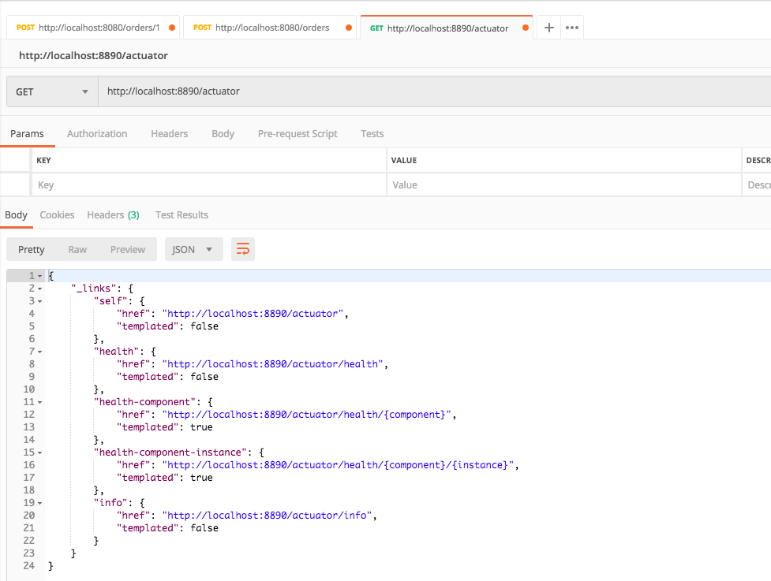
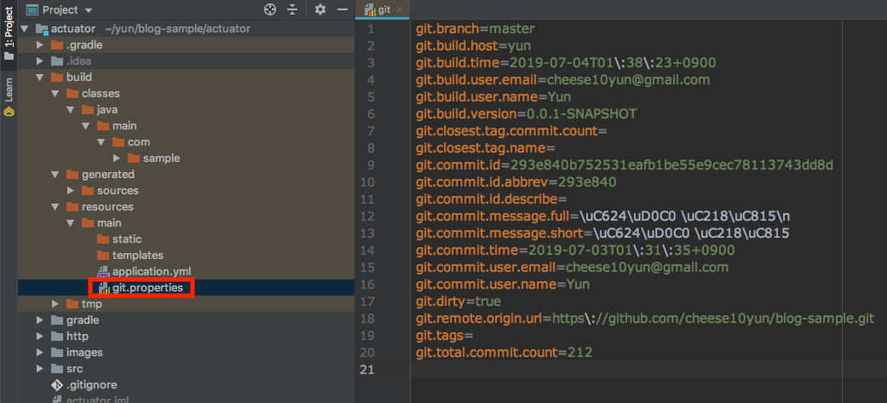
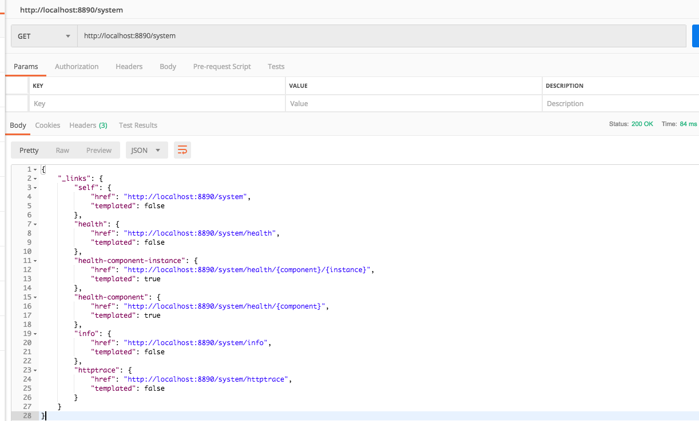
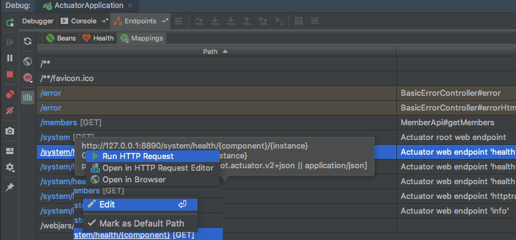
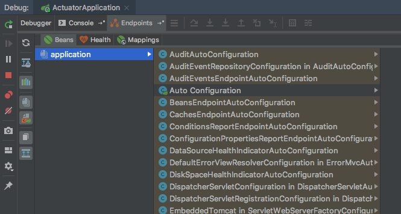
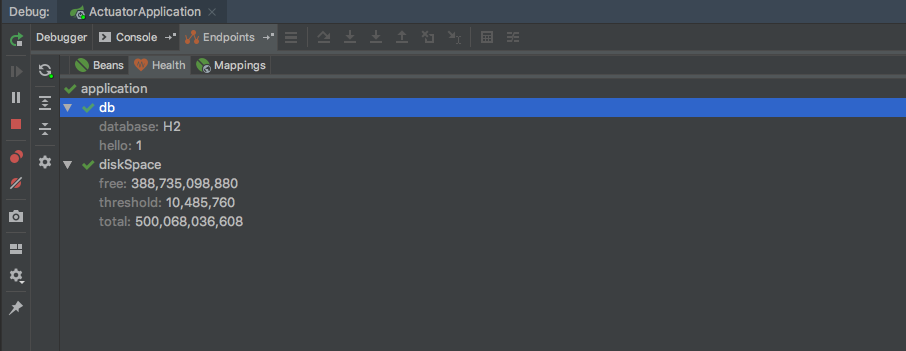
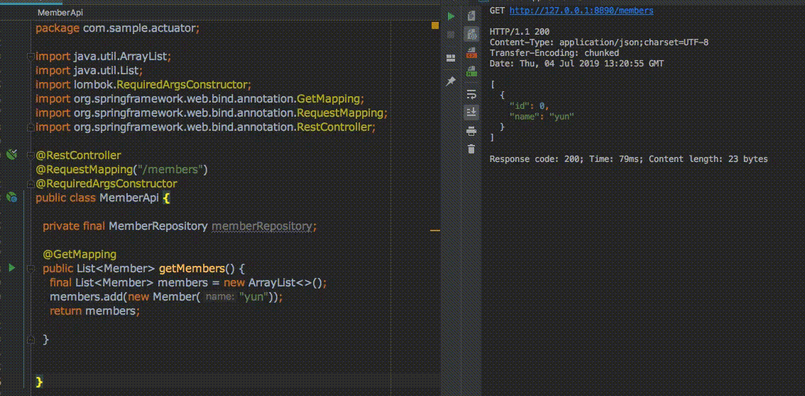

## Spring Actuator
스프링은 Actuator를 이용해서 애플리케이션 상태를 종합적으로 모니터링할 수 있습니다. 

## 의존성 주입

```gradle
dependencies {
    implementation 'org.springframework.boot:spring-boot-starter-actuator'
}
```

## actuator 호출


`http://localhost:8890/actuator`를 호출하면 위와 같은 Response를 받을 수 있습니다. 기본 설정으로는 모든 endpoint가 노출돼있지는 않습니다. 모든 endpoint를 노출하도록 설정해보겠습니다.

## endpoints 전체 노출
```yml
# application.yml
management:
  endpoints:
    web:
      exposure:
        include: "*"
```
`application.yml` 설정을 변경하고 다시 `/actuator` 호출하면 아래 Response와 같습니다.

```json
{
    "_links": {
        "self": {
            "href": "http://localhost:8890/actuator",
            "templated": false
        },
        "auditevents": {
            "href": "http://localhost:8890/actuator/auditevents",
            "templated": false
        },
        "beans": {
            "href": "http://localhost:8890/actuator/beans",
            "templated": false
        },
        "caches-cache": {
            "href": "http://localhost:8890/actuator/caches/{cache}",
            "templated": true
        },
        "caches": {
            "href": "http://localhost:8890/actuator/caches",
            "templated": false
        },
        "health": {
            "href": "http://localhost:8890/actuator/health",
            "templated": false
        },
        "health-component": {
            "href": "http://localhost:8890/actuator/health/{component}",
            "templated": true
        },
        "health-component-instance": {
            "href": "http://localhost:8890/actuator/health/{component}/{instance}",
            "templated": true
        },
        "conditions": {
            "href": "http://localhost:8890/actuator/conditions",
            "templated": false
        },
        "configprops": {
            "href": "http://localhost:8890/actuator/configprops",
            "templated": false
        },
        "env": {
            "href": "http://localhost:8890/actuator/env",
            "templated": false
        },
        "env-toMatch": {
            "href": "http://localhost:8890/actuator/env/{toMatch}",
            "templated": true
        },
        "info": {
            "href": "http://localhost:8890/actuator/info",
            "templated": false
        },
        "loggers": {
            "href": "http://localhost:8890/actuator/loggers",
            "templated": false
        },
        "loggers-name": {
            "href": "http://localhost:8890/actuator/loggers/{name}",
            "templated": true
        },
        "heapdump": {
            "href": "http://localhost:8890/actuator/heapdump",
            "templated": false
        },
        "threaddump": {
            "href": "http://localhost:8890/actuator/threaddump",
            "templated": false
        },
        "metrics-requiredMetricName": {
            "href": "http://localhost:8890/actuator/metrics/{requiredMetricName}",
            "templated": true
        },
        "metrics": {
            "href": "http://localhost:8890/actuator/metrics",
            "templated": false
        },
        "scheduledtasks": {
            "href": "http://localhost:8890/actuator/scheduledtasks",
            "templated": false
        },
        "httptrace": {
            "href": "http://localhost:8890/actuator/httptrace",
            "templated": false
        },
        "mappings": {
            "href": "http://localhost:8890/actuator/mappings",
            "templated": false
        }
    }
}
```
다양한 정보들이 포함되어 있습니다. 필요한 정보들을 확인한 후 아래와 같이 필요한 정보들만 노출할 수 있습니다.

```yml
management:
  endpoints:
    web:
      exposure:
        include:
          - "info"
          - "health"
          - "httptrace"
```

`application.yml` 변경이후 다시 `/actuator`을 호출하면 `include`에 포함시킨 endpoint만 Response 받게 됩니다.

```json
{
  "_links": {
    "self": {
      "href": "http://localhost:8890/actuator",
      "templated": false
    },
    "health": {
      "href": "http://localhost:8890/actuator/health",
      "templated": false
    },
    "health-component": {
      "href": "http://localhost:8890/actuator/health/{component}",
      "templated": true
    },
    "health-component-instance": {
      "href": "http://localhost:8890/actuator/health/{component}/{instance}",
      "templated": true
    },
    "info": {
      "href": "http://localhost:8890/actuator/info",
      "templated": false
    },
    "httptrace": {
      "href": "http://localhost:8890/actuator/httptrace",
      "templated": false
    }
  }
}
```

## Info Git Info 노출하기
기본 설정에서 `actuator/info` 호출시 아무 정보도 Response를 하지 않습니다. plugin을 이용하면 git에 대한 정보를 쉽게 노출할 수 있습니다.

```
buildscript {
    ...
    dependencies {
        ...
        classpath "gradle.plugin.com.gorylenko.gradle-git-properties:gradle-git-properties:2.0.0"
    }
}
apply plugin: "com.gorylenko.gradle-git-properties"
```
필요한 디펜던시를 추가합니다. 

```yml
management:
  ...
  info:
    git:
      mode: SIMPLE # FULL or SIMPLE
```
git 정보에 대한 mode를 SMPLE, FULL을 지정할 수 있습니다. 이후에 서버를 실행시키면 아래 그림처럼 `git.properties` 파일에 Git에 대한 정보가 담겨있습니다.




### SIMPLE Mode
```json
{
  "git": {
    "commit": {
      "time": "2019-07-02T16:31:35Z",
      "id": "293e840"
    },
    "branch": "master"
  }
```
### FULL Mode
```json
{
  "git": {
    "build": {
      "host": "yun",
      "version": "0.0.1-SNAPSHOT",
      "time": "2019-07-03T16:49:41Z",
      "user": {
        "name": "Yun",
        "email": "cheese10yun@gmail.com"
      }
    },
    "branch": "master",
    "commit": {
      "message": {
        "short": "오타 수정",
        "full": "오타 수정\n"
      },
      "id": {
        "describe": "",
        "abbrev": "293e840",
        "full": "293e840b752531eafb1be55e9cec78113743dd8d"
      },
      "time": "2019-07-02T16:31:35Z",
      "user": {
        "email": "cheese10yun@gmail.com",
        "name": "Yun"
      }
    },
    "closest": {
      "tag": {
        "name": "",
        "commit": {
          "count": ""
        }
      }
    },
    "dirty": "true",
    "remote": {
      "origin": {
        "url": "https://github.com/cheese10yun/blog-sample.git"
      }
    },
    "tags": "",
    "total": {
      "commit": {
        "count": "212"
      }
    }
  }
}
```
`mode`에 따라서 출력되는 정보가 다릅니다.

## Health Database
기본 설정에서 `/actuator/health`를 호출하면 아래와 같은 응답 정보를 받을 수 있습니다. (데이터베이스 정보를 표시하기 위해서 H2 의존성을 추가했습니다.)
```
{
  "status": "UP"
}
```
데이터베이스에 대한 정보를 추가적으로 확인하기 위해서는 `application.yml`을 추가적으로 설정하면 됩니다.


```yml
management:
  ...
  endpoint:
    health:
      enabled: true
      show-details: always
```

위 설정을 추가하시고 `/actuator/health`를 다시 호출하면 아래와 같은 Response를 확인할 수 있습니다.

```json
{
  "status": "UP",
  "details": {
    "db": {
      "status": "UP",
      "details": {
        "database": "H2",
        "hello": 1
      }
    },
    "diskSpace": {
      "status": "UP",
      "details": {
        "total": 500068036608,
        "free": 389070479360,
        "threshold": 10485760
      }
    }
  }
}
```

## Base Path 변경하기
기본으로 제공해주는 URL 정보는 변경해서 사용하는 것이 바람직합니다. `base-path` 속성을 이용하면 endpoint base path를 변경할 수 있습니다.

```yml
management:
  endpoints:
    ...
    web:
      base-path: "/system"
```
`base-path`을 변경하면 아래와 같이 endpoint base path가 변경되는 것을 확인할 수 있습니다.



## IntelliJ Endpint
IntelliJ를 이용하면 Actuator를 더욱 잘 활용할 수 있습니다.



Run/Debug Tab에서 Endpoints에서는 전체 Request Mapping를 볼 수 있습니다. 실제 `Run HTTP Request`를 이용하면 요청을 보낼 수 있습니다.

우 클릭 이후 Edit을 활용하면 실제 매핑된 Controller 코드로 이동되어 컨트롤러에 있는 특정 Request Mapping 정보를 쉽게 찾을 수 있습니다.



`Beans` Tab에서는 등록돼있는 Bean들을 볼 수 있습니다. 스프링 부트에서는 특정 빈의 유무에 따라서 설정들이 변경되는 일이 많기 때문에 디버깅 시 유용하게 사용할 수 있습니다.



`Health` Tab에서는 위에서 확인한 heath 정보도 확인할 수 있습니다. Http 요청을 보내서 확인하는 것보다는 인텔리 제이에서 확인하는 것이 개인적으로는 편리한 거 같습니다.



Controller에서 HTTP Call을 위 그림처럼 진행할 수 있습니다.