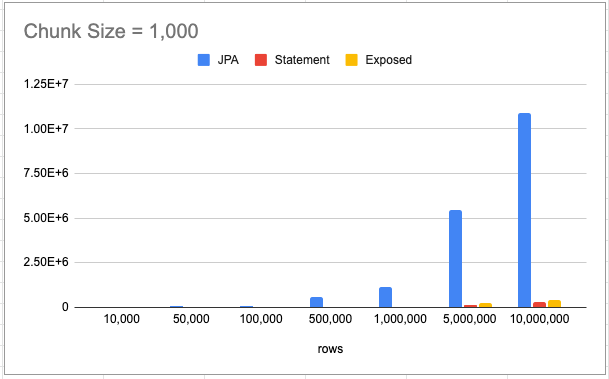
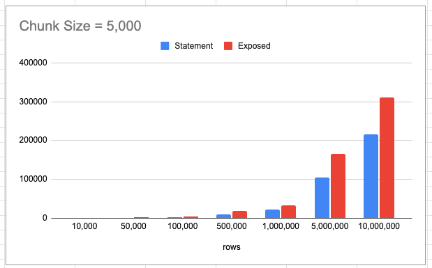
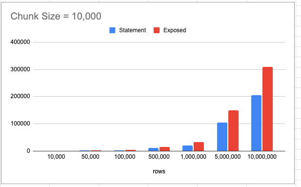

# Batch Insert 성능 향상기 2편 - 성능 측정

JPA + MySQL + GenerationType.IDENTITY 조합으로는 Batch Insert를 사용할 수 없습니다. 자세한 내용은 [Batch Insert 성능 향상기 1편 - With JPA](https://cheese10yun.github.io/jpa-batch-insert/)에서 자세하게 정리했습니다.

JPA의 단일 insert와, batch insert의 성능적인 차이가 얼마나 발생하는지 측정해보고 batch insert를 지원하는 새로운 솔루션을 찾아 성능 측정을 진행한 포스팅입니다.

## 다른 솔루션 찾기 

### 솔루션에 대한 요구사항
* SQL 관련 작업들을 문자열로 처리하지 하지 않고 DSL 표현하며 DSL 표현이 풍부할 것
* Batch Insert 외에도 조회 작업 등에도 사용이 용이할 것
* JDBC `addBatch()` 직접 호출하는 코드와 성능적인 차이가 거의 없을 것

### Exposed
결론부터 말씀드리면 [Exposed](https://github.com/JetBrains/Exposed)라는 도구를 선택했습니다. Batch Insert를 지원하며 DSL을 잘 지원해 JPA에서 사용 못 하는 쿼리를 진행할 수 있는 장점이 있습니다. Exposed에 대한 소개는 다음 포스팅에 진행해 보겠습니다.


### Batch Code

```kotlin
const val GLOBAL_CHUNK_SIZE = 1_000
const val DATA_SET_UP_SIZE = 5_000_000

@Configuration
class BulkInsertJobConfiguration(
    private val jobBuilderFactory: JobBuilderFactory,
    private val jobDataSetUpListener: JobDataSetUpListener,
    private val dataSource: DataSource,
    private val exposedDataBase: Database,
    private val paymentBackJpaRepository: PaymentBackJpaRepository,
    entityManagerFactory: EntityManagerFactory
) {

    @Bean
    fun bulkInsertJob(
        jdbcTemplateInsertStep: Step
    ): Job =
        jobBuilderFactory["bulkInsertJob"]
            .incrementer(RunIdIncrementer())
            .listener(jobDataSetUpListener) // payment 데이터 setup
            .start(jdbcTemplateInsertStep)
            .build()

    @Bean
    @JobScope
    fun bulkInsertStep(
        stepBuilderFactory: StepBuilderFactory,
        bulkInsertReader: JpaCursorItemReader<Payment>
    ): Step =
        stepBuilderFactory["bulkInsertStep"]
            .chunk<Payment, Payment>(GLOBAL_CHUNK_SIZE)
            .reader(bulkInsertReader) // Reader는 JpaCursorItemReader 기반으로 조회
//            .writer(writerWithStatement) // Statement addBatch() 기반 저장 
            .writer(writerWithExposed) // Exposed 기반 저장
//            .writer(writerWithJpa) // JPA 기반 저장
            .build()

    @Bean
    @StepScope
    fun bulkInsertReader(
        entityManagerFactory: EntityManagerFactory
    ) = JpaCursorItemReaderBuilder<Payment>()
        .name("bulkInsertReader")
        .entityManagerFactory(entityManagerFactory)
        .queryString("SELECT p FROM Payment p")
        .build()


    private val writerWithStatement: ItemWriter<Payment> = ItemWriter { payments ->
        val sql = "insert into payment_back (amount, order_id) values (?, ?)"
        val connection = dataSource.connection
        val statement = connection.prepareStatement(sql)!!
        try {
            for (payment in payments) {
                statement.apply {
                    this.setBigDecimal(1, payment.amount)
                    this.setLong(2, payment.orderId)
                    this.addBatch()
                }
            }
            statement.executeBatch()
        } catch (e: Exception) {
            throw e
        } finally {
            if (statement.isClosed.not()) {
                statement.close()
            }
            if (connection.isClosed.not()) {
                connection.close()
            }
        }
    }

    private val writerWithJpa: ItemWriter<Payment> =
        ItemWriter { payments ->
            payments.map { payment ->
                PaymentBackJpa(
                    amount = payment.amount,
                    orderId = payment.orderId
                )
            }
                .also {
                    paymentBackJpaRepository.saveAll(it)
                }
        }


    private val writerWithExposed: ItemWriter<Payment> = ItemWriter { payments ->
        transaction(
            exposedDataBase
        ) {
            PaymentBack.batchInsert(
                data = payments,
                shouldReturnGeneratedValues = false
            ) { payment ->
                this[PaymentBack.orderId] = payment.orderId
                this[PaymentBack.amount] = payment.amount
            }
        }
    }
}

object PaymentBack : LongIdTable(name = "payment_back") {
    val amount = decimal("amount", 19, 4)
    val orderId = long("order_id")
}
```

Spring Batch 기반으로 `payment` 테이블을 N 개 읽어서 `payment_back` 테이블로 저장하는 흐름입니다. Reader는 JpaCursorItemReader 기반으로 `payment` 테이블을 조회합니다. 그리고 각 저장하는 `wirter` 코드들이 있습니다. `writerWithExposed()` 메서드는 `Exposed` 라이브러리에서 지원하는 `batchInsert()`메서드를 이용해서 insert를 진행하고 있습니다.

### Exposed Batch Insert

```kotlin
transaction(
    exposedDataBase
) {
    PaymentBack.batchInsert(
        data = payments,
        shouldReturnGeneratedValues = false
    ) { payment ->
        this[PaymentBack.orderId] = payment.orderId
        this[PaymentBack.amount] = payment.amount
    }
}
```
`Exposed`는 `batchInsert()` 메서드를 지원하기 때문에 쉽게 batch insert를 진행할 수 있습니다. Mysql의 경우 JDBC 드라이버에 `rewriteBatchedStatements=true` 속성을 반드시 입력해야 batch insert가 가능합니다. `shouldReturnGeneratedValues` 값을 `false`로 지정하면 `auto_increment`으로 증가된 ID 값을 가져오지 않기에 성능이 향상될 수 있습니다.


## Insert 성능 측정
Insert에 대한 성능 측정은 JPA, Statement, Exposed 3가지 라이브러리로 진행하겠습니다. JPA는 단건으로 저장하며, Statement는 문자열 기반으로 `addBatch()`를 직접 호출, Exposed는 자체적으로 지원하는 Batch Insert를 진행합니다. 

**해당 속도 측정은 JpaCursorItemReader 기반으로 조회하는 시간까지 포함된 시간입니다.** 수백수만 데이터를 한 번에 저장하는 경우는 보다 페이징 처리를 진행해서 저장하는 것이 일반적이기도 하고 모두 동일한 Reader를 사용했기 때문에 비율은 동일하게 측정됩니다. 측정 단위는 모두 `ms`입니다.

#### chunk size = 1,000



rows | JPA | Statement | Exposed
-----|-----|-----------|--------
10,000 | 9278 | 577 | 890
50,000 | 53330 | 2632 | 3119
100,000 | 108460 | 3470 | 4820
500,000 | 561756 | 14693 | 21154
1,000,000 | 1163130 | 28633 | 46533
5,000,000 | 5452635 | 140117 | 227203
10,000,000 | x | 282603 | 438349

**rows `10,000,000` 측정은 너무 오래 걸려 진행하지 못했습니다.** `5,000,000` 보다 약 2배 정도 `10905270ms` 정도 예상됩니다. JPA 성능 측정은 더 이상 의미가 없을 거 같아서 Statement, Exposed를 chunk size 기준으로 진행하겠습니다.

#### chunk size = 5,000



rows | Statement | Exposed
-----|-----------|--------
10,000 | 415 | 787
50,000 | 1454 | 2569
100,000 | 2681 | 3777
500,000 | 10607 | 17911
1,000,000 | 22378 | 33637
5,000,000 | 105275 | 165472
10,000,000 | 215456 | 311385


#### chunk size = 10,000


rows | Statement | Exposed
-----|-----------|--------
10,000 | 421 | 879
50,000 | 1713 | 2582
100,000 | 2636 | 4101
500,000 | 10959 | 15479
1,000,000 | 21159 | 33711
5,000,000 | 105478 | 150009
10,000,000 | 205380 | 308874


### 정리
JPA(단일 insert)와 성능은 비교 자체가 되지 않으며, 자바 코드와, 데이터베이스가 동일 네트워크가 환경에서는 IO 작업이 더 많이 발생하기 때문에 위 성능 측정보다 안 좋은 결과가 예상됩니다.

`Exposed`도 내부적으로 `addBatch()`를 사용해서 batch insert를 진행하는데도 불과하고 대략 `30%`성능의 차이를 보였습니다. `Statement` 보다 느린 부분은 사실이지만 절대적인 성능 자체가 둘 모두 빠르기에 (`10,000,000` 기준 1분 40초 차이) 속도적인 측면보다는 개발 및 유지 보수 측면에서 `Exposed`가 더 좋다고 판단했습니다.

그리고 chunk size `5,000`, `10,000` 각각 측정해 본 결과 `Exposed`가 조금 더 효율적으로 성능이 향상되었습니다. 물론 모든 측정은 로컬 환경에서 진행한 것이니 절대적인 수치보다는 각 rows 별 `JPA`, `Statement`, `Exposed`의 비율을 보는 게 더 바람직합니다.
