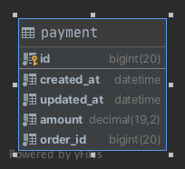
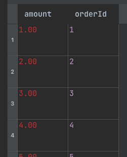
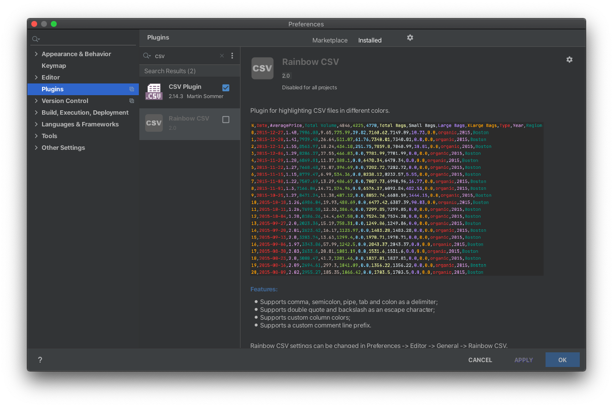
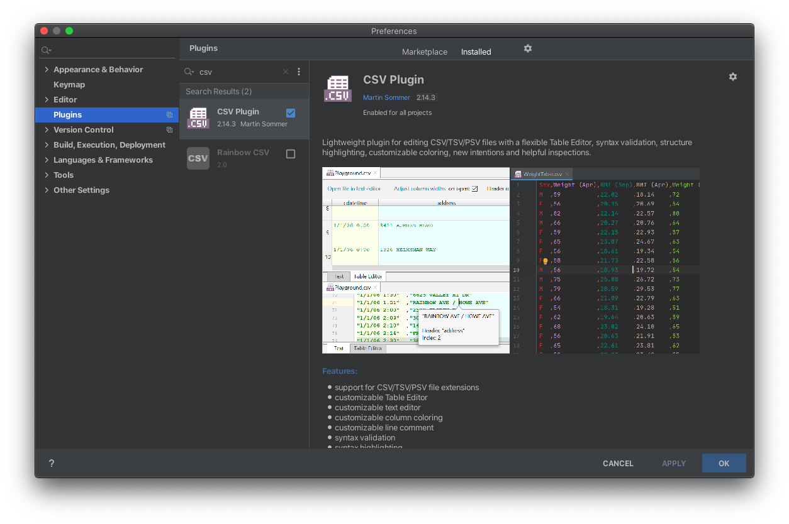

# Spring Batch CSV Writer

Spring Batch를 이용해서 데이터베이스에 저장되어 있는 정보를 CSV file로 저장을 하는 방법에 대해서 작성해보겠습니다.

## 데이터 흐름

### payment


### csv


데이터의 흐름은 간단합니다. payment table -> `payment.csv`으로 변경됩니다. payment table의 불필요한 칼럼 id, `created_ay`, `updated_at은` 빼고 `amount`, `order_id`만 CSV에 저장하겠습니다.


## Batch Code
를

```kotlin
@Configuration
class CsvWriterJobConfiguration(
    private val jobBuilderFactory: JobBuilderFactory,
    private val jobDataSetUpListener: JobDataSetUpListener,
    entityManagerFactory: EntityManagerFactory
) {
    private val CHUNK_SZIE = 10

    @Bean
    fun csvWriterJob(
        csvWriterStep: Step
    ): Job =
        jobBuilderFactory["csvWriterJob"]
            .incrementer(RunIdIncrementer())
            .listener(jobDataSetUpListener)
            .start(csvWriterStep)
            .build()

    @Bean
    @JobScope
    fun csvWriterStep(
        stepBuilderFactory: StepBuilderFactory
    ): Step =
        stepBuilderFactory["csvWriterStep"]
            .chunk<Payment, PaymentCsv>(CHUNK_SZIE)
            .reader(reader)
            .writer(writer)
            .build()

    private val reader: JpaPagingItemReader<Payment> =
        JpaPagingItemReaderBuilder<Payment>()
            .queryString("SELECT p FROM Payment p")
            .entityManagerFactory(entityManagerFactory)
            .name("readerPayment")
            .build()

    private val writer: FlatFileItemWriter<PaymentCsv> =
        FlatFileItemWriterBuilder<PaymentCsv>()
            .name("writerPayment")
            .resource(FileSystemResource("src/main/resources/payment.csv"))
            .append(true)
            .lineAggregator(PaymentCsvMapper().delimitedLineAggregator())
            .headerCallback {
                it.write(PaymentCsvMapper().headerNames.joinToString(","))
            }
            .encoding(StandardCharsets.UTF_8.name())
            .build()
}

data class PaymentCsv(
    val amount: BigDecimal,
    val orderId: Long
)

class PaymentCsvMapper :
    CsvLineAggregator<PaymentCsv> {
    override val headerNames: Array<String> = arrayOf(
        "amount", "orderId"
    )
}
```

### Job
```kotlin
@Bean
fun csvWriterJob(
    csvWriterStep: Step
): Job =
    jobBuilderFactory["csvWriterJob"]
        .incrementer(RunIdIncrementer()) // (1)
        .listener(jobDataSetUpListener) // (2)
        .start(csvWriterStep) // (3)
        .build()
```

* (1): 동일한 job parameter으로 여러 번 job을 실행시켜도 문제없게 `run.id`를 증가시킵니다.
* (2): `beforeJob` payment 100 rows를 insert 합니다.
* (3): `csvWriterStep` 해당 step을 실생 시킵니다.

### Step
```kotlin
@Bean
@JobScope
fun csvWriterStep(
    stepBuilderFactory: StepBuilderFactory
): Step =
    stepBuilderFactory["csvWriterStep"]
        .chunk<Payment, PaymentCsv>(CHUNK_SZIE) // (1)
        .reader(reader) // (2)
        .writer(writer) // (3)
        .build()

private val reader: JpaPagingItemReader<Payment> =
    JpaPagingItemReaderBuilder<Payment>()
        .queryString("SELECT p FROM Payment p")
        .entityManagerFactory(entityManagerFactory)
        .name("readerPayment")
        .build()
```

* (1): chunk size 및, inout, output 클래스 지정합니다.
* (2): `readerPayment`는 전체를 조회합니다. (chuk size 별로 limit ?, ? query가 발생합니다. 한 번에 모두 가져오는 구조는 아닙니다.)
* (3): `writerPayment` FlatFileItemWriterBuilder 기반으로 Writer을 진행할 CSV에 대한 정보를 생성합니다. 

### writerPayment

```kotlin
private val writer: FlatFileItemWriter<PaymentCsv> =
    FlatFileItemWriterBuilder<PaymentCsv>()
        .name("writerPayment")
        .resource(FileSystemResource("src/main/resources/payment.csv")) // (1)
        .append(true) // (2)
        .lineAggregator(PaymentCsvMapper().delimitedLineAggregator()) // (3)
        .headerCallback { // (4)
            it.write(PaymentCsvMapper().headerNames.joinToString(","))
        }
        .encoding(StandardCharsets.UTF_8.name())
        .build()


interface CsvLineAggregator<T> {
    val headerNames: Array<String>

    fun delimitedLineAggregator(
        delimiter: String = ","
    ) =
        object : DelimitedLineAggregator<T>() {
            init {
                setDelimiter(delimiter) // 3-1
                setFieldExtractor(
                    object : BeanWrapperFieldExtractor<T>() {
                        init {
                            setNames(headerNames) // // 3-2
                        }
                    }
                )
            }
        }
```
* (1): `output`을 사용할 `Resource`을 지정합니다. 
* (2): `ture`을 지정하면 해당 경로에 이미 파일이 있으면 파일을 추가합니다.
* (3): csv 파일에 집계할 방식에 대해서 작성합니다. `CsvLineAggregator` 인터페이스를 기준으로 진행됩니다. csv 필드에 대한 구분은 `,`을 사용하며, `PaymentCsvMapper` 기반으로 필드 순서가 결정됩니다.
* (4): csv 파일에 header 정보를 입력합니다. `PaymentCsvMapper`에 headNames를 사용해서 (3)에서 사용한 필드 순서와 동일하게 지정합니다.

`CsvLineAggregator`, `PaymentCsvMapper`를 사용하지 않아도 문제는 없지만 Srping Batch에서 지원하는 `lineAggregator`, `headerCallback` 사용법을 단순화 시켰습니다. 프레임 워크에서는 상대적으로 저수준의 기능을 제공해주기 때문에 각 서비스에서 고수준으로 변경해서 사용하는 방법을 고려해서 개발하는 것도 개발자에게 중요한 스킬이라고 생각합니다.


## 실행 결과

```kotlin
java -jar build/libs/study-0.0.1-SNAPSHOT.jar --job.name=csvWriterJob
```

해당 테스트는 `docker-compose.yaml` 기반 mysql 5.7 기반으로 동작 됩니다. 

```csv
amount,orderId
1.00,1
2.00,2
3.00,3
4.00,4
5.00,5
6.00,6
7.00,7
8.00,8
9.00,9
10.00,10
11.00,11
12.00,12
13.00,13
14.00,14
15.00,15
16.00,16
17.00,17
18.00,18
19.00,19
20.00,20
21.00,21
...
```
`amount, orderId` header 정보 및 데이터가 정상적으로 저장돼있는 것을 확인할 수 있습니다.

## IntelliJ Plugins




IntelliJ 사용한다면 위 두 개의 CSV 플러그인을 추천드립니다. 