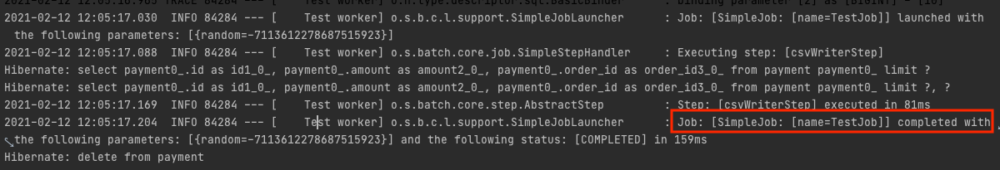
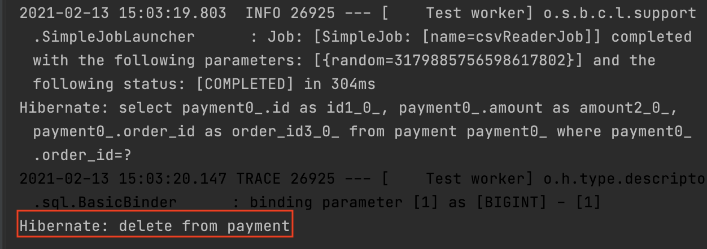
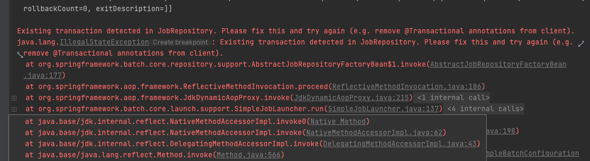
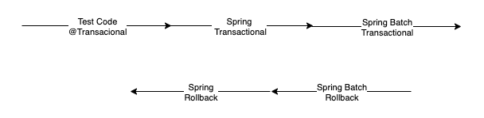

# Spring Batch Test Code

스프링 배치 애플리케이션 테스트 코드를 작성하면서 만났던 이슈와 그에 따른 나름의 고찰을 정리한 포스팅 내용입니다. 배치를 사용하지 않더라도 스프링 기반으로 테스트를 작성하는 경우에도 도움 되는 내용들이 있습니다.

## @SpringBatchTest

[Spring Batch 4.1](https://docs.spring.io/spring-batch/docs/4.1.x/reference/html/whatsnew.html) 버전 부터는 `@SpringBatchTest` Annotation을 지원합니다.

```java

@RunWith(SpringRunner.class)
@SpringBatchTest
@ContextConfiguration(classes = {JobConfiguration.class})
public class JobTest {

    @Autowired
    private JobLauncherTestUtils jobLauncherTestUtils;

    @Autowired
    private JobRepositoryTestUtils jobRepositoryTestUtils;


    @Before
    public void clearMetadata() {
        jobRepositoryTestUtils.removeJobExecutions();
    }

    @Test
    public void testJob() throws Exception {
        // given
        JobParameters jobParameters =
            jobLauncherTestUtils.getUniqueJobParameters();

        // when
        JobExecution jobExecution =
            jobLauncherTestUtils.launchJob(jobParameters);

        // then
        Assert.assertEquals(ExitStatus.COMPLETED,
            jobExecution.getExitStatus());
    }
}
```

* JobLauncherTestUtils : 스프링 배치 테스트에 필요한 유틸 기능
* JobRepositoryTestUtils : 데이터베이스에 저장된 JobExcution을 생성/삭제 지원
* StepScopeTestExecutionListener : 배치 단위 테스트 시 StepScope 컨텍스트를 생성, 해당 컨텍스트를 통해 JobParamerter 등을 단위 테스트에서 DI 받을 수 있음
* JobSopceTestExecutionListener : 배치 단위 테스트 시 JobScope 컨텍스트를 생성, 해당 컨텍스트를 통해 JobParameter 등을 단위 테스트에서 DI 받을 수 있음

`@SpringBatchTest`으로 위 코드를 자동으로 구성할 수 있습니다.

## Spring Batch Test Support 만들기

```kotlin
@SpringBootTest
@SpringBatchTest
@TestInstance(TestInstance.Lifecycle.PER_CLASS)
@TestConstructor(autowireMode = TestConstructor.AutowireMode.ALL)
@ActiveProfiles("test")
abstract class BatchTestSupport {

    @Autowired
    protected lateinit var entityManagerFactory: EntityManagerFactory

    @Autowired
    protected lateinit var jobLauncherTestUtils: JobLauncherTestUtils

    protected val entityManager by lazy { entityManagerFactory.createEntityManager() }

    protected var jobExecution: JobExecution? = null

    protected val query: JPAQueryFactory by lazy { JPAQueryFactory(entityManager) }

    protected fun launchJob(
        job: Job,
        jobParameters: JobParameters = jobLauncherTestUtils.uniqueJobParameters
    ) {
        jobLauncherTestUtils.job = job
        this.jobExecution = jobLauncherTestUtils.launchJob(jobParameters)
    }

    protected fun launchStep(
        stepName: String,
        jobParameters: JobParameters = jobLauncherTestUtils.uniqueJobParameters,
        executionContext: ExecutionContext? = null
    ) {
        this.jobExecution = jobLauncherTestUtils.launchStep(stepName, jobParameters, executionContext)
    }

    protected fun thenBatchCompleted() {
        then(BatchStatus.COMPLETED).isEqualTo(jobExecution?.status)
    }

    protected fun thenBatchStatus(batchStatus: BatchStatus) {
        then(batchStatus).isEqualTo(jobExecution?.status)
    }

    protected fun <T> save(entity: T): T {
        entityManager.transaction.let { transaction ->
            transaction.begin()
            entityManager.persist(entity)
            transaction.commit()
            entityManager.clear()
        }
        return entity
    }

    protected fun <T> saveAll(entities: List<T>): List<T> {
        val entityManager = entityManagerFactory.createEntityManager()
        entityManager.transaction.let { transaction ->
            transaction.begin()
            for (entity in entities) {
                entityManager.persist(entity)
            }
            transaction.commit()
            entityManager.clear()
        }
        return entities
    }

    protected fun <E> List<E>.persist() {
        saveAll(this)
    }

    protected fun <T> deleteAll(path: EntityPath<T>) {
        entityManager.transaction.let { transaction ->
            transaction.begin()
            query.delete(path).execute()
            transaction.commit()
        }
    }
}
```

배치 애플리케이션의 테스트를 도와주는 유틸성 클래스, 테스트 코드를 효율적으로 작성할 수 있게 지원합니다. 어떤 기능들이 있고, 이 기능들이 어떤 불편한 점 때문에 추가했는지에 대해서 설명을 진행하겠습니다.

### 테스트 Job 실행은?
```kotlin
abstract class BatchTestSupport {

    @Autowired
    protected lateinit var jobLauncherTestUtils: JobLauncherTestUtils
    ...
    protected fun launchJob(
        job: Job,
        jobParameters: JobParameters = jobLauncherTestUtils.uniqueJobParameters
    ) {
        jobLauncherTestUtils.job = job
        this.jobExecution = jobLauncherTestUtils.launchJob(jobParameters)
    }
}


internal class CsvWriterConfigurationTest(
    private val csvWriterJob: Job,
) : BatchTestSupport() {

    @Test
    internal fun `csvWriterJob test`() {
        //given
        ...

        //when
        launchJob(csvWriterJob)

        //then
        ...
    }


    @Autowired
    protected lateinit var jobLauncherTestUtils: JobLauncherTestUtils

    @Test
    internal fun `csvWriterJob test 슈퍼 클래스에 없는 경우 직접 DI 받아 job을 실헹 해야한다`() {
        //given
        ...

        //when
        jobLauncherTestUtils.job = job
        jobLauncherTestUtils.launchJob(job)

        //then
        ...
    }
}
```
배치 테스트를 위해서는 Job을 실행시켜야 합니다. 이것을 편리하게 도와주는 것이 `launchJob()`메서드입니다. `JobLauncherTestUtils`의 `launchJob()` 메서드를 한 번 감싸서 사용하는 용도로 특별하건 없습니다. 슈퍼 클래스에서 의존성을 주입받지 않으면 실제 테스트에 계속 DI를 받아 사용해야 하기 때문에 슈퍼 클래스에서 해당 기능을 제공합니다. JobParameters가 필요한 경우 `JobParameters`를 전달하면 됩니다. 그렇지 않은 경우에는 스프링 배치에서 자체적으로 유니크한 `JobParameters`을 생성하는 기본값을 지정했습니다.


### 특정 Step만 테스트하고 싶은 경우는 ?

```kotlin
@Bean
fun sampleJob(
    jobBuilderFactory: JobBuilderFactory,
    step1: Step,
    step2: Step,
    step3: Step,
    step4: Step,
    step5: Step,
): Job =
    jobBuilderFactory["csvWriterJob"]
        .incrementer(RunIdIncrementer())
        .listener(JobReportListener())
        .start(step1)
        .next(step2)
        .next(step3)
        .next(step4)
        .next(step5)
        .build()
```
단순한 Job의 경우에는 Step이 여러개로 구성되어 있는 경우는 특정 Step만 테스트를 진행하는 단위 테스트가 필요할 수 있습니다.

```kotlin
abstract class BatchTestSupport {
    ...
    protected fun launchStep(
        job: Job,
        stepName: String,
        jobParameters: JobParameters = jobLauncherTestUtils.uniqueJobParameters,
        executionContext: ExecutionContext? = null
    ) {
        this.jobExecution = jobLauncherTestUtils.launchStep(stepName, jobParameters, executionContext)
    }
}

internal class CsvWriterConfigurationTest(
    private val csvWriterJob: Job,
) : BatchTestSupport() {
    
    @Test
    internal fun `csvWriterStep test`() {
        //given
        ...

        //when
        launchStep(csvWriterJob, "csvWriterStep")

        //then
        ...
    }
}
```
Step 테스트도 마찬가지로 `jobLauncherTestUtils.launchStep()` 메서드를 활용해서 특정 Step을 실행할 수 있습니다. 개인적으로는 `launchStep()` 테스트를 진행하는 것은 좋아하지는 않습니다.



Job name이 `name=TestJob` 이것을 확인할 수 있습니다. Step을 테스트하기 위해서는 반드시 Job이 있어야 하기 때문에 `TestJob`으로 연결해서 테스트를 진행하는 것입니다. 이렇게 테스트가 진행되게 되면 문제가 있을 수 있습니다.

```kotlin
class SimpleJobListener : JobExecutionListener {
    private val log by logger()

    override fun beforeJob(jobExecution: JobExecution) {
        log.info("beforeJob")
    }

    override fun afterJob(jobExecution: JobExecution) {
        log.info("afterJob")
    }
}

@Configuration
class CsvWriterJobConfiguration {

    @Bean
    fun csvWriterJob(
        jobBuilderFactory: JobBuilderFactory,
        csvWriterStep: Step
    ): Job =
        jobBuilderFactory["csvWriterJob"]
            .incrementer(RunIdIncrementer())
            .listener(SimpleJobListener())
            .start(csvWriterStep)
            .build()
}
```
위 코드처럼 `SimpleJobListener`로 Job 시작 이전, 이후로 log를 찍는 리스너를 추가하고 `launchStep("csvWriterStep")` Step을 실행시키면 리스너는 동작하지 않습니다. 반면 `launchJob(csvWriterJob)`은 잘 동작합니다.

> launchJob(csvWriterJob) Log


> launchStep("csvWriterStep") Log


리스너는 Job에 연결이 된다는 것이지 Step에 연결돼있는 것은 아니며, 위에서 언급했듯 `launchStep()`은 `name=TestJob`으로 Job을 실행시키기 때문에 해당 잡에는 리스너가 없어 당연한 결과입니다.

해당 코드는 단순하게 리스너로 로직을 것이지만 해당 Step에 필요한 리스너라면 예상했던 테스트 결과와 다르게 동작할 수 있습니다. 이러한 문제 때문에 저는 아래와 같은 방식으로 Step 테스트합니다.

```kotlin
internal class CsvWriterConfigurationTest(
    private val csvWriterJob: Job,
    csvWriterStep: Step,
    jobBuilderFactory: JobBuilderFactory,
) : BatchTestSupport() {

    private val job = jobBuilderFactory["csvWriterStepForTestJob"]
        .incrementer(RunIdIncrementer())
        .listener(SimpleJobListener())
        .start(csvWriterStep)
        .build()

    @Test
    internal fun `csvWriterStep job을 직접 생성해서 테스트`() {
        //given
        ...

        //when
        launchJob(job)

        //then
        ...
    }
}
```
위 코드는 실제 Job을 생성하고 해당 Job으로 `launchJob()`메서드를 통해서 Job을 실행시키고 있습니다.


해당 결과 리스너의 로그 및 Job name이 `name=csvWriterStepForTestJob`으로 테스트를 진행하는 것을 확인할 수 있습니다.

그 밖에도 Job을 직접 생성할 수 있으니 다양한 방법으로 테스트를 진행할 수 있습니다. 예를 들어 특정 step 몇 개를 연결해서 단위 테스트해볼 수 있으며, Flow와 같은 배치 Step의 순서에 대한 Flow를 직접 정의해서 테스트할 수 있습니다.

### 테스트 데이터 세팅은?
배치 애플리케이션 여러 여러 테이블의 데이터를 읽어 오고, 여러 테이블에 데이터를 저장하는 경우가 빈번합니다. 이런 경우 테스트를 작성하기 위한 `given`절에 해당하는 데이터 세팅이 많이 번거롭습니다.

### JPA 기반 세팅
테스트를 진행할 때 `given`을 JPA 기반으로 작성하기 위해서는 `Repositroy`를 주입받아 save 해서 테스트하는 것이 일반적입니다. 위에서도 언급했지만 여러 테이블의 조회가 필요하니 그 필요한 테이블만큼 `Repositroy`를 주입 받아야 하는데 이것이 생각보다 귀찮고 코딩의 흐름을 방해합니다.

테스트 코드를 작성하다 '아 데이터가 필요하네..' 하고 다시 테스트 클래스 상위로 올라가 필요한 Repositroy를 주입받고 다시 save를 진행하는 것은 코딩의 흐름을 많이 방해한다고 생각합니다.


```kotlin
abstract class BatchTestSupport {

    @Autowired
    protected lateinit var entityManagerFactory: EntityManagerFactory

    protected val entityManager by lazy { entityManagerFactory.createEntityManager() }

    protected fun <T> save(entity: T): T {
        entityManager.transaction.let { transaction ->
            transaction.begin()
            entityManager.persist(entity)
            transaction.commit()
            entityManager.clear()
        }
        return entity
    }

    protected fun <T> saveAll(entities: List<T>): List<T> {
        val entityManager = entityManagerFactory.createEntityManager()
        entityManager.transaction.let { transaction ->
            transaction.begin()
            for (entity in entities) {
                entityManager.persist(entity)
            }
            transaction.commit()
            entityManager.clear()
        }
        return entities
    }
}
```
위에서 언급한 문제를 해결하기 위해서 `BatchTestSupport`는 해당 기능을 제공합니다. `EntityManagerFactory`를 주입받아 `EntityManager`를 직접 생성하여 해당 매니저로 트랜잭션을 진행시켜 필요한 데이터를 세팅합니다.


```kotlin
internal class CsvWriterConfigurationTest(
    private val csvWriterJob: Job,
    private val paymentRepository: PaymentRepository
    ...
) : BatchTestSupport() {

    @Test 
    internal fun `csvWriterJob repositroy를 DI 받아 테스트 진행`() {
        //given
        (1..10).map {
            Payment(
                amount = it.toBigDecimal(),
                orderId = it.toLong()
            )
        }
            .also {
                paymentRepository.saveAll(it)
            }

        //when
        launchJob(csvWriterJob)

        //then
        ...
    }

    @Test
    internal fun `csvWriterJob test`() {
        //given
        (1..10).map {
            Payment(
                amount = it.toBigDecimal(),
                orderId = it.toLong()
            )
        }
            .persist()

        //when
        launchJob(csvWriterJob)

        //then
        ...
    }
```
위 테스트 코드는 Repositroy를 주입받아 테스트, `BatchTestSupport`를 기반으로 테스트하는 코드입니다. 해당 코드는 단순하지만 테스트에 필요한 `Repositroy`가 많아지면 `BatchTestSupport` 기반으로 테스트하는 것이 효율적입니다.

### SQL 기반 세팅
프로젝트가 JPA 기반으로 진행하고 있다면 코드 냥이 많아 지나더라도 JPA 기반으로 테스트하는 것이 장기적으로 좋다고 생각한다. 하지만 JPA로 데이터 셋업이 번거롭고, 특정 시점으로 데이터를 Set Up 하기에는 어려운 부분이 있다. 그런 경우 유용한 방법이 `@Sql`을 기반으로 데이터를 세팅하는 것이다.

```sql
insert into payment (amount, order_id)
values (100, 1),
       ...
       (100, 1),
       (100, 1)
;
```

```kotlin
    @Test
    @Sql("/csv-setup.sql")
    internal fun `csvWriterJob sql 테스트 진행`() {
        //given

        //when
        launchJob(csvWriterJob)

        //then
        thenBatchCompleted()

        deleteAll(QPayment.payment)
    }
```
`/test/resources/csv-setup.sql` 해당 경로에 SQL 파일을 위치시키고 `@Sql`으로 해당 경로를 지정하면 해당 SQL 기반으로 데이터를 세팅합니다. `@Sql`는 테스트 메서드 단위로 실행되기 때문에 편리하지만 SQL의 단순 문자열 기반으로 관리되기 때문에 엔티티가 변경되는 경우 유지 보수가 어려운 부분들이 있습니다. **해당 엔티티가 변경될 일이 거의 없거나. 데이터의 특정 시점을 객체 기반으로 만들기 어려운 경우 사용하는 것을 권장합니다.**

### 테스트 검증은?
테스트 검증 시 여러 테이블에 대한 변경 작업이 발생했을 경우 모든 변경에 대한 테스트를 작성해야 합니다. 우선 then에서 검증할 엔티티의 개수만큼 `Repositroy`를 주입받아야 합니다. 이는 위에서도 언급했듯이 코딩의 흐름에 악영향을 미칩니다. 무엇보다 테스트 검증을 위한 조회를 `Repositroy`를 의존하게 되면 **오직 테스트 코드 검증을 위한 조회 로직이 필요하게 됩니다.**

```kotlin
    @Test
    internal fun `csvWriterJob 테스트 코드만을 위한 코드`() {
        //given

        //when
        launchJob(csvWriterJob)

        //then
        thenBatchCompleted()
        paymentRepository.findByxxxxx() // 오직 테스트 코드엑서만 사용한다

        deleteAll(QPayment.payment)
    }
```
위 테스트의 검증은 paymentRepository 기반으로 진행하고 있습니다. 그런데 검증을 위해 조회 코드가 없어 만들려고 하는데 **이 코드는 오직 테스트 검증 시에만 사용하게 되는 코드입니다. 이렇게 테스트를 위해서 특정 메서드가 테스트 스코프가 아닌 영역에 있다는 거 자체가 좋지 않은 패턴, 설계라고 생각합니다.**

이렇게 어려운 부분들을 해결하기 위해서 Query DSL 기반으로 조회를 진행할 수 있는 `JPAQueryFactory`를 `BatchTestSupport`에서 지원하고 있습니다.

```kotlin
internal class CsvReaderJobConfigurationTest(
    private val csvReaderJob: Job,
    private val paymentRepository: PaymentRepository
) : BatchTestSupport() {

    @Test
    internal fun `csvReaderJob repository 기반 테스트`() {
        //given

        //when
        launchJob(csvReaderJob)

        //then
        thenBatchCompleted()

        val payments = paymentRepository.findByOrderId(1L)

        then(payments).hasSize(9)

        deleteAll(QPayment.payment)
    }

    @Test
    internal fun `csvReaderJob JPAQueryFactory 기반 테스트`() {
        //given

        //when
        launchJob(csvReaderJob)

        //then
        thenBatchCompleted()

        val payments = query.selectFrom(QPayment.payment)
            .where(QPayment.payment.orderId.eq(1L))
            .fetch()

        then(payments).hasSize(9)

        deleteAll(QPayment.payment)
    }
}
```
repository 기반으로 테스트 진행할 할 때, 당연하지만 해당 Repositroy를 주입받아야 하며 검증 조회 메서드가 없는 경우 오직 테스트 코드에서 사용하기 위해서 메서드를 구현해야 합니다. 검증할 엔티티가 많아지면 그만큼 위 작업을 반복해야 합니다.

JPAQueryFactory 기반으로 테스트는 Query DSL 방식으로 검증을 진행하기 때문에 불필요한 DI, 조회 검증 메서드는 테스트에서 직접 구현해서 이런 문제를 해결할 수 있습니다.

### 테스트 검증 이후 데이터 제거는 ?

스프링 배치 애플리케이션은 `@Transactional`으로 시작할 수 없습니다. 그 결과 테스트 메서드가 끝난 이후에 **자동으로 해당 데이터가 롤백 되지 않으며 데이터가 남아 있어 다른 테스트 코드에 영향을 주게 됩니다.** 그러기 때문에 테스트가 끝난 이후에 데이터를 제거하는 작업을 해야 합니다. 반복적인 이야기이지만 Repositroy 기반으로 해당 작업을 하기 위해서는 의존성을 주입받아야 합니다. 이것들을 쉽게 처리할 수 있게 `BatchTestSupport`에서 `deleteAll()` 메서드를 지원합니다.

```kotlin
abstract class BatchTestSupport {

    @Autowired
    protected lateinit var entityManagerFactory: EntityManagerFactory

    protected val entityManager by lazy { entityManagerFactory.createEntityManager() }

    protected fun <T> deleteAll(path: EntityPath<T>) {
        entityManager.transaction.let { transaction ->
            transaction.begin()
            query.delete(path).execute()
            transaction.commit()
        }
    }
}

internal class CsvReaderJobConfigurationTest(
    private val csvReaderJob: Job
) : BatchTestSupport() {

    @AfterEach
    internal fun deleteAll() {
        deleteAll(QPayment.payment)
    }
}
```
`BatchTestSupport`에서 엔티티 매니저를 직접 생성해서 `JPAQueryFactory` 기반으로 데이터를 제거합니다.



실제 delete 쿼리가 동작하는 것을 확인할 수 있습니다.


### 왜 배치에서는 @Transactional을 물고 시작할 수 없을까?

```kotlin
@Transactional
internal class CsvReaderJobConfigurationTest(
    private val csvReaderJob: Job
) : BatchTestSupport() {

    @AfterEach
    internal fun deleteAll() {
        deleteAll(QPayment.payment)
    }

    @Test
    @Test
    internal fun `@Transactional 물고 시작하는 경우 테스트는 정상 동작하지 않습니다`() {}
}
```


트랜잭션을 물고 시작하면 위와 같은 에러가 발생합니다. 일단 실패하는 것은 확인했고 그 이유에 대해서 정리해 해보겠습니다. 해당 내용은 제가 이해한 내용으로 설명한 드린 부분이기 때문에 맞지 않을 수도 있습니다. 비판적으로 읽어주세요.

> 
> 이미지 출처 [spring-batch](https://docs.spring.io/spring-batch)

스프링 배치에서는 배치에 대한 메타 정보를 저장하기 위해서 [Meta-Data Schema](https://docs.spring.io/spring-batch/docs/current/reference/html/schema-appendix.html#metaDataSchema)를 이용합니다. **결과 적으로 해당 정보를 데이터베이스에 저장하기 위해서는 트랜잭잭션이 필요합니다.**

```kotlin
@Transactional
internal class CsvReaderJobConfigurationTest() {...}
```


테스트 코드에서 트랜잭션을 물고 시작하면 위와 같은 트랜잭션 원자성이 하나로 묶이게 됩니다. 그렇다면 문제가 생겨서 롤백이 발생하면 어떻게 될까요? 하나의 원자성을 가지고 있기 때문에 `Meta-Data Schema`에 저장돼있는 데이터까지 모두 롤백 되게 됩니다. 해당 저장소에는 배치에 실패에 대한 기록도 남겨야 하기 때문에 이는 문제가 되기 때문에 이러한 경우 예외가 발생하는 것이라고 생각합니다.


## 그동안 배치 테스트를 작성하면서 느낀 점들

그동안 스프링 배치 테스트 코드 작성에 대한 나름의 고찰을 정리해 보았습니다. 배치 애플리케이션 테스트 코드도 다른 환경에서의 테스트 코드 작성 방식과 전체적인 방향성은 크게 다르지 않다고 생각합니다. 스프링 배치라는 프레임워크를 통해서 조금 더 쉽고 안전하게 테스트할 수 있는 방향성에 대해서 포스팅해보았습니다.

스프링 배치 프레임워크를 사용하기 때문에 테스트 코드 작성 시에도 제약사항을 받는 부분이 있었고 이를 원천적으로 해결하기에는 아직도 역량이 많이 부족하다는 생각이 들었습니다. 그래도 이러한 부분들에 대해서 정리가 저와 같은 고민을 했던 분들에게 조금이라도 도움이 되기를 기원하겠습니다. 긴 글 읽어주셔서 감사합니다.