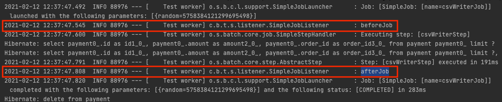
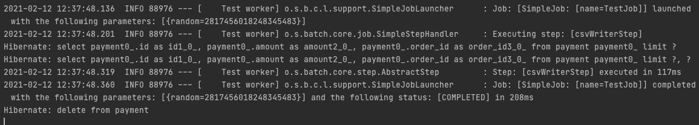
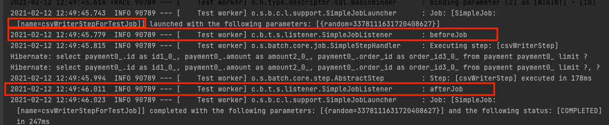

# Spring Batch Test Code

스프링 배치 애플리케이션 테스트 코드를 작성하면서 만났던 이슈와 그에 따른 나름의 고찰을 정리한 포스팅 내용입니다. 


## @SpringBatchTest

[Spring Batch 4.1](https://docs.spring.io/spring-batch/docs/4.1.x/reference/html/whatsnew.html) 버전 부터는 `@SpringBatchTest` Annotation을 지원합니다.

```java

@RunWith(SpringRunner.class)
@SpringBatchTest
@ContextConfiguration(classes = {JobConfiguration.class})
public class JobTest {

    @Autowired
    private JobLauncherTestUtils jobLauncherTestUtils;

    @Autowired
    private JobRepositoryTestUtils jobRepositoryTestUtils;


    @Before
    public void clearMetadata() {
        jobRepositoryTestUtils.removeJobExecutions();
    }

    @Test
    public void testJob() throws Exception {
        // given
        JobParameters jobParameters =
            jobLauncherTestUtils.getUniqueJobParameters();

        // when
        JobExecution jobExecution =
            jobLauncherTestUtils.launchJob(jobParameters);

        // then
        Assert.assertEquals(ExitStatus.COMPLETED,
            jobExecution.getExitStatus());
    }
}
```

* JobLauncherTestUtils : 스프링 배치 테스트에 필요한 유틸 기능
* JobRepositoryTestUtils : 데이터베이스에 저장된 JobExcution을 생성/삭제 지원
* StepScopeTestExecutionListener : 배치 단위 테스트시 StepScope 컨텍스트를 생성, 해당 컨텍스트를 통해 JobParamerter 등을 단위 테스트에서 DI 받을 수 있음
* JobSopceTestExecutionListener : 배치 단위 테스트시 JobScope 컨텍스트를 생성, 해당 컨텍스트를 통해 JobParameter등을 단위 테스트에서 DI 받을 수 있음

`@SpringBatchTest` 으로 위 코드를 자동으로 구성할 수 있습니다.

## Spring Batch Test Support 만들기

최신 코드인지 확인할것
```kotlin
@SpringBootTest
@SpringBatchTest
@TestInstance(TestInstance.Lifecycle.PER_CLASS)
@TestConstructor(autowireMode = TestConstructor.AutowireMode.ALL)
@ActiveProfiles("test")
abstract class BatchTestSupport {

    @Autowired
    protected lateinit var entityManagerFactory: EntityManagerFactory

    @Autowired
    protected lateinit var jobLauncherTestUtils: JobLauncherTestUtils

    protected val entityManager by lazy { entityManagerFactory.createEntityManager() }

    protected var jobExecution: JobExecution? = null

    protected val query: JPAQueryFactory by lazy { JPAQueryFactory(entityManager) }

    protected fun launchJob(
        job: Job,
        jobParameters: JobParameters = jobLauncherTestUtils.uniqueJobParameters
    ) {
        jobLauncherTestUtils.job = job
        this.jobExecution = jobLauncherTestUtils.launchJob(jobParameters)
    }

    protected fun launchStep(
        stepName: String,
        jobParameters: JobParameters = jobLauncherTestUtils.uniqueJobParameters,
        executionContext: ExecutionContext? = null
    ) {
        this.jobExecution = jobLauncherTestUtils.launchStep(stepName, jobParameters, executionContext)
    }

    protected fun thenBatchCompleted() {
        then(BatchStatus.COMPLETED).isEqualTo(jobExecution?.status)
    }

    protected fun thenBatchStatus(batchStatus: BatchStatus) {
        then(batchStatus).isEqualTo(jobExecution?.status)
    }

    protected fun <T> save(entity: T): T {
        entityManager.transaction.let { transaction ->
            transaction.begin()
            entityManager.persist(entity)
            transaction.commit()
            entityManager.clear()
        }
        return entity
    }

    protected fun <T> saveAll(entities: List<T>): List<T> {
        val entityManager = entityManagerFactory.createEntityManager()
        entityManager.transaction.let { transaction ->
            transaction.begin()
            for (entity in entities) {
                entityManager.persist(entity)
            }
            transaction.commit()
            entityManager.clear()
        }
        return entities
    }

    protected fun <E> List<E>.persist() {
        saveAll(this)
    }

    protected fun <T> deleteAll(path: EntityPath<T>) {
        entityManager.transaction.let { transaction ->
            transaction.begin()
            query.delete(path).execute()
            transaction.commit()
        }
    }
}
```

배치 애플리케이션의 테스트를 도와주는 유틸성 클래스, 테스트 코드를 효율적으로 작성할 수 있게 지원합니다. 어떤 기능들이 있고, 이 기능들이 어떤 불편한점 때문에 추가했는지에 대해서 설명을 진행하겠습니다.

### 테스트 Job 실행은?
```kotlin
abstract class BatchTestSupport {

    @Autowired
    protected lateinit var jobLauncherTestUtils: JobLauncherTestUtils
    ...
    protected fun launchJob(
        job: Job,
        jobParameters: JobParameters = jobLauncherTestUtils.uniqueJobParameters
    ) {
        jobLauncherTestUtils.job = job
        this.jobExecution = jobLauncherTestUtils.launchJob(jobParameters)
    }
}


internal class CsvWriterConfigurationTest(
    private val csvWriterJob: Job,
) : BatchTestSupport() {

    @Test
    internal fun `csvWriterJob test`() {
        //given
        ...

        //when
        launchJob(csvWriterJob)

        //then
        ...
    }


    @Autowired
    protected lateinit var jobLauncherTestUtils: JobLauncherTestUtils

    @Test
    internal fun `csvWriterJob test 슈퍼 클래스에 없는 경우 직접 DI 받아 job을 실헹 해야한다`() {
        //given
        ...

        //when
        jobLauncherTestUtils.job = job
        jobLauncherTestUtils.launchJob(job)

        //then
        ...
    }
}
```
배치 테스트를 위헤서는 Job을 실행시켜야 합니다. 이것을 편리하게 도와주는 것이 `launchJob()`메서드 입니다. `JobLauncherTestUtils`의 `launchJob()` 메서드를 한 번 감싸서 사용하는 용도로 특별하건 없습니다. 슈퍼 클래스에서 의조성을 주입받지 않으면 실제 테스트에 계속 DI를 받아 사용해야 하기 때문에 슈퍼 클래스에서 해당 기능을 제공 합니다. 

JobParameters가 필요한 경우 `JobParameters`를 전달하면 됩니다. 그렇지 않은 경우에는 스프링 배치에서 자체적으로 유니크한 `JobParameters`을 생성하는 기본값을 지정했습니다.


### 특정 Step만 테스트하고 싶은 경우는 ?

```kotlin
@Bean
fun sampleJob(
    jobBuilderFactory: JobBuilderFactory,
    step1: Step,
    step2: Step,
    step3: Step,
    step4: Step,
    step5: Step,
): Job =
    jobBuilderFactory["csvWriterJob"]
        .incrementer(RunIdIncrementer())
        .listener(JobReportListener())
        .start(step1)
        .next(step2)
        .next(step3)
        .next(step4)
        .next(step5)
        .build()
```
단순한 Job의 경우에는 Step이 여러개로 구성되어 있는 경우는 특정 Step만 테스트를 진행하는 단위 테스트가 필요할 수 있습니다.

```kotlin
abstract class BatchTestSupport {
    ...
    protected fun launchStep(
        job: Job,
        stepName: String,
        jobParameters: JobParameters = jobLauncherTestUtils.uniqueJobParameters,
        executionContext: ExecutionContext? = null
    ) {
        this.jobExecution = jobLauncherTestUtils.launchStep(stepName, jobParameters, executionContext)
    }
}

internal class CsvWriterConfigurationTest(
    private val csvWriterJob: Job,
) : BatchTestSupport() {
    
    @Test
    internal fun `csvWriterStep test`() {
        //given
        ...

        //when
        launchStep(csvWriterJob, "csvWriterStep")

        //then
        ...
    }
}
```
Step 테스트도 마찬가지로 `jobLauncherTestUtils.launchStep()` 메서드를 활용해서 특정 Step을 실행할 수 있습니다. 개인적으로는 `launchStep()` 테스트를 진행하는 것은 좋아하지는 않습니다.


Job name이 `name=TestJob` 이것을 확인 할 수 있습니다. Step을 테스트하기 위해서는 반드시 Job이 있어야 하기 때문에 `TestJob`으로 연결해서 테스트를 진행하는 것입니다. 이렇게 테스트가 진행되게 되면 문제가 있을 수 있습니다.

```kotlin
class SimpleJobListener : JobExecutionListener {
    private val log by logger()

    override fun beforeJob(jobExecution: JobExecution) {
        log.info("beforeJob")
    }

    override fun afterJob(jobExecution: JobExecution) {
        log.info("afterJob")
    }
}

@Configuration
class CsvWriterJobConfiguration {

    @Bean
    fun csvWriterJob(
        jobBuilderFactory: JobBuilderFactory,
        csvWriterStep: Step
    ): Job =
        jobBuilderFactory["csvWriterJob"]
            .incrementer(RunIdIncrementer())
            .listener(SimpleJobListener())
            .start(csvWriterStep)
            .build()
}
```
위 코드처럼 `SimpleJobListener`로 Job 시작 이전, 이후로 log를 찍는 리스너를 추가하고 `launchStep("csvWriterStep")` Step을 실행시키면 리스너는 동작하지 않습니다. 반면 `launchJob(csvWriterJob)`은 잘 동작합니다.

> launchJob(csvWriterJob) Log


> launchStep("csvWriterStep") Log


리스너는 Job에 연결돤것이지 Step에 연결되있는 것은 아니며, 위에서 언급했듯 `launchStep()`은  `name=TestJob` 으로 Job을 실행시키기 때문에 해당 잡에는 리스너가 없어 당연한 결과입니다.

해당 코드는 단순하게 리스너로 로직을 것이지만 해당 Step에 필요한 리스너라면 예상했던 테스트 결과와 다르게 동작할 수 있습니다. 이러한 문제 때문에 저는 아래와 같은 방식으로 Step 테스트 합니다.

```kotlin
internal class CsvWriterConfigurationTest(
    private val csvWriterJob: Job,
    csvWriterStep: Step,
    jobBuilderFactory: JobBuilderFactory,
) : BatchTestSupport() {

    private val job = jobBuilderFactory["csvWriterStepForTestJob"]
        .incrementer(RunIdIncrementer())
        .listener(SimpleJobListener())
        .start(csvWriterStep)
        .build()

    @Test
    internal fun `csvWriterStep job을 직접 생성해서 테스트`() {
        //given
        ...

        //when
        launchJob(job)

        //then
        ...
    }
}
```
위 코드는 실제 Job을 생성하고 해당 Job으로 `launchJob()`메서드를 통해서 Job을 실행 시키고 있습니다.


해당 결과 리스너의 로그 및 Job name이 `name=csvWriterStepForTestJob`으로 테스트를 진행하는 것을 확인 할 수 있습니다.

그 밖에도 Job을 직접 생성할 수 있으니 다양한 방법으로 테스트를 진행 할 수 있습니다. 예를들어 특정 step 몇개를 연결해서 단위 테스트 해볼 수 있으며, Flow와 같은 배치 Step의 순서에 대한 플로우를 직접 정의해서 테스트할 수 있습니다.


### 테스트 데이터 셋팅은?

### 테스트 검증은?

### 테스트 검증 이후 데이터 제거는 ?

### 왜 배치에서는 @Transactional을 물고 시작할 수 없을까?


