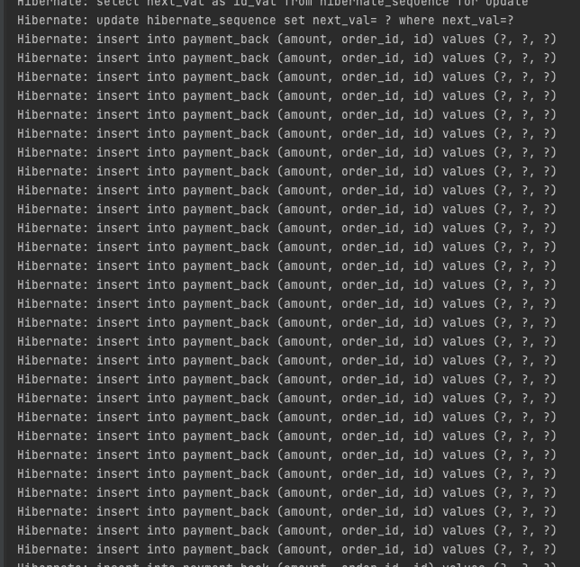

# Batch Insert 성능 향상 - JPA Batch Insert

성능 향상을 위해서 Batch Insert를 도입하는 과정 중 JPA, Mysql 환경에서의 Batch Insert에 대한 방법과 제약사항들에 대해서 정리했습니다. 결과적으로는 다른 프레임워크를 도입해서 해결했으며 본 포스팅은 JPA Batch Insert의 정리와, 왜 다른 프레임워크를 도입을 했는지에 대해한 내용입니다.

## Batch Insert 란 ?

```sql
# 단건 insert
insert into payment_back (amount, order_id) values (?, ?)

# 멀티 insert
insert into payment_back (amount, order_id)
values 
       (1, 2),
       (1, 2),
       (1, 2),
       (1, 2)
```

insert rows 여러 개 연결해서 한 번에 입력하는 것을 Batch Insert라고 말합니다. 당연한 이야기이지만 Batch Insert는 하나의 트랜잭션으로 묶이게 됩니다.

## Batch Insert With JPA
위 Batch Insert SQL이 간단해 보이지만 실제 로직으로 작성하려면 코드가 복잡해지고 실수하기 좋은 포인트들이 있어 유지 보수하기 어려운 코드가 되기 쉽습니다. 해당 포인트들은 아래 주석으로 작성했습니다. **JPA를 사용하면 이러한 문제들을 정말 쉽게 해결이 가능합니다.**

```kotlin
    // 문자열로 기반으로 SQL을 관리하기 때문에 변경 및 유지 보수에 좋지 않음
    val sql = "insert into payment_back (id, amount, order_id) values (?, ?, ?)"
    val statement = connection.prepareStatement(sql)!!

    fun addBatch(payment: Payment) = statement.apply {
        // code 바인딩 순서에 따라 오동작 가능성이 높음
        // 매번 자료형을 지정해서 값을 입력해야 함
        this.setLong(1, payment.id!!)
        this.setBigDecimal(2, payment.amount)
        this.setLong(3, payment.orderId)
        this.addBatch()
    }

    // connection & statement 객체를 직접 close 진행, 하지 않을 경우 문제 발생 가능성이 있음
    fun close() {
        if (statement.isClosed.not())
            statement.close()
    }
```

### 쓰기 지연 SQL 지원 이란 ?

```java
EntityMaanger em  = emf.createEnttiyManager();
ENtityTranscation transaction = em.getTransaction();
// 엔티티 매니저는 데이터 변경 시 트랜잭션을 시작해야 한다.

transaction.begin();

em.persist(memberA);
em.persist(memberB);

// 여기까지 Insert SQL을 데이터베이스에 보내지 않는다.
// Commit을 하는 순간 데이터베이스에 Insert SQL을 보낸다
transaction.commit();
```

엔티티 매니저는 트랜잭션을 커밋 하기 직전까지 데이터베이스에 엔티티를 저장하지 않고 내부 쿼리 저장소에 INSERT SQL을 모아둔다. 그리고 트랜잭션을 커밋 할 때 모아둔 쿼리를 데이터베이스에 보내는데 이것을 트랜잭션을 지원하는 쓰기 지연이라 한다.


회원 A를 영속화했다. 영속성 컨텍스트는 1차 캐시에 회원 엔티티를 저장하면서 동시에 회원 엔티티 정보로 등록 쿼리를 만든다. 그리고 만들어진 등록 쿼리를 쓰기 지연 SQL 저장소에 보관한다.


다음으로 회원 B를 영속화했다. 마찬가지로 회원 엔티티 정보로 등록 쿼리를 생성해서 쓰지 지연 SQL 저장소에 보관한다. 현재 쓰기 지연 SQL 저장소에는 등록 쿼리가 2건이 저장되어 있다.


마지막으로 트랜잭션을 커밋 했다. 트랜잭션을 커밋 하면 엔티티 매니저는 우선 영속성 컨텍스트를 플러시 한다. 플러시는 영속성 컨텍스트의 변경 내용을 데이터베이스에 동기화하는 작업인데 이때 등록, 수정, 삭제한 엔티티를 데이터베이스에 반영한다. **이러한 부분은 JPA 내부적으로 이루어지기 때문에 사용하는 코드에서는 코드의 변경 없이 이러한 작업들이 가능하다.**

### JPA With Batch Insert Code

```yml
spring:
    jpa:
        database: mysql
        properties:
            hibernate.jdbc.batch_size: 50
            hibernate.order_inserts: true
            hibernate.order_updates: true
            hibernate.dialect: org.hibernate.dialect.MySQL5InnoDBDialect
            hibernate.show_sql: true

    datasource:
        url: jdbc:mysql://localhost:3366/batch_study?useSSL=false&serverTimezone=UTC&autoReconnect=true&rewriteBatchedStatements=true
        driver-class-name: com.mysql.cj.jdbc.Driver
```
addBatch 구분을 사용하기 위해서는 `rewriteBatchedStatements=true` 속성을 지정해야 합니다. 기본 설정은 `false`이며, 해당 설정이 없으면 Batch Insert는 동작하지 않습니다. 정확한 내용은 공식 문서를 참고해 주세요.

> [MySQL Connector/J 8.0 Developer Guide : 6.3.13 Performance Extensions](https://dev.mysql.com/doc/connector-j/8.0/en/connector-j-connp-props-performance-extensions.html)
> Stops checking if every INSERT statement contains the "ON DUPLICATE KEY UPDATE" clause. As a side effect, obtaining the statement's generated keys information will return a list where normally it wouldn't. Also be aware that, in this case, the list of generated keys returned may not be accurate. The effect of this property is canceled if set simultaneously with 'rewriteBatchedStatements=true'.

`hibernate.jdbc.batch_size: 50` Batch Insert의 size를 지정합니다. 해당 크기에 따라서 한 번에 insert 되는 rows가 결정됩니다. 자세한 내용은 아래에서 설명드리겠습니다.

```kotlin
@Entity
@Table(name = "payment_back")
class PaymentBackJpa(
    @Column(name = "amount", nullable = false)
    var amount: BigDecimal,

    @Column(name = "order_id", nullable = false, updatable = false)
    val orderId: Long
){
    
    @Id
    @Column(name = "id", updatable = false) // @GeneratedValue를 지정하지 않았음
    var id: Long? = null
}

interface PaymentBackJpaRepository: JpaRepository<PaymentBackJpa, Long>
```
엔티티 클래스는 간단합니다. 중요한 부분은 `@GeneratedValue`을 지정하지 않은 부분입니다.

```kotlin
@SpringBootTest
@TestConstructor(autowireMode = TestConstructor.AutowireMode.ALL)
internal class BulkInsertJobConfigurationTest(
    private val paymentBackJpaRepository: PaymentBackJpaRepository
) {

    @Test
    internal fun `jpa 기반 bulk insert`() {
        (1..100).map {
            PaymentBackJpa(
                amount = it.toBigDecimal(),
                orderId = it.toLong()
            )
                .apply {
                    this.id = it.toLong() // ID를 직접 지정
                }
        }.also {
            paymentBackJpaRepository.saveAll(it)
        }
    }
}
```
`paymentBackJpaRepository.saveAll()`를 이용해서 batch inset를 진행합니다. JPA 기반으로 Batch Insert를 진행할 때 별다른 코드가 필요 없습니다. 컬렉션 객체를 `saveAll()`으로 저장하는 것이 전부입니다. `hibernate.show_sql: true`으로 로킹 결고를 확인해보겠습니다.



로그상으로는 Batch Insert가 진행되지 않은 것처럼 보입니다. 결론부터 말씀드리면 실제로는 Batch Insert가 진행됐지만 `hibernate.show_sql: true` 기반 로그에는 제대로 표시가 되지 않습니다. Mysql의 실제 로그로 확인해보겠습니다.

```sql
show variables like 'general_log%'; # general_log 획인
set global general_log = 'ON'; # `OFF` 경우 `ON` 으로 변경
```


**해당 로그 설정은 성능에 지장을 줄 수 있기 때문에 테스트, 개발 환경에서만 지정하는 것을 권장합니다.** 해당 기능은 실시간으로 변경 가능하기 때문에 설정 완료 이후 `/var/lib/mysql/0a651fe44d20.log` 파일에 로그를 확인할 수 있습니다.

### batch size
```sql
Query	SELECT @@session.transaction_read_only
Query	insert into payment_back (amount, order_id, id) values (1, 1, 1),(2, 2, 2),(3, 3, 3),(4, 4, 4),(5, 5, 5),(6, 6, 6),(7, 7, 7),(8, 8, 8),(9, 9, 9),(10, 10, 10),(11, 11, 11),(12, 12, 12),(13, 13, 13),(14, 14, 14),(15, 15, 15),(16, 16, 16),(17, 17, 17),(18, 18, 18),(19, 19, 19),(20, 20, 20),(21, 21, 21),(22, 22, 22),(23, 23, 23),(24, 24, 24),(25, 25, 25),(26, 26, 26),(27, 27, 27),(28, 28, 28),(29, 29, 29),(30, 30, 30),(31, 31, 31),(32, 32, 32),(33, 33, 33),(34, 34, 34),(35, 35, 35),(36, 36, 36),(37, 37, 37),(38, 38, 38),(39, 39, 39),(40, 40, 40),(41, 41, 41),(42, 42, 42),(43, 43, 43),(44, 44, 44),(45, 45, 45),(46, 46, 46),(47, 47, 47),(48, 48, 48),(49, 49, 49),(50, 50, 50)
Query	SELECT @@session.transaction_read_only
Query	insert into payment_back (amount, order_id, id) values (51, 51, 51),(52, 52, 52),(53, 53, 53),(54, 54, 54),(55, 55, 55),(56, 56, 56),(57, 57, 57),(58, 58, 58),(59, 59, 59),(60, 60, 60),(61, 61, 61),(62, 62, 62),(63, 63, 63),(64, 64, 64),(65, 65, 65),(66, 66, 66),(67, 67, 67),(68, 68, 68),(69, 69, 69),(70, 70, 70),(71, 71, 71),(72, 72, 72),(73, 73, 73),(74, 74, 74),(75, 75, 75),(76, 76, 76),(77, 77, 77),(78, 78, 78),(79, 79, 79),(80, 80, 80),(81, 81, 81),(82, 82, 82),(83, 83, 83),(84, 84, 84),(85, 85, 85),(86, 86, 86),(87, 87, 87),(88, 88, 88),(89, 89, 89),(90, 90, 90),(91, 91, 91),(92, 92, 92),(93, 93, 93),(94, 94, 94),(95, 95, 95),(96, 96, 96),(97, 97, 97),(98, 98, 98),(99, 99, 99),(100, 100, 100)
Query	commit
Query	SET autocommit=1
```

실제 mysql 로그에서는 Batch Insert를 확인할 수 있습니다. 그런데 왜 2번에 걸쳐서 Batch Insert가 진행되었을까요? **`hibernate.jdbc.batch_size: 50`설정으로 Batch Insert에 대한 size를 50으로 지정했기 때문에 rows 100를 저장할 때 2번에 걸쳐 insert를 진행하는 것입니다.** 만약 `hibernate.jdbc.batch_size: 100`이라면 1번의 insert로 저장됩니다.

```sql
Query	insert into payment_back (amount, order_id, id) values (1, 1, 1),(2, 2, 2),(3, 3, 3),(4, 4, 4),(5, 5, 5),(6, 6, 6),(7, 7, 7),(8, 8, 8),(9, 9, 9),(10, 10, 10),(11, 11, 11),(12, 12, 12),(13, 13, 13),(14, 14, 14),(15, 15, 15),(16, 16, 16),(17, 17, 17),(18, 18, 18),(19, 19, 19),(20, 20, 20),(21, 21, 21),(22, 22, 22),(23, 23, 23),(24, 24, 24),(25, 25, 25),(26, 26, 26),(27, 27, 27),(28, 28, 28),(29, 29, 29),(30, 30, 30),(31, 31, 31),(32, 32, 32),(33, 33, 33),(34, 34, 34),(35, 35, 35),(36, 36, 36),(37, 37, 37),(38, 38, 38),(39, 39, 39),(40, 40, 40),(41, 41, 41),(42, 42, 42),(43, 43, 43),(44, 44, 44),(45, 45, 45),(46, 46, 46),(47, 47, 47),(48, 48, 48),(49, 49, 49),(50, 50, 50),(51, 51, 51),(52, 52, 52),(53, 53, 53),(54, 54, 54),(55, 55, 55),(56, 56, 56),(57, 57, 57),(58, 58, 58),(59, 59, 59),(60, 60, 60),(61, 61, 61),(62, 62, 62),(63, 63, 63),(64, 64, 64),(65, 65, 65),(66, 66, 66),(67, 67, 67),(68, 68, 68),(69, 69, 69),(70, 70, 70),(71, 71, 71),(72, 72, 72),(73, 73, 73),(74, 74, 74),(75, 75, 75),(76, 76, 76),(77, 77, 77),(78, 78, 78),(79, 79, 79),(80, 80, 80),(81, 81, 81),(82, 82, 82),(83, 83, 83),(84, 84, 84),(85, 85, 85),(86, 86, 86),(87, 87, 87),(88, 88, 88),(89, 89, 89),(90, 90, 90),(91, 91, 91),(92, 92, 92),(93, 93, 93),(94, 94, 94),(95, 95, 95),(96, 96, 96),(97, 97, 97),(98, 98, 98),(99, 99, 99),(100, 100, 100)
```
위 쿼리는 `hibernate.jdbc.batch_size: 100`으로 지정한 결과입니다. 그렇다면 왜 `batch_size` 옵션을 주어서 한 번에 insert 할 수 있는 데이터의 크기를 제한하는 것일까요? 아래 코드에서 해답을 찾을 수 있습니다.

> [Hibernate User Guide: 12.2.1. Batch inserts](https://docs.jboss.org/hibernate/orm/5.4/userguide/html_single/Hibernate_User_Guide.html#batch-jdbcbatch)
> 
> When you make new objects persistent, employ methods flush() and clear() to the session regularly, to control the size of the first-level cache.

```java
EntityManager entityManager = null;
EntityTransaction txn = null;
try {
	entityManager = entityManagerFactory().createEntityManager();

	txn = entityManager.getTransaction();
	txn.begin();

	int batchSize = 25;

	for ( int i = 0; i < entityCount; i++ ) {
		if ( i > 0 && i % batchSize == 0 ) {
			//flush a batch of inserts and release memory
			entityManager.flush();
			entityManager.clear();
		}

		Person Person = new Person( String.format( "Person %d", i ) );
		entityManager.persist( Person );
	}

	txn.commit();
} catch (RuntimeException e) {
	if ( txn != null && txn.isActive()) txn.rollback();
		throw e;
} finally {
	if (entityManager != null) {
		entityManager.close();
	}
}
```
하이버네이트 공식 가이드의 내용입니다. `batchSize` 값을 기준으로 `flush();`, `clear();`를 이용해서 영속성 컨텍스트를 초기화 작업을 진행하고 있습니다. `batchSize`에 대한 제한이 없으면 영속성 컨텍스트에 모든 엔티티가 올라가기 때문에 `OutOfMemoryException` 발생할 수 있고, 메모리 관리 측면에서도 효율적이지 않기 때문입니다. 하이버네이트의 공식 가이드에서도 해당 부분의 언급이 있습니다.

> [Hibernate User Guide: 12.2. Session batching](https://docs.jboss.org/hibernate/orm/5.4/userguide/html_single/Hibernate_User_Guide.html#batch-session-batch)
> 
> 1. Hibernate caches all the newly inserted Customer instances in the session-level cache, so, when the transaction ends, 100 000 entities are managed by the persistence context. If the maximum memory allocated to the JVM is rather low, this example could fail with an OutOfMemoryException. The Java 1.8 JVM allocated either 1/4 of available RAM or 1Gb, which can easily accommodate 100 000 objects on the heap.
> 2. long-running transactions can deplete a connection pool so other transactions don’t get a chance to proceed
> 3. JDBC batching is not enabled by default, so every insert statement requires a database roundtrip. To enable JDBC batching, set the hibernate.jdbc.batch_size property to an integer between 10 and 50.

### 쓰기 지연 SQL 제약 사항

`batchSize: 50` 경우 `PaymentBackJpa` 객체를 50 단위로 Batch Insert 쿼리가 실행되지만, 중간에 다른 엔티티를 저장하는 경우 아래처럼 지금까지의 `PaymentBackJpa`에 대한 지정하기 때문에 최종적으로 `batchSize: 50` 단위로 저장되지 않습니다.

```java
em.persist(new PaymentBackJpa()); // 1
em.persist(new PaymentBackJpa()); // 2
em.persist(new PaymentBackJpa()); // 3
em.persist(new PaymentBackJpa()); // 4
em.persist(new Orders()); // 1-1, 다른 SQL이 추가 되었기 때문에  SQL 배치를 다시 시작 해야 한다.
em.persist(new PaymentBackJpa()); // 1
em.persist(new PaymentBackJpa()); // 2
```
이러한 문제는 `hibernate.order_updates: true`, `hibernate.order_inserts: true` 값으로 해결 할 수 있습니다.

### JPA Batch Insert의 가장 큰 문제...
위에서 설명했던 부분들은 Batch Insert에 필요한 properties 설정, 그리고 내부적으로 JPA에서 Batch Insert에 대한 동작 방식을 설명한 것입니다. **실제 Batch Insert를 진행하는 코드는 별다른 부분이 없고 컬렉션 객체를 `saveAll()` 메서드로 호출하는 것이 전부입니다.** 이로써 JPA는 Batch Insert를 강력하게 지원해 주고 있습니다. **하지만 가장 큰 문제가 있습니다. `@GeneratedValue(strategy = GenerationType.IDENTITY)` 방식의 경우 Batch Insert를 지원하지 않습니다.**


> [Hibernate User Guide: 12.2. Session batching](https://docs.jboss.org/hibernate/orm/5.4/userguide/html_single/Hibernate_User_Guide.html#batch-session-batch)
> 
> Hibernate disables insert batching at the JDBC level transparently if you use an identity identifier generator.

공식 문서에도 언급이 있듯이 `@GeneratedValue(strategy = GenerationType.IDENTITY)` 경우 Batch Insert를 지원하지 않습니다. 정확히 어떤 이유 때문인지에 대해서는 언급이 없고, 관련 내용을 잘 설명한 [StackOverflow](https://stackoverflow.com/questions/27697810/why-does-hibernate-disable-insert-batching-when-using-an-identity-identifier-gen/27732138#27732138)를 첨부합니다.

제가 이해한 바로는 하이버네이트는 `Transactional Write Behind` 방식(마지막까지 영속성 컨텍스트에서 데이터를 가지고 있어 플러시를 연기하는 방식)을 사용하기 때문에 `GenerationType.IDENTITY` 방식의 경우 JDBC Batch Insert를 비활성화함. `GenerationType.IDENTITY` 방식이란 `auto_increment`으로 PK 값을 자동으로 증분 해서 생성하는 것으로 매우 효율적으로 관리할 수 있다.(heavyweight transactional course-grain locks 보다 효율적). 하지만 Insert를 실행하기 전까지는 ID에 할당된 값을 알 수 없기 때문에 `Transactional Write Behind`을 할 수 없고 결과적으로 Batch Insert를 진행할 수 없다. 

Mysql에서는 대부분 `GenerationType.IDENTITY`으로 사용하기 때문에 해당 문제는 치명적입니다. 우선 `GenerationType.IDENTITY` 으로 지정하고 다시 테스트 코드를 돌려 보겠습니다.

```kotlin
@Entity
@Table(name = "payment_back")
class PaymentBackJpa(
    @Column(name = "amount", nullable = false)
    var amount: BigDecimal,

    @Column(name = "order_id", nullable = false, updatable = false)
    val orderId: Long
){
    @Id
    @GeneratedValue(strategy = GenerationType.IDENTITY) // GenerationType.IDENTITY 지정
    var id: Long? = null
}

internal class BulkInsertJobConfigurationTest(
    private val paymentBackJpaRepository: PaymentBackJpaRepository
) {

    @Test
    internal fun `jpa 기반 bulk insert`() {
        (1..100).map {
            PaymentBackJpa(
                amount = it.toBigDecimal(),
                orderId = it.toLong()
            )
                .apply {
//                    this.id = it.toLong() // ID를 자동 증가로 변경 했기 때문에 코드 주석
                }
        }.also {
            paymentBackJpaRepository.saveAll(it)
        }
    }
}
```

```sql
Query	insert into payment_back (amount, order_id) values (1, 1)
Query	insert into payment_back (amount, order_id) values (2, 2)
Query	insert into payment_back (amount, order_id) values (3, 3)
Query	insert into payment_back (amount, order_id) values (4, 4)
Query	insert into payment_back (amount, order_id) values (5, 5)
Query	insert into payment_back (amount, order_id) values (6, 6)
Query	insert into payment_back (amount, order_id) values (7, 7)
Query	insert into payment_back (amount, order_id) values (8, 8)
Query	insert into payment_back (amount, order_id) values (9, 9)
Query	insert into payment_back (amount, order_id) values (10, 10)
Query	insert into payment_back (amount, order_id) values (11, 11)
Query	insert into payment_back (amount, order_id) values (12, 12)
...
```
**`GenerationType.IDENTITY`의 경우에는 Batch Insert가 진행되지 않습니다.** 그래서 다른 대안을 찾아야 했습니다. 이 부분부터는 다음 포스팅에서 이어가겠습니다.


# 참고
* [Spring Data에서 Batch Insert 최적화](https://homoefficio.github.io/2020/01/25/Spring-Data%EC%97%90%EC%84%9C-Batch-Insert-%EC%B5%9C%EC%A0%81%ED%99%94/)
* [JPA GenerationType에 따른 INSERT 성능 차이](https://github.com/HomoEfficio/dev-tips/blob/master/JPA-GenerationType-%EB%B3%84-INSERT-%EC%84%B1%EB%8A%A5-%EB%B9%84%EA%B5%90.md)
* [JPA Batch inserts Document](https://docs.jboss.org/hibernate/orm/5.4/userguide/html_single/Hibernate_User_Guide.html#batch-session-batch-insert)
* [How do persist and merge work in JPA](https://vladmihalcea.com/jpa-persist-and-merge/)
* [MySQL Connector/J 8.0 Developer Guide](https://dev.mysql.com/doc/connector-j/8.0/en/)
* [Hibernate ORM 5.4.28.Final User Guide](https://docs.jboss.org/hibernate/orm/5.4/userguide/html_single/Hibernate_User_Guide.html)
* [자바 ORM 표준 JPA 프로그래밍](http://www.acornpub.co.kr/book/jpa-programmig)