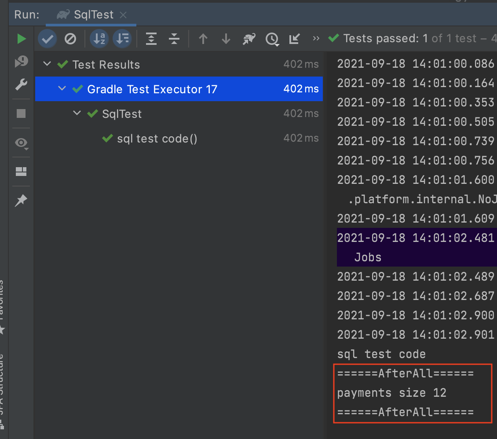
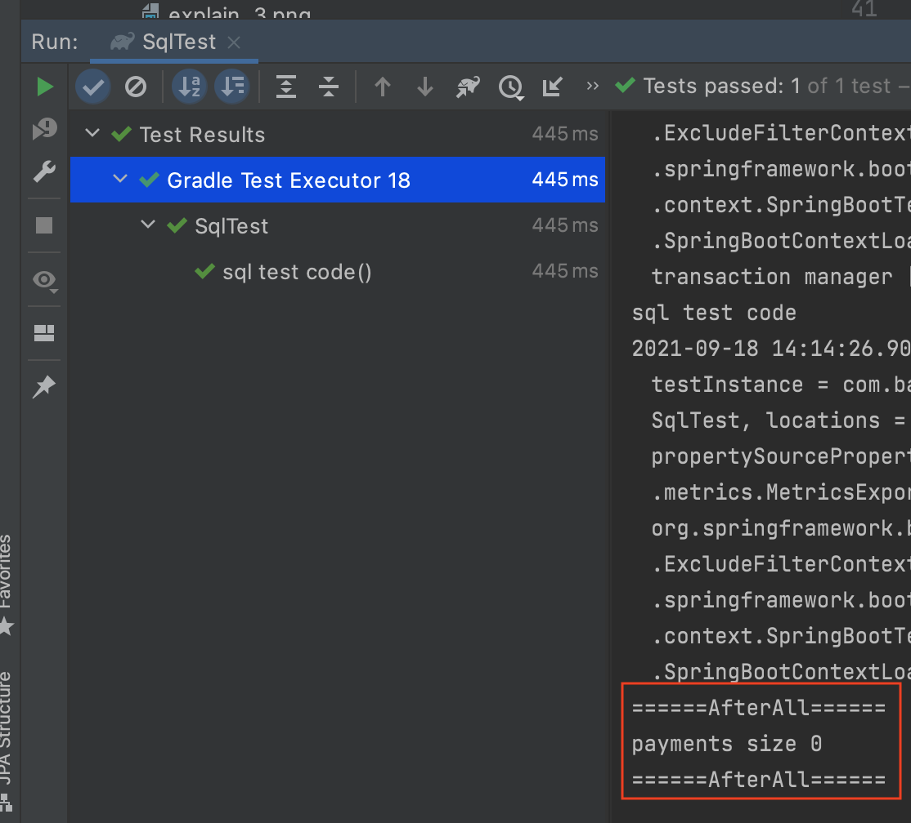
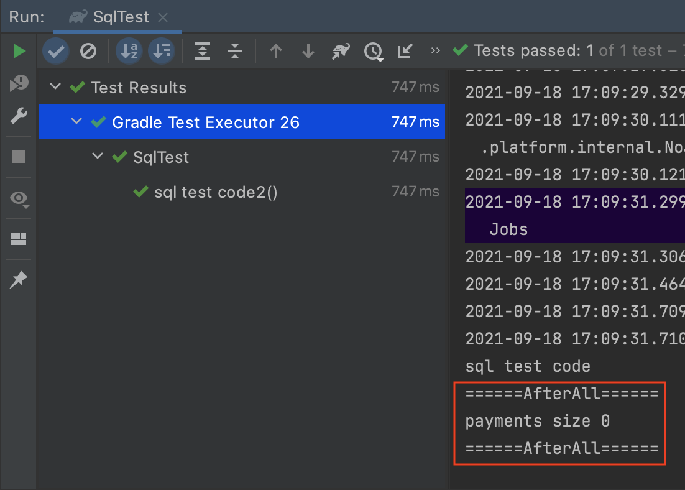

# @Sql을 통해서 테스트 코드를 쉽게 작성하자

데이터베이스와 의존성이 있는 테스트를 진행하는 경우 given 절에 해당하는 데이터를 set up 한 이후에 로직에 대한 검증을 진행하는 것이 일반적입니다. 이때 given 절에 대한 데이터 set up을 `*.sql` 파일 기반으로 작성하는 것입니다.


## @Sql 사용법

```sql
// /src/test/resources/payment-setup.sql
insert into payment (amount, created_at, order_id, updated_at)
values (1000, now(), 1, now()),
       (2000, now(), 2, now()),
       (3000, now(), 3, now()),
       (4000, now(), 4, now()),
       (5000, now(), 5, now()),
       (6000, now(), 6, now()),
       (7000, now(), 7, now()),
       (8000, now(), 8, now()),
       (9000, now(), 9, now()),
       (10000, now(), 10, now()),
       (11000, now(), 11, now()),
       (12000, now(), 12, now())
;
```

```kotlin
@SpringBootTest
@TestInstance(TestInstance.Lifecycle.PER_CLASS)
@TestConstructor(autowireMode = TestConstructor.AutowireMode.ALL)
class SqlTest(
    private val paymentRepository: PaymentRepository
) {

    @AfterAll
    internal fun setUp() {
        println("BeforeAll: 모든 테스트 끝난 이후 ")
        println("payments size ${paymentRepository.findAll().size}")
    }

    @Sql("/payment-setup.sql")
    @Test
    fun `sql test code`() {
        //given

        //when
        val payments = paymentRepository.findAll().toList()

        //then
        then(payments).hasSize(12)
        println("sql test code")
    }
}
```

사용방법은 간단합니다. `@Sql` 어노테이션을 작성하고 해당 경로에 `*.sql` 파일을 위치 시킵니다.



테스트 코드는 통과했고, AfterAll 메서드를 로그를 보면 `payments size 12`으로 롤백이 진행되지 않는 것을 볼 수 있습니다. 테스트 클래스 상단에 `@Transactional` 어노테이션을 작성하면 자동 롤백 처리가 됩니다. 한 번 테스트해 보겠습니다.



`payments size 0` 으로 정상적으로 롤백된것 확인할 수 있습니다. 


## @SqlGroup 사용법

`@SqlGroup`은 여러 `@Sql` 집계하는 컨테이너 어노테이션으로 여러 `@Sql`을 그룹화하여 사용할 수 있습니다.

```yml
spring:
    jpa:
        properties:
            hibernate.hbm2ddl.auto: none
```
JPA ddl 설정을 none으로 지정해서 엔티티 기반의 테이블 생성을 off 시켰습니다. 즉 테스트 코드 동작시 자동으로 테이블이 생성되지 않기 때문에 수동으로 생성해야 합니다.

```sql
// schema.sql
drop table if exists payment;
drop table if exists payment_back;

create table payment
(
    id         bigint         not null auto_increment,
    amount     decimal(19, 2) not null,
    created_at datetime       not null,
    order_id   bigint         not null,
    updated_at datetime       not null,
    primary key (id)
) engine=InnoDB
;

create table payment_back
(
    id       bigint         not null auto_increment,
    amount   decimal(19, 2) not null,
    order_id bigint         not null,
    primary key (id)
) engine=InnoDB
;
create index idx_created_at on payment (created_at);

// payment-setup.sql
insert into payment (amount, created_at, order_id, updated_at)
values (1000, now(), 1, now()),
       (2000, now(), 2, now()),
       (3000, now(), 3, now()),
       (4000, now(), 4, now()),
       (5000, now(), 5, now()),
       (6000, now(), 6, now()),
       (7000, now(), 7, now()),
       (8000, now(), 8, now()),
       (9000, now(), 9, now()),
       (10000, now(), 10, now()),
       (11000, now(), 11, now()),
       (12000, now(), 12, now())
;

// delete.sql
delete
from payment;

delete
from payment_back;

```

`schema.sql`, `payment-setup.sql`, `delete.sql` 각 SQL은 DDL 정의, 데이터 set up, 모든 row 제거 작업을 진행합니다.

```kotlin
@SpringBootTest
@TestInstance(TestInstance.Lifecycle.PER_CLASS)
@TestConstructor(autowireMode = TestConstructor.AutowireMode.ALL)
//@Transactional 해당 코드를 주석 했기 때문에 테스트 내용이 롤백되지 않는다.
class SqlTest(
    private val paymentRepository: PaymentRepository
) {


    @AfterAll
    internal fun setUp() {
        println("======AfterAll======")
        println("payments size ${paymentRepository.findAll().size}")
        println("======AfterAll======")
    }

    @SqlGroup(
        Sql(
            value = ["/schema.sql", "/payment-setup.sql"], // (1)
            config = SqlConfig( // (2)
                dataSource = "dataSource", // (3)
                transactionManager = "transactionManager" // (4)
            ),
            executionPhase = Sql.ExecutionPhase. BEFORE_TEST_METHOD // (5)
        ),
        Sql(
            value = ["/delete.sql"], // (6)
            config = SqlConfig(
                dataSource = "dataSource",
                transactionManager = "transactionManager"
            ),
            executionPhase = Sql.ExecutionPhase.AFTER_TEST_METHOD // (7)
        )
    )
    @Test
    fun `sql test code2`() {
        //given
        //when
        val payments = paymentRepository.findAll().toList()
        //then
        then(payments).hasSize(12)
        println("sql test code")
    }
}
```

* (1): JPA DDL 설정을 off 했기 때문에, 스키마를 생성하고, 해당ㅇ 테이블의 데이터를 set up을 진행합니다. `*.sql` 파일을 배열로 구성하면 배열의 index 순서로 sql을 실행합니다.
* (2): Sql에 대한 Config를 지정합니다
* (3): 해당 데이터베이스의 DataSource를 지정합니다.
* (4): 해당 데이터베이스의 TransactionManager를 지정합니다.
* (5): `BEFORE_TEST_METHOD`으로 테스트 코드가 동작하기 전에 해당 Sql이 동작하게 정의합니다.
* (6): 모든 데이터를 제거하는 SQL을 지정합니다.
* (7): `AFTER_TEST_METHOD`으로 테스트 코드가 동작 이후에 해당 Sql이 동작하게 정의합니다.



테스트 코드가 통과했으니 `schema.sql`, `payment-setup.sql`이 정상적으로 동작 했고, AfterAll에서 `payments size 0`이 출력되었으니 `delete.sql`도 정사적으로 동작했다는 것을 확인 할 수 있습다.

## 이런 기능이 왜 필요할까?

JPA를 사용하고 있다면 테스트 코드에서 스키마 설정은 DDL 설정으로, 데이터에 대한 롤백은 `@Transactional`으로 사용이고, 데이터 Set Up은 Entity Manager를 이용해서 사용하는 것이 훨씬 효율 작이라고 생각이 드실 겁니다. 하지만 단순한 프로젝트가 아니라 복잡한 프로젝트에서는 다소 복잡한 환경이 구성됩니다. 여기서 단순하다는 말은 구성이 단순하다는 표현인 것이지 도메인의 복잡도가 낮다던가, 해당 애플리케이션이 해결하려는 문제가 단순하다는 말은 아닙니다.

제가 해당 기능이 필요했던 이유와 시점은 다음과 같습니다.


### Spring Batch 테스트 코드
스프링 배치에서는 트랜잭션을 물고 테스트 코드를 작성할 수 없습니다. 그러기 때문에 당연히 테스트 코드 완료 이후에도 데이터가 롤백 되지 않기 때문에 이후 테스트에 영향을 줄 수 있습니다. 이런 경우 `Sql.ExecutionPhase.AFTER_TEST_METHOD`를 이용해서 테스트 끝난 이후의 데이터를 삭제할 수 있습니다.

### 다른 서비스의 DataSoruce를 2개 이상 연결하는 경우

Master, Slave 구조에서 DataSoruce를 의미하는 것이 아니라, 전혀 다른 서비스의 DataSource를 2개 이상 연결하는 경우에 유용합나다. 물론 2개 이상의 DataSource를 연결하는 것이 좋다고는 생각이 들지 않지만 실제 개발 황경에서 자주 만나는 환경입니디.
 
각기 다른 DataSource이기 때문에 트랜잭션에 트랜잭션 메니저를 명시적으로 선언한 트랜잭션에 데이터는 롤백이 되게고 나머지 하나는 롤백되지 않게 될 수 도 있습니다.

조금 과격한 예가 될수도 있겠지만, 애플리케이션 구동시 특정 코드 값들을 가져와야하는 경우 데이터베이스 컨넥션을 맺어서 가져오는 경우도 있습니다. 물론 API를 통해서 가져오는 방법이 좋은건 맞지만, 실제로 이런 서비스들은 종종 있습니다.

중심 서비스가 아닌 데이터베이스에 대해서 굳이 JPA를 사용하는 것이 좋은 판단이 아닐 수도 있기 때문에 해당 코드에 대한 테스트 코드를 작성 시 JPA와 무관하게 스키마를 생성하고, 데이터를 set up 하는 과정들이 필요한 경우 좋은 `@Sql`이 적절한 대안이 될 수 있다고 생각합니다.


### 특정 시점의 데이터 Set Up

커머스 시스템에서 배송중 -> 배송 완료로 주문의 상태가가 변경되는 로직을 작성해야 한다고 가정했을 때 우리는 Order 객체를 배송중 상태로 만드는 givn절이 필요합니다.

주문의 setter 코드가 모두 열려 있다면 해당 시점의로 객체를 생성하는 것은 어렵지 않습니다. 하지만 setter를 만들지 않는 패턴을 사용하고 있다면 배송중 상태로 실제 객체를 만드는 것은 다소 번거롭습니다. 잘짜여진 코드라고 하면 방어 로직이 충분히 있기 때문에 객체를 대충 만들 수도 없고 모든 예외 사항을 지켜가며 주문 완료 -> 결제 완료 -> 배송 준비 -> 배송중 으로 배송중 상태를 만들어여 합니다.

이런 경우 JPA같은 경우 다소 번거로울 수 있는 내용을 Sql으로는 쉽게 해결 가능 합니다. insert into를 작성하기만 하면 끝입니다. 물론 이 방법이 좋은 테스트 코드를 작성하는 방법일까라는 의문은 갖고 있습니다. 

## 결론

각자 다양한 개발 환경이 있고 그 환경에 맞는 테스트 코드를 작성하는 게 좋다고 생각합니다. 만약 스프링 배치 테스트 코드를 많이 작성하고, 2개 이상의 다른 서비스의 DataSource를 연결하는 프로젝트에서는 `@Sql`은 효율적인 도구라고 생각합니다.