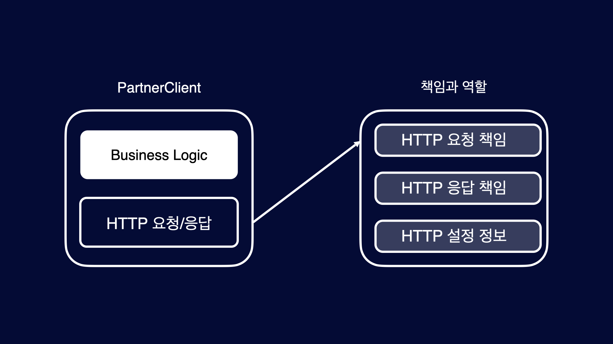
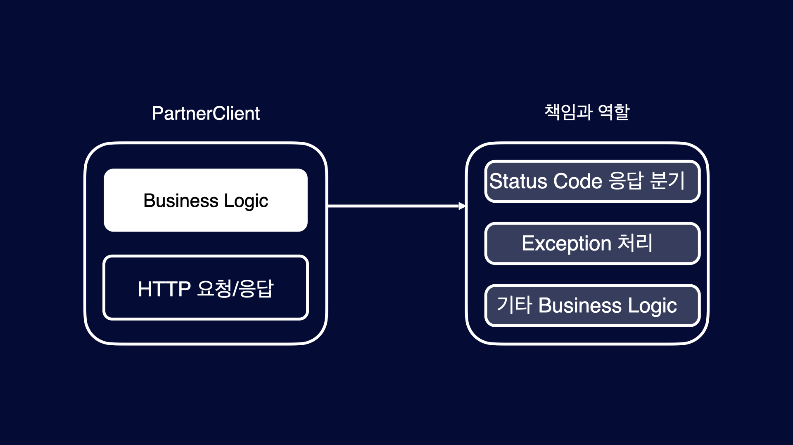
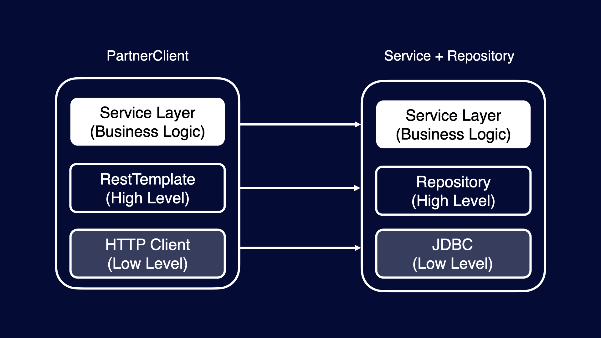
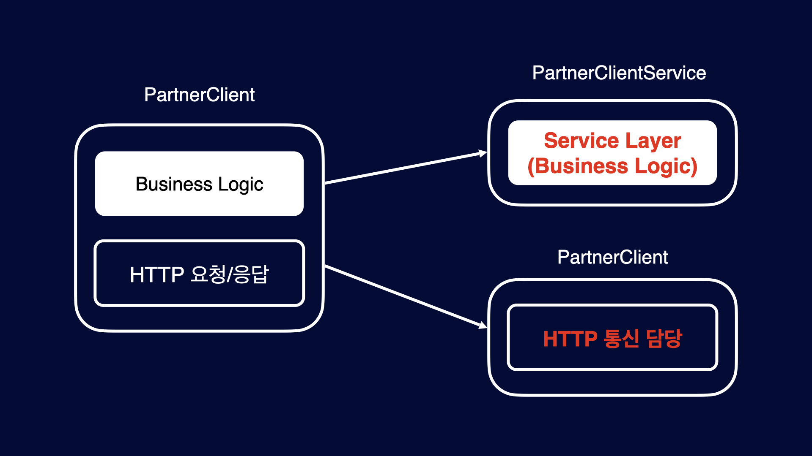
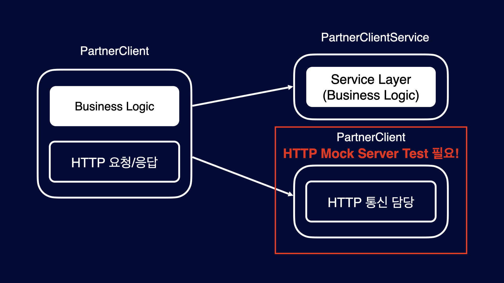
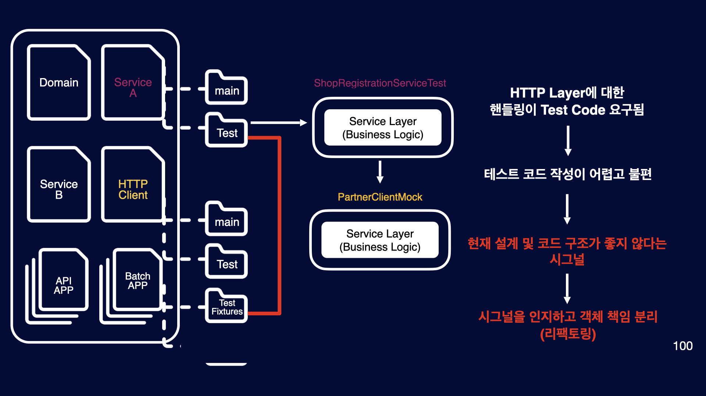

## 시작하며

안녕하세요. 정산플랫폼팀 윤입니다. [지난글](https://tech.kakaopay.com/post/mock-test-code/)에서는 효율적으로 Mock Test를 진행하는 방법에 대해서 살펴봤습니다. 이번 주제는 테스트 코드로 부터 피드백을 받기 입니다. 테스트 코드는 단순히 로직을 검증하는 코드만이 아니라 우리가
작성한 구현 코드를 가장 먼저 사용하는 사용처 이기도 합니다. 첫 사용자에게 제품에 대한 피드백을 받듯이 테스트 코드도 구현 코드의 첫 사용자이기 때문에 많은 피드백을 줄 수 있습니다. 이런 피드백에 귀를 귀울이면 자연스럽게 좋은 코드 디자인을 갖을 수 있으며 좋은 구현 코드 디자인으로 부터 더 간결하고 검증하기 쉬운
테스트 코드를 작성할 수 있게되는 순한 구조를 갖을 수 있습니다. 이렇듯 테스트 코드는 동떨어진 코드가 아니며 구현코드와 긴밀하게 상호작용 하며 소통하는 코드입니다. 구체적으로 살펴 보도록하겠습니다.

발표 영상이 궁금한 분들은 아래 링크에서 확인 가능하며, [지난글](https://tech.kakaopay.com/post/mock-test-code/)에서 내용이 이어집니다.
🔗[2023 Spring Camp 실무에서 적용하는 테스트 코드 작성 방법과 노하우](https://springcamp.ksug.org/2023/)

## Mock Server Test는 불필요 한가?

본 내용에 들어가기 앞서 “그러면 HTTP Mock Test는 필요 없나요?”라는 의문을 가질 수 있습니다. 실제로 너무 과도하게 Mocking 하는 것이 불편하기 때문이죠. 결론부터 말씀드리면 **필요합니다. 중요한 것은 해당 객체의 책임이 무엇이고, 그 객체의 관심사가 무엇이냐는 것입니다.** 그 책임과 관심사가 바로 테스트해야 하는 항목들인 것이기 때문입니다. PartnerClient의 책임과 역할을 살펴보도록 하겠습니다.

### PartnerClient 객체의 책임과 역할


### HTTP 통신에 대한 책임



PartnerClient 객체의 책임과 역할을 조금 더 디테일하게 보면 2가지로 볼 수 있습니다. 하나는 HTTP 통신에 관한 책임으로 HTTP 요청/응답 및 HTTP 설정 정보에 대한 책임을 담당합니다.

#### 비즈니스로직에 대한 책임



또 다른 하나의 책임은 HTTP 통신 이후 비즈니스 로직에 대한 책임을 담당합니다. 예를 들어 Status code에 따른 분기 및 처리할 수 없는 경우 Exception 발생, 기타 도메인 요구사항 등등이 이에 해당합니다.

### PartnerClient 객체의 책임 분리



객체의 책임을 계층 별로 보면 위 처럼 나눌 수 있습니다. Service Layer는 비즈니스 로직을 담당, RestTemplate는 HTTP 통신을 편리하게 사용할 수 있는 High Level, HTTP Client 실제 HTTP 통신을 진행하는 Low Level 이런 구조는 우리는 이미 너무나도 익숙한 구조입니다. 우리가 자주 이용하는 Service + Repository와 유사한 구조입니다. Service Layer는 비즈니스 로직을 담당, Repository는 데이터베이스에 대한 제어를 편리하게 하는 High Level, JDBC는 실제 데이터베이스에 대한 제어를 진행하는 Low Level로 PartnerClient와 유사한 구조입니다.



그렇다는 것은 **PartnerClient도 비즈니스 로직을 담당하는 서비스 로직과, HTTP 통신을 담당하는 로직으로 각기 다른 책임으로 분리하는 것이 더 좋다는 것은 우리는 경험적으로 이미 알고 있습니다.**

### 책임은 결국 변화에 관한 것

이렇게 책임 별로 객체를 나누는 이유는 책임은 이라는 것은 결국 변화에 관한 것이기 때문입니다. 만약 API가 XML에서 JSON으로 변화가 발생하게 된다면 HTTP 통신 로직과, 비즈니스 로직의 책임이 같이 있는 경우 변경이 상대적으로 더 어렵습니다. 만약 객체의 책임을 분리되 있다면 HTTP 통신만 담당하는 PartnerClient 객체만 변경하여 대응이 가능합니다. 반대의 경우도 동일합니다. 비즈니스 로직의 변경이 있다면 PartnerClientService 객체만 변화에 대응하여 변경을 하면 됩니다.

### Business Logic, HTTP 통신 책임 분리 되지 않은 Test Code

우리는 경험적으로 책임을 분리하는게 좋다는 것을 알고 있고 이런 패턴에 익숙하지만 막상 구현 코드를 작성하게 되면 이런 사실을 잊어버리고 코드를 작성하게 됩니다. 이럴 때 현재 구현 코드의 디자인이 적절하지 못하다고 테스트 코드가 우리에게 피드백을 줍니다. 어떤 피드백이 있는지 살펴보도록 하겠습니다.

```kotlin
@Test
fun `2xx가 아닌 경우 IllegalArgumentException 발생`() {
    //given
    val brn = "000-00-0000"
    val name = "주식회사 XXX"
    mockServer
        .expect(
            requestTo("http://localhost:8787/api/v1/partner/${brn}")
        )
        .andExpect(method(HttpMethod.GET))
        .andRespond(
            withStatus(HttpStatus.INTERNAL_SERVER_ERROR)
                .contentType(MediaType.APPLICATION_JSON)
                .body(
                    """
                        {
                          "brn": "$brn",
                          "name": "$name"
                        }
                    """.trimIndent()
                )
        )

    //when & then
    thenThrownBy {
        partnerClient.getPartnerBy(brn)
    }
        .isInstanceOf(IllegalArgumentException::class.java)
}
```

아직 객체의 책임이 분리되지 않는 상태의 테스트 코드에서 어떤 피드백을 주고 있는지 살펴보겠습니다.
2xx응답이 아닌 경우 특정 예외라 발생하는 로직이 있다고 가정하면, 해당 테스트 코드의 주요 관심는 특정 케이스에 특정 Exception이 발생하는 것이 주요 관심사입니다. HTTP Response Body, HTTP Method 등등이 주요 관심사가 아닙니다.

```kotlin
@Test
fun `PartnerResponse의 JOSN을 Deserialize 테스트`() {
    //given
    val brn = "000-00-0000"
    val name = "주식회사 XXX"
    val response = PartnerResponse(brn, name)

    given(partnerClient.getPartnerByResponse(brn))
        .willReturn(ResponseEntity(response, HttpStatus.OK))

    //when
    partnerClientService.getPartnerBy(brn)
}
```

다음 테스트 코드는 2xx 응답인경우 JSON을 특정 객체로 Deserialize 하는 것이 테스트의 주요 관심사입니다. 하지만 객체의 행위 자체를 Mocking하는 것으로는 검증이 어렵습니다. 이렇듯 테스트 코드를 작성하기 어렵거나 불편하다는 것은 구현 코드가 무언가가 잘못됐을 수 있다는 피드백을 주는 것입니다.

### Test Code 피드백으로 PartnerClient 리펙토링

```kotlin
fun getPartnerBy(brn: String): PartnerResponse {
    return restTemplate
        .getForObject(
            "/api/v1/partner/${brn}",
            PartnerResponse::class.java
        )!!
}
```

해당 피드백을 받고 HTTP 통신만 담당하도록 PartnerClient 객체를 다시 디자인 했고, 그렇다면 테스트 코드는 주요 관심사는 HTTP 통신에 대한 것입니다.
주요 관심사를 테스트 하기 위해서 Mock Server Test를 진행 하며 어떤 테스트를 진행하는지 살펴 보겠습니다.

### PartnerClient HTTP 주요 관심사 Test Code

```kotlin
@Test
fun `getPartnerBy test`() {
    //given
    val brn = "000-00-0000"
    val name = "주식회사 XXX"
    mockServer
        .expect(
            requestTo("http://localhost:8787/api/v1/partner/${brn}")
        )
        .andExpect(method(HttpMethod.GET))
        .andRespond(
            withStatus(HttpStatus.OK)
                .contentType(MediaType.APPLICATION_JSON)
                .body(
                    """
                        {
                          "brn": "$brn",
                          "name": "$name"
                        }
                    """.trimIndent()
                )
        )

    //when & then
    val response = partnerClient.getPartnerBy(brn)
    then(response.brn).isEqualTo(brn)
    then(response.name).isEqualTo(name)
}
```

```
Request URI
Expected :http://localhost:8787/api/v1/partner/123
Actual   :http://localhost:8787/api/v1/partner/000-00-0000
```

```
Unexpected HttpMethod
Expected :POST
Actual   :GET
```

```
Expected :"김밥천국"
Actual   :"주식회사 XXX"
```

### HTTP Mock Server Test는 필요하다




| 관심사    | 테스트 예시                                        |
| --------- | -------------------------------------------------- |
| HTTP 응답 | Request Body가 의도한 대로 Serialize 여부          |
| HTTP 응답 | Response Body가 의도한 대로 Deserialize 여부       |
| HTTP 요청 | 필수 Header 정보 등을 의도한 대로 잘 보냈는지 여부 |
| HTTP 요청 | Query Parameter를 의도한 대로 요청하고 있는지 여부 |

### Test Code 피드백으로 PartnerClientService 리펙토링

```kotlin
class PartnerClientService(
    private val partnerClient: PartnerClient
) {

    /**
     * 2xx 응답이 아닌 경우 Business Logic에 맞게 설정
     */
    fun getPartnerBy(brn: String): PartnerResponse {
        val response = partnerClient.getPartnerByResponse(brn)
        if (response.statusCode.is2xxSuccessful.not()){
            throw IllegalArgumentException("....")
        }
        return response.body!!
    }
}
```

Business 로직을 담당하는 객체를 분리 했고 주요 관심사는 Business 로직입니다.

### PartnerClientService 주요 관심사 Test Code

```kotlin
@Test
fun `getPartnerBy 200 응답 케이스`() {
    //given
    val brn = "000-00-0000"
    val name = "주식회사 XXX"
    val response = PartnerResponse(brn, name)

    given(partnerClient.getPartnerByResponse(brn))
        .willReturn(ResponseEntity(response, HttpStatus.OK))

    //when
    val result = partnerClientService.getPartnerBy(brn)

    //then
    then(result.brn).isEqualTo(brn)
    then(result.name).isEqualTo(name)
}
```

HTTP 통신이 주 관심사가 아니기 때문에 Mock 객체로 테스트 합니다. HTTP 통신이 2xx 응답으로 끝났다고 가정하고 우리 도메인 로직에 맞는 주요 관심사를 테스트 합니다.

```kotlin
@Test
fun `getPartnerBy 400 케이스`() {
    //given
    val brn = "000-00-0000"
    val name = "주식회사 XXX"
    val response = PartnerResponse(brn, name)

    given(partnerClient.getPartnerByResponse(brn))
        .willReturn(ResponseEntity(response, HttpStatus.BAD_REQUEST))

    //when
    thenThrownBy {
        partnerClientService.getPartnerBy(brn)
    }
        .isInstanceOf(IllegalArgumentException::class.java)
}
```

HTTP 통신이 4xx 응답으로 끝났다고 가정하고 우리 도메인 로직에 맞는 주요 관심사를 테스트 합니다. 이 처럼 객체 책임을 명확하게 나누고, 책임을 부여하면 본인의 주요 관심사에 대한 테스트 코드가 간단 명료해 집니다.

### 테스트 코드에서 보내는 시그널 정리



* 테스트 코드에서 보내는 시그널을 정리 해 보겠습니다.
* ShopRegistrationServiceTest에서 HTTP Layer에 대한 핸들링이 Test Code 요구됨
* 테스트 코드 작성이 어렵고 불편하다는 피드백을 받게 됩니다.
* 현재 설계 및 코드 구조가 좋지 않다는 시그널을 인지합니다.
* 시그널을 인지하고 객체 책임을 분리, 즉 리팩토링 작업을 진행합니다.

### 해당 객체가 본인의 책임을 다하지 않으면 그 책임은 다른 객체로 넘어간다.


컨테이너 벨트가 있습니다. 앞 사람이 본인의 작업을 다 하지 않으면 그 작업은 자연스럽게 뒷 사람에게 넘어가게 되고 전체적인 공정에 악영향을 줍니다.
객체의 협력 관계에서도 이는 동일 합니다. 해당 객체가 본인의 책임을 다하지 않으면 그 책임은 다른 객체로 넘어가게 되고 이는 시스템 전체에 악영향을 줍니다.
객체의 적절한 책임을 부여할 수 있게 테스트 코드에서는 자연스럽게 우리에게 피드백을 주며 이는 테스트 코드의 정말 중요한 가치중에 하나 입니다.

## 신규 가맹점 등록2 Flow

### 신규 가맹점 등록2 Flow Code

### 신규 가맹점 등록2 Flow Test Code

### 신규 가맹점 등록2 Code

### 신규 가맹점 등록2 코드 교체

### 테스트 코드에서 보내는 시그널 정리

## 상품 주문 Flow

### 상품 주문 Flow Code

### Given 지옥…

### OrderService의 두 가지 책임

### OrderServiceSupport 신규 협력 객체

### 상품 주문 Flow Case 협력 객체 Test Code

### 책임 분리 이후 OrderService

## 정리

[](https://)

## 마치며

카카오페이 정산플랫폼팀은 테스트 코드 작성의 생산성을 올리고, 유지 보수하기 좋은 구조를 갖도록 지속적인 관심과 노력을 기울여왔습니다. 그중 Mock 관련 테스트 코드 작성에 대해 효율적이고 쉽게 작성하는 방법을 소개 드렸습니다. 테스트 코드는 상대적으로 운영 코드에 비해 관심도가 낮을 수 있습니다. 하지만 이렇게
방치되면 결국 운영 코드의 안전성과 효율성이 떨어질 수밖에 없습니다. 운영 코드가 변경됨에 따라 그에 따른 테스트 코드도 해당 구조에 알맞게 변경돼야 하며 그런 관심을 지속적으로 갖고 관리의 영역으로 바라봐야 합니다. 다음 포스팅에서는 지속적으로 잘 관리되는 테스트 코드로부터 어떤 피드백을 받을 수 있으며, 전해 받은
기반의 피드백으로 운영 코드를 어떻게 리팩토링할 수 있는지에 대해서 다루어 보겠습니다.

이렇게 책임 별로 객체를 나누는 이유는, 책임은 이라는 것은 결국 변화에 관한 것이기 때문입니다. 만약 API가 XML에서 JSON으로 포멧이 변경되면, Business Logic과, HTTP 통신의 책임이 같이 있는 경우 변경이 상대적으로 더 어렵습니다.
객체의 책임을 분리하면 PartnerClient 책임은 HTTP 통신만 진행하는 것이기 때문에 변경 포인트가 PartnerClient 객체만 변경 하여 대응이 가능하게 됩니다.
Business Logic의 변경이 있는 경우도 마찬가지로 PartnerServiceClient 객체만 변경하여 대응이 가능합니다.
