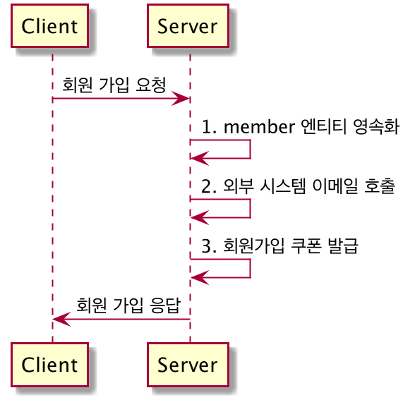
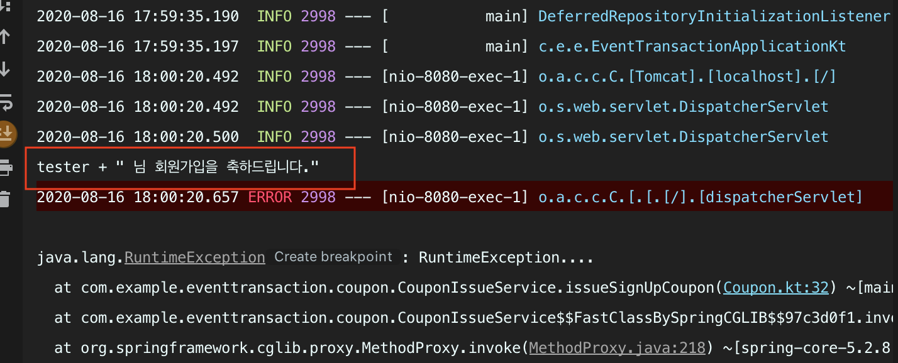
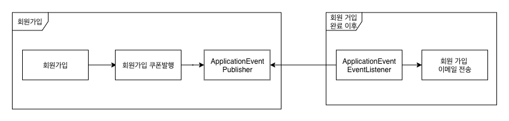
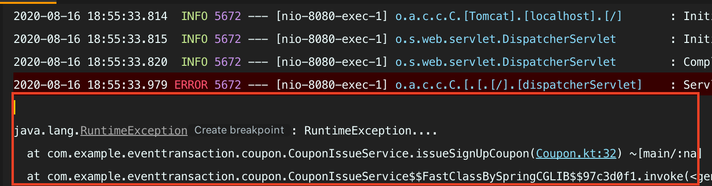
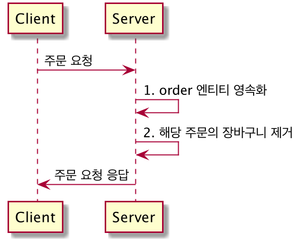
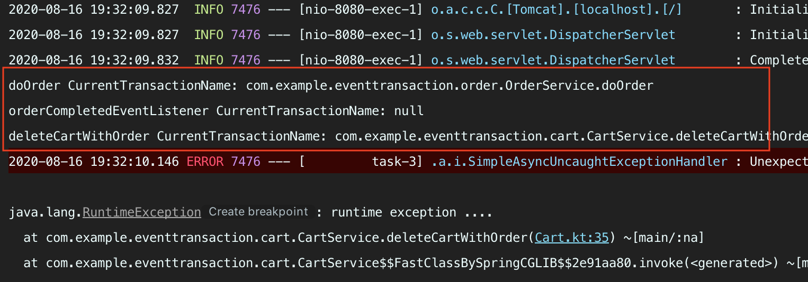
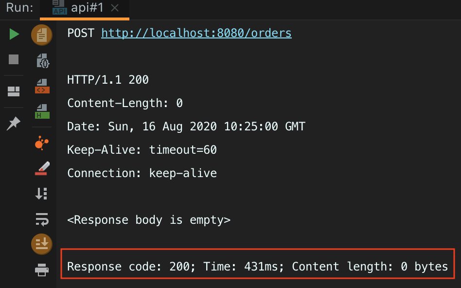

# Event 기반으로 강결합 및 트랜잭션 문제 해결

## 회원 가입 시나리오



회원 가입시 회원 가입 쿠폰발행, 회원 가입 이메일 발등을 해야 한다면 다음 코드 처럼 로직을 만들 수 있습니다. 이메일 전송 실패, 쿠폰 발급이 실패하는 경우 회원 가입을 다시 해야한다는 가정으로 설명드리겠습니다.(다소 과격한 시나리오지만 원자성에 대한 설명을 위해서 이런 시나리오를 정했습니다.)

## 문제점

### 시스템의 강결한 결합 문제

```kotlin
@Service
class MemberSignUpService(
    private val memberRepository: MemberRepository,
    private val couponIssueService: CouponIssueService,
    private val emailSenderService: EmailSenderService
) {
    @Transactional
    fun signUp(dto: MemberSignUpRequest) {
        val member = createMember(dto.toEntity()) // 1. member 엔티티 영속화
        emailSenderService.sendSignUpEmail(member) // 2. 외부 시스템 회원 가입 이메일 전송
        couponIssueService.issueSignUpCoupon(member.id!!) // 3. 회원가입 쿠폰 발급
    }
}
```
해당 흐름을 코드로 표현하면 위와 같습니다. 여기서 `signUp`메서드에 많은 책임들이 부여되는 것입니다. 회원 엔티티를 영속화 시키고, 회원 가입 이메일도 전송 요청하고, 회원 가입 쿠폰까지 발급 시키고있습니다. 그 결과 `MemberSignUpService`에 많은 의존성이 필요해지고 이런 의존성들 사이에서 강한 결합 관계가 발생하게 됩니다. 해당 코드 정도는 복잡도가 높진 않지만, 회원가입시 필요한 로직들이 추가될 때마다 `MemberSignUpService` 객체에는 더 많은 의존성 주입이 생기며, 더 많은 책임들을 부여받게 됩니다.

### 트랜잭션의 문제

```kotlin
@Service
class CouponIssueService(
    private val couponRepository: CouponRepository
) {

    @Transactional
    fun issueSignUpCoupon(memberId: Long) {
        couponRepository.save(Coupon(100.toBigDecimal(), memberId))
        throw RuntimeException("RuntimeException....")
    }
}
```
만약 `3. 회원가입 쿠폰 발급`에서 위 코드 처럼 예외를 발생시킨다면 회원가입, 회원가입 쿠폰발행은 트랜잭션이 묶여있기 때문에 Rollback이 진행됩니다. **하지만 2. 외부 시스템 회원 가입 이메일 전송의 경우는 외부 인프라스트럭처 이기 때문에 Rollback과는 무관하게 이메일을 전송하게 됩니다.** 회원가입이 실패했지만, 이메일을 전송하게 되는 문제가 발생하게 된것입니다.



`RuntimeException` 예외가 발생해서 Member, Coupon은 Rollback돼었지만 회원 가입 이메일은 전송하게 됩니다.(위 코드는 외부 시스템 연동이 아닌 print 메서드로 간단하게 호출 한 것입니다.)

## 해결



해당 문제는 스프링에서 지원하는 `ApplicationEventPublisher` 으로 해결 할 수 있습니다.

이벤트 헨들러는 이벤트 생성 주체가 발행한 이벤트에 반응하고, 이벤트 핸들러는 생성 주체가 발행한 이벤트를 전달받아 이벤트에 담긴 정보(데이터)를 기반으로 해당 기능을 수행하게 됩니다. 

`회원 가입` -> `회원 가입 쿠폰 발행` -> `회원 가입 완료 이벤트 발행 ` -> `회원 가입 이벤트 리스너 동작` -> `회원 가입 이메일 전송`  으로 동작하게 됩니다.


### 시스템의 강결한 결합 문제 해결

```kotlin
@Service
class MemberSignUpService(
    private val memberRepository: MemberRepository,
    private val couponIssueService: CouponIssueService,
    // private val emailSenderService: EmailSenderService, 의존성 주석
    private val eventPublisher: ApplicationEventPublisher // 의존성 추가
) {

    @Transactional
    fun signUp(dto: MemberSignUpRequest) {
        val member = createMember(dto.toEntity()) // 1. member 엔티티 영속화
//        emailSenderService.sendSignUpEmail(member) // 2. 외부 시스템 이메일 호출 -> 주석
        eventPublisher.publishEvent(MemberSignedUpEvent(member)) //2. 회원 가입 완료 이벤트 발행
        couponIssueService.issueSignUpCoupon(member.id!!) // 3. 회원가입 쿠폰 발급
    }
}

data class MemberSignedUpEvent(
    val member: Member
)

@Component
class MemberEventHandler(
    private val emailSenderService: EmailSenderService
) {
    
    // 회원가입 완료 이벤트 리스너 Bean 등록
    @TransactionalEventListener
    fun memberSignedUpEventListener(event: MemberSignedUpEvent) {
        emailSenderService.sendSignUpEmail(event.member)
    }
}
```

기존 회원가입 이메일 전송하는 로직과 회원가입 로직이 서로 섞여 있는 것을 위 코드처럼 방지할 수 있습니다. 회원가입이 완료 됐다고 생각하는 시점에 `회원 가입 완료` 이벤트를 발행하기면 하면 되기 때문에 더이상 `signUp` 메서드에서 이메일 전송 관련 의존성이 필요없어지게 됩니다.


### 트랜잭션의 문제 해결

`ApplicationEventPublisher`에서 발행한 이벤트를 리스닝하는 방식은 `@TransactionalEventListener`, `@EventListener` 2가지 방식이 있습니다. 각각의 차이점을 설명하고 트랜잭션의 문제 해결에 대해서 설명드리겠습니다.

#### @EventListener

```kotlin
@EventListener
fun memberSignedUpEventListener(event: MemberSignedUpEvent) {
    emailSenderService.sendSignUpEmail(event.member)
}
```

`@EventListener`으로 리스너를 등록하는 경우 이벤트를 퍼블리싱 한 이후 바로 리스너가 동작하게 됩니다. 만약 `memberSignedUpEventListener`를 `@EventListener`으로 등록한 경우에 동일하게 회원 가입 쿠폰 발급시 예외가 발생하게 되면 결과는 동일하게 이메일을 전송하게 됩니다.

```kotlin
@Transactional
fun issueSignUpCoupon(memberId: Long) {
    couponRepository.save(Coupon(100.toBigDecimal(), memberId))
    throw RuntimeException("RuntimeException....") // 동일하게 예외가 발생 시킨다.
}
```


`@EventListener`는 이벤트를 발행하는 시점에 바로 리스닝을 진행하기 때문에 `issueSignUpCoupon` 메서드 실행이전에 동작하게 된다. 그 결과 위 처럼 동일하게 이메일을 전송하게 된다.

#### @TransactionalEventListener

```kotlin
@TransactionalEventListener
fun memberSignedUpEventListener(event: MemberSignedUpEvent) {
    emailSenderService.sendSignUpEmail(event.member)
}
```

`@TransactionalEventListener`으로 리스너를 등록하는 경우 해당 트랜잭션이 Commit된 이후에 리스너가 동작하게 됩니다. 위 처럼 동일하게 회원 가입 쿠폰에서 예외가 발생하게 된다면 **트랜잭션 Commit이 진행되지 않기 때문에 해당 리스너가 동작하지 않게 되어 트랜잭션 문제를 해결할 수 있습니다.**



`@TransactionalEventListener`으로 빈등 등록을하게 되면 회원 가입 이메일 관련 메시지가 출력되지 않는 것을 확인할 수 있습니다.


## 주문 시나리오


회원 가입시 회원 가입 쿠폰발행, 회원 가입 이메일 발등을 해야 한다면 다음 코드 처럼 로직을 만들 수 있습니다. 이메일 전송 실패, 쿠폰 발급이 실패하는 경우 회원 가입을 다시 해야한다는 가정으로 설명드리겠습니다.(다소 과격한 시나리오지만 원자성에 대한 설명을 위해서 이런 시나리오를 정했습니다.)

상품을 주문시 장바구니에 있는 제품인 경우 해당 유저의 장바구니를 제거 합니다. 만약 장바구니를 제거하다 예외가 발생하더라도 주문은 완료되어야 한다는 것이 전제입니다.


## 문제점

### 장바구니 삭제시 트랜잭션 문제

```kotlin
@Service
class OrderService(
    private val orderRepository: OrderRepository,
    private val cartService: CartService,
    private val emailSenderService: EmailSenderService
) {

    @Transactional
    fun doOrder(dto: OrderRequest) {
        val order = orderRepository.save(dto.toEntity()) // 1. order 엔티티 영속화
        cartService.deleteCartWithOrder(order) // 2. 해당상품의 장바구니 제거
    }
}

@Service
class CartService(
    private val cartRepository: CartRepository
) {
    @Transactional
    fun deleteCartWithOrder(order: Order) {
        cartRepository.deleteByProductId(order.productId)
        throw RuntimeException("runtime exception ....") // 예외를 발생시키면 주문 트랜잭션까지 Rollback이 진행된다.
    }
}
```
해당 흐름을 코드로 표현하면 위와 같습니다. 만약 `2. 해당상품의 장바구니 제거` 도중 예외가 발생하면 한 트랜잭션으로 묶었기 때문에 주문까지 Rollback되게 됩니다. 이 문제를 해결하기 위해서는 트랜잭션을 분리 시켜야합니다.


### 성능 문제

```kotlin
cartService.deleteCartWithOrder(order) // 2. 해당상품의 장바구니 제거
```

해당 코드는 동기식으로 진행되기 때문에 `deleteCartWithOrder()` 메서드가 블록되는 만큼 주문 완료에 대한 응답이 늦어질 수 밖에 없습니다. 해당 문제를 해결하기 위해서는 비동기으로 동작하게 하여 해결이 가능합니다.


## 해결

해당 문제도 `ApplicationEventPublisher`, `@Async`으로 해결할 수 있습니다.

### 장바구니 삭제시 트랜잭션 문제, 성능 문제 해결

```kotlin
@Service
class OrderService(
    private val orderRepository: OrderRepository,
    private val eventPublisher: ApplicationEventPublisher
) {

    @Transactional
    fun doOrder(dto: OrderRequest) {
        val order = orderRepository.save(dto.toEntity()) // 1. order 엔티티 영속화
        eventPublisher.publishEvent(OrderCompletedEvent(order)) // 2. 주문 완료 이벤트 발행
    }
}

class OrderCompletedEvent(
    val order: Order
)

@Component
class OrderEventHandler(
    private val cartService: CartService,
) {

    @Async // 비동기 처리를 위해 추가
    @EventListener
    fun orderCompletedEventListener(event: OrderCompletedEvent) {
        cartService.deleteCartWithOrder(event.order)
    }
}

@Service
class CartService(
    private val cartRepository: CartRepository
) {
    @Transactional
    fun deleteCartWithOrder(order: Order) {
        println("deleteCartWithOrder CurrentTransactionName: ${TransactionSynchronizationManager.getCurrentTransactionName()}")
        cartRepository.deleteByProductId(order.productId)
        throw RuntimeException("runtime exception ....") // 예외 발생
    }
}
```


`@Async`을 추가하면 해당 메서드는 기존 스레드와 분리되게 됩니다. 그러기 때문에 비동기로 동작하기 때문에 `deleteCartWithOrder()` 메서드에서 블록되더라도 주문에 대한 응답대기는 사라지게 되며 스레드가 다르기 때문에 트랜잭션도 자연스럽게 분리가 됩니다.



`TransactionSynchronizationManager.getCurrentTransactionName()` 으로 현재 트랜잭션을 확인 해보면 두 트랜잭션은 다르다는 것을 확인 할 수 있습니다.




위 처럼 `deleteCartWithOrder()` 메서드에서 예외가 발행 하더라도 주문 요청 응답은 HTTP Status 200을 받게 되어 장바구니 제거를 실패했더라도 주문 요청은 정상적으로 완료할 수 있습니다. **하지만 문제는 있습니다. 주문은 완료했지만, 해당 상품의 장바구니가 제거되지 않은 상태입니다.** 이런 문제가 발생했을 경우 `ApplicationEventPublisher` 으로만 재처리를 진행하기는 매우 어렵습니다. 