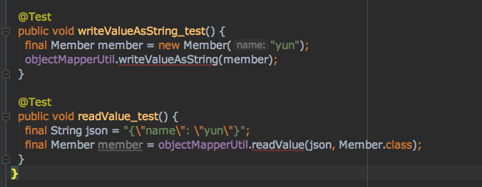
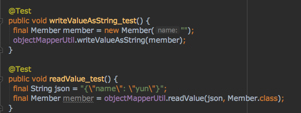

# Checked Exception을 대하는 자세

Checked Exception을 처리하는 전략과 그것에 유의해야 할 점들에 대해서 포스팅을 진행해보겠습니다. 자바에서는 대표적으로 Checked Exception 과 Unchecked Exception이 있습니다. 먼저 이 둘의 차이를 살펴보겠습니다. 


## Checked,Unchecked *Exception* 차이


Error는 시스템이 비정상적인 상황에서 발생하다. 이 수준의 Error는 시스템 레벨에서 발생하는 심각한 수준의 오류이기 때문에 개발자가 미리 예측할 수도 없고 처리할 수 있는 방법도 없다. 애플리케이션 반에서는 Error에 대한 처리를 신경 쓰지 않아도 된다. OutOfMemoryError이나 ThreadDeath 같은 에러는 try catch으로 잡아도 할 수 있는 것이 없기 때문이다.

그러기 때문에 어플리케이션단 에서는 Checked,Unchecked Exception에 대한 처리가 상대적으로 중요합니다.


.                    | Checked Exception         | Unchecked Exception
---------------------|---------------------------|-----------------------------------------------
**처리 여부**            | 반드시 예외 처리 해야함             | 예외 처리 하지 않아도됨
**트랜잭션 Rollback 여부** | Rollback 안됨               | Rollback 진행
**대표 Exception**     | IOException, SQLException | NullPointerException, IllegalArgumentException

Checked, Unchecked은 개발자들이 만든 애플리케이션 코드에서 예외가 발생했을 경우에 사용하게 됩니다.

위 상속 구조를 처럼 **Unchecked Exception는 RuntimeException을 상속하고 Checked Exception는 RuntimeException을 상속하지 않습니다.** 이것으로 두 **Exception을 구분할 구분하는 중요한 포인트입니다.**


### Unchecked Exception
명시적인 예외 처리를 강제하지 않는 특징이 있기 때문에 Unchecked Exception이라 하며, catch로 잡거나 throw로 호출한 메서드로 예외를 던지지 않아도 상관이 없습니다.


### Checked Exception
반드시 명시적으로 처리해야 하기 때문에 Checked Exception이라고 하며, try catch를 해서 에러를 잡든 throws를 통해서 호출한 메서드로 예외를 던져야 합니다.


### Code : 예외 처리 여부 

```java
  @Test
  public void throws_던지기() throws JsonProcessingException {
    final ObjectMapper objectMapper = new ObjectMapper();
    final Member member = new Member("yun");
    final String valueAsString = objectMapper.writeValueAsString(member);

  }

  @Test
  public void try_catch_감싸기() {
    final ObjectMapper objectMapper = new ObjectMapper();
    final Member member = new Member("yun");
    final String valueAsString;
    try {
      valueAsString = objectMapper.writeValueAsString(member);
    } catch (JsonProcessingException e) {
      e.printStackTrace();
      throw new RuntimeException();
    }
  }
```
위 JsonProcessingException는 IOException Exception을 상속하는 Checked Exception이다. **그러기 때문에 throws로 상위 메서드로 넘기든 자신이 try catch 해서 throw를 던지든 해야 한다.** 이것은 문법적인 강제 선택이다. 그에 반해 **Unchecked Exception은 명시적인 예외 처리를 하지 않아도 된다.**


### Code : Rollback 여부

```java
@Service
@RequiredArgsConstructor
@Transactional
public class MemberService {

  private final MemberRepository memberRepository;

  // (1) RuntimeException 예외 발생
  public Member createUncheckedException() {
    final Member member = memberRepository.save(new Member("yun"));
    if (true) {
      throw new RuntimeException();
    }
    return member;
  }

  // (2) IOException 예외 발생
  public Member createCheckedException() throws IOException {
    final Member member = memberRepository.save(new Member("wan"));
    if (true) {
      throw new IOException();
    }
    return member;
  }
}
```

(1) RuntimeException 예외 발생 발생시키면 yun이라는 member는 rollback이 진행됩니다. 하지만 (2) IOException 예외 발생이 되더라도 wan은 **rollback이 되지 않고 트랜잭션이 commit까지 완료됩니다.**

```
--- Ynu Log
Hibernate: 
    /* insert yun.blog.exception.member.Member
        */ insert 
        into
            member
            (id, name) 
        values
            (null, ?)
2019-05-16 00:55:16.117 TRACE 49422 --- [nio-8080-exec-2] o.h.type.descriptor.sql.BasicBinder      : binding parameter [1] as [VARCHAR] - [yun]
2019-05-16 00:55:16.120 ERROR 49422 --- [nio-8080-exec-2] o.a.c.c.C.[.[.[/].[dispatcherServlet]    : Servlet.service() for servlet [dispatcherServlet] in context with path [] threw exception [Request processing failed; nested exception is java.lang.RuntimeException] with root cause

java.lang.RuntimeException: null

--- Wan Log
Hibernate: 
    /* insert yun.blog.exception.member.Member
        */ insert 
        into
            member
            (id, name) 
        values
            (null, ?)
2019-05-16 00:55:43.931 TRACE 49422 --- [nio-8080-exec-4] o.h.type.descriptor.sql.BasicBinder      : binding parameter [1] as [VARCHAR] - [wan]
2019-05-16 00:55:43.935 ERROR 49422 --- [nio-8080-exec-4] o.a.c.c.C.[.[.[/].[dispatcherServlet]    : Servlet.service() for servlet [dispatcherServlet] in context with path [] threw exception

java.io.IOException: null
	at yun.blog.exception.member.MemberService.createCheckedException(MemberService.java:27) ~[classes/:na]
```
로그 메시지를 보면 member yun, wan 모두 insert 쿼리는 보이지만 **yun rollback이 진행되고 wan은 rollback이 되지 않고 commit까지 됩니다.**


### 왜 Checked Exception은 Rollback되지 않는 것일까?
기본적으로 Checked Exception는 복구가 가능하다는 메커니즘을 가지고 있다. 예를 들어서 특정 이미지 파일을 찾아서 전송해주는 함수에서 이미지를 찾지 못했을 경우 기본 이미지를 전송한다. 복구 전략을 가질 수 있게 된다.

```java
public void sendFile(String fileName){

    File file;
    try {
        file = FileFindService.find(fileName);
    } catch (FileNotFoundException e){ // FileNotFoundException은 IOException으로 checked exception이다.
        // 파일을 못찾았으니 기본 파일을 찾아서 전송 한다
        file = FileFindService.find("default.png");
    }

    send(file);
}
```
기본적으로 복구가 가능하니 네가 복구를 작업을 진행했을 수 있으니까 Rollback은 진행하지 않을게라는 의미가 있다고 생각합니다. (주관적인 생각입니다.)

하지만 이런 식의 예외는 복구하는 것이 아니라 일반적인 코드의 흐름으로 제어해야 합니다.
```java
public void sendFile(String fileName){
    if(FileFindService.existed(filename)){
        // 파일이 있는 경우 해당 파일을 찾아서 전송
        send(FileFindService.find(fileName));    
    }else{
        // 파일이 있는 없는 경우 기본 이미지 전송
        send(FileFindService.find("default.png"));    
    }
}
```

### 하지만 현실은...
하지만 우리가 일반적으로 Checked Exception 예외가 발생했을 경우 복구 전략을 갖고 그것을 복구할 수 있는 경우는 그렇게 많지 않습니다.

유니크해야 하는 이메일 값이 중복돼서 SQLException이 발생하는 경우 어떻게 복구 전략을 가질 수 있을까요? 유저가 입력했던 이메일 + 난수를 입력해서 insert 시키면 가능은 하겠지만 현실에서는 그냥 RuntimeException을 발생시키고 입력을 다시 유도하는 것이 현실적입니다.

**여기서 중요한 것은 해당 Exception을 발생시킬 때 명확하게 어떤 예외가 발생해서 Exception이 발생했는지 정보를 전달해주는 것입니다. 위 같은 경우에는 DuplicateEmailException (Unchecked Exception)을 발생 시는 것이 바람직합니다.**

Checked Exception을 만나면 더 구체적인 Unchecked Exception을 발생시켜 정확한 정보를 전달하고 로직의 흐름을 끊어야 합니다. 우리는 JPA에 구현체를 가져다 사용하더라도 Checked Exception을 직접 처리하지 않고 있는 이유도 다 적절한 RuntimeException으로 예외를 던져주고 있기 때문입니다.

## Checked Exception 처리 전략

### Code
```java
public class ObjectMapperUtil {

  private final ObjectMapper objectMapper = new ObjectMapper();

  // 예외처리를 throws를 통해서 위임하고 있습니다.
  public String writeValueAsString(Object object) throws JsonProcessingException {
    return objectMapper.writeValueAsString(object);
  }

  // 예외처리를 throws를 통해서 위임하고 있습니다.
  public <T> T readValue(String json, Class<T> clazz) throws IOException {
    return objectMapper.readValue(json, clazz);
  }
}
```

writeValueAsString, readValue 메서드는 Checked Exception을 발생시키는 메서드입니다. 반드시 예외를 처리를 진행해야 합니다.



해당 메서드의 테스트 코드입니다. 예외 처리를 상위로 던져버리기 때문에 메서드를 상용하는 곳에서 다시 throw를 하던지 예외를 try catch 하든지 해야 합니다. 이렇게 **무의하고 반복적인 예외를 던지는 것은 좋지 않습니다.**

### 더 구체적인 Unckecked Exception 발생 시켜라
```java
public String writeValueAsString(Object object) {
    try {
      return objectMapper.writeValueAsString(object);
    } catch (JsonProcessingException e) {
      throw new JsonSerializeFailed(e.getMessage());
    }
  }

  public <T> T readValue(String json, Class<T> clazz) {
    try {
      return objectMapper.readValue(json, clazz);
    } catch (IOException e) {
      throw new JsonDeserializeFailed(e.getMessage());
    }
  }
```


[Spring Exception Guide](https://github.com/cheese10yun/spring-guide/blob/master/docs/exception-guide.md)에서 정리한 Try Catch 전략과 비슷합니다.




**Checked Exception을 Unckecekd Exception으로 던지고 있기 때문에 메서드를 사용하는 곳에서는 아무런 예외처리를 진행하지 않아도 됩니다.** 

물론 해당 예러가 왜 발생했는지에 대해서 에러 메시지 뿐만이 아니라 더욱 구체적인 정보를 전달해주는것이 더 좋습니다.

## 결론
예외 복구 전략이 명확하고 그것이 가능하다면 Checked Exceptio을 try catch로 잡고 해당 복구를 하는 것이 좋습니다. 

**하지만 그러한 경우는 흔하지 않으며 Checked Exception이 발생하면 더 구체적인 Unchecked Exception을 발생시키고 예외에 대한 메시지를 명확하게 전달하는 것이 효과적입니다.**

무책임하게 상위 메서드로 throw를 던지는 행위는 하지 않는 것이 좋습니다. 상위 메서드들의 책임이 그만큼 증가하기 때문입니다.

또 Checked Exception은 기본 트랜잭션에 속성에서는 rollback을 진행하지 않는 점도 알고 있어야 실수를 방지할 수 있습니다.


## 참고
* [Java 예외(*Exception*) 처리에 대한 작은 생각](http://www.nextree.co.kr/p3239/)
* [토비의 스프링](http://www.yes24.com/Product/goods/7516721)


