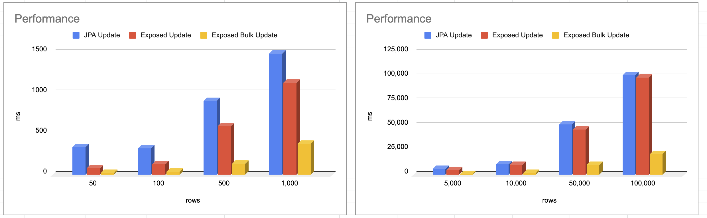

# Mysql Batch Update With Exposed 성능 측정

```kotlin

```

## Performance




| rows    | JPA Update | Exposed Update | Exposed Bulk Update |
|---------|:-----------|----------------|---------------------|
| 50      | 337ms      | 80ms           | 23ms                |
| 100     | 327ms      | 130ms          | 40ms                |
| 500     | 908ms      | 596ms          | 135ms               |
| 1,000   | 1,491ms    | 1,130ms        | 381ms               |
| 5,000   | 5,848ms    | 5,121ms        | 1,127ms             |
| 10,000  | 10,927ms   | 10,094ms       | 2,227ms             |
| 50,000  | 51,429ms   | 46,506ms       | 10,355ms            |
| 100,000 | 101,595ms  | 99,349ms       | 21,370ms            |