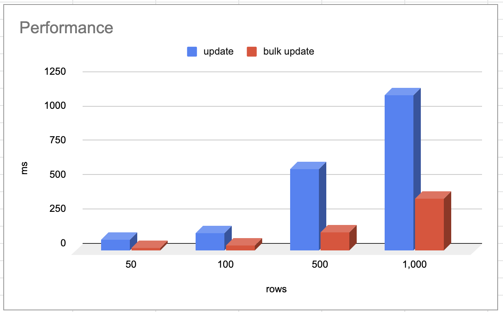
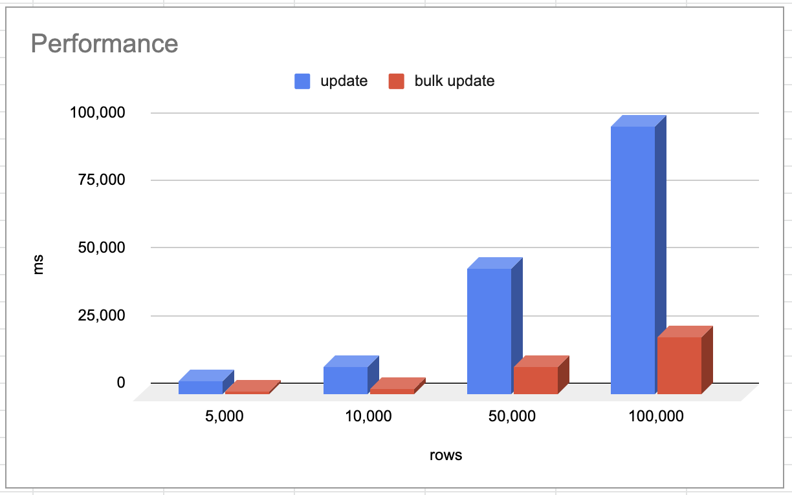

# Mysql Batch Update 성능


```kotlin

```

## Performance




| rows    | update   | bulk update | 차이   |
| ------- | -------- | ----------- | ------ |
| 50      | 80ms     | 23ms        | 28.75% |
| 100     | 130ms    | 40ms        | 30.76% |
| 500     | 596ms    | 135ms       | 22.65% |
| 1,000   | 1,130ms  | 381ms       | 33.71% |
| 5,000   | 5,121ms  | 1,127ms     | 22.00% |
| 10,000  | 10,094ms | 2,227ms     | 22.06% |
| 50,000  | 46,506ms | 10,355ms    | 22.26% |
| 100,000 | 99,349ms | 21,370ms    | 21.51% |
