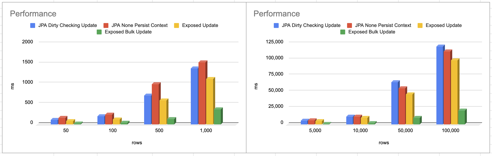

# Mysql Batch Update With Exposed 성능 측정

## Update With JPA

```kotlin
// JPA Object
@Entity
@Table(name = "writer")
class Writer(
    @Column(name = "name", nullable = false)
    var name: String,
    @Column(name = "email", nullable = false)
    var email: String,
) {

    @Id
    @GeneratedValue(strategy = GenerationType.IDENTITY)
    var id: Long? = null
        internal set

    @CreationTimestamp
    @Column(name = "created_at", nullable = false, updatable = false)
    lateinit var createdAt: LocalDateTime
        internal set

    @UpdateTimestamp
    @Column(name = "updated_at", nullable = false)
    lateinit var updatedAt: LocalDateTime
        internal set
}

internal class WriterTest(
    private val writerService: WriterService
) : SpringBootTestSupport() {

    @Test
    internal fun `update test`() {
        // 업데이트 대상 rows, 50, 100, 500, 1,000, 5,000, 10,000, 50,000, 100,000
        val total = 500
        val map = (1..total).map {
            Writer(
                name = "old",
                email = "old"
            )
        }
        // 데이터 셋업, 속도 측정 포함 X
        setup(map)
        // 데이터 조회, 속도 특정 X
        val writers = writerService.findAll()

        val stopWatch = StopWatch()
        // 업데이트 속도 측정
        stopWatch.start()
        writerService.update(writers)
        stopWatch.stop()

        println("${map.size}, ${stopWatch.lastTaskTimeMillis}")
    }

    @Test
    internal fun `none persist context update test`() {
        // 업데이트 대상 rows, 50, 100, 500, 1,000, 5,000, 10,000, 50,000, 100,000
        val total = 500
        val map = (1..total).map {
            Writer(
                name = "old",
                email = "old"
            )
        }
        // 데이터 셋업, 속도 측정 포함 X
        setup(map)
        val findAll = writerService.findAll()

        // 업데이트 속도 측정
        val stopWatch = StopWatch()
        stopWatch.start()
        writerService.nonPersistContestUpdate(findAll.map { it.id!! })
        stopWatch.stop()

        println("${map.size}, ${stopWatch.lastTaskTimeMillis}")

    }
}

class WriterCustomRepositoryImpl : QuerydslCustomRepositorySupport(Writer::class.java), WriterCustomRepository {

    // 영속성 컨텍스트 없는 업데이트
    @Transactional
    override fun update(ids: List<Long>) {
        for (id in ids) {
            update(qWriter)
                .set(qWriter.name, "update")
                .where(qWriter.id.eq(id))
                .execute()
        }
    }
}
```

JPA에서는

## Performance



| rows    | JPA Dirty Checking Update | JPA None Persist Context | Exposed Update | Exposed Bulk Update |
|---------|:--------------------------|:-------------------------|----------------|---------------------|
| 50      | 115ms                     | 167ms                    | 80ms           | 23ms                |
| 100     | 206ms                     | 242ms                    | 130ms          | 40ms                |
| 500     | 718ms                     | 994ms                    | 596ms          | 135ms               |
| 1,000   | 1,388ms                   | 1,540ms                  | 1,130ms        | 381ms               |
| 5,000   | 6,204ms                   | 6,441ms                  | 5,121ms        | 1,127ms             |
| 10,000  | 12,151ms                  | 12,209                   | 10,094ms       | 2,227ms             |
| 50,000  | 65,309ms                  | 56,295                   | 46,506ms       | 10,355ms            |
| 100,000 | 120,906ms                 | 11,3194ms                | 99,349ms       | 21,370ms            |