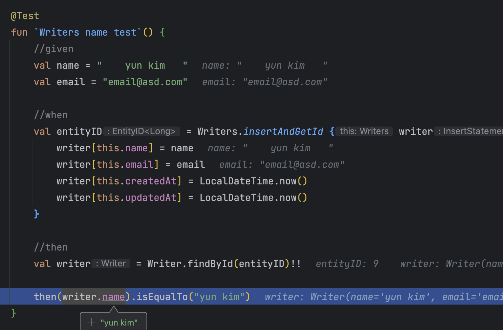

# Kotlin 기반 경량 ORM Exposed 추가 정리 part 2


## VarCharColumnType 기반 Converter

데이터 저장소에 값을 저장하는 경우, 저장된 데이터를 가져오는 경우 적절하게 컨버팅이 필요한 경우 JPA에서는 `@Converter`를 사용하면 손쉽게 제어할 수 있습니다. Exposed에서는 `VarCharColumnType`를 확장하는 방식으로 해당 기능을 사용할 수 있습니다.

```kotlin
object Writers : LongIdTable("writer") {
    val name = varchar("name", 150).nullable()
    val email = varchar("email", 150)
    val createdAt = datetime("created_at").clientDefault { LocalDateTime.now() }
    val updatedAt = datetime("updated_at").clientDefault { LocalDateTime.now() }
}
```

`title` 필드에 불필요한 공백을 제거하고 싶은 Converter를 사용하고 싶은 경우에는 `VarCharColumnType`를 확장하여 구현이 가능합니다.

```kotlin
class TrimmingWhitespaceConverterColumnType(length: Int) : VarCharColumnType(colLength = length) {
    override fun valueToDB(value: Any?): String? {
        return when (value) {
            is String -> value.trim()
            null -> null
            else -> throw IllegalArgumentException("${value::class.java.typeName} 타입은 Exposed 기반 컨버터에서 지원하지 않습니다.")
        }
    }

    override fun valueFromDB(value: Any): String {
        return when (value) {
            is String -> value.trim()
            else -> throw IllegalArgumentException("${value::class.java.typeName} 타입은 Exposed 기반 컨버터에서 지원하지 않습니다.")
        }
    }
}
```

`title` 칼럼은 `varchar` 타입임으로  `VarCharColumnType`을 통해서 구현합니다. `valueToDB`에는 데이터 저장소에 들어가는 컨버팅 로직을, `valueFromDB`에는 반대로 데이터베이스에서 가져온 데이터에 대한 컨버팅 로직을 작성합니다. 해당 로직은 공백을 제거하는 로직 임으로 `trim()`을 사용해서 동일하게 구현 합니다. 해당 코드는 String 자료형에만 동작 하게 구성했으며 필요에 따라 추가적인 자료형을 추가하면 됩니다.

```kotlin
object Writers : LongIdTable("writer") {
    val name = registerColumn<String>(
        name = "name",
        type = TrimmingWhitespaceConverterColumnType(length = 150)
    ).nullable()
    val email = varchar("email", 150)
    val createdAt = datetime("created_at").clientDefault { LocalDateTime.now() }
    val updatedAt = datetime("updated_at").clientDefault { LocalDateTime.now() }
}
```

registerColumn을 활용해서 Converter 코드 TrimmingWhitespaceConverterColumnType을 적용 시킵니다.

```kotlin
@Test
fun `Writers name test`() {
    //given
    val name = "    yun kim   "
    val email = "email@asd.com"

    //when
    val entityID = Writers.insertAndGetId { writer ->
        writer[this.name] = name
        writer[this.email] = email
        writer[this.createdAt] = LocalDateTime.now()
        writer[this.updatedAt] = LocalDateTime.now()
    }
    
    //then
    val writer = Writer.findById(entityID)!!

    then(writer.name).isEqualTo("yun kim")
}
```
앞뒤 공백이 있는 문자열에 대해서 실제 데이터베이스에 정상적으로 Converter 로직이 동작하는지 테스트를 진행해 보겠습니다. 실제 디버깅으로 확인 해보겠습니다.



앞뒤 공백이 제거된 `yun kim`으로 출력되는 것을 확인할 수 있습니다.

## 
