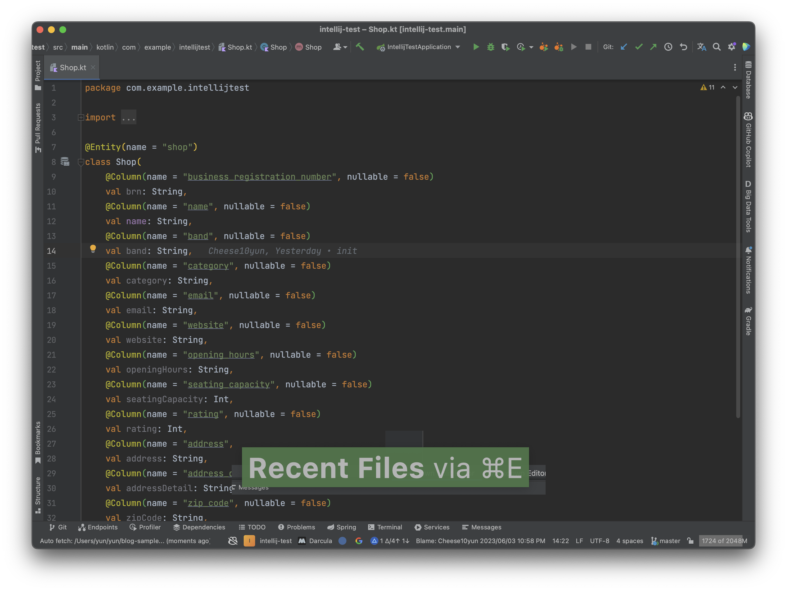
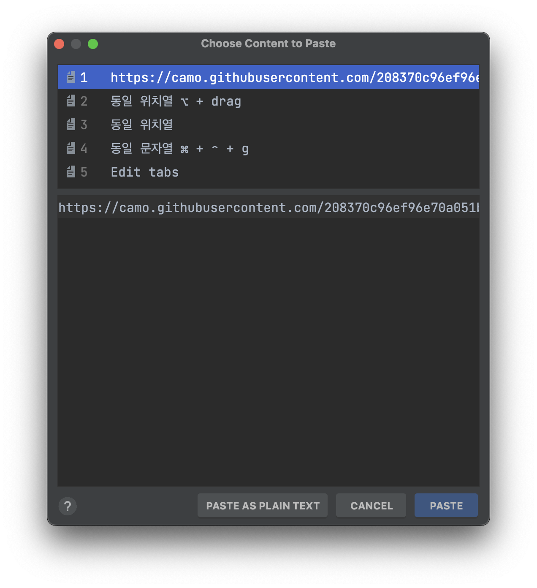

# Intelli J

## Presentation

<p align="center">

</p>


[Presentation Assistant](https://plugins.jetbrains.com/plugin/7345-presentation-assistant) 플러그인을 통해서 단축키 정보는 하단에 출력 됩니다.


## Tab

### Tab Limit

<p align="center">

</p>


* settings -> Edit tabs -> Tab Limit 으로 Tab limit 설정 가능
* 여러 Tab을 켜도 Limit한 설정 값으로 유지, Limit 1을 추천

### Tab 이동


<p align="center">

</p>

| Name                     | Hot Key         | Desc                                         |
|--------------------------|-----------------| -------------------------------------------- |
| `Split Right`            | fn + ctr +  ➡️  | 현재 화면 오른 쪽으로 분활                   |
| `Split Down`             | fn + ctr +  ⬇️  | 현재 화면 아래 쪽으로 분할                   |
| `Goto Next Splitter`     | shfit + cmd  ➡️ | 현재 포커싱 화면애서 다음 Tab으로 이동       |
| `Goto Previous Splitter` | shfit + cmd  ⬅️ | 현재 포커싱 화면애서 이전 다음 Tab으로 이동  |
| `<- Back`                | cmd + [         | 현재 Tab의 이전 Tab, tab limit 1 지정시 유용 |
| `-> Forword`             | cmd + ]         | 현재 Tab의 다음 Tab, tab limit 1 지정시 유용 |
| `Recent Files`           | cmd + e         | 최근 Open 파일 리스트                        |
| `Recent Locations`       | shfit + cmd + e | 최근 Open 파일 커서 위치                     |
| `Bookmarks 지정`           | cmd + F3        | 북마크 지정                                  |
| `Bookmarks`              | F3              | 지정한 북마크 리스트                         |
| `Go to file`             | shfit + cmd + o | 파일 열기                                    |


## 간단 팁

### Find Action


* 특정한 기능을 찾고 싶은 경우 단축키 `shfit + cmd + a`  Find Action 으로 해당 기능을 찾을 수 있음
* 대충 이런 기능이 있지 않을까 하는 기능을 검색을 통해서 해당 기능의 유무를 빠르게 파악 가능 ex) git stash


### Key map


* Key map 통해서 Hot Key 조회 및 등록 가능
* 키워드를 통해 검색 or 단축 키를 통한 검색도 지원


### Live Template


* 코드 템플릿을 미리 지정해서 편하게 코드를 작성할 수 있는 기능입니다.
* `sout`, `psvm` 등이 여기에 해당 합니다.
* `ss`, `tdd`, `comment-formatter` `sf` 등등을 커스텀해서 사용 


### Gradle Task


* Gradle Task 자동 완성 기능을 통해서 보다 쉽게 Gradle 명령어를 사용할 수 있습니다.
* `build.gradle.kts`에 직접 작성한 TASK도 동작 가능


## 문자열

### 동일 문자열 ⌘ + ⌃ + g


### 동일 위치열 ⌥ + drag or ⌥⌥  


### 복사 히스토리 command + shift + v





## Plugins
* [ ] grep
* [ ] git tool box
* [ ] string manipulation
* [ ] Rainbow
* [ ] Key Promoter X
* [ ] GitToolbox


### String Manipulation Plugin

[](https://plugins.jetbrains.com/plugin/2162-string-manipulation/)


* 특정 값에 대해서 자동으로 증가시켜 중복되지 않는 값으로 설정할 수 있습니다.


* Switch는 다양한 문자열 포맷으로 쉽게 변경이 가능합니다.

## HTTP Client
* [ ] env post
* [ ] query parameter
* [ ] curl copy & paste

```
curl -X GET --location "http://localhost:8080/actuator/health" \
-H "Accept: application/json"
```


## Spring

### Debug

* [ ] Beans
* [ ] Health
* [ ] Mappings

### Spring
* [ ] Beans
* [ ] MVC
* [ ] Data

### Endpoints
* [ ] Bean
* [ ] MVC


### Dependencies
* [ ] Version

## Github Code Review

* [ ] CMD + 3
* [ ] comment
* [ ] Approve

## Git
* [ ] Commit, Push, Pull
* [ ] Stash, UnStash
* [ ] Branch, Branch Diff, Merge, Checkout

## Refactoring

* [ ] move
* [ ] copy
* [ ] introduce variable
* [ ] Property
* [ ] introduce Parameter
* [ ] Pull Members Up
