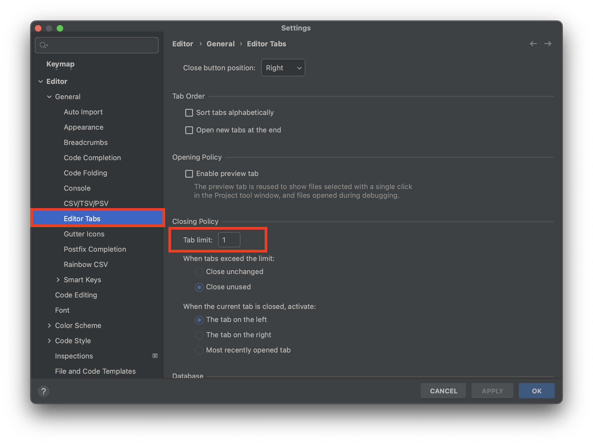
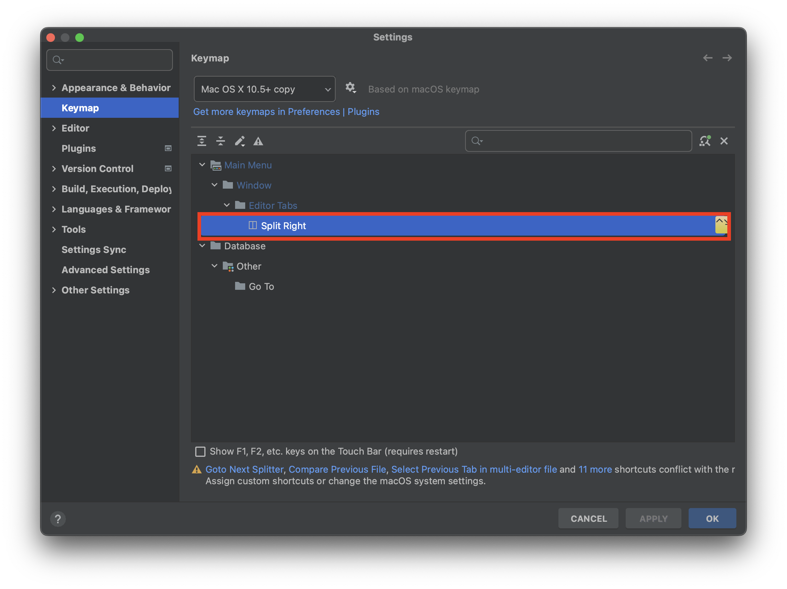

# Intelli J

## Tab

### Tab Limit

* settings -> Edit tabs -> Tab Limit 으로 Tab limit 설정 가능
* 여러 Tab을 켜도 Limit한 설정 값으로 유지, Limit 1을 추천

### Tab 이동

| name                     | hot key         | Desc                                         |
| ------------------------ | --------------- | -------------------------------------------- |
| `Split Right`            | fn + cmd +  ➡️   | 현재 화면 오른 쪽으로 분활                   |
| `Split Down`             | fn + cmd +  ⬇️   | 현재 화면 아래 쪽으로 분할                   |
| `Goto Next Splitter`     | shfit + cmd  ➡️  | 현재 포커싱 화면애서 다음 Tab으로 이동       |
| `Goto Previous Splitter` | shfit + cmd  ⬅️  | 현재 포커싱 화면애서 이전 다음 Tab으로 이동  |
| `<- Back`                | cmd + [         | 현재 Tab의 이전 Tab, tab limit 1 지정시 유용 |
| `-> Forword`             | cmd + ]         | 현재 Tab의 다음 Tab, tab limit 1 지정시 유용 |
| `Recent Files`           | cmd + e         | 최근 Open 파일 리스트                        |
| `Recent Locations`       | shfit + cmd + e | 최근 Open 파일 커서 위치                     |
| `Bookmarks 지정`         | cmd + F3        | 북마크 지정                                  |
| `Bookmarks`              | F3              | 지정한 북마크 리스트                         |
| `Go to file`             | shfit + cmd + o | 파일 열기                                    |

## 문자열

## Plugins
* [ ] grep
* [ ] git tool box
* [ ] string manipulation
* [ ] Rainbow
* [ ] Key Promoter X
* [ ] GitToolbox

## Refactoring

## find action

## Github

## Git
* [ ] Commit, Push, Pull
* [ ] Stash, UnStash
* [ ] Branch, Branch Diff, Merge, Checkout

## Live Template

## HTTP Client

## Gradle Task

## Spring 
* bean
* mvc

## 