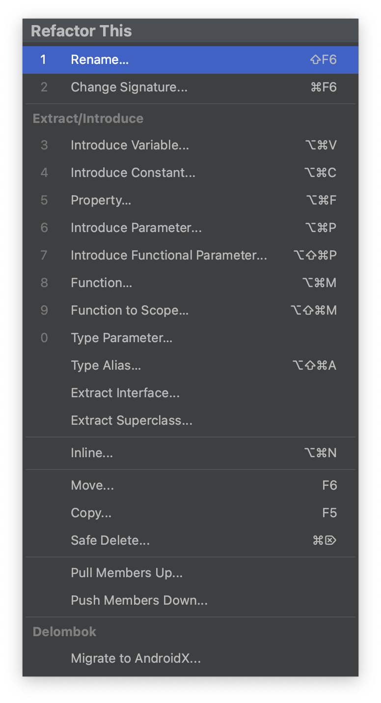

# Intelli J

## Presentation


[Presentation Assistant](https://plugins.jetbrains.com/plugin/7345-presentation-assistant) 플러그인을 통해서 단축키 정보는 하단에 출력 됩니다.

## Tab

### Tab Limit


* settings -> editor tabs -> Tab Limit으로 Tab limit 설정 가능
* 여러 Tab을 켜도 Limit 한 설정값으로 유지, Limit 1을 추천

### 자주 사용하는 Tab 이동


| Name                     | Hot Key         | Desc                               |
|--------------------------|-----------------|------------------------------------|
| `Split Right`            | fn + ctr +  ➡️  | 현재 화면 오른 쪽으로 분활                    |
| `Split Down`             | fn + ctr +  ⬇️  | 현재 화면 아래 쪽으로 분할                    |
| `Goto Next Splitter`     | shfit + cmd  ➡️ | 현재 포커싱 화면애서 다음 Tab으로 이동            |
| `Goto Previous Splitter` | shfit + cmd  ⬅️ | 현재 포커싱 화면애서 이전 다음 Tab으로 이동         |
| `<- Back`                | cmd + [         | 현재 Tab의 이전 Tab, tab limit 1 지정시 유용 |
| `-> Forword`             | cmd + ]         | 현재 Tab의 다음 Tab, tab limit 1 지정시 유용 |
| `Recent Files`           | cmd + e         | 최근 Open 파일 리스트                     |
| `Recent Locations`       | shfit + cmd + e | 최근 Open 파일 커서 위치                   |
| `Bookmarks 지정`           | cmd + F3        | 북마크 지정                             |
| `Bookmarks`              | F3              | 지정한 북마크 리스트                        |
| `Go to file`             | shfit + cmd + o | 파일 열기                              |

## 간단 팁

### Find Action


* 특정한 기능을 찾고 싶은 경우 단축키 `shfit + cmd + a` Find Action으로 해당 기능을 찾을 수 있음
* 대충 이런 기능이 있지 않을까 하는 기능을 검색을 통해서 해당 기능의 유무를 빠르게 파악 가능 ex) git stash

### Key map


* Key map 통해서 Hot Key 조회 및 등록 가능
* 키워드를 통해 검색 or 단축키를 통한 검색도 지원

### Live Template


* 코드 템플릿을 미리 지정해서 편하게 코드를 작성할 수 있는 기능입니다.
* `sout`, `psvm` 등이 여기에 해당합니다.
* `ss`, `tdd`, `jobc`, `jobcode`, `comment-formatter` `sf` 등등을 커스텀 해서 사용

#### 등록 방법


* Settings -> Live Templates

### formatter 코드 정렬 제외


```kotlin
fun asd(): Unit {
    //@formatter:off
    val a = 10
        val b = 10
        val c = 10
        val d = 10
    val e = 10
    val f = 10
    //@formatter:on
}
``` 

* 특정한 이유로 코드 정렬을 제외하고 싶을 때 `@formatter:off ~ @formatter:on`을 활용하여 제외할 수 있다.

### Gradle Task


* Gradle Task 자동 완성 기능을 통해서 보다 쉽게 Gradle 명령어를 사용할 수 있습니다.
* `build.gradle.kts`에 직접 작성한 TASK도 동작 가능


## 문자열

### 동일 문자열 ⌘ + ⌃ + g


### 동일 위치열 ⌥ + drag or ⌥⌥  


### 복사 히스토리 command + shift + v


### 활용 방법


특정 Entity를 응답 객체로 만들어야 하는 경우 동일 문자열을 복사해서 보다 쉽게 Response 객체를 만들 수 있습니다.


* [ ] Entity -> Response, ShopResponse
* [ ] Column, Order
* [ ] SQL -> increment, test
* [ ] Json -> Object, JsonToObject


## Plugins

### [String Manipulation Plugin](https://plugins.jetbrains.com/plugin/2162-string-manipulation/)


* 특정 값에 대해서 자동으로 증가시켜 중복되지 않는 값으로 설정할 수 있습니다.


* Switch는 다양한 문자열 포맷으로 쉽게 변경이 가능합니다.

### [Grep Console](https://plugins.jetbrains.com/plugin/7125-grep-console)

> 
> 
> 출처 [Grep Console](https://plugins.jetbrains.com/plugin/7125-grep-console)

Console Log를 Grep 해서 보다 쉽게 로그 확인을 도와주는 플러그인


### [Key Promoter X](https://plugins.jetbrains.com/plugin/9792-key-promoter-x)

> 
> 출처 [Key Promoter X](https://plugins.jetbrains.com/plugin/9792-key-promoter-x)

IDE에서 마우스를 사용하면 대체 가능한 단축키를 알려주는 플러그인


### [Presentation Assistant](https://plugins.jetbrains.com/plugin/7345-presentation-assistant)


사용하는 단축키와 기능 명을 디스플레이 해주는 플러그인


### 플러그인 찾는 방법


플러그인 검색을 `/sortBy:downloads`으로 다운로드가 높은 순으로 정렬하고 필요한 플러그인을 선택

## HTTP Client


HTTP Client는 Postman처럼 HTTP 호출을 도와주는 도구로 IntelliJ에서 사용 가능

### HTTP Env


```json
{
  "local": {
    "shop-service": "http://localhost:8080"
  },
  "sandbox": {
    "shop-service": "http://snadbox-xxxx"
  },
  "beta": {
    "shop-service": "http://beta-xxxx"
  }
}
```

HTTP 호출 환경을 JSON으로 관리할 수 있습니다. HTTP 호출에 대한 환경을 지정하여 호출 가능합니다.

### HTTP Curl Copy & Paste


Curl을 붙여넣기를 하면 HTTP Client에 맞는 형식으로 자동으로 변환 됩니다.


반대로 HTTP Client를 Curl 형식으로 변환하여 복사할 수 있습니다.

### Query parameter 정리


Query parameter를 쉽게 정리할 수 있습니다.

## GitHub Code Review

GitHub 기반으로 코드 리뷰를 진행하면 단순 Diff만 보이기 때문에 디테일한 부분까지 확인하고 싶은 경우는 pull을 받아 진행하곤 합니다. IntelliJ에서는 GitHub 기반 코드 리뷰를 IDEA에서 진행할 있습니다.


PullRequest를 확인합니다. `Find Action` 기능을 통해서 찾을 수 있고 `CMD + 3` 단축키로도 찾을 수 있습니다.


PullRequest를 내용을 확인할 수 있습니다.


Diff가 있는 파일을 선택하여 확인이 가능하며 필요한 부분에 코멘트를 작성할 수 있습니다.


작성된 코멘트는 실제 Github에도 작성됩니다.


IDEA에서 해당 PR을 Meger 할 수 있습니다.


Pull Request 항목들을 필터를 통해서 검색도 가능합니다.

## Refactoring



Refactoring 기능을 막강하게 지원 해주고 있습니다.
⇧  ⌥  ⌘

| Name                | Hot Key   | Desc           |
|---------------------|-----------|----------------|
| Move                | F6        | 파일 이동          |
| Rename              | ⇧ + F6    | 이름 변경          |
| Property Extract    | ⌥ + ⌘ + F | Property 으로 분리 |
| Introduce Variable  | ⌥ + ⌘ + V | 변수로 분리         |
| Introduce Parameter | ⌥ + ⌘ + P | Parameter 분리   |
| Inline              | ⌥ + ⌘ + N | 변수 머지          |

## Spring

### Spring
* [ ] Beans
* [ ] MVC
* [ ] Data

### Endpoints


Endpoints을 통해 api 전체를 볼 수 있으며, HTTP Client, OpenAPI를 쉽게 구성할 수 있습니다.


### Dependencies


Dependencies통해서 특정 의존성에 대한 버전을 보다 쉽게 변경 가능