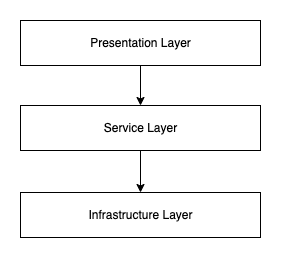
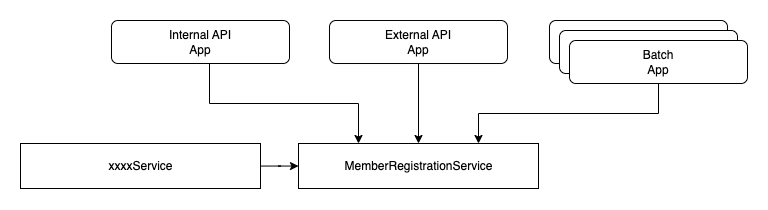
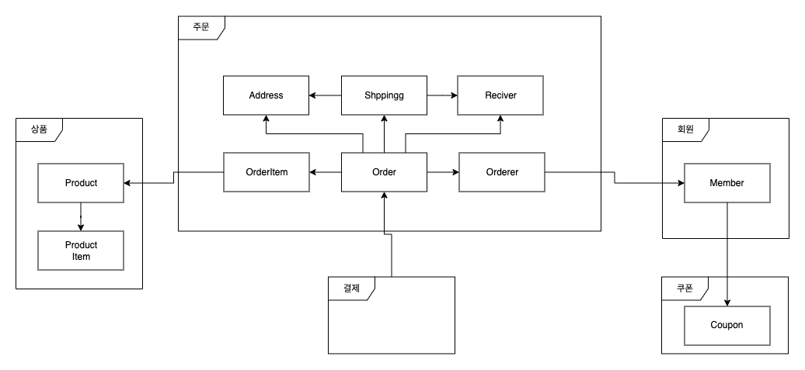
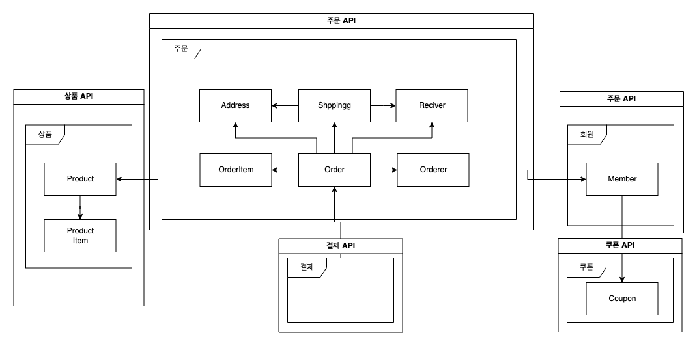
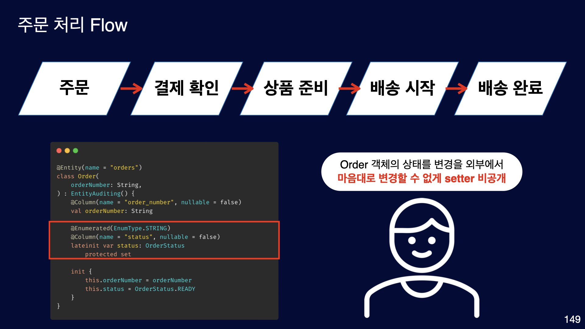
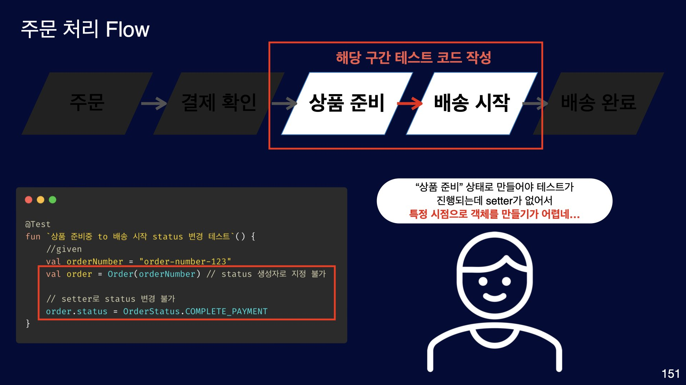
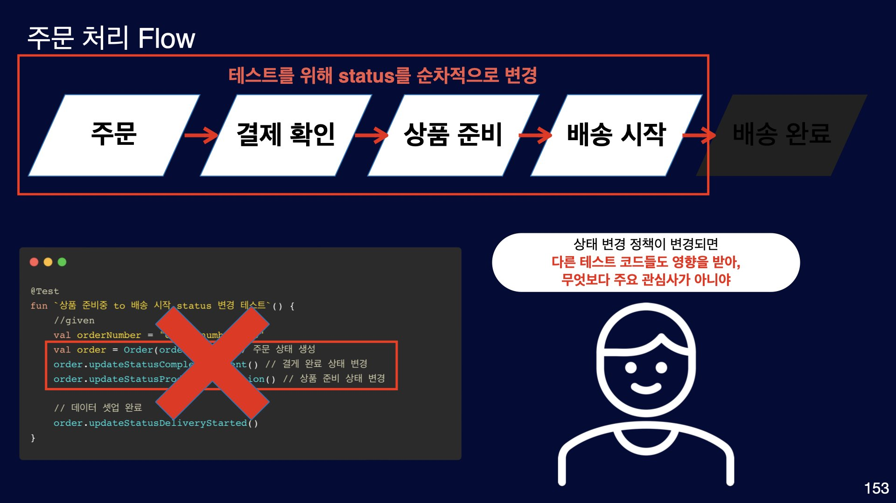
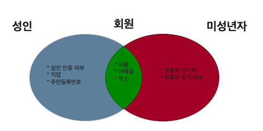

# 좋은 코드 설계를 위한 답없는 고민들

좋은 코드 설계를 위한 고민들을 평소에 많이 해왔고, 그에 관련한 학습들도 진행했었다. OOP, DDD, Clean Code, Clean Architecture 등등을 통해서 나름의 주관이 생겼으며 경력 초반에는 이런 것들을 지키기 위해 많이 노력해왔다. 현재는 이런 개념들을 선택적으로 적용하며 또 어떠한 의미에서는 이런 것들을 지키는 것들에 대해서 가성비가 좋지 않다고까지 생각한다. 해당 포스팅에서 작성한 내용은 개발하면서 코드 설계적인 부분에 대해서 아직까지 고민을 하고 있는 부분들에 대해서 정리한 것들이다. 만약 Spring, JPA, Kotlin을 통해서 프로젝트를 진행하고 있다면 공감이 될 수 있다.

## 복잡도를 어디서 제어(책임)할 것인가?

당연히 요구사항이 복잡하니 코드 또한 복잡해진다. 결국 이러한 복잡도를 어느 코드에서는 해결해야 하는데 이 부분에 대한 고민이다. 

```kotlin
enum class MemberStatus(
    desc: String
) {
    NORMAL("정상"), // 이메일 받는 회원 
    UNVERIFIED("미인증"), // 이메일 받는 회원
    LOCK("계정 일지 정지"), // 이메일 제외 회원
    BAN("계정 영구정지"); // 이메일 제외 회원
}
```
예를 들어 특정 성별 중 현재 활성화된 회원들 전체에게 이메일을 보내는 로직에서 활성화 회원들을 조회하는 코드가 있다고 가정해 보자.

### 조회 코드에서 복잡도 제어

```kotlin
class MemberRepositoryImpl(
    private val query: JPAQueryFactory,
) : MemberRepositoryCustom {
    
    override fun findBy(gender: String): List<Member> = query
        .selectFrom(member)
         // 정상적인 회원 상태를 직접 명시
        .where(member.genter.eq(gender))
        .where(member.status.`in`(setOf(MemberStatus.NORMAL, MemberStatus.UNVERIFIED)))
        .fetch()
}
```
조회 코드에서 회원 상태의 복잡도를 직접 제어하면 외부 객체에서 현재 활성화 상태에 대한 복잡도에 대해서 자유로워진다. 즉 호출하는 객체에서는 회원의 상태에 대해서 알바가 없어진다는 장점이 있다. 하지만 단점 또한 있다. 회원 상태가 다른 조회 로직이 있다면 거의 유사한 코드가 중복해서 나온다는 것이다.

### 조회를 호출하는 코드에서 복잡도 제어

```kotlin
class MemberRepositoryImpl(
    private val query: JPAQueryFactory,
) : MemberRepositoryCustom {
    
    // 파라미터로 직접 받는다.
    override fun findBy(gender: String, memberStatuses: Set<MemberStatus>): List<Member> = query
        .selectFrom(member)
        .where(member.status.`in`(memberStatuses))
        .fetch()
}
```
조회를 호출하는 코드에서 복잡도 제어를 하면 회원 상태에 대한 세부적인 규칙을 해당 객체를 호출하는 곳에 복잡도가 위임된다. 즉 호출하는 쪽에서 회원 상태에 대해서 명확하게 알고 있어야 한다. 물론 이 정도 상태 정도야 복잡도가 높다고 할 수 없지만 여러 필드들의 조합을 분석해서 조회해야 하는 경우는 복잡도가 높아진다. 또 요구사항이 바뀌어서 코드를 변경했다면 호출하는 코드들을 모두 찾아가서 변경해야 한다. 그 복잡도를 외부에서 제어했기 때문에 당연한 결과이다. 

### 정리

단순 파라미터로 받을 것인가 아닌가에 대한 단순한 고민이 아니라 복잡도를 어디에서 제어할 것인가? 그에 따른 장단점이 있고 어떠한 근거로 어떠한 방법을 택할 것인가 또 그 근거는 무엇인가에 대한 고민을 해봤으면 한다. 나름의 결론이 있다면(또 어떻게 바뀔지 모르겠지만) 네이밍을 통해서 그 의도를 드러나게 하는 것이 좋다고 생각한다.

```kotlin
@Service
class MemberQueryService(
    private val memberRepository: MemberRepository,
) {

    // 활성화 상태인 유저 성별로 조회, 명확하게 해당 의도 전달
    fun findActivityMemberBy(gender: String): List<Member> {
        return memberRepository.findBy(gender, setOf(MemberStatus.NORMAL, MemberStatus.UNVERIFIED))
    }
}

class MemberRepositoryImpl(
    private val query: JPAQueryFactory,
) : MemberRepositoryCustom {

    // 제너럴하게 파라미터로 넘겨 받음
    override fun findBy(gender: String, memberStatuses: Set<MemberStatus>): List<Member> = query
        .selectFrom(member)
        .where(member.status.`in`(memberStatuses))
        .fetch()
}
```
MemberQueryService 같은 서비스 계층을 두고 해당 객체에서 네이밍으로 명확하게 그 의도를 표현하고, Repository 계층에서는 제너럴 하게 파라미터로 받아 처리한다. 이렇게 하면 서비스 계층에서는 명확하게 현재 활성화 상태의 유저를 조회하게 되며, 인프라 계층에서는 제너럴 하게 조회 로직을 작성함으로써 중복 코드 및 유사 코드를 방지할 수 있다. 인프라스트럭처에 직접적인 의존성을 갖게 하는 것보다 MemberQueryService처럼 서비스 계층을 통해 인프라스트럭처를 간접적으로 의존하는 것이 여러모로 좋다고 생각한다. 관련 포스팅은
[Spring Guide - Service 가이드](https://cheese10yun.github.io/spring-guide-service/#-2)에 정리되어 있다.


## 유효성 검사는 어디서 어떻게 해야할까?



일반적으로 Presentation 계층에서 다양한 유효성 검사를 하고 문제가 없다면 서비스 계층으로 넘어가서 비즈니스 로직을 수행하는 것이 일반적이다. 간단하게 코드로 표현하면 다음과 같다.

```kotlin
// 회원가입 요청 DTO
@MemberRegistrationForm
data class MemberRegistrationRequest(
  @field:NotEmpty
  val firstName: String,
  @field:NotEmpty
  val lastName: String,
  @field:NotEmpty
  val email: String
)

@RestController
@RequestMapping("/api/members")
class MemberController(
    private val memberRegistrationService: MemberRegistrationService
) {

    @PostMapping
    fun register(
        @RequestBody @Valid dto: MemberRegistrationRequest
    ) {
        // ...
        // (1) 간단한 validation 외에 각종 검증...
        memberRegistrationService.register(dto)
    }
}
```

`spring-boot-starter-validation` 의존성으로 필드에 대한 유효성 검증을 쉽게 진행할 수 있다. 하지만 상호 베타적인 값 검증, 외부 인프라를 의존하는 유효성 검사는 진행하기가 어렵다. 그래서 [ConstraintValidator을 이용해서 효과적인 검증](https://cheese10yun.github.io/ConstraintValidator/)에 대해서 포스팅한 적이 있다. 추가적인 검증을 그냥 `(1)`에서 진행해도 무방하지만 Error Response 관련해서 더 효율적으로 관리하기 위해서는 `ConstraintValidator`을 통해서 진행하는 것이 좋다. 예를 들어 요청 필드가 5개고 해당 요청 필드 5개가 모두 문제라면 Error Response을 할 때 모든 문제에 대해서 구체적으로 응답해 주는 것이 좋다. 개별적으로 응답을 주면 최악의 경우 5번 요청을 하고 나서야 모든 필드들에 대해서 유효성 확보가 되기 때문이다.

```json
// 한 요청에 대해서 모든 문제를 한 번에 내려주는 것이 좋다
{
  "message": " Invalid Input Value",
  "status": 400,
  "code": "C001",
  "errors": [
    {
      "field": "lastName",
      "value": "",
      "reason": "비어 있을 수 없습니다"
    },
    {
      "field": "email",
      "value": "asd",
      "reason": "올바른 형식의 이메일 주소여야 합니다"
    }
  ],
  "timestamp": "2023-06-11T23:41:38.557228"
}
```

### 사전 유효성 검증의 문제



사전에 검증하게 되면 문제가 있다. 위 그림처럼 여러 개의 애플리케이션, 혹은 다른 서비스에서 `MemberRegistrationService`의존 하여 회원가입을 진행할 수 있다. 이렇게 어느 한 구간에서 유효성 검사를 하지 않거나, 유효성 검증 항목의 변경 사항이 제대로 반영되지 않거나 하는 문제가 발생할 수 있다. 결국 여러 애플리케이션, 외부 객체에서 의존하려면 유효성 검사를 모두 `MemberRegistrationService`에서 진행 시키는 것이 바람직해 보일 수 있다.

### 사전 유효성 검증의 문제 해결 방법

```kotlin
// ValidatorService에서 모든 예외를 담당한다.
@Service
class MemberRegistrationValidatorService(
    private val memberQueryService: MemberQueryService
) {
    // 내부 로직을 기반으로 오류 검사를 진행하며, 유효성 검사 실패시 Excpetion 발생
    fun checkEmailDuplication(email: String) {
        var inValidCount = 0
        val errorMessage = StringBuilder()

        isExistedEmail(email)
            .also { isExistedEmail ->
                if (isExistedEmail) {
                    inValidCount++
                    errorMessage.append("${email}은 이미 등록된 이메일 입니다.\n")
                }
            }
        // 기타 문제...
        // 한 가지 필드를 여러 검증을 진행...
        if (true) {
            inValidCount++
            errorMessage.append("${email}은 xxx 문제가 있습니다. \n")
        }

        check(inValidCount == 0) { errorMessage.toString() }
    }

   // 실제 유효성 검사를 단순히 boolean 으로 표현 
    fun isExistedEmail(email: String) = memberQueryService.existedEmail(email)
}

// Presentation 계층에서 유효성 검사 진행, 실제 검증에 대한 로직은 ValidatorService을 통해 진행 하며 오류 메시지 전달 역할 담당
@Service
class MemberRegistrationFormValidator(
    private val memberRegistrationValidatorService: MemberRegistrationValidatorService
) : ConstraintValidator<MemberRegistrationForm, MemberRegistrationRequest> {
    
    override fun isValid(dto: MemberRegistrationRequest, context: ConstraintValidatorContext): Boolean {
        var inValidCount = 0
        val existedEmail = memberRegistrationValidatorService.isExistedEmail(dto.email)

        if (existedEmail) {
            inValidCount++
            addConstraintViolation(context, "${dto.email}은 이미 등록된 이메일 입니다.", "email")
        }

        // 기타 문제...
        // 한 가지 필드를 여러 검증을 진행...
        if (true) {
            inValidCount++
            addConstraintViolation(context, "${dto.email}은 xxx 문제가 있습니다.", "email")
        }

        return inValidCount == 0
    }
}
```
MemberRegistrationValidatorService를 보면 isExistedEmail는 유효성 검사에 대한 결과를 Boolean 타입으로 응답하며, checkEmailDuplication에서 isExistedEmail을 활용하여 예외 여부를 결정한다. 또 isExistedEmail은 단순 Boolean 타입이기 때문에 여러 애플리케이션 Presentation 계층에서 해당 메서드로 유효성 검사를 진행하며 애플리케이션에 맞는 응답에 대한 핸들링을 진행한다.

```kotlin
@Service
class MemberRegistrationService(
    private val memberRegistrationValidatorService: MemberRegistrationValidatorService
) {
    /**
     * @param isAlreadyCompletedValidation true 경우 이미 유효성 검사를 진행 한것으로 간주하고 추가적으로 유효성 검사를 진행하지 않는다. 
     */
    fun register(
        dto: MemberRegistrationRequest,
        isAlreadyCompletedValidation: Boolean = false // 이미 유효성 검사를 진행 했다면 추가적은 검증을 진행하지 않는다..
    ) {
        if (isAlreadyCompletedValidation.not()){
            memberRegistrationValidatorService.checkEmailDuplication(dto.email)
        }
      // ... 등록 로직
    }
}
```
MemberRegistrationService 계층에서는 isAlreadyCompletedValidation을 기준으로 추가적으로 유효성 검사를 진행할지 여부를 결정한다. 만약 Presentation 계층에서 동일한 유효성 검사를 진행했다면 더 이상 검증을 하지 않고 등록 로직을 수행한다. 물론 성능상의 큰 차이가 없다면 이런 플래그를 두지 않고 두 번 검사해도 무방하다. 이렇게 진행하면 장점으로는 유효성 검사 로직이 한곳에 모이게 되기 때문에 코드의 응집력이 높아지며, 사전 검증 여부를 확인하고 검증을 진행하지 않았다면 유효성 검사를 담당하는 객체를 통해서 진행하면 된다. 물론 단점으로는 단순 플래그 처리이기 때문에 호출하는 곳에서 이것을 무시하고 진행하지 않았음에도 진행했다고 요청하면 되기 때문에 단점으로 볼 수 있다. 최소한의 방어 로직으로 해당 플래그 default value를 false으로 설정하자. 꼭 이렇게 사용하지 않더라도 유효성을 검증하는 코드를 한 객체에 위임하여 관리하는 것은 좋은 패턴이라고 생각한다.

## Setter 없애기

개인적으로 Setter 사용을 지양한다. 관련 내용은 [Spring-Jpa Best Practices Step-06 - Setter 사용하지 않기](https://cheese10yun.github.io/spring-jpa-best-06/)에서 진행한 적 있다. 최근 대부분의 프로젝트는 Kotlin을 기반으로 코딩하고 있으며, JPA도 많이 사용하고 있다. OOP 설계를 지향하기 위해서는 단순 setter를 지양하는 것은 매우 동의하지만 Kotlin + JPA 조합을 사용하는 프로젝트에서는 적용하는 것이 많이 불편하다.

```kotlin
@Entity
@Table(name = "member")
class Member(
    @Column(name = "email", nullable = false, updatable = false)
    val email: String,
    firstName: String,
    lastName: String,
    phoneNumber: String,
    address: String,
    age: Int,
    gender: String,
    occupation: String,
    residentRegistrationNumber: String?,
    status: MemberStatus
) : EntityAuditing() {

    @Column(name = "first_name", nullable = false)
    var firstName: String = ""
        protected set
    @Column(name = "last_name", nullable = false)
    var lastName: String = ""
        protected set
    @Column(name = "phone_number", nullable = false)
    var phoneNumber: String = ""
        protected set
    @Column(name = "address", nullable = false)
    var address: String = ""
        protected set
    @Column(name = "age", nullable = false)
    var age: Int = 0
        protected set
    @Column(name = "gender", nullable = false)
    var gender: String = ""
        protected set
    @Column(name = "occupation", nullable = false)
    var occupation: String = ""
        protected set
    @Column(name = "resident_registration_number", nullable = false)
    var residentRegistrationNumber: String? = null
        protected set

    @Enumerated(EnumType.STRING)
    var status: MemberStatus = MemberStatus.NORMAL

    init {
        // 필요하다면 유효성 체크, 기타 로직 수행 등등 진행
        this.firstName = firstName
        this.lastName = lastName
        this.phoneNumber = phoneNumber
        this.address = address
        this.age = age
        this.gender = gender
        this.occupation = occupation
        this.residentRegistrationNumber = residentRegistrationNumber
        this.status = status
    }
}

```
단순히 생성자로 받아서 처리하는 방식 보다 코드가 간결하지 않다. 만약 이메일을 변경을 제공하지 않는다면 val으로 선언하고 updatable = false까지 설정하는 것을 권장한다. 생각 보다 필드를 변경하지 않아야 하는 값들이 있다. 예를 들어 주문번호, 거래 번호 등등 고유한 번호로 지정받는 값들은 가능하면 val으로 지정해서 이 필드가 변경이 되지 않는다는 것을 명확하게 표현하는 것이 좋다. 또 @Column을 반드시 작성하는 것을 권장한다. @Column을 사용하면 자연적으로 nullable, updatable 등등을 한 번 더 고민하게 되고 그 고민이 코드적으로 자연스럽게 표현된다고 생각한다.

### 그렇다면 setter를 사용하지 않는 것이 정말 효율적인가?

개인적으로 단순 setter를 지양한다. 하지만 팀 내 컨벤션으로 가져가야 할 정도로 가져가야 할 컨벤션으로 가져가야 할 정도인가?라고 하면 조금은 회의적이다. 회의적인 이유는 효율성이다. setter를 지양하는 다양한 이유가 있겠지만 개인적인 생각으로는 결국 서비스가 커지고, 관련 개발자들도 많아지면 복잡도를 제어하기가 더욱더 힘들어진다는 것이다. 즉 그렇게 복잡하지 않은 서비스의 경우는 setter를 지양해야 할 필요성이 상대적으로 낮다고 본다. 물론 어느 정도가 복잡하냐는 기준 자체는 주관적인 관점이기 부분이 크기 때문에 많은 논쟁들이 발생 하긴 한다. 



위 구조처럼 상품, 주문, 결제, 회원, 쿠폰 등등 모든 서비스들이 단일 서비스 즉 모놀리식 으로 구성돼 있다고 가정해 보자. 서비스 초기에는 2 ~ 3명의 개발자가 모든 도메인에 대해서 거의 같은 수준으로 도메인을 이해하고 있다. 하지만 서비스가 커지고, 개발자를 채용하면 문제들이 발생한다. 초기에 있던 2 ~ 3명의 개발자들도 프로젝트가 복잡해지면 도메인의 이해 수준이 달라지게 되며 새롭게 합류한 개발자들은 더더욱 그 이해도가 차이 날 수밖에 없다.

초장기에는 쿠폰을 사용하면 쿠폰 미사용에서 사용으로, 사용한 날짜 정도만 업데이트를 하면 됐지만 여러 업체들이 들어오고 업체와의 쿠폰 비용에 대한 처리 비용, 또 다양한 서비스들의 이벤트 쿠폰 등등 단순히 쿠폰을 사용 이후 2개 필드 정로를 업데이트하는 것에서 이제는 고려해야 할 사항들이 쿠폰 외부 상황까지 늘어난 셈이다. 단순히 setter로 업데이트하다 보면 사이드 이펙트가 발생할 가능 성이 높아진다. 결국 이렇게 복잡도가 높아지면 객체 지향적인 관점으로 책임과 역할을 부여하고 그 범주에서 기능들을 수행해야 하게 된다.


### 결국은 가성비

그렇다면 이렇게 복잡해졌으니 단순 setter를 지양하는 방식으로 프로젝트를 리팩토링할 것인가?라는 의견에는 동의하지 않는다. 그렇게 리팩토링할 시관과 리소스로 차리를 서비스를 상품, 주문, 결제, 회원, 쿠폰 등으로 분리해서 본인의 복잡도를 본인의 애플리케이션에서 해결해야 한다.



위 이미지처럼 적당한 서비스의 크기로 애플리케이션을 나누는 것이 도메인적인 복잡도를 해결하기 좋은 방법이라고 생각한다. 물론 이렇게 분산 환경을 구축하면 기술적인 복잡도가 요구되게 한다. 개발의 모든 결정은 다 트레이드오프가 있으며 이런 결정은 단순히 기술적인 역량뿐만이 아니라 정무적인 역량도 함께 필요하다고 생각한다. 이러한 역량까지 없기 때문에 나의 결론은 거대한 모놀로식 구조라면 단순 setter를 지양하는 것보다는 서비스의 크기를 작게 나누는 것에 대해서 더 리소스를 투자하는 게 효율적이라고 생각한다.


### 서비스의 크기를 적당하게 분리 한 이후에는 ?

그렇다면 서비스의 크기를 적절한 수준으로 나눈 이후에는 단순 setter를 지양할 것인가라는 생각이 있다. 결론부터 개인적으로는 지양하나 팀 내 컨벤션까지는 적용은 모르겠다.라는 생각이다. 결국 개발은 협업이며 팀 내 개발자들과 같은 청백 사진을 공유하고 얼라인 하는 것이 매우 중요하다고 생각한다. 본인이 setter를 지양한다면 그에 따른 타당한 이유로 팀원들을 설득해야 한다. 결국 입증의 책임은 주장하는 사람이 하는 것이다. 이런 측면에서는 서비스의 크기가 적당하게(적당히 작게) 유지되고 있다고 전제하에는 모두를 설득 시킬만한 확신은 지금의 나에게는 없다.


### 단순 setter가 없는 경우 불편한 점

단순 setter가 없는 경우 불편한 점은 테스트 코드 작성이 어려운 부분이다. 이 부분에 대한 국체적인 설명은 [2023 Spring Camp 실무에서 적용하는 테스트 코드 작성 방법과 노하우](https://springcamp.ksug.org/2023/)에서 다룬 적이 있다. 해당 발표 내용은 이후 유튜브에 공개되기 때문에 자세한 내용은 이후에 볼 수 있기 때문에 대략적으로 설명하면 다음과 같다



주문 Flow는 주문 -> 결제 확인 -> 상품 준비 -> 배송 시작 -> 배송 완료 이렇게 Flow가 존재하고 해당 Flow에는 순서가 있기 때문에 각 Step 별로 구성되며 건너뛰어서 넘어갈 수 없는 구조다. 즉 타임 테이블이 있고 그 순서대로만 진행해야 하기 때문에 상태 변경에든 다양한 유효성 체크 로직이 있다.



Order라는 엔티티 객체를 테스트 코드를 작성하려면 특정 Snapshot 상태로 만들어야 한다. 테스트 코드를 작성하는 구간은 상품 준비 -> 배송시작 임으로 해당 객체를 상품 준비 상태로 만들어야 한다. 하지만 단순 setter가 없기 때문에 상품 준비 중 객체로 직접 만드는 것이 어려운 부분이 있다. 



가장 쉬운 해결 책으로는 Order 객체를 하나 만들고 주문 -> 결제 확인 -> 상품 준비의 로직을 각각 호출해서 상품 준비 중 상태로 만들면 된다. 하지만 이 방법도 좋은 방법이 아니다. 해당 테스트 코드의 주요 관심사는 상품 준비 -> 배송 시작에 대한 테스트 코드를 작성하는 것이지 주문 상태부터 결제 확인, 상품 준비까지 객체를 만드는 것이 주요 관심사가 아니다. 이렇게 작성하면 주문 -> 결제 확인, 결제 확인 -> 상품 준비 등의 Flow가 변경이 있다면 이 테스트 코드까지 영향 범위가 확대된다. 즉 테스트 코드는 중요 관심사의 변경에만 반영하는 것이 좋다.

### 확신 없는 결론...

이러한 문제로 단순 setter를 없애는 게 다양한 부작용들이 있다. 물론 이런 부작용들은 Given 절에 데이터 셋업의 어려움이기 때문에 필요한 데이터를 sql 파일, json 파일로 데이터를 임의로 만들어서 테스트를 진행하는 방식으로 대체하고 있다. 이러한 방법이 다양한 테스트 대역폭을 확보하기 위한 좋은 전략이라고 생각은 하지만 이 또한 단점들이 있어서 이 방법을 택할 정도로 압도적인 장점이 크지 않기 때문에 확신은 없고 계속 고민하고 있는 주제이다. 이러한 이유 등등으로 프로젝트를 크기를 적절하게 분리해서 분산 환경으로 관리하고 setter는 그 해당 팀의 정책적으로 선택하는 것이 좋다고 생각한다. 

## Notnull을 보장 받고 싶은데...

```kotlin
class Member(
    // 주민등록 번호, 선인 회원인 경우 반드시 주민번호 등록 등록되어 있다.
    @Column(name = "resident_registration_number", nullable = true)
    val residentRegistrationNumber: String?,
    @Enumerated(EnumType.STRING)
    @Column(name = "status", nullable = false)
    var status: MemberStatus = MemberStatus.NORMAL,
) : EntityAuditing()


class MemberRepositoryImpl(
  private val query: JPAQueryFactory,
) : MemberRepositoryCustom {
    
    // 성인 Member 조회
    override fun findBy(age: Int): List<Member> = query
        .selectFrom(member)
        .where(member.status.`in`(MemberStatus.NORMAL, MemberStatus.DORMANCY))
        .where(member.age.gt(age))
        .fetch()
}
```

성인 Member를 조회했지만 실제 Member 객체를 리턴하기 때문에 주민등록 필드를 notnull 관련 작업을 진행할 때는 `member.residentRegistrationNumber!!`을 사용해야 한다. 이런 경우 Projection을 사용하면 이런 문제를 쉽게 해결할 수 있다.

```kotlin
data class AdultMember(
    // notnull을 보장
    val residentRegistrationNumber: String,
    var status: MemberStatus,
)
```

자세한 Projection 방법은 [Querydsl Projection 방법 소개 및 선호하는 패턴 정리](https://cheese10yun.github.io/querydsl-projections/)에서 포스팅한 내용이 있습니다. Projection을 사용하면 영속성 컨텍스트가 없기 때문에 JPA에서 제공해 주는 다양한 기능들을 사용하지 못한다. 그 밖에 단점들도 있지만 이것은 조금 더 이후에 살펴보자. 이렇게까지 하면서 해야 할 가치가 있을까라는 의문이 있다.

```json
//  Refind(환불) 객체를 JSON으로 표현
{
  "order": {
    "order_number": "1110",
    "name": "나이키 에어멕스",
    "price": 10000
  },
  "payment": {
    "payment_metohd_type": "CARD",
    "credit_card": {
      "number": "110-123123",
      "card_corp": "SHINHAN"
    },
    "account": null
  }
}
```

위 데이터 구조처럼 주문에 대한 Refund(환불) 객체가 있고, 신용카드 결제라면 `credit_card` 정보가 있고, 무통장 입금의 경우에는 `account` 정보가 있다고 가정해 보자. `credit_card`, `account` 정보는 상호 베타적인 정보이기 때문에 두 객체는 nullable 설정할 수밖에 없다. Refund(환불) 엔티티 객체를 그대로 사용한다면 내가 조회한 데이터와 상관없이 계속 null 안정성에 대한 고민을 할 수밖에 없고 `!!`의 불편한 동행이 계속된다. 문제는 그것뿐만이 아니다 환불이라는 컨텍스트의 모호함이 있다. 카드 환불인지, 무통장입금의 환불인지를 명확하게 표시하면 그 컨텍스트를 이해하는 것에 도움이 된다. 물론 변수명으로 표현이 하지만 Projection을 사용해서 `CardRefund` 타입으로 표현하는 것도 좋은 방법이라고 생각한다.

### Projection의 치명적인 단점

Projection을 사용하면 영속성 컨텍스트를 사용하지 못하는 단점 말고도 다른 큰 단점이 있다. 리턴되는 타입이 엔티티 객체가 아니기 때문에 엔티티 객체에 있는 로직을 사용할 수 없다는 것이다. 이를 해결하기 위해서 Interface로 묶고 공통적인 로직은 Interface에서 구현하는 것으로 쉽게 해결이 가능해 보안 다.

```kotlin
interface GeneralMember {
    // ...
    val email: String
    val firstName: String
    val lastName: String
    
    // 공통 로직을 작성
    fun fullName(): String {
        return "$firstName $lastName"
    }
}

data class AdultMember(
    // ...
    override val email: String,
    override val firstName: String,
    override val lastName: String,
    val status: MemberStatus,
) : GeneralMember  // 인터페이스를 상속해서 공통 로직 사용 가능
```
GeneralMember 인터페이스를 만들고 필요한 공통 로직을 작성한다. 그리고 Member 엔티티 객체, AdultMember Projection 객체에서 해당 인터페이스를 구현하면 공통 로직을 사용할 수 있다. 하지만 이렇게 인터페이스를 설계하려면 책임과 역할을 명확한 단위(작은 단위)로 구성해야 한다. 그저 엔티티와 일대일로 매핑되는 인터페이스를 두는 행위는 지양해야 한다.



Member라는 공통 교집합에는 이름, 이메일, 주소 세 가지 필드가 있다. GeneralMember가 보호자 연락처, 보호자 동의 여부 필드를 가지고 있다면 어떻게 될까? 정상적으로 override을 할 수 없다. 즉 위 그림처럼 회원이라는 인터페이스는 세 가지 일반(공통), 성인, 미성년자 인터페이스로 구성해야 하며 단순히 인터페이스를 공통 로직으로만 보고 설계하면 안 되고 많은 것들을 고려해야 한다.


### 이런식의 인터페이스는 올바른가?

위 문제처럼 각 책임에 맞게 적절하게 인터페이스를 두었다고 가정해 보자. 그렇다면 그것이 좋은 설계라고 볼 수 있을까? 나는 그렇지 않다고 생각한다. 결국 인터페이스를 두는 이유는 세부 구현체를 숨기 기고 인터페이스를 바라보게 함으로써 클래스 간의 의존관계를 줄이는 것, 다형성을 사용하여 역할을 대체할 수 있는 것이 중요한 핵심이라고 생각한다. 위 예제처럼 인터페이스는 그저 중복 로직을 맞기 위해 억지로 끼워 맞추는 것에 지나지 않는다고 생각한다.


### 상속보다는 조합(Composition)

캡슐화를 쉽게 깨트리고, 상위 클래스에 지나치게 의존하게 돼서 변화에 유연하게 대응하지 못하는 경우 상속보다는 조합(Composition)을 사용해서 이러한 문제를 해결하라고 한다. 또 Kotlin에서 by 키워드는 포함된 객체에 있는 모든 public 함수를 이 객체를 담고 있는 컨테이너를 통해 노출할 수 있는 기능을 by 키워드를 통해 제공해 주고 있다. 이런 것으로 해결은 가능하나 JPA와 사용했을 때 궁합이 좋지 않고 이러한 문제를 다 떠안고 사용할 정도의 확신이 아직 없다.

## 마무리

복잡도를 제어하고 유지 보수하기 좋은 코드 디자인을 갖기 위해 학습했던 것들을 실제 적용하면서 만났던 현실적인 문제들을 정리해 보았다. 이런 것들을 학습할 때는 모든 문제를 해결해 줄 것처럼 느껴지지만 결국 은 탄환은 없으며 개발이라는 것은 트레이드오프이며 무언가를 얻으면 반드시 무언가를 어느 정도는 손해 볼 수밖에 없다. 이런 것들을 철저히 지키고 있다면 얻는 것은 무엇이며 그것으로 필연적으로 잃어버리는 것은 무엇인지 고민을 많은 개발자들이 해봤으면 한다.    