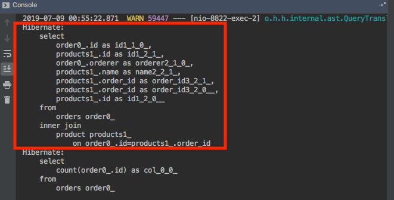
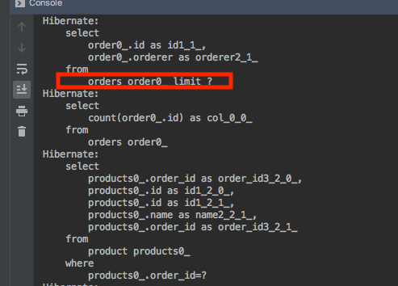
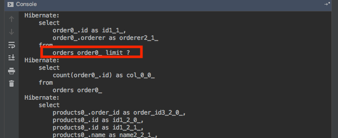
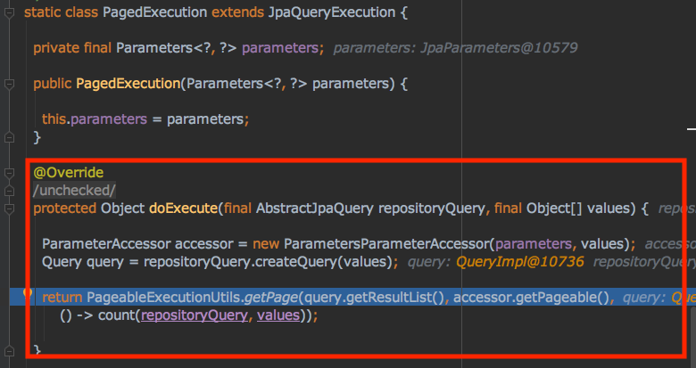

# JPA Paging 처리 Fetch Join 적용시 limit 동작하지 않는 이슈
결론부터 말씀드리면 Pagealge + Fetct Join을 이용해서 페이징 처리 시 특정 조건의 경우 limit이 발생하지 않아 **테이블 FULL Scan 진행해서 애플리케이션 단에서 limit을 조정하는 경우가 있습니다.** 성능에 막대한 영향을 주기 때문에 조심해야 합니다.

## 조건


주문 1 : 제품 N OneToMany 관계에 대해서 Pageagle 객체를 이용한 fetch join 사용 시 문제가 발생합니다. 아래는 연관관계의 코드입니다.

## limit 확인

```java
@Entity
@Table(name = "orders")
public class Order {

  @Id @GeneratedValue(strategy = GenerationType.IDENTITY)
  private long id;

  @Column(name = "orderer", nullable = false)
  private String orderer;

  @OneToMany(mappedBy = "order", cascade = CascadeType.ALL)
  private List<Product> products = new ArrayList<>();
}

@Entity
@Table(name = "product")
public class Product {

  @Id @GeneratedValue(strategy = GenerationType.IDENTITY)
  private long id;

  @Column(name = "name", nullable = false)
  private String name;

  @ManyToOne
  @JoinColumn(name = "order_id", nullable = false)
  private Order order;
}
```

Pageable 객체를 이용한 fetch join 쿼리 입니다.

```java
public interface OrderRepository extends JpaRepository<Order, Long> {

  @Query(
      value = "select  o from Order o "
          + "inner join fetch o.products ",
      countQuery = "select count(o) from Order o"
  )
  Page<Order> findByPageWithProducts(Pageable pageable);

}
```

findByPageWithProducts 메서드에 대한 SQL입니다.


**limit 키워드가 없는 것을 확인할 수 있습니다. 그렇기 때문에 orde 전체를 Full Scan 한 이후에 Pageable size 만큼 애플리케이션 단에서 조절하는 것으로 보입니다.**

그렇다면 JpaRepository에서 제공해주는 findAll + Pageable을 이용한 방식에서는 어떻게 동작하는지 확인해 보겠습니다.

```java 
@GetMapping
public Page<Order> getOrderAll(Pageable pageable) {
    return orderRepository.findAll(pageable);
}
```


limit이 정상적으로 동작하는 것을 확인할 수 있습니다. 하지만 N + 1 fetch join 이 제거해서 n +1 문제가 발생하는 합니다.

fetch join을 제거한 쿼리도 limit이 동작하는지 확인해 보겠습니다.
```java
  @Query(
      value = "select  o from Order o ",
      countQuery = "select count(o) from Order o"
  )
  Page<Order> findByPageWithProducts(Pageable pageable);
```


JpaRepository에서 제공해주는 이외의 메서드에서도 limit이 제대로 동작합니다.

## limit이 결정되는 시점


PagedExecution에서 doExecute 메서드 동작시 orders select 쿼리가 출력되는 것을 보아 저 시점에서 limit 여부가 결정되는 포인트인 거 같습니다. N + 1 문제를 해결하면서 limit이 동작하게 하는 방법은 아직 못 찾았습니다.

## 결론
Full Scan 해서 애플리케이션 레벨에서 해당 작업을 진행하는 것보다 N + 1 문제가 발생하더라도 fetch join을 제거하는 것이 현재로서는 그나마 적당한 방법인 거 같습니다.
