# N+1
JPA를 사용하다면 보면 N+1문제를 많이 만나게 됩니다. 그에 따른 발생 원인과 해결법을 정리해보았습니다

## ERD
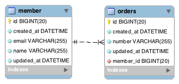

```kotlin
@Entity
@Table(name = "member")
class Member private constructor() {

    ...
    @OneToMany(mappedBy = "member", fetch = FetchType.LAZY)
    var orders: Set<Order> = emptySet()
        private set
}

@Entity
@Table(name = "orders")
class Order private constructor() {
    ...

    @ManyToOne(fetch = FetchType.LAZY)
    @JoinColumn(name = "member_id", nullable = false, updatable = false)
    lateinit var member: Member
        private set
```

위 엔티티 처럼 멤버 <-> 주문 관계를 기준으로 살명드리겠습니다.


## 발생 케이스

### 즉시로딩 N+1

```kotlin
@Test
internal fun `즉시 로딩 n+1`() {
    // fetch = FetchType.EAGER 의 경우
    val members = memberRepository.findAll()
}
```

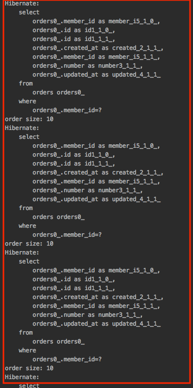

**`fetch = FetchType.EAGER` 전략을 즉시 로딩으로 가져가면 N+1 문제가 발생합니다.**

### 지연로딩과 N+1
```kotlin
@Test
internal fun `지연 로딩 n+1`() {
    // fetch = FetchType.LAZY 의 경우
    val members = memberRepository.findAll()
}
```
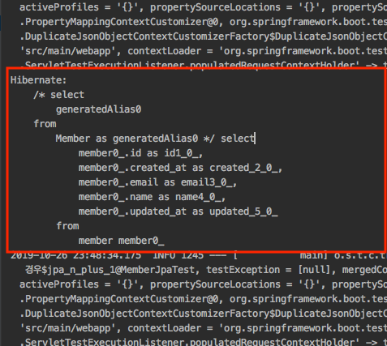

`fetch = FetchType.LAZY` 설정으로 LAZY 로딩을 하면 N+1 문제는 발생하지 않습니다.

```kotlin
@Test
internal fun `지연로딩인 n+1`() {
    val members = memberRepository.findAll()

    // 회원 한명에 대한 조회는 문제가 없다
    val firstMember = members[0]
    println(firstMember.orders.size)
}
```
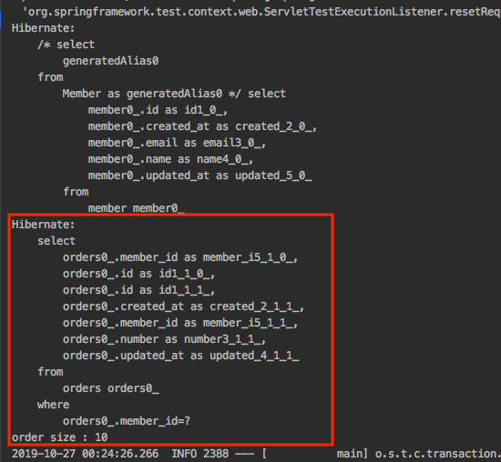

위처럼 한 명의 member를 조회했기 때문에 해당 memeber의 order를 위 와 같은 SQL로 조회합니다. **하지만 아래 코드처럼 모은 Member에 대해서 주문을 조회하는 경우 N+1문제가 발생합니다.**

```kotlin
@Test
internal fun `지연로딩인 n+1`() {
    val members = memberRepository.findAll()

    // 회원 한명에 대한 조회는 문제가 없다
    val firstMember = members[0]
    println("order size : ${firstMember.orders.size}")

    // 조회한 모든 회원에 대해서 조회하는 경우 문제 발생
    for(member in members){
        println("order size: ${member.orders.size}")
    }
}
```


**결국 지연 로딩에서도 N+1 문제는 발생합니다.**

## 원인


JPQL 특징이 있습니다. `findById()` 같은 경우에는 엔티티를 영속성 컨텍스트에서 먼저 찾고 영속성 컨텍스트에 없는 경우에 데이터베이스에 찾는 **반면 JPQL은 항상 데이터베이스에 SQL을 실행해서 결과를 조회합니다.** 그리고 아래와 같은 작업을 진행하게 됩니다.

1. **JPQL을 호출하면 데이터베이스에 우선 적으로 조회한다.**
2. 조회한 값을 영속성 컨텍스트에 저장한다.
3. 영속성 컨텍스트에 조회할 **때 이미 존재하는 데이터가 있다면(같은 영속성 컨텍스트에서 이미 조회한 유저가 있는 경우) 데이터를 버린다.**

**JPQL의 동작 순서는 위와 같고 그렇다면 왜 N+1이 발생하는 것일까요? JPQL을 실행하면 JPA는 이것을 분석해서 SQL을 생성합니다. JPQL 입장에서는 즉시 로딩, 지연 로딩과 같은 글로벌 패치 전략을 무시하고 JPQL만 사용해서 SQL을 생성합니다.** 

### 즉시 로딩인 경우
```kotlin
val members = memberRepository.findAll()
```
JPQL에서 동작한 쿼리를 통해서 members에 데이터가 바인딩 됩니다. **그 이후 JPA에서는 글로벌 패치 전략(즉시 로딩)을 받아들여 해당 member의 연관관계인 order에대해서 추가적인 레이지 로딩이 진행되어 N+1을 발생시킵니다.**

### 지연 로딩인 경우
```kotlin
val members = memberRepository.findAll()
```
JPQL에서 동작한 쿼리를 통해서 members에 데이터가 바인딩 됩니다. **JPA가 글로벌 패치 전략을 받아들이지만 지연 로딩이기 때문에 추가적인 SQL을 발생시키지 않습니다.** 하지만 위에서 본 예제처럼 레이지로 딩으로 추가적인 작업을 진행하게되면 결국 N+1 문제가 발생하게 됩니다.

## 해결 방법

### Batch SIZE
```kotlin
@Entity
@Table(name = "member")
class Member private constructor() {
    ...

    @BatchSize(size = 5) // Batch size를 지정한다
    @OneToMany(mappedBy = "member", fetch = FetchType.EAGER) // 즉시 로딩으로 설정
    var orders: List<Order> = emptyList()
        private set
}
```

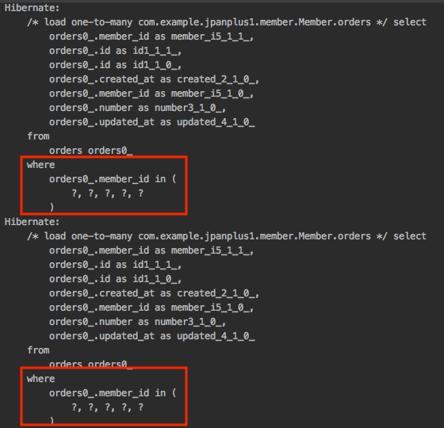


`@BatchSize(size = 5)` 에노테이션을 통해서 설정한 size 만큼 데이터를 미리 로딩 한다. 즉 연관된 엔티티를 조회할때 size 만큼 `where in` 쿼리를 통해서 조회하게되고 size를 넘어가게 되면 추가로 `where in` 쿼리를 진행합니다. 하지만 **글로벌 패치전략을 변경해야 하며, 정해진 Batch size 만큼 조회되는 것도 고정되기 때문에 권장 드리는 방법은 아닙니다.**


### 페치 조인 사용

```kotlin
interface MemberRepository : JpaRepository<Member, Long> {
    
    @Query(
            "select m from Member m left join fetch m.orders"
    )
    fun findAllWithFetch(): List<Member>
}
```

```kotlin
@Test
internal fun `페치 조인 사용`() {
    val members = memberRepository.findAllWithFetch()

    // 조회한 모든 회원에 대해서 조회하는 경우에도 N+1 문제가 발생하지 않음
    for (member in members) {
        println("order size: ${member.orders.size}")
    }
}
```

가장 많이 사용하는 방법인 `fetch`을 통해서 조인 쿼리를 진행하는 것입니다. `fetch` 키워드를 사용하게 되면 연관된 엔티티나 컬렉션을 한 번에 같이 조회할 수 있습니다. **즉 페치 조인을 사용하게 되면 연관된 엔티티는 프록시가 아닌 실제 엔티티를 조회하게 되므로 연관관계 객체까지 한 번의 쿼리로 가져올 수 있습니다.**

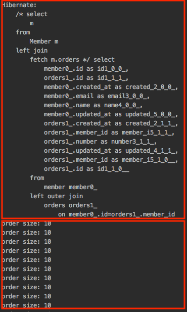

위 로그를 보면 SQL을 통해서 한 번에 데이터를 가져 온다. **`Order Size: 10`을 보면 N+1이 발생하지 않고 있다.** 그렇다면 `fetch` 키워드를 제거하면 어떻게 될까요?

#### 페치 조인과 일반 조인 차이
```kotlin
interface MemberRepository : JpaRepository<Member, Long> {

    @Query(
            "select m from Member m join m.orders"
    )
    fun findAllWithFetch(): List<Member>
}
```

```kotlin
@Test
internal fun `페치 조인 키워드 제거`() {
    val members = memberRepository.findAllWithFetch() // 패치 타입 Lazy 경우

    // 패치 조인하지 않은 상태에서는 N+1 문제 발생
    for (member in members) {
        println("order size: ${member.orders.size}")
    }
}
```

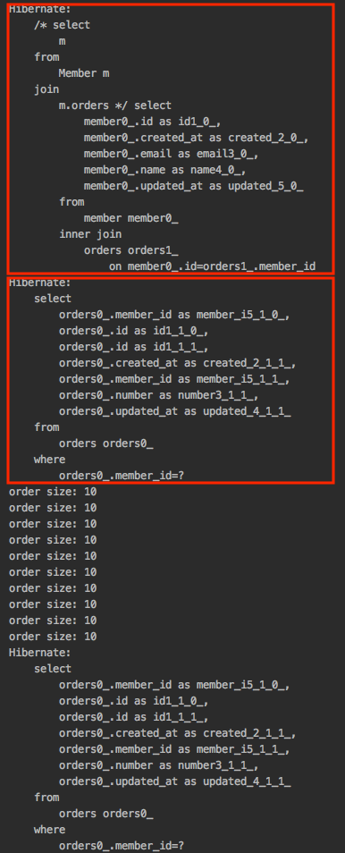

출력되는 SQL을 보면 조인을 통해서 연관관계 컬렉션까지 함께 조회되는 것으로 생각할 수 있습니다. **하지만 JPQL은 결과를 반환할 때 연관관계까지 고려하지 않고 select 절에 지정한 엔티티만 조회하게 됩니다.** 따라서 컬렉션은 초기화하지 않은 컬렉션 레퍼를 반환하게 되고 컬렉션이 없기 때문에 Lazy 로딩이 발생하게 되고 **결과적으로 N+1 문제가 발생하게 됩니다.**

## 페치 조인의 한계
그렇다면 Fetch 조인이 만능일까요? 아쉽지만 Fetch 조인은 몇가지의 한계가 있습니다.

### 컬렉션을 페치 조인하면 페이징 API를 사용할 수 없다.
```kotlin
interface MemberRepository : JpaRepository<Member, Long> {
    @Query(
            value = "select m from Member m left join fetch m.orders",
            countQuery = "select count(m) from Member m"
    )
    fun findAllWithFetchPaging(pageable: Pageable): Page<Member>
}
```

```kotlin
@Test
internal fun `컬렉션을 페치 조인하면 페이징 API를 사용할 수 없다`() {
    val page = PageRequest.of(0, 10)
    val members = memberRepository.findAllWithFetchPaging(page)


    // 조회한 모든 회원에 대해서 조회하는 경우에도 N+1 문제가 발생하지 않음
    for (member in members) {
        println("order size: ${member.orders.size}")
    }
}
```
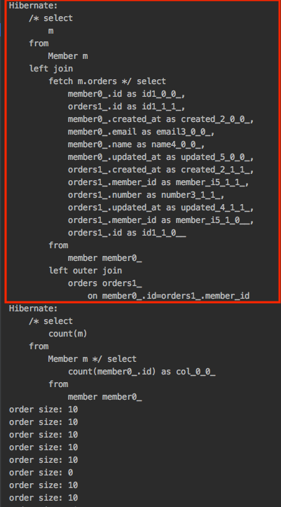

이전에 [Paging 처리 Fetch Join 적용 시 limit 동작하지 않는 이슈](https://github.com/cheese10yun/blog-sample/tree/master/jpa-fetch-join)에서도 다룬 적있습니다. 해당 쿼리에서는 limit offset 관련된 쿼리문이 없습니다. **하이버네이트에서 컬렉션을 페치 조인하고 페지이 API를 사용하면 메모리에서 페이징 처리를 진행합니다.** 즉 데이터베이스에서는 FULL Scan 한 이후 모든 데이터를 메모리에 올린 이후 limit에 맞게 데이터를 만들게 됩니다. 우선 데이터베이스에 Full Sacn 하는 것도 문제지만 그것을 메모리에 올리기 때문에 메모리를 심하게 잡아먹게 됩니다. **컬렉션이 아닌 단일 값 연관 필드의 경우에는 패치 조인을 사용해도 페이징 API를 사용할 수 있습니다.**

### 둘 이상 컬렉션을 페치할 수 없다.

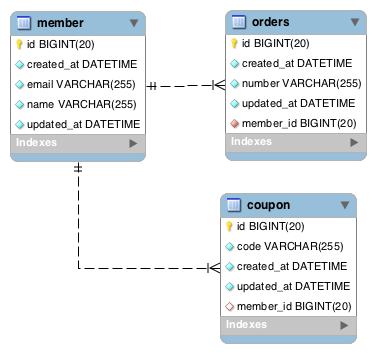

위 ERD 처럼 member가 orders, copons를 갖는 테이블 구조인 

```kotlin
@Entity
@Table(name = "member")
class Member private constructor() {
    ...

    @OneToMany(mappedBy = "member", fetch = FetchType.LAZY)
    var orders: List<Order> = emptyList()
        private set

    @OneToMany(mappedBy = "member", fetch = FetchType.LAZY) // 새로운 컬렉션 쿠폰 추가
    var coupons: List<Coupon> = emptyList()
        private set
}
```

```kotlin
@Query(
        value = "select m from Member m left join fetch m.orders left join fetch m.coupons",
        countQuery = "select count(m) from Member m"
    )
fun findAllWithFetchPaging2(pageable: Pageable): Page<Member>
```

```kotlin
@Test
internal fun `둘 이상 컬렉션을 페치할 수 없다`() {
    val page = PageRequest.of(0, 10)
    val members = memberRepository.findAllWithFetchPaging2(page)

    // 조회한 모든 회원에 대해서 조회하는 경우에도 N+1 문제가 발생하지 않음
    for (member in members) {
        println("order size: ${member.orders.size}")
    }
}
```
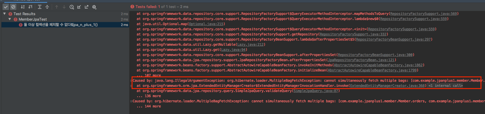

컬렉션의 카테시안 곱이 만들어지므로 하이버네이트는 주의해야 합니다. 하이버네이트는 `annot simultaneously fetch multiple bag` 예외가 발생하게 됩니다. 가장 쉬운 해결 방법으로는 자료형을 List -> Set으로 변경하는 것입니다.

```kotlin
@Entity
@Table(name = "member")
class Member private constructor() {
    ...

    @OneToMany(mappedBy = "member", fetch = FetchType.LAZY)
    var orders: Set<Order> = emptySet()
        private set

    @OneToMany(mappedBy = "member", fetch = FetchType.LAZY)
    var coupons: Set<Coupon> = emptySet()
        private set
}
```

아래 코드처럼 변경하고 테스트 코드를 다시 실행하면 아래와 같은 결과를 확인할 수 있습니다.

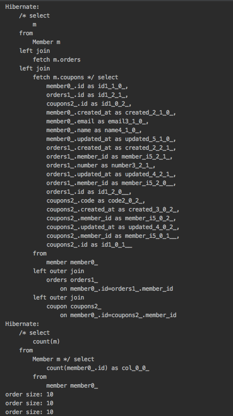

**하지만 이 방법도 권장 드리지 않습니다. 특정 에러를 해결하기 위해서 자료형을 바꾸는 것 자체가 좋은 해결법이 아니며 도메인 레이어는 아주 중요한 레이어이기 때문에 더 권장 드리지 않습니다.**


## 참고
* [자바 ORM 표준 JPA 프로그래밍](http://www.acornpub.co.kr/book/jpa-programmig)