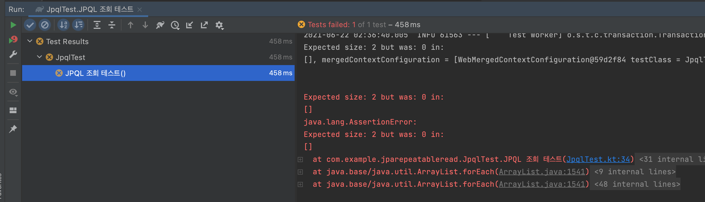
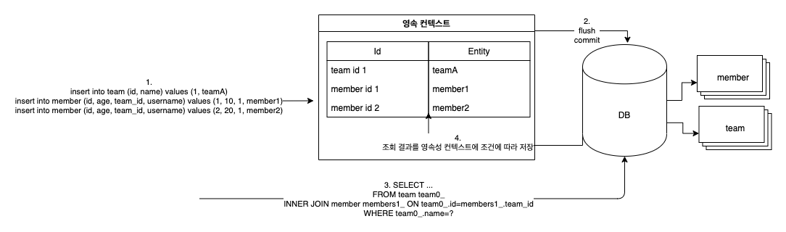
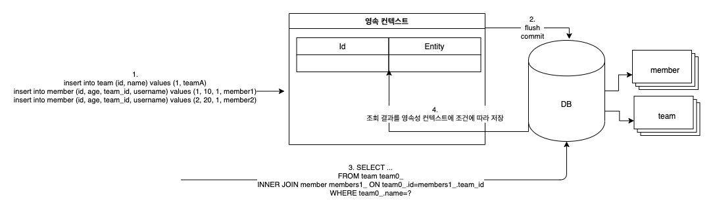
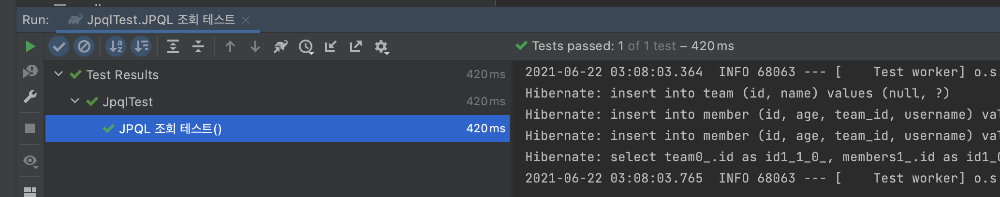

# JPA JPQL의 동작에 대한 정리

## JPQL 조회 방식


findById() 같은 경우는 영속성 컨텍스트를 먼저 찾고 영속성 컨텍스트에 해당 엔티티가 있으면 그 값을 바로 리턴합니다. 이를 1차 캐시라고 말합니다. **반면 JPQL은 영속성성 컨텍스트를 먼저 조회하지 않고 데이터베이스에 Query하여 결과를 가져옵니다.** 그리고 아래와 같은 흐름으로 영속성 컨텍스트를 저장을 시도합니다.

1. **JPQL을 호출하면 데이터베이스에 우선적으로 조회한다.**
2. 조회한 값을 영속성 컨텍스트에 저장을 시도한다.
3. **저장을 시도할 때 해당 데이터가 이미 영속성 컨텍스트에 존재하는 경우(영속성 컨텍스트에서는 식별자 값으로 식별) 데이터베이스에서 조회한 신규 데이터를 버린다.**

### JPQL 조회 방식 테스트

```kotlin

@Entity
@Table(name = "member")
class Member(
    @Column(name = "username", nullable = false)
    var username: String,

    @Column(name = "age", nullable = false)
    var age: Int = 0,

    @ManyToOne(fetch = FetchType.LAZY, optional = false)
    @JoinColumn(name = "team_id", nullable = false)
    var team: Team
) : EntityAuditing()

@Entity
@Table(name = "team")
class Team(
    @Column(name = "name", nullable = false, unique = true)
    var name: String
) : EntityAuditing() {

    @OneToMany(mappedBy = "team")
    var members: MutableList<Member> = mutableListOf()
}

interface TeamRepository : JpaRepository<Member, Long> {

    @Query(
        "select t from Team t inner join fetch t.members where t.name=:name"
    )
    fun findFetchJoinBy(
        @Param("name") name: String
    ): Team

}
```
해당 코드는 단순합니다. Team은 N개의 Member를 가질 수 있는 구조입니다. TeamRepository의 findFetchJoinBy 메서드는 단순히 팀 이름으로 Fetch Join해서 해당 Team에 속한 모든 Member를 조회하는 JPQL 코드입니다. JPQL이 위에서 설명한 방식대로 동작하는지 아래 테스트 코드로 확인 해보겠습니다.

```kotlin
@SpringBootTest
@TestConstructor(autowireMode = TestConstructor.AutowireMode.ALL)
@Transactional
class JpqlTest(
    private val em: EntityManager,
    private val teamRepository: TeamRepository
) {

    @Test
    fun `JPQL 조회 테스트`() {
        //given
        val teamA = Team(name = "teamA")
        em.persist(teamA) // teamA 저장

        // insert into member (id, age, team_id, username) values (null, ?, ?, ?)
        val member1 = Member(username = "member1", age = 10, team = teamA) // member1에 teamA 연결해서 저장
        // insert into member (id, age, team_id, username) values (null, ?, ?, ?)
        val member2 = Member(username = "member2", age = 20, team = teamA) // member2에 teamA 연결해서 저장
        em.persist(member1)
        em.persist(member2)

        //when
        // select team0_.id as id1_1_0_, members1_.id as id1_0_1_, team0_.name as name2_1_0_, members1_.age as age2_0_1_, members1_.team_id as team_id4_0_1_, members1_.username as username3_0_1_, members1_.team_id as team_id4_0_0__, members1_.id as id1_0_0__ from team team0_ inner join member members1_ on team0_.id=members1_.team_id where team0_.name=?
        val team = teamRepository.findFetchJoinBy("teamA")

        //then
        then(team.members).hasSize(2)
    }
}
```


해당 테스트는 실패 합니다. teamA를 저장하고, member1, member2에 각각 teamA를 저장 했습니다. 그리고 Fetch Join을 통해서 아래 SQL 문으로 데이터를 조회 합니다.

```sql
SELECT team0_.id AS id1_1_0_,
         members1_.id AS id1_0_1_,
         team0_.name AS name2_1_0_,
         members1_.age AS age2_0_1_,
         members1_.team_id AS team_id4_0_1_,
         members1_.username AS username3_0_1_,
         members1_.team_id AS team_id4_0_0__,
         members1_.id AS id1_0_0__
FROM team team0_
INNER JOIN member members1_ ON team0_.id=members1_.team_id
WHERE team0_.name=?
```

올바르게 데이터가 저장되고, 조회 쿼리 또한 문제가 없는데 해당 테스트느 실패 합니다. 

### 왜 테스트가 실패하는 것일까 ?



영속성 컨텍스트와 데이터베이스 흐름을 자세히 살펴 보겠습니다.

1. teamA, member1, memeber2를 영속화를 위해서 persist 메서드를 통해서 영속성 컨텍스트에 저장
2. 데티터베이스에 영구적으로 저장하기 위해서 flush, commit을 진행
3. findFetchJoinBy를 통해서 조회를 진행, **JPQL은 영속성 컨텍스트를 먼저 들리는것이 아니라 데이터베이스로 조화**
4. 조회한 결과를 영속성 컨텍스에 저장 시도, **이미 존재하는 경우(영속성 컨텍스트에서는 식별자 값으로 식별) 데이터베이스에서 조회한 값을 버림, 즉 member1, memeber2가 포함된 데이터는 버리게 됩니다.**

위와 같은 메커니즘으로 JPQL이 동작하니 해당 테스트는 실패하게 됩니다. **그렇다면 조회 직전에 영속성 컨텍스트를 초기화 하면 어떻게 동작할까요?**



3번 조회 잔에 영속성 컨텍스트를 초기화를 하면 위 이미지 처럼 3번에서 조회한 값을 영속성 컨텍스에 저장하게 됩니다.

```kotlin
{
    //when
    // select team0_.id as id1_1_0_, members1_.id as id1_0_1_, team0_.name as name2_1_0_, members1_.age as age2_0_1_, members1_.team_id as team_id4_0_1_, members1_.username as username3_0_1_, members1_.team_id as team_id4_0_0__, members1_.id as id1_0_0__ from team team0_ inner join member members1_ on team0_.id=members1_.team_id where team0_.name=?
    em.clear() // 영속성 컨텍스트를 초기화
    val team = teamRepository.findFetchJoinBy("teamA")

    //then
    then(team.members).hasSize(2)
}
```

em.clear() 메서드로 영속성 컨텍스트를 제거하고 테스트를 돌리면 정상적으로 동작하게 됩니다.



위 테스트를 통해서 JPQL 조회 방식에 대해서 검증을 진행 완료했습니다.

## 그렇다면 JPQL은 왜 이렇게 동작하는 것일까요?

JPQL에서 데이터베이스에서 조회한 값을 그대로 사용하지 않는 이유는 트랜잭션 격리 수준 떄문입니다. **트랜잭션의 격리 수준이란 동시에 여러 트랜잭션이 처리될 때, 특정 트랜잭션이 다른 트랜잭션에서 변경하거나 조회하는 데이터를 볼 수 있도록 허용할지 말지를 결정하는 것입니다.**

**결론 부터 말씀드리면 JPQL 조회 방식 때문에 Isolation 레벨이 REPEATABLE READ 수준까지 올라가게 됩니다.** 해당 트랜잭션의 Isolation이 REPEATABLE READ 보다 낮은 READ UNCOMMITTED, READ COMMITTED 경우에도 **REPEATABLE READ의 수준으로 애플리케이션단에서 보장 받을 수 있습니다.** 물론 같은 영속성 컨텍스트를 공유하는 동일 트랜잭션에서만 해당 효과를 얻을 수 있습니다. 


## 격리 수준

| ISOLATION        | DIRY READ | NOE-REPEATABLE READ | PHANTOM READ              |
| ---------------- | --------- | ------------------- | ------------------------- |
| READ UNCOMMITTED | O         | O                   | O                         |
| READ COMMITTED   | X         | O                   | O                         |
| REPEATABLE READ  | X         | X                   | O(InnoDB는 발생하지 않음) |
| SERIALIZABLE     | X         | X                   | X                         |


그렇다면 REPEATABLE READ 격리 레벨의 경우 어떤 장점이 있을까요? 그것을 알기 위해서는 각 격리 레벨에의 문제 점들을 MySQL `AUTO_COMMIT=false` 기준으로 설명드리겠습니다.

### READ UNCOMMITTED


### READ COMMITTED


#### REPEATABLE READ


## todo
* [ ] JPQL은 영속성 DB 조회이후 영속성 컨텍스트에 있는 내용이면 벼린다.
* [ ] 단한한 셈플 예제 -> https://cheese10yun.github.io/jpa-persistent-context/
* [ ] 왜 이렇게 동작하는지, 이는 REPEATABLE READ와 관련이 있음
* [ ] REPEATABLE REA 개념적인 설명
* [ ] JPA는 애플리케이션에서 동일한 트랜잭션에 대해서 REPEATABLE READ를 지원하는 거임
* [ ] 동일하지 않은 트랜잭션이거나, 영속성 컨텍스트를 하지 않은 Projections에서는 문제가 발생
* [ ] MySQL 에서는 기본적으로 REPEATABLE 격리 레벨이기 때문에 이는 발생하지 않음