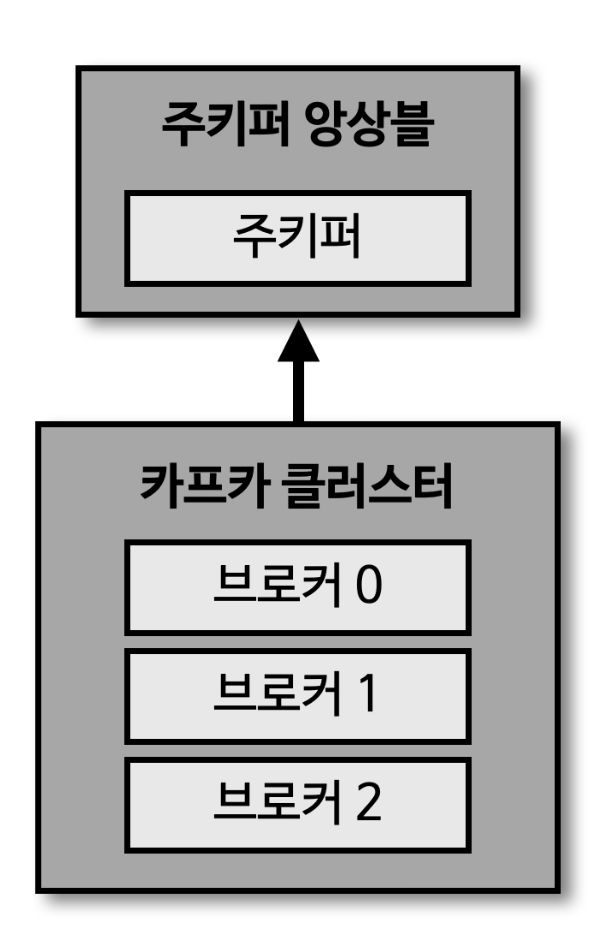
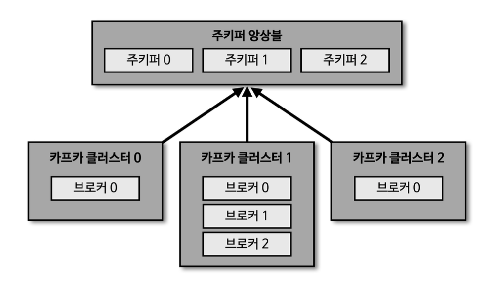

> [[아파치 카프카 애플리케이션 프로그래밍] 개념부터 컨슈머, 프로듀서, 커넥트, 스트림즈까지!](https://www.inflearn.com/course/%EC%95%84%ED%8C%8C%EC%B9%98-%EC%B9%B4%ED%94%84%EC%B9%B4-%EC%95%A0%ED%94%8C%EB%A6%AC%EC%BC%80%EC%9D%B4%EC%85%98-%ED%94%84%EB%A1%9C%EA%B7%B8%EB%9E%98%EB%B0%8D) 학습 정리

# 세션1 아파치 카프카의 역사와 미래

## 아파치 카프카가 데이터 파이프라인으로 적합한 4가지 이유

### 높은 처리양

카프카는 프로듀서가 브로커로 데이터를 보낼 때 컨슈머가 브로커로부터 데이터를 받을 때 모두 묶어서 전송한다. 많은 양의 데이터를 송수신할 때 맺어진 네트워크 비용은 무시할 수 없는 규모가 된다. 동일한 양의 데이터를 보낼 때 네트워크 통신 횟수를 최소한으로 줄인다면 동일 시간 내에 더 많은 데이터를 전송할 수 있다. 많은 양의 데이터를 묶음 단위로 처리하는 배치로 빠르게 처리할 수 있기 때뭄ㄴ에 대용량의 실시간 로그데이터를 처리하는 데 적합하다. 또한, 파티션 단위를 통해 동일 목적의 데이터를 여러 파티션에 분배하고 데이터를 병렬 처리할 수 있다. 파티션 개수만큼 컨슈머 개수를 늘려서 동일한 시간당 데이터 처리양을 늘리는 것이다.

### 확장성

데이터 파이프라인에서 데이터를 모을 때 데이터가 얼마나 들어올지는 예측하기 어렵다. 하루에 1,000건 가량 들어오는 로그 데이터라도 예상치 못한 특정 이벤트로 인해 100만 건 이상의 데이터가 들어오는 경우가 있다. 카프카는 이러한 가변적인 환경에서 안정적으로 확장 하능하도록 설계되있다. 데이터가 적을 때는 카프카 클러스터의 브로커를 최소한의 개수로 운영하다가 데이터가 많아짐녀 클러스터 브로커 개수를 자연스럽게 늘려 스케일 아웃할 수 있다. 반대로 데이터 개수가 적어지고 추가 서버들이 더는 필요 없어지면 브로커 개수를 줄여 스케일 인할 수 있다. 카프카의 스케일 아웃, 스케일 인과정은 클러스트의 무중단 운영을 지원하므로 안정적으로 운영이 가능하다.

### 영속성

영속성이란 데이터를 생성한 프러그램이 종료되더라도 사라지지 않은 데이터의 특성을 뜻한다. 카프카는 다른 메시징 플랫폼과 다르게 전송받은 데이터를 메모리에 저장하지 않고 파일 시스템에 저장한다. 파일 시스템에 데이터를 적재하고 사용하는 것은 보편적으로 느리다고 생각하겠지만, 카프카는 운영체제 레벨에서 파일 시스템을 최대한 활용하는 방법을 적용하였다. 운영체제에서는 파일 I/O 성능을 향상을 위해 페이지 캐시 영역을 메모리에 따로 생성하여 사용한다. 페이지 캐시 메모리 영역을 시용하여 한 번 읽은 파일ㅇ 내용은 메모리에 저장 시켰다가 다시 사용하는 방식이기 떄문에 카프카가 파일 시스템에 저장하고 데이터를 저장, 전송하더라도 처리양이 높은 것이다. 디스크 기반의 파일 시스템을 활용한 덕분에 브로커 애플리케이션이 장애 방생으로 인해 급작스럽게 종료되더라도 프로세스를 재시작하여 안전하게 데이터를 다시 처리 할 수 있다.

### 고가용성

3개 이상의 서버들로 운영되는 카프카 클러스터는 일부 서버에 장애가 발생허다라도 무중단으로 안전하고 지속적으로 데이터를 처리할 수 있다. 클러스터로 이루어진 카프카는 데이터의 복제를 통해 고가용성의 특징을 가지게 되었다. 프로듀서로 전송받은 데이터를 여러 브로커 중 1대의 브로커에만 저장하는 것이 아니라 또 다른 브로코에도 저장하는 것이다. 한 브로커에 장애가 발생하더라도 복제된 데이터가 나머지 브로ㅓ커에 젖아되어 있으므로 저장 된 데이터를 기준으로 지속적으로 데이터 처리가 가능한 것이다. 이에 더하여 서버를 직접 운영하는 온프레미스 환경의 서버 랙 또는 퍼블릭 클라우드의 리전 단위 장애에도 데이터를 안전하게 복제할 수 있는 브로커 옵션들이 준비되어 있다.

## 빅데이터 아키텍처의 종류와 카프카의 미래

| 배치 데이터                                                                                                                                     | 스트림 데이터                                                                                                                        |
| ----------------------------------------------------------------------------------------------------------------------------------------------- | ------------------------------------------------------------------------------------------------------------------------------------ |
| - 한정된 데이터 처리  - 대규모 배치 데이터를 위한 분산 처리 수행   - 분, 시간, 일 단위 처리를 위한 지연 발생  - 복잡한 키 조인 수향 | - 무한 데이터 처리  - 지속적으로 들어오는 데이터를 위한 분산 처리 수행   - 분 단위 이하 지연 발생  - 단순한 키 조인 수행 |

# 세션2 카프카 기본 개념 설명

## 카프카 브로커와 클러스터

### 카프카 브로커 클러스터 주키퍼

카프카 브로커는 카프카 클라이언트와 데이터를 주고받기 위 해 사용하는 주체이자, 데이터를 분산 저장하여 장애가 발생하더라도 안전하게 사용할 수 있도록 도와주는 애플리케이션이다. 하나의 서버 에는 한 개의 카프카 브로커 프로세스가 실행된다. 카프카 브로커 서버 1대로도 기본 기능이 실행되지만 데이터를 안전하게 보관하고 처리하기 위해 3대 이상의 브로커 서버를 1개의 클러스터로 묶어서 운영한다. 카프카 클러스터로 묶인 브로커들은 프로듀서가 보낸 데이터를 안전하게 분산 저장하고 복제하는 역할을 수행한다.

### 여러개의 카프카 클러스타가 연결된 주키퍼

- 카프카 클러스터를 실행하기 위해서는 주키퍼가 필요함
- 주키퍼의 서로 다른 znode에 클러스터를 지정하면 됨
- root znode에 각 클러스터별 znode를 생성하고 클러스터 실행시 root가 아닌 하위 znode로 설정
- 카프카 3.0 부터는 주키퍼가 없어도 클러스터 동작 가능

