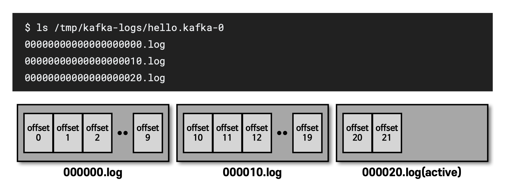
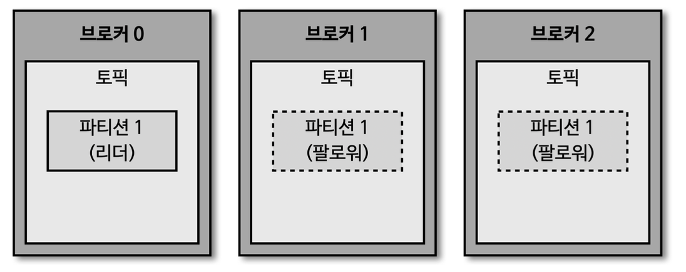
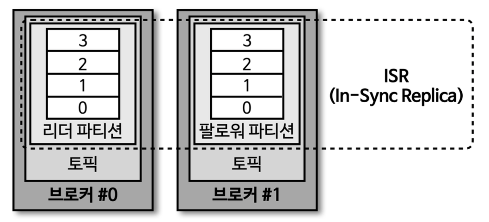
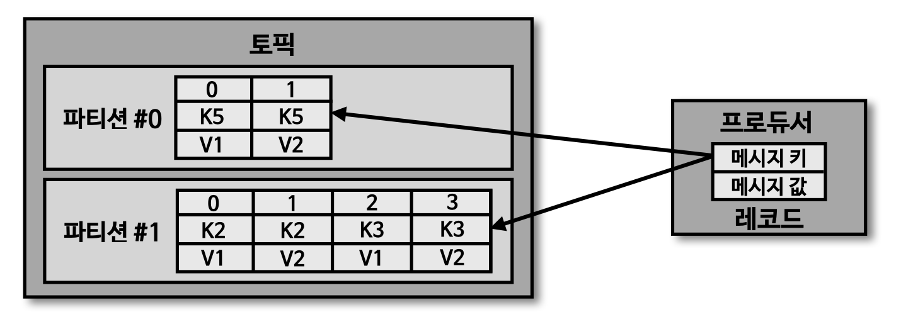
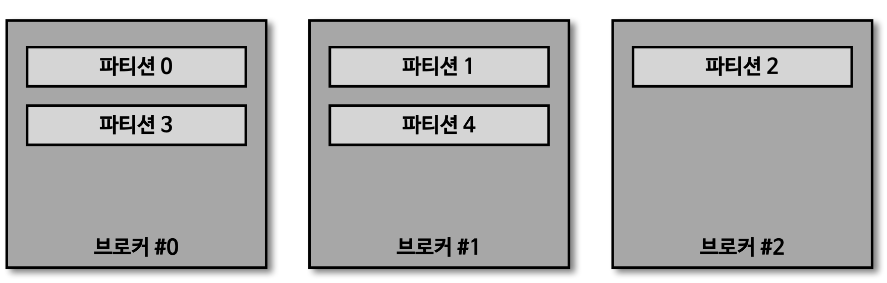
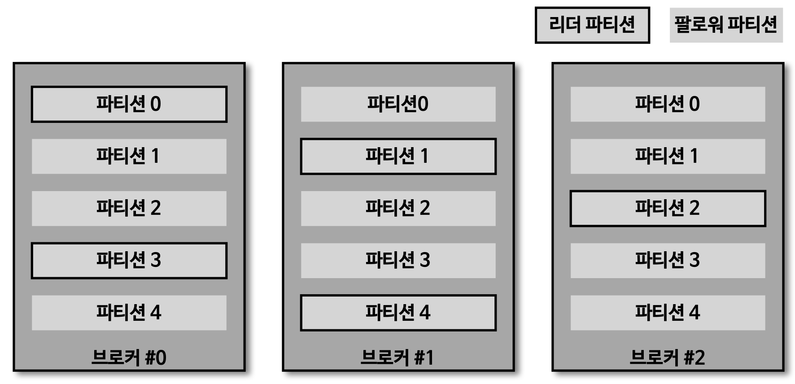
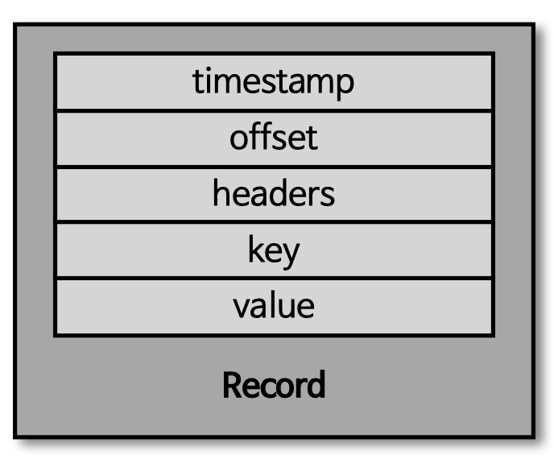

> [[아파치 카프카 애플리케이션 프로그래밍] 개념부터 컨슈머, 프로듀서, 커넥트, 스트림즈까지!](https://www.inflearn.com/course/%EC%95%84%ED%8C%8C%EC%B9%98-%EC%B9%B4%ED%94%84%EC%B9%B4-%EC%95%A0%ED%94%8C%EB%A6%AC%EC%BC%80%EC%9D%B4%EC%85%98-%ED%94%84%EB%A1%9C%EA%B7%B8%EB%9E%98%EB%B0%8D) 학습 정리

# 세션 1 아파치 카프카의 역사와 미래

## 아파치 카프카가 데이터 파이프라인으로 적합한 4가지 이유

### 높은 처리양

카프카는 프로듀서가 브로커로 데이터를 보낼 때 컨슈머가 브로커로부터 데이터를 받을 때 모두 묶어서 전송한다. 많은 양의 데이터를 송수신할 때 맺어진 네트워크 비용은 무시할 수 없는 규모가 된다. 동일한 양의 데이터를 보낼 때 네트워크 통신 횟수를 최소한으로 줄인다면 동일 시간 내에 더 많은 데이터를 전송할 수 있다. 많은 양의 데이터를 묶음 단위로 처리하는 배치로 빠르게 처리할 수 있기 때뭄ㄴ에 대용량의 실시간 로그데이터를 처리하는 데 적합하다. 또한, 파티션 단위를 통해 동일 목적의 데이터를 여러 파티션에 분배하고 데이터를 병렬 처리할 수 있다. 파티션 개수만큼 컨슈머 개수를 늘려서 동일한 시간당 데이터 처리양을 늘리는 것이다.

### 확장성

데이터 파이프라인에서 데이터를 모을 때 데이터가 얼마나 들어올지는 예측하기 어렵다. 하루에 1,000건 가량 들어오는 로그 데이터라도 예상치 못한 특정 이벤트로 인해 100만 건 이상의 데이터가 들어오는 경우가 있다. 카프카는 이러한 가변적인 환경에서 안정적으로 확장 하능하도록 설계되있다. 데이터가 적을 때는 카프카 클러스터의 브로커를 최소한의 개수로 운영하다가 데이터가 많아짐녀 클러스터 브로커 개수를 자연스럽게 늘려 스케일 아웃할 수 있다. 반대로 데이터 개수가 적어지고 추가 서버들이 더는 필요 없어지면 브로커 개수를 줄여 스케일 인할 수 있다. 카프카의 스케일 아웃, 스케일 인과정은 클러스트의 무중단 운영을 지원하므로 안정적으로 운영이 가능하다.

### 영속성

영속성이란 데이터를 생성한 프러그램이 종료되더라도 사라지지 않은 데이터의 특성을 뜻한다. 카프카는 다른 메시징 플랫폼과 다르게 전송받은 데이터를 메모리에 저장하지 않고 파일 시스템에 저장한다. 파일 시스템에 데이터를 적재하고 사용하는 것은 보편적으로 느리다고 생각하겠지만, 카프카는 운영체제 레벨에서 파일 시스템을 최대한 활용하는 방법을 적용하였다. 운영체제에서는 파일 I/O 성능을 향상을 위해 페이지 캐시 영역을 메모리에 따로 생성하여 사용한다. 페이지 캐시 메모리 영역을 시용하여 한 번 읽은 파일ㅇ 내용은 메모리에 저장 시켰다가 다시 사용하는 방식이기 떄문에 카프카가 파일 시스템에 저장하고 데이터를 저장, 전송하더라도 처리양이 높은 것이다. 디스크 기반의 파일 시스템을 활용한 덕분에 브로커 애플리케이션이 장애 방생으로 인해 급작스럽게 종료되더라도 프로세스를 재시작하여 안전하게 데이터를 다시 처리 할 수 있다.

### 고가용성

3개 이상의 서버들로 운영되는 카프카 클러스터는 일부 서버에 장애가 발생허다라도 무중단으로 안전하고 지속적으로 데이터를 처리할 수 있다. 클러스터로 이루어진 카프카는 데이터의 복제를 통해 고가용성의 특징을 가지게 되었다. 프로듀서로 전송받은 데이터를 여러 브로커 중 1대의 브로커에만 저장하는 것이 아니라 또 다른 브로코에도 저장하는 것이다. 한 브로커에 장애가 발생하더라도 복제된 데이터가 나머지 브로ㅓ커에 젖아되어 있으므로 저장 된 데이터를 기준으로 지속적으로 데이터 처리가 가능한 것이다. 이에 더하여 서버를 직접 운영하는 온프레미스 환경의 서버 랙 또는 퍼블릭 클라우드의 리전 단위 장애에도 데이터를 안전하게 복제할 수 있는 브로커 옵션들이 준비되어 있다.

## 빅데이터 아키텍처의 종류와 카프카의 미래

| 배치 데이터                                                                                          | 스트림 데이터                                                                                 |
|-------------------------------------------------------------------------------------------------|-----------------------------------------------------------------------------------------|
| - 한정된 데이터 처리  - 대규모 배치 데이터를 위한 분산 처리 수행   - 분, 시간, 일 단위 처리를 위한 지연 발생  - 복잡한 키 조인 수향 | - 무한 데이터 처리  - 지속적으로 들어오는 데이터를 위한 분산 처리 수행   - 분 단위 이하 지연 발생  - 단순한 키 조인 수행 |

# 세션 2 카프카 기본 개념 설명

## 카프카 브로커와 클러스터

### 카프카 브로커 클러스터 주키퍼

카프카 브로커는 카프카 클라이언트와 데이터를 주고받기 위 해 사용하는 주체이자, 데이터를 분산 저장하여 장애가 발생하더라도 안전하게 사용할 수 있도록 도와주는 애플리케이션이다. 하나의 서버 에는 한 개의 카프카 브로커 프로세스가 실행된다. 카프카 브로커 서버 1대로도 기본 기능이 실행되지만 데이터를 안전하게 보관하고 처리하기 위해 3대 이상의 브로커 서버를 1개의 클러스터로 묶어서 운영한다. 카프카 클러스터로 묶인 브로커들은 프로듀서가 보낸 데이터를 안전하게 분산 저장하고 복제하는 역할을 수행한다.

### 여러개의 카프카 클러스타가 연결된 주키퍼

- 카프카 클러스터를 실행하기 위해서는 주키퍼가 필요함
- 주키퍼의 서로 다른 znode에 클러스터를 지정하면 됨
- root znode에 각 클러스터별 znode를 생성하고 클러스터 실행시 root가 아닌 하위 znode로 설정
- 카프카 3.0 부터는 주키퍼가 없어도 클러스터 동작 가능

## 카프카 브로커의 역할들

### 컨트롤러

클러스터의 다수 브로커 중 한 대가 컨트롤러의 역할을 한다. 커늩롤러는 다른 브로커들의 상태를 체크하고 브로커가 클러스터에서 빠지는 경우 해당 크로커에 존재하는 리더 파티션을 재분배한다. 카프카는 지속적으로 데이터를 처리해야 하므로 브로커의 상태가 비정상이라면 빠르게 클러스터에서 뺴내는 것이 중요하다. 만약 컨트롤러 역할을 하는 브로커에 장애가 생기 면 다른 브로커가 컨트롤러 역할을 한다.

### 데이터 삭제

카프카는 다른 메시징 플랫폼과 다르게 컨슈머가 데이터를 가져가더라도 토픽의 데이터는 삭제되지 않는다. 또한, 컨슈머나 프로듀서가 데이터 삭제를 요청할 수도 없다. 오직 브로커만이 데이터를 삭제할 수있다. 데이터 삭제는 파일 단위로 이루어지는데 이 단위를 로그 세그먼트 라고 부른다. 이 세그먼트에는 다수의 데이터가 들어 있기 떄문에 일반적으로 데이터베이스 처럼 특정 데이터를 선별해서 삭제할 수 없다.

### 컨슈머 오프셋 저장

컨슈머 그룹은 토픽이 특정 파티션으로 부터 데이터를 가져가서 처리하고 이 파티션이 어느 레코드까지 가져갔는지 확인 하기 위해 오프셋을 커밋한다. 커밋한 오프셋은 _consumer, _offsets 토픽에 저장한다. 여기에 저장된 오프셋을 초대로 컨슈머 그룹은 다음 레코드를 가져가서 처리한다.

### 그룹 코디네이터

코디네이터는 컨슈머 그룹의 상태를 체크하고 파티션을 컨슈머와 매칭되도록 분배하는 역할을 한다. 컨슈머가 컨슈머 그룹에서 빠지면 매칭되지 않는 파티션을 정상 동작하는 컨슈머로 할당하여 끊임 없이 데이터가 처리되도록 도와준다. 이렇게 파티션을 컨슈머로 재할당하는 과정을 리밸런스 라고 부른다.

### 데이터의 저장

- 카프카를 실행할 때 config/server.properteis의 log.dir 옵션에 정의한 디렉토리에 데이터를 저장한다. 토픽 이름과 파팃현 번호의 조합으로 하위 디엑토리를 생성하여 데이터를 저장한다.
- hello.kafka 토픽의 0번 파티션에 존재하는 데이터를 확인할 수 있다. log에는 메시지와 메타데이터를 저장한다. index는 메시지의 오프셋을 인덱싱한 정보를 담은 파일이다. timeindex 파일에는 메시지에 포함된 timesteamp값을 기준으로 인덱싱한정보가 담겨 있다.

## 브로커 로그와 세그먼트

- log.segment.bytes: 바이트 단위의 최대 세그먼트 크기 저장. 기본 값은 1GB
- log.roll.ms(hours): 세그먼트가 신규 생성된 이후 다음 파일로 넘어가는 시간 주기, 기본 값은 7일

## 복제

데이터 복제는 카프카를 장애 허용 시스템으로 동작하도록 하는 원동력이다. 복제의 이유는 클러스터로 묶인 브로커 중 일부에 장애가 발생하도라도 데이터를 유실하지 않고 안전하게 사용하기 위함이다. 카프카의 데이터 복제는 파티션 단위로 이루어진다. 토픽을 생성할 때 파티션 복제 개수도 같이 설정되는데 직접 옶ㄴ을 선택하지 않으면 브로커에 설정된 옵션 값을 따라나간다. 복제 개수의 최솟값은 1이고 최대 값은 브로커 개수만큼 설정하여 사용할 수 있다.

파티션 복제로 인해 나머지 브로커에도 파티션의 데이터가 복제되므로 복제 개수만큼 저장 용량이 증가한다는 단점 이 있다. 그러나 **복제를 통해 데이터를 안전하게 사용할 수 있다는 강력한 장점떄문에 카프카를 운영할 때
2 이상의 복제 개수를 정하는 것이중요하다.
** 카프카 브로커가 설치된 기업용 서버는 개인용 컴퓨터와 비교가 안될정도로 안전성이 좋지만 서버는 해커로 인한 친입, 디스크 오류, 네트워크 연결 장애의 이유로 언제든지 장애가 발생할 수 있다.

브로커가 다운되면 해당 브로커에 있는 리더파티션은 사용할 수 없기 때문에 팔로워파티션 중 하나가 리더 파티션 지위를 넘겨 받는다. 이를 통해 데이터 유실되지 않고 컨슈머 프로듀서와 데이터를 주고받도록 독장할 수 있다. 운영 시에는 데이터 종류마다 다른 복제 개수를 설정하고 상황에 따라서는 토픽마다 복제 개수를 다르게 설정하여 운영하기로 한다. 데이터 일부 유식되어도 무관하고 데이터 처리 속도가 중요하다면 1 또는 2로 설정한다. 금융 정보와 같이 유실이 일어나면 안되는 데이터의 경우 복제개수를 3으로 설정하기도 한다.

## ISR (In-Sync-Replicas)

ISR은 리더 파티션과 팔로워 파티션이 모두 싱크가 된 상태를 뜻한다. 복제 개수가 2인 토픽을 가정햅보자. 이 토픽에는 리더 파티션 1개와 팔로워 파티션 1개가 존재할 것이다. 리더 파티션에 0부터 3의 오프셋이 있다고 가정할 때, 팔로워 파티션에 동기화가 완료되려면 0부터 3 까지 오프셋이 존재해야한다. 동기화가 완료됐다는 의미는 리더 파티션의 모든 데이터가 팔로워 파티션에 복제된 상태를 말하기 떄문이다.

## 토픽과 파티션

토픽은 카프카에서 데이터를 구분하기 위해 사용하는 단위이다. 토픽은 1개 이상의 파티션을 소유하고 있다. 파티션에서는 프로듀서가 보낸 데이터들이 들어가 저장돼는데 이 데이터를 레코드라고 부른다. 파티션은 자료구조에서 접하는 큐와 비슷한 구조라고 생각하면 쉽다. FIFO 구조와 같이 먼저 들어간 ㄷ레코드는 컨슈머가 먼저 가져가게 된다. 다만, 일반적인 자료구조로 사용되는 큐는 데이터를 가져가면 삭제 하지만 카프카에서는 삭제 하지 않는다. 파티션의 레코드는 컨슈머가 가져가는 것과 별개로 관리된다. 이러한 특징 떄문에 토픽의 레코드는 다양한 목적을 가진 여러 컨슈머 그룹들이 토픽의 데이터를 여러번 가져갈 수 있다.

## 토픽 생성시 파티션이 배치되는 방법

파티션이 5개인 토픽을 생성했을 경우 그림과 같이 0번 브로커로부터 시작하여 round-robin 방식으로 리더 파티션들이 생성된다. 카프카 클라이언트는 리더 파티션이 있는 브로커와 통신하여 데이터를 주고 받으므로 여러 브로커에 골고루 네트우 ㅓ크 통신을 하게 된다. 이를 통해, 데이터가 특정 서버와 통ㄷ신이 집중되는 현상을 막고 선형 확장을 하여 데이터가 많아지더라도 자연스럽게 대응할 수 있게 된다.

## 토픽 생성시 파티션이 배치되는 방법

## 레코드

레코드는 타임스탬프, 헤더, 메시지 키, 메시지 값, 오프셋으로 구성되어 있다. 프로듀서가 생성한 레코드가 브로커로 전성되며 오프셋과 타임스템프가 지정되어 저장된다. 브로커에 한번 적재된 레코드는 수정할 수 없고 로그 리텐션 기간 또는 용량에 따라서만 삭제 된다.

## 토픽 이름 제약 조건

- 빈 문자열 토픽은 이름은 지원하지 않는다.
- 토픽 이름은 마침표 하나 또는 마핌표 둘로 생성 될 수 없다.
- 토픽 이름은 길이는 249자 미만
- 토픽 이름은 영어 대,소문자 숫자 0~9, `.`, `_`, `-` 조합으로 생성할 수 있다. 그외 문자열이 포함된 토픽 이름은 셋팅이 불가 하다.
- ex)
    - <환경>.<팀명>.<애플리케이션명-명>,<메시지-타입>
    - <프로젝트명>.<서비스명>.<환경>.<이벤트명>

# 세션 3 카프카 클러스터 운영

# 세션 4 아파치 카프카 CLI 활용

# 세션 5 카프카 프로듀서 애플리케이션 개발

# 세션 6 카프카 컨슈머 애플리케이션 개발

# 세션 7 멱등성 프로듀서, 트랜잭션 프로듀서와 컨슈머

# 세션 8 카프카 스트림즈

# 세션 9 카프카 커넥트

# 세션 10 카프카 기반 아키텍처

# 세션 11 커리큘럼 복습 