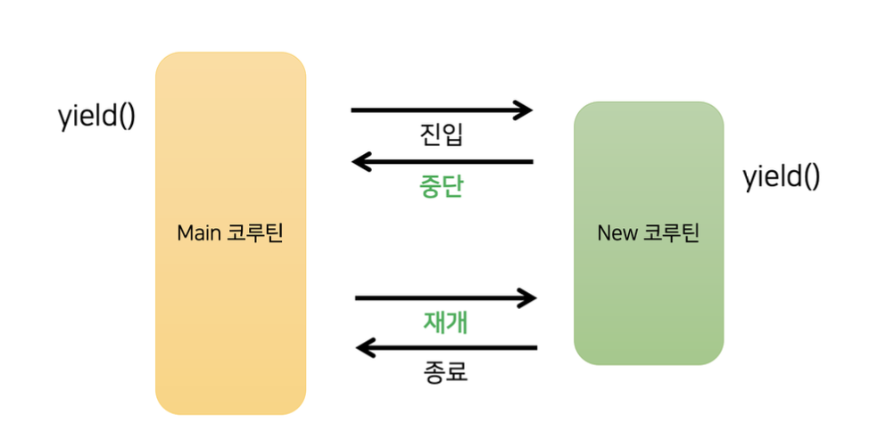
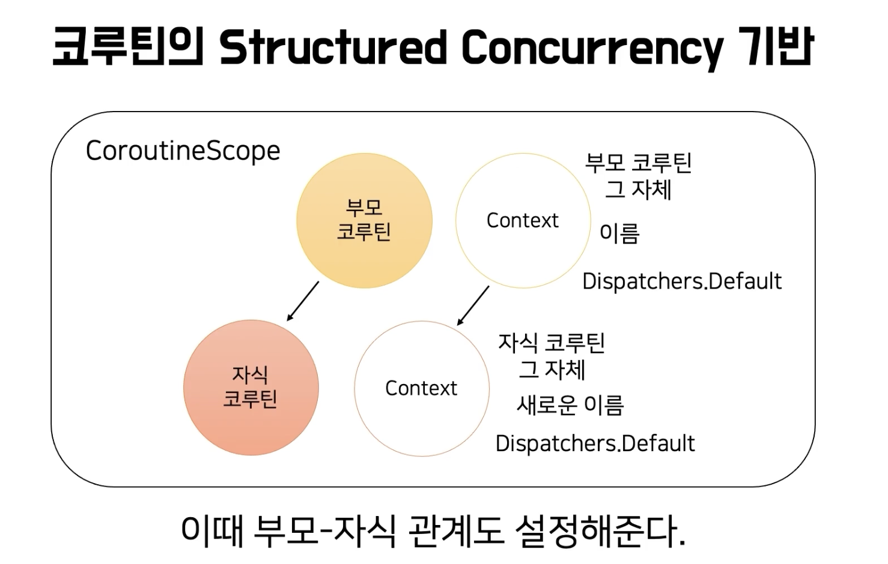

# [2 시간으로 끝내는 코루틴](https://www.inflearn.com/course/2%EC%8B%9C%EA%B0%84%EC%9C%BC%EB%A1%9C-%EB%81%9D%EB%82%B4%EB%8A%94-%EC%BD%94%EB%A3%A8%ED%8B%B4) 학습 정리

강의

# 코루틴 기초

## 1강 루틴과 코루틴

### 루틴과 코루틴의 차이

#### Code

```kotlin
fun main(): Unit = runBlocking {
    printWithThread("START")
    launch {
        newRoutine()
    }
    yield()
    printWithThread("END")
}

suspend fun newRoutine() {
    val num1 = 1
    val num2 = 2
    yield()
    printWithThread("${num1 + num2}")
}

fun printWithThread(str: Any) {
    println("[${Thread.currentThread().name}] $str")
}

// 결과
// [main @coroutine#1] START
// [main @coroutine#1] END
// [main @coroutine#2] 3
```

#### 메모리 관점



새로운 루틴이 호출된 후 완전히 종료되기 전, **해당 루틴에서 사용했던 정보들을 보관**하고 있어야 한다.

루틴과 코루틴의 가장 큰 차이점은 중단과 재개이다. 루틴은 한 번 시작되면 종료될 때 까지 멈추지 않지만, 코루틴은 상황에 따라 잠시 중단되었다가 다시 시작 시작되기도 한다. 때 문에 완전히 종료되기 전까지 `newRoutine` 함수 안에 있는 `num1`, `num2` 변수가 메모리에서 제거되지 않는다.

### 루틴과 코루틴의 차이점 정리


| 루틴                                    | 코루틴                                         |
| --------------------------------------- | ---------------------------------------------- |
| 시작되면 끝 날 때까지 멈추지 않는다.    | 중단되었다가 재개될 수 있다.                   |
| 한 번 끝나면 루틴 내의 정보가 사라진다. | 중단되더라도 루틴 내의 정보가 사라지지 않는다. |

## 2강 스레드와 코루틴

### 스레드와 쿠리틴의 차이 정리


| 스레드                                               | 코루틴                                                                   |
| ---------------------------------------------------- | ------------------------------------------------------------------------ |
| 프로세스보다 작은 개념이다.                          | 스레드보다 작은 개념이다.                                                |
| 한 스레드는 오직 한 프로세스에만 포함되어 있다.      | 한 코루틴의 코드는 여러 스레드에서 실행될 수 있다.                       |
| context switching 발생시 stack 영역이 교체된다.      | 한 스레드에서 실행하는 경우 context switching 발생시 메모리 교체가 없다. |
| OS가 스레드를 강제로 멈추고 다른 스레드를 실행 한다. | 코루틴 스스로가 다른 코루틴에게 양보한다.                                |

## 3강 코루틴 빌더와 Job

## 6강 Structured Concurrency

* Structured Concurrency는 부모 - 자식 관계의 코루틴이 한 몸 처럼 움직이는 것
* Structured Concurrency는 수많은 코루틴이 유실되거나 누수되지 않도록 보장한다.
* **자식 코루틴에서 예외가 발생할 경우, Structured Concurrency에 의해 부모 코루틴이 취소되고, 보무 코루틴의 다른 자식 코루틴들도 취소된다.**
* 다만 CancelationException은 정상적인 취소로 간주하기 때문에 부모 코루틴에게 전파되지 않고, 부모 코루틴의 다른 자식 코루틴을 취소하지 않는다.


## 7강 CoroutineScope과 CoroutineContext

## CoroutineScope과 CoroutineContext



* launch/async CoroutineScope의 확장 함수이다.
* runBlocking이 코루틴과 루틴의 세계를 이어주며 CoroutineScope을 제공해주었다.
* 직접 CoroutineScope을 단들면 runBlocking이 필요하지 않다.
* CoroutineScope 주요 역할은 코루틴과 관련된 여러가지 데이터를 갖고 있는 것이다.
* CoroutineScope: 코루틴이 탄생할 수 있는 영역
* CoroutineContext: 코루틴과 관련된 데이터를 보관
* 클래스 내부에서 독립적인 CoroutineScope을 관리, 해당 클래스에서 사용하던 코루틴을 한 번에 종료 시킬 수 있다.


## CoroutineDispatchers

* 코루틴을 스레드에 배정하는 역할
* CoroutineDispatchers
  * default: 기본적으로 사용하는 디스패처, CPU 자원을 많이 쓸때 권장, 별다른 설정이 없다면 이 디스패처라 사용된다.
  * IO: I/O 작업에 최적화된 디스패처, 네트워크, 파일 입출력 등
  * Main: 안드로이드에서 사용되는 디스패처, UI 작업을 할 때 사용
* ExecutorService를 디스패처로 사용할수 있다. asCoroutineDispatcher() 확장 함수를 활요하여 스레드풀을 기반으로 코루틴을 실행할 수 있다.

## 8강 suspending function

* launch의 시그니처를 살퍄보면 suspeding lambda가 있다. 
* suspend를 붙이면 다른 suspend 함수를 호출할 수 있다.
* suspend 함수는 코루틴이 중지되었다가 **재개될 수 있는 지점**
* suspend를 사용하면 특정 러아브러리에 의존하지 않게되는 장점이 있다.
  * 예를들어 Async의 Deferred는 코루틴에 의존하고 있다. 다른 라이브러리를 사용해도 그 라이브러리에의 의존적인 리턴타입을 명시하면 라이브러리 교체시에 코드를 수정해 하기 때문에 suspend를 붙여 중지될 수있다는 것을 알려주고 특정 라이브러리에 의존하지 않는 방식으로 코드를 작성할 수 있다.