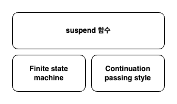

# Coroutine 기초

## 일반 함수 suspend 함수 실행

* suspend 함수는 coroutine 혹은 suspend 함수에 실행 가능

### Kotlin compiler 변환 결과

```kotlin
class SuspendExample {
    suspend fun greet() {
        delay(100)
        println("Hello, World!")
    }
}
```

```java

@Metadata(
        mv = {1, 8, 0},
        k = 1,
        d1 = {"\u0000\u0014\n\u0002\u0018\u0002\n\u0002\u0010\u0000\n\u0002\b\u0002\n\u0002\u0010\u0002\n\u0002\b\u0002\u0018\u00002\u00020\u0001B\u0005¢\u0006\u0002\u0010\u0002J\u0011\u0010\u0003\u001a\u00020\u0004H\u0086@ø\u0001\u0000¢\u0006\u0002\u0010\u0005\u0082\u0002\u0004\n\u0002\b\u0019¨\u0006\u0006"},
        d2 = {"Lcom/example/kotlincoroutine/SuspendExample;", "", "()V", "greet", "", "(Lkotlin/coroutines/Continuation;)Ljava/lang/Object;", "kotlin-coroutine_test"}
)
public final class SuspendExample {
    @Nullable
    public final Object greet(@NotNull Continuation var1) {
        Object $continuation;
        label20:
        {
            if (var1 instanceof <undefinedtype >){
            $continuation = ( < undefinedtype >)var1;
            if (((( < undefinedtype >) $continuation).label & Integer.MIN_VALUE) !=0){
                (( < undefinedtype >) $continuation).label -= Integer.MIN_VALUE;
                break label20;
            }
        }

            $continuation = new ContinuationImpl(var1) {
                // $FF: synthetic field
                Object result;
                int label;

                @Nullable
                public final Object invokeSuspend(@NotNull Object $result) {
                    this.result = $result;
                    this.label |= Integer.MIN_VALUE;
                    return SuspendExample.this.greet(this);
                }
            };
        }

        Object $result = (( < undefinedtype >) $continuation).result;
        Object var5 = IntrinsicsKt.getCOROUTINE_SUSPENDED();
        switch ((( < undefinedtype >) $continuation).label){
            case 0:
                ResultKt.throwOnFailure($result);
                (( < undefinedtype >) $continuation).label = 1;
                if (DelayKt.delay(100L, (Continuation) $continuation) == var5) {
                    return var5;
                }
                break;
            case 1:
                ResultKt.throwOnFailure($result);
                break;
            default:
                throw new IllegalStateException("call to 'resume' before 'invoke' with coroutine");
        }

        String var2 = "Hello, World!";
        System.out.println(var2);
        return Unit.INSTANCE;
    }
}

```

1. Continuation 인자를 추가
2. Continuation 구현체를 생성
3. switch문을 추가
4. Delay.Kt의 delay를 호출하여 Continuation을 전달하고 종료
5. System.out.println 수행
6. Unit 반환

### suspend 함수



Kotlin Compiler가 suspend 함수를 변환하는 과정을 파악하기 위해서 Finite state machine과 Continuation passing style에 대해서 알아야 한다.

## Finite state machine

### state machine


* 시스템이 가질 수 있는 상태를 표현한 추상적인 모델
* State: 시스템 특정한 상황
* Transition: 하나의 state에서 다른 state로 이동
* Event: Transition을 trigger하는 외부 사건

### Finite state machine


* Finite state machine은 유한한 개수의 state를 갖는 state machine
* 한 번에 오직 하나의 state만을 가질 수 있다.
* Event를 통해서 하나의 state에서 다른 state로 transition이 가능하다.

### FSM 구현


* 재기 함수를 호출해서 fsm 구현
* 각각 state에 따라서 다른 코드 실행
* 재기 함수가 수행될 때마다 state가 변화

```kotlin
private val log = kLogger()

class FsmExample {

    fun execute(label: Int = 0) {

        var nextLabel: Int? = null

        when (label) {
            0 -> {
                log.info("Initial")
                nextLabel = 1
            }

            1 -> {
                log.info("State 2")
                nextLabel = 2
            }

            2 -> {
                log.info("State 3")
                nextLabel = 3
            }

            3 -> {
                log.info("End")
            }
        }

        if (nextLabel != null) {
            this.execute(nextLabel)
        }
    }
}

fun main() {
    val fsmExample = FsmExample()
    fsmExample.execute()
}
```

```
[main] INFO - Initial
[main] INFO - State 2
[main] INFO - State 3
[main] INFO - End
```

## Continuation passing style

### Direct style

* 일반적인 동기 코드에서 사용하는 스타일

### Continuation passing style

* Continuation은 가장 마지막에서 딱 한 번실행

### Callback vs Continuation

```kotlin
// Callback vs Continuation 차이 설명 에제 코ㅓ드  
private val log = kLogger()

object CallbackExample {

    fun handleButtonClicked(
        callback: () -> Unit,
        continuation: (count: Int) -> Unit
    ) {
        var count = 0

        for (i in 0 until 5) {
            count++
            // callback은 어디에서나 여러번 호출 해도 무방
            callback()
        }

        // 마지막에 딱 헌번 호출
        // 
        continuation(count)
    }
}

fun main() {
    CallbackExample.handleButtonClicked(
        callback = {
            log.info("Button clicked")
        },
        continuation = { count ->
            log.info("Clicked count: $count")
        }
    )
}
```

* Callback
  * 추가로 무엇을 해애 하는지
  * 특정 이벤트가 발생했을떄 호출
  * 따라서 어디에서나 여러번 호출될 수 있다.
* Continuation
  * **다음에** 무엇을 해야 하는지
  * 모든 결과를 계산하고 다음으로 넘어가는 상황에서 호출
  * **따라서 마지막에 딱 한번만 호출된다.**
  * **로직의 제어를 넘긴다 라고 볼 수 있다**

### Continuation

```kotlin
@SinceKotlin("1.3")
public interface Continuation<in T> {
    /**
     * The context of the coroutine that corresponds to this continuation.
     */
    public val context: CoroutineContext

    /**
     * Resumes the execution of the corresponding coroutine passing a successful or failed [result] as the
     * return value of the last suspension point.
     */
    public fun resumeWith(result: Result<T>)
}
```

* Kotlin coroutine에서 Continuation 인터페이스를 제공
* resumeWith을 구현하여 외부에서 해당 continuation을 실행할 수 있는 endpoint 제공
* CoroutineConext를 포함

### Continuation 구현

```kotlin
fun main() {
    var visied = false
    val continuation = object : Continuation<Int> {
        override val context: CoroutineContext
            get() = EmptyCoroutineContext

        override fun resumeWith(result: Result<Int>) {
            if (visied) {
                log.info("Result: $result")
            } else {
                log.info("Visit Now")
                visied = true
            }
        }
    }

    continuation.resume(10)
    continuation.resume(10)
    continuation.resumeWithException(IllegalStateException())
}
```

* Continuation 인터페이스를 구현하는 익명 클래스러 생성하여 context, resumeWith를 구현
* context에는 EmptyCoroutineContext를 resumeWith에서는 상태에 따라서 다른 코가 실행
* 결과 뿐만 아니라 에러도 전달 가능

```
18:00:28.041 [main] INFO - Visit Now
18:00:28.056 [main] INFO - Result: Success(10)
18:00:28.056 [main] INFO - Result: Failure(java.lang.IllegalStateException)

Process finished with exit code 0
```

## CPS와 FSM 적용

### CPS와 FSM

* Continuation passing style
  * 값을 반환하는 대신 continuation을 실행
* Finite state machine
  * 함수에 인자로 label을 전달
  * label에 따라서 다른 연산을 수행
  * label을 변경하고 재귀 호출을 통해서 transition

## 동기, 비동기, Coroutine

# Coroutine Context 이해


```kotlin
fun main() {
    val getting = ThreadLocal<String>()

    getting.set("Hello")


    runBlocking {

        log.info("thread: ${Thread.currentThread().name}")
        log.info("getting: ${getting.get()}")

        launch(Dispatchers.IO) {

            log.info("thread: ${Thread.currentThread().name}")
            log.info("getting: ${getting.get()}")

        }
    }
}
```

```
18:20:17.251 [main] INFO - thread: main
18:20:17.253 [main] INFO - getting: Hello
18:20:17.257 [DefaultDispatcher-worker-1] INFO - thread: DefaultDispatcher-worker-1
18:20:17.257 [DefaultDispatcher-worker-1] INFO - getting: null
```


## CoroutineContext 전파

```kotlin
fun main(): Unit = runBlocking {
    // (1)
    log.info("start context in runBlocking: ${this.coroutineContext}")
    // (2)
    withContext(CoroutineName("withContext")) {
        // (3)
        log.info("context in withContext: ${this.coroutineContext}")

        // (4)
        launch {
            delay(200)
            println("launch in withContext")
        }
    }

    // (5)
    launch {
        delay(50)
        println("launch in runBlocking")
    }

    // (6)
    log.info("end context in runBlocking: ${this.coroutineContext}")
}
```

* (1): runBlocking의 CoroutineContext이 사용된다.
* (2): 새로운 CoroutineContext을 만들고 이름을 withContext 으로 지정한다.
* (3): 새로운 CoroutineContext에서 CoroutineContext 정보를 출력한다. runBlocking의 CoroutineContext와는 다른 CoroutineContext가 할당된다.
* (4): 새로운 CoroutineContext에서 launch를 실행하는데 딜레이를 200ms 주고 로그를 찍는다. **여기서 중요한 점은 해당 딜레이를 모두 지나야지 launch 스코프를 나오게된다.** 
* (5): runBlocking의 CoroutineContext에서 딜레이를 50ms를 주고 로그를 찍는다. runBlocking의 CoroutineContext 이기 떄문에 (6)번 로그가 먼저 찍히고 딜레이 50ms 이후 launch의 로그가 찍힌다.


**중요 포인트는 CoroutineContext안에서 새로운 CoroutineContext를 만들면 새로운 CoroutineContext에서 모든 작업이 동기식으로 동작한다는 것이다. 반면 동일 CoroutineContext안에서는 (6)의 로그가 찍히고 (5)의 딜레이 이후 로그가 찍힌다.** 

```
[main] - start context in runBlocking: [BlockingCoroutine{Active}@157632c9, BlockingEventLoop@6ee12bac]
[main] - context in withContext: [CoroutineName(withContext), kotlinx.coroutines.UndispatchedMarker@5906ebcb, UndispatchedCoroutine{Active}@258e2e41, BlockingEventLoop@6ee12bac]
[main] - launch in withContext
[main] - end context in runBlocking: [BlockingCoroutine{Active}@157632c9, BlockingEventLoop@6ee12bac]
[main] - launch in runBlocking
```