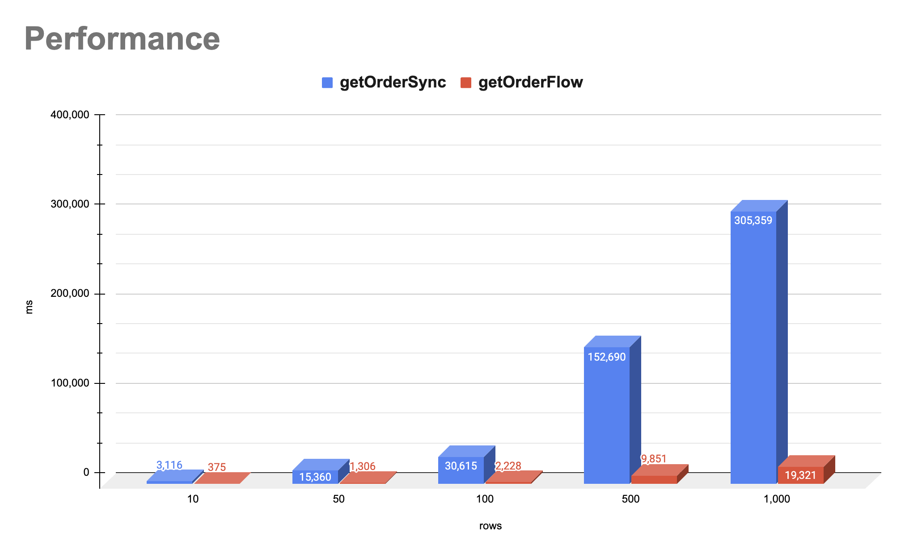

# 코루틴을 이용한 성능 개선: `Flow`를 활용한 다중 요청 처리

Kotlin의 코루틴을 이용한 비동기 프로그래밍은 성능을 크게 향상시킬 수 있는 강력한 도구입니다. 특히 `Flow`를 활용하여 여러 요청을 동시에 처리하는 방식은 효율적인 비동기 처리를 가능하게 합니다. 이 블로그에서는 `Flow`를 사용하여 다중 요청을 처리하는 방법과 이론적 배경, 그리고 이를 사용할 때 주의할 점에 대해 다루겠습니다.

## 시나리오


300ms가 발생하는 API 요청을 100번 반복하는 시나리오를 가정해봅시다. 동기적으로 처리하면 100번의 요청을 처리하는 데 30초가 걸립니다.

```kotlin
class OrderClient {
    fun getOrder(orderRequest: OrderRequest): ResponseResult<OrderResponse> {
        return runBlocking {
            delay(300)
            ResponseResult.Success(OrderResponse(orderRequest.productId))
        }
    }
}

fun getOrderSync(orderRequests: List<OrderRequest>): List<OrderResponse> {
    return orderRequests
        .map {
            orderClient
                .getOrder(it) // 300ms 지연
                .onFailure { log.error("Failure: $it") }
                .onSuccess { log.info("Success: $it") }
                .getOrThrow()
        }
}
```

위 코드에서 `OrderClient`의 `getOrder` 함수는 각 호출마다 300ms가 소요된다고 가정합니다. 일반적인 API 호출의 경우 300ms 응답속도는 빠른 편에 속합니다. 하지만 100번을 호출 한다고 가정하면 총 소요 시간은 100 * 300ms = 30,000ms, 즉 30초가 됩니다.

```kotlin

@Test
fun getOrderSync() {
    val stopWatch = StopWatch()
    val flatMapMergeStudy = FlatMapMergeStudy()
    val orderRequests = (1..100).map { OrderRequest("$it") }

    stopWatch.start()
    val response = flatMapMergeStudy.getOrderSync(orderRequests)
    stopWatch.stop()
    println(stopWatch.totalTimeMillis)

    // 30,528ms
    println(response)
}
```

## 코루틴 `Flow`를 이용한 성능 개선

Kotlin의 코루틴을 이용한 비동기 프로그래밍은 성능을 크게 향상시킬 수 있는 강력한 도구입니다. 특히 Flow를 활용하여 여러 요청을 동시에 처리하는 방식은 효율적인 비동기 처리를 가능하게 합니다. 이 블로그에서는 flatMapMerge를 사용하여 다중 요청을 처리하는 방법과 이론적 배경, 그리고 이를 사용할 때 주의할 점에 대해 다루겠습니다.

```kotlin
@OptIn(FlowPreview::class)
suspend fun getOrderFlow(orderRequests: List<OrderRequest>): List<OrderResponse> {
    return orderRequests
        .asFlow()
        .flatMapMerge { request ->
            flow {
                orderClient
                    .getOrder(request)
                    .onFailure { log.error("Failure: $it") }
                    .onSuccess {
                        log.info("Success: $it")
                        emit(it)
                    }
            }
        }
        .toList()
}
```

위 코드에서 getOrderFlow 함수는 orderRequests 리스트를 플로우로 변환하고, flatMapMerge를 사용하여 각 요청을 병렬로 처리합니다. 각 요청은 코루틴 내에서 300ms 동안 지연된 후 결과를 반환합니다. 이 방식으로 100개의 요청을 동시에 처리하면, 전체 처리 시간은 가장 오래 걸리는 요청 하나의 시간인 300ms로 줄어듭니다.

### 성능 테스트

```kotlin
@Test
fun getOrderFlow(): Unit = runBlocking {
        val stopWatch = StopWatch()
        val flatMapMergeStudy = FlatMapMergeStudy()
        val orderRequests = (1..100).map { OrderRequest("$it") }

        stopWatch.start()
        val response = flatMapMergeStudy.getOrderFlow(orderRequests)
        stopWatch.stop()
        // 2,228ms
        println(stopWatch.totalTimeMillis)
    }
```

이론상 100개의 요청을 동시에 처리하면 300ms 정도의 시간이 소요되어야 하지만, 실제로는 2,228ms가 소요됩니다. 이는 다음과 같은 요인들로 인한 것입니다.

1. **코루틴 생성과 컨텍스트 전환 오버헤드**:
    - 코루틴을 생성하고 실행할 때 발생하는 오버헤드는 무시할 수 없는 시간 지연을 초래할 수 있습니다.
    - 특히, `flatMapMerge`를 사용하여 다수의 코루틴을 병렬로 실행할 때, 각 코루틴의 생성과 컨텍스트 전환 비용이 누적되어 총 실행 시간이 증가할 수 있습니다.
2. **`flatMapMerge`의 병합 과정**:
    - `flatMapMerge`는 여러 플로우를 병합하면서 각 플로우의 결과를 수집합니다.
    - 이 과정에서 발생하는 추가적인 작업들, 예를 들어 플로우의 결과를 수집하고 병합하는 오버헤드가 존재할 수 있습니다.
    - 이 오버헤드는 특히 플로우의 개수가 많을 때 더 크게 작용합니다.
3. **`emit` 호출과 플로우 수집의 지연**:
    - 각 플로우에서 `emit`을 호출하고, 최종적으로 `toList`로 수집하는 과정에서 발생하는 지연도 무시할 수 없습니다.
    - `emit`은 비동기적으로 데이터를 내보내는 작업이므로, 여러 번 호출될 때 지연이 누적될 수 있습니다.



| Rows  | getOrderSync (ms) | getOrderFlow (ms) | Improvement (%) |
|-------|-------------------|-------------------|-----------------|
| 10    | 3,116             | 375               | 87.97           |
| 50    | 15,360            | 1,306             | 91.50           |
| 100   | 30,615            | 2,228             | 92.72           |
| 500   | 152,690           | 9,851             | 93.55           |
| 1,000 | 305,359           | 19,321            | 93.67           |

위 표는 동기 방식(`getOrderSync`)과 비동기 방식(`getOrderFlow`)의 성능을 비교한 결과입니다. `getOrderFlow`를 사용한 비동기 방식은 모든 요청을 동시에 처리함으로써 동기 방식에 비해 큰 성능 개선을 보여주고 있습니다. 특히, 요청 수가 많을수록 비동기 방식의 성능 향상 효과가 더욱 두드러집니다. 이는 동기 방식이 요청 수에 비례하여 선형적으로 시간이 증가하는 반면, 비동기 방식은 병렬 처리를 통해 시간 증가를 억제할 수 있기 때문입니다.

## 코드 심화 분석

### 스레드와 코루틴: 경량 스레드의 강점

Kotlin 문서에서는 코루틴을 경량 스레드라고 합니다. 이는 대부분의 스레드와 마찬가지로 코루틴이 프로세스가 실행할 명령어 집합의 실행을 정의하기 때문입니다. 또한 코루틴은 스레드와 비슷한 라이프 사이클을 갖고 있습니다.

코루틴은 스레드 안에서 실행됩니다. 하나의 스레드에는 여러 개의 코루틴이 있을 수 있지만, 주어진 시간에 하나의 스레드에서는 하나의 명령만 실행될 수 있습니다. 즉, 같은 스레드에 10개의 코루틴이 있다면 해당 시점에는 하나의 코루틴만 실행됩니다.

스레드와 코루틴의 가장 큰 차이점은 코루틴이 빠르고 적은 비용으로 생성될 수 있다는 점입니다. 수천 개의 코루틴도 쉽게 생성할 수 있으며, 수천 개의 스레드를 생성하는 것보다 빠르고 자원도 훨씬 적게 사용합니다.

### 코루틴 생성 테스트

다음 코드는 코루틴을 생성하는 데 필요한 스레드 수를 테스트하는 예제입니다. 이 테스트를 통해 코루틴이 얼마나 적은 리소스로 동작하는지 확인할 수 있습니다.

```kotlin
// 코드 출처 코틀린 동시성 프로그래밍 
suspend fun createCoroutines(amount: Int) {
    val jobs = ArrayList<Job>()
    for (i in 1..amount) {
        jobs += GlobalScope.launch {
            delay(1000)
        }
    }
    jobs.forEach { it.join() }
}

@Test
@DelicateCoroutinesApi
fun `코루틴 생성 테스트`() = runBlocking {
    println("${Thread.activeCount()} thread active at the start")

    val time = measureTimeMillis {
        createCoroutines(100)
    }

    println("${Thread.activeCount()} thread active at the end")
    println("Took $time ms")
}
```

다음은 테스트 결과입니다. 다양한 수의 코루틴을 생성했을 때 사용되는 스레드 수를 보여줍니다:

| 코루틴 수   | 시작 시 활성 스레드 수 | 종료 시 활성 스레드 수 |
|---------|---------------|---------------|
| 1       | 4             | 7             |
| 100     | 4             | 15            |
| 500     | 4             | 15            |
| 1,000   | 4             | 15            |
| 5,000   | 4             | 15            |
| 10,000  | 4             | 15            |
| 100,000 | 4             | 15            |

위 결과에서 알 수 있듯이, 코루틴을 많이 생성해도 사용되는 스레드 수는 크게 증가하지 않습니다. 시작 시에는 4개의 스레드가 활성화되어 있었고, 종료 시에도 최대 15개의 스레드만 활성화되었습니다. 이는 코루틴이 얼마나 적은 리소스를 사용하여 병렬 작업을 수행할 수 있는지를 잘 보여줍니다.

코루틴은 스레드와 비교했을 때 훨씬 가볍고, 생성 및 전환 비용이 낮습니다. 이러한 특성 덕분에 코루틴은 높은 동시성을 요구하는 애플리케이션에서 매우 유용합니다. 동기 방식에서 수천 개의 스레드를 생성하는 것은 비효율적이고 리소스 낭비가 심하지만, 코루틴을 사용하면 동일한 작업을 더 적은 리소스로 처리할 수 있습니다.


## TODO
* [ ] 사용되는 스레드 알아보기
* [ ] Flow concurrency size 별로 찾아 보기