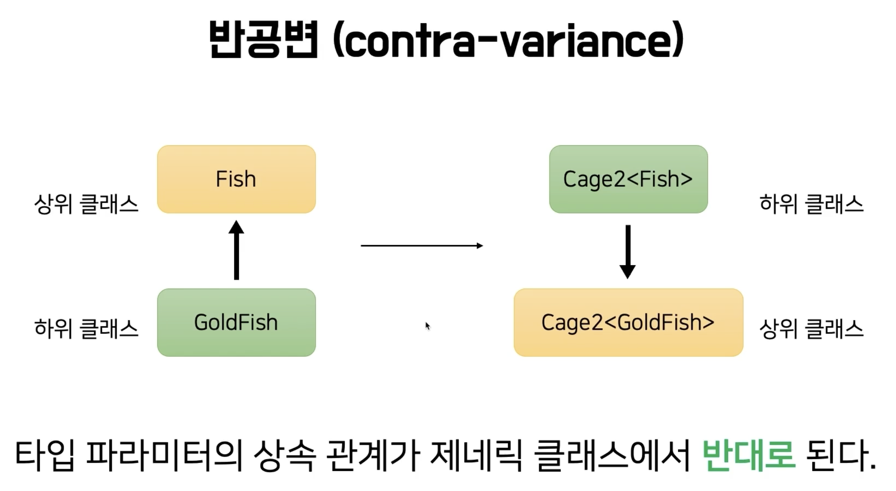
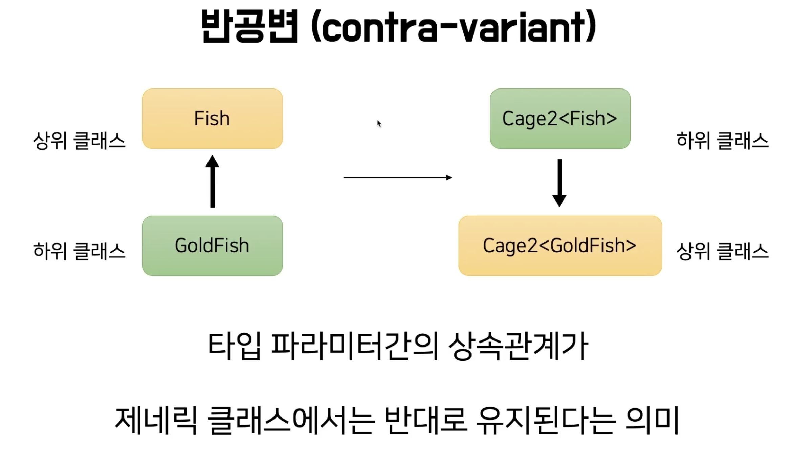

# [코틀린 고급편](https://www.inflearn.com/course/%EC%BD%94%ED%8B%80%EB%A6%B0-%EA%B3%A0%EA%B8%89%ED%8E%B8)

# 섹션 1 제네릭

## 1강 제네릭과 타입 파리미터


```kotlin
class Cage {

    private val animals: MutableList<Animal> = mutableListOf()

    fun getFirst(): Animal {
        return animals.first()
    }

    fun put(animal: Animal) {
        this.animals.add(animal)
    }

    fun moveForm(cage: Cage) {
        this.animals.addAll(cage.animals)
    }
}

abstract class Animal(val name: String)

abstract class Fish(name: String) : Animal(name)

class GoldFish(name: String) : Fish(name)

class Crap(name: String) : Fish(name)
```

```kotlin
fun main() {
    val cage = Cage()
    cage2.put(Crap("잉어"))
    // type miss match 오류
    val carp: Carp = cage2.getFirst()
}
```

* cage에 잉어만 있지만 getFirst() 메소드를 호출하면 Animal이 나온다.
* 이 문제를 해결하기 위해서 제네릭을 사용한다.

```kotlin
class Cage2<T> {

    private val animals: MutableList<T> = mutableListOf()

    fun getFirst(): T {
        return animals.first()
    }

    fun put(animal: T) {
        this.animals.add(animal)
    }

    fun moveForm(cage: Cage2<T>) {
        this.animals.addAll(cage.animals)
    }
}
```

```kotlin
fun main() {
    val cage2 = Cage2<Crap>()
    cage2.put(Crap("잉어"))
    val crap: Crap = cage2.getFirst()
}
```

* 제네릭 <T>를 사용하면 Cage2 클래스를 생성할 때 타입을 지정할 수 있다.

```kotlin
fun main() {
    val goldFishCage = Cage2<GoldFish>()
    goldFishCage.put(GoldFish("금붕어"))

    val fishCage = Cage2<Fish>()
    // type miss match 오류
    fishCage.moveForm(goldFishCage)
}
```

* Cage<T> 간의 함수 호출인데 왜 GlideFish를 Fish로 옮길 수 없을까?
* **이는 제네릭과 무공변을 알아야 한다.**

## 2강 배열과 리스트. 제니릭과 무공변

### 상속관계의 의미


* 상위 타입이 들어가는 자리에 하위 타입이 대신 위치할 수 있다


* Cage2<Fish>에 Cage2<GoldFish>를 넣을 수 없다.


* **Cage2<Fish>에 Cage2<GoldFish>는 아무관계가 없다**
* **Cage2는 무공변 (in-variant, 불공변)하다 라고 말한다.**

### 무공변

* 왜 Fish와 GoldFish 간의 상속관계까 제네릭 클래스에서 유지되지 않을까?
* 왜 제네릭 클래스는 타입 파라미터 간의 상속관계까 있더라도 무공변할까?

### Java 배열


* Java의 배열은 제네릭과 다르다.
* A 객체가 B 객체의 하위 타입이라면, A 배열이 B 배열의 하위 타입으로 간주된다.
* **Java의 배열은 공변 하다.**


```java
String[] strs = new String[]{"A", "B", "C"}
Object[] objs = strs // String[]은 Object[]의 하위 타입이니 objs에 strs를 넣을 수 있다.

objs[0] = 1; // 컴파일상 가능함 

```

* objs는 Object[] 타입이니 1을 넣을 수 있을 것처럼 컴파일상의 문제는 없어 보이지만 objs는 사실 String[] 이기 때문에 int를 넣을 수 없다. 
* 떄문에 런터임 때 에러가 발생한다.
* 타입 세이프하지 않는 코드로 위험하다.


### Java의 배열과 리스트

```java
import java.util.List;

List<String> strs = List.of("A", "B", "C")
List<Object> objs = strs // Type Missmatch!
```
* **List는 제네릭을 사용하기 때문에 공변인 Array와 다르게 무공변하다.**
* 위 코드는 컴파일 떄에 원천적으로 불가능하다.
* 그러기 떄문에 제네릭은 


## 3강 공변과 반공변


```kotlin

class Cage2<T> {
    
    fun moveForm(cage: Cage2<out T>) {
        this.animals.addAll(cage.animals)
    }
}
```
* **out을 붙이면 moveForm 함수를 호출할 때 Cage2는 공변하게 된다.**
* 변성을 준다는 것은 무공변에서 무공변으로 된다.
* out을 통해서 변셩(variance)를 주었기 떄문에 out을 variance anootation 이라고도 부른다.


```kotlin

fun getFirst(): T {
    return animals.first()
}

fun put(animal: T) {
    this.animals.add(animal)
}

fun moveForm(otherCage: Cage2<out T>) {
    otherCage.getFirst() // 사용 가능
    otherCage.put(this.getFirst()) // 오류 발생
    this.animals.addAll(otherCage.animals)
}
```
* otherCage는 데이터를 꺼내는 getFirst() 함수만 사용할 수 있다.
* **otherCage는 생상자 (데이터를 꺼내는)역할만 할 수 있다.**


* 허용해주는 경우 타입 안전성이 깨져 런타임 오류가 발생한다.
* this는 잉어를 말하지만 otherCage는 금붕어를 말하는 것이기 때문에 잉어를 옮기는 것은 불가능하다


```kotlin
fun moveForm(otherCage: Cage2<in T>) {
    otherCage.animals.addAll(this.animals)
}
```
* in이 붙은 otherCage는 데이터를 받을 수만 있다. otherCage는 소비자이다.


### 함수에 대해 공변, 반공변 정리

* out: (함수 파라미터 입장에서) 생상자, 공변
* in: (함수 파라미터 입장에서) 소비자, 반공변





* 코틀린의 List는 불변 컬렉션이라 데이터를 꺼낼 수만 있다.
* 그러나 contains(), containsAll()은 타입파라미터 E를 받아야 한다.
* 이런 경우 @UnsafeVariance를 사용한다.
* **원래는 out 선언지점변성을 활용해 E를 함수 파라미터에 쓸 수 없지만, @UnsafeVariance를 이용해 함수 파라미터에 사용할 수 있다.**

## 5강 제네릭 제약과 제네릭 함수


* 우리는 Cage 클래스에 Animal만 사용하고 싶다.
* 타입 파라미터에는 Int나 String도 들어올 수 있다.
* 타입 파라미터 T에 Animal과 Animal의 하위 타입만 들어오게 하고 싶은 경우 타입 파라미터에 제약 조건을 줄 수 있다. 이를 제네릭 제약 이라고 한다.


```kotlin
class Cage5<T: Animal> {}
```

위 처럼 구현할 수 있다.


```kotlin
class Cage5<T>(
    private val animals: MutableList<T> = mutableListOf()
) where  T : Animal, T : Comparable<T> {

    fun getFirst(): T {
        return animals.first()
    }

    fun put(animal: T) {
        this.animals.add(animal)
    }
}
```


* <T : Any>를 통해서 non-null 타입 한정에 사용 가능


## 6강. 타입 소거와 Star Projection


* 제네릭은 JDK 초기 버전 부터 있던 개념이 아니다. 그러기 떄문에 이전 버전과 호환성을 지켜야 한다.
* **List<String>도 런타임 때는 타입 정보 String을 제거 하는 방향으로 호환성을 지켰다.**
* 이로 인해 Java에서는 raw type을 만들 수 있다. List list = List.of(1, 2, 3); (권장되는 방식은 아님)
* **코틀린은 언어 초기부터 제네릭이 고려되었기 떄문에 raw type을 만들 수 없다.**
* 하지만 코틀린 JVM 위에서 동작하기 때문에 **런타임 떄는 타입 정보가 사라진다. 이를 타입 소거라 부른다.**


* 런타임 환경에서는 List인지는 확인이 가능해도 String인지 확인할 수 없다.


* star projection, 해당 타입 파라미터에 어떤 타입이 들어 있을지 모른다는 의미
* 타입 정보만 모를뿐, List의 기능을 사용할 수는 있다.


* data가 List 타입 이니 데이터를 가져올 수 는 있지만 정확히 어떤 타입인지는 모르기 떄문에 Any로 받아야 한다.


* MutableList 안에 어떤 타입이 들어 있을지 모르니 데이터를 넣을 수는 없다.

```kotlin
fun main() {
    val num = 3
    num.toSuperString()
    // 정상 동작
    println("${num::class.java}: $num")

    val str = "ABC"
    str.toSuperString()
    // 정상 동작
    println("${str::class.java}: $str")
}

private fun <T> T.toSuperString() {
    // 오류 발생 Cannot use 'T' as reified type parameter. Use a class inst
    println("${T::class.java}: $this")
}
```

* 클래스 이름: Value를 출력하는 toSuperString 메소드가 있다.
* **하지만 위 코드는 컴파일을 할 수 없다. 제네릭 함수에서 타입 파라미터 T에 대해서 클래스 정보를 가져오려고 하는 순간 이 타입 파라미터 정보는 런타임 때 소거 되기 떄문에 정보를 가져올 수 없어서 에러가 발생하게 됩니다.**
* 반면 클래스 제네릭 타입이 아닌 경우는 타입을 가져올 수 있기 때문에 정상 동작한다.
* 하지만 우리는 T의 정보를 가져오고 싶은 경우가 있다. 이럴 떄 inline를 + reified 사용한다.

```kotlin
inline fun <reified T> T.toSuperString() {
    println("${T::class.java}: $this")
}
```

* inline + reified를 시용하면 런타임 시점에도 타입 파라미터 T의 정보가 소실하지 않게 된다.
* **inline 함수는 코드의 본문을 호출 지점으로 이동시켜 컴파일 되는 함수를 의미한다.**
* **T 자체를 본문에 옮겨 쓰게 되기 때문에 이 자체가 제네릭의 타입 파라미터로 간주되지 않는다.**
* reified 키워드도 함계가 있다. reified 키워드가 붙은 T를 이용해 T의 인스턴스를 만들거나 T의 companion object를 가져올 수 없다. 

## 7강. 제네릭 용어 정리 및 간단한 팁


### 변셩


* 변성이란 어떤 클래스에 계층관계가 있다고 하고 이런 계층 관계가 있는 클래스가 제네릭 클래스의 타입 파라미터로 들어왔을 때 제니릭 클래스의 타입 파라미터에 따라 제네릭 클래스의 상속관계가 어떻게 되는지를 나타내는 용어


### 무공변 (in-variant)


* 타입 파라미터끼리 상속관계가 있더라도 제네릭 클래스로 넘어오면 상속관계가 없다는 의미
* 제네릭 클래스가 무공변한 이유는 자바의 배열은 기본적으로 본경하기 때문에 타입이 안전하지 않는 문제가 많이 생길 수 있다. 그래서 이 문제를 해결 하기 위해서 제네릭 클래스는 아예 원천적으로 차단하기 위해서 무공변하게 설계 되었다.

### 공변 (co-variant)


* co에서도 알 수 있듯이 협력적인 의미가 있다.
* 타입 파라미터의 상속관계가 제네릭 클래스에도 동일하게 유지된다는 의미이다.
* 예를 들어 물고기는 금붕어의 상위 타입이니까 물고기 케이지는 그붕어 케이지의 상위 타입으로 간주된다.
* 기본적으로 제네릭은 무공변하지만 코틀린에서는 out 변셩 키워드를 사용하면 제네릭 클래스의 특정 지점 혹은 전체 지점에서 공변하게 만들 수 있다.


### 반공변 (contra-variant)



* 반공변은 공변과 반대로 생각하면 된다.
* 타입 파라미터의 상속 관계가 제네릭 클래스에서 반대로 유지된다는 의미이다.
* 코틀린에서는 in 변셩 키워드를 사용해서 제네릭 클래스의 특정 지점 혹은 전체 지점에서 반공변하게 만들 수 있다.

### 선언 지점 변성


* 선언 지점 변성은 클래스 자체를 선언할 떄 이 클래스 전체를 공변하게 하거나 반공변하게 하는 것을 의미한다.
* 클래스 자차게 공변하거나 반공변하려면 그에 따라 데이터를 생상만 하거나 소비만 해야 한다.

### 사용 지점 변성


* 사용지점 변셩이란 특정 함수 또는 특정 변수에 대해 공변, 반공변을 만드는 방법이다.
* out, in 키워드를 사용해서 특정 지점에서만 공변하거나 반공변하게 만들 수 있다.


### 제네릭 제약


* 제네릭 제약은 타입 파라미터에 대한 제약을 주는 것을 의미한다.


### 타입 소거


# 세션 2 지연과 위임

## lateinit과 lazy

