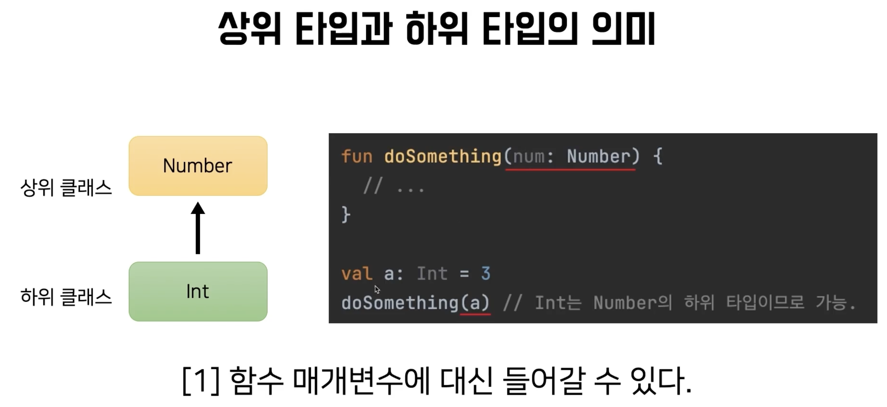

# [코틀린 고급편](https://www.inflearn.com/course/%EC%BD%94%ED%8B%80%EB%A6%B0-%EA%B3%A0%EA%B8%89%ED%8E%B8)

# 섹션 1 제네릭

## 1강 제네릭과 타입 파리미터


```kotlin
class Cage {

    private val animals: MutableList<Animal> = mutableListOf()

    fun getFirst(): Animal {
        return animals.first()
    }

    fun put(animal: Animal) {
        this.animals.add(animal)
    }

    fun moveForm(cage: Cage) {
        this.animals.addAll(cage.animals)
    }
}

abstract class Animal(val name: String)

abstract class Fish(name: String) : Animal(name)

class GoldFish(name: String) : Fish(name)

class Crap(name: String) : Fish(name)
```

```kotlin
fun main() {
    val cage = Cage()
    cage2.put(Crap("잉어"))
    // type miss match 오류
    val carp: Carp = cage2.getFirst()
}
```

* cage에 잉어만 있지만 getFirst() 메소드를 호출하면 Animal이 나온다.
* 이 문제를 해결하기 위해서 제네릭을 사용한다.

```kotlin
class Cage2<T> {

    private val animals: MutableList<T> = mutableListOf()

    fun getFirst(): T {
        return animals.first()
    }

    fun put(animal: T) {
        this.animals.add(animal)
    }

    fun moveForm(cage: Cage2<T>) {
        this.animals.addAll(cage.animals)
    }
}
```

```kotlin
fun main() {
    val cage2 = Cage2<Crap>()
    cage2.put(Crap("잉어"))
    val crap: Crap = cage2.getFirst()
}
```

* 제네릭 <T>를 사용하면 Cage2 클래스를 생성할 때 타입을 지정할 수 있다.

```kotlin
fun main() {
    val goldFishCage = Cage2<GoldFish>()
    goldFishCage.put(GoldFish("금붕어"))

    val fishCage = Cage2<Fish>()
    // type miss match 오류
    fishCage.moveForm(goldFishCage)
}
```

* Cage<T> 간의 함수 호출인데 왜 GlideFish를 Fish로 옮길 수 없을까?
* **이는 제네릭과 무공변을 알아야 한다.**

## 2강 배열과 리스트. 제니릭과 무공변

### 상속관계의 의미




* 상위 타입이 들어가는 자리에 하위 타입이 대신 위치할 수 있다


* Cage2<Fish>에 Cage2<GoldFish>를 넣을 수 없다.


* **Cage2<Fish>에 Cage2<GoldFish>는 아무관계가 없다**
* **Cage2는 무공변 (in-variant, 불공변)하다 라고 말한다.**

### 무공변

* 왜 Fish와 GoldFish 간의 상속관계까 제네릭 클래스에서 유지되지 않을까?
* 왜 제네릭 클래스는 타입 파라미터 간의 상속관계까 있더라도 무공변할까?

### Java 배열


* Java의 배열은 제네릭과 다르다.
* A 객체가 B 객체의 하위 타입이라면, A 배열이 B 배열의 하위 타입으로 간주된다.
* **Java의 배열은 공변 하다.**


```java
String[] strs = new String[]{"A", "B", "C"}
Object[] objs = strs // String[]은 Object[]의 하위 타입이니 objs에 strs를 넣을 수 있다.

objs[0]=1; // 컴파일상 가능함 

```

* objs는 Object[] 타입이니 1을 넣을 수 있을 것처럼 컴파일상의 문제는 없어 보이지만 objs는 사실 String[] 이기 때문에 int를 넣을 수 없다.
* 떄문에 런터임 때 에러가 발생한다.
* 타입 세이프하지 않는 코드로 위험하다.

### Java의 배열과 리스트

```java
import java.util.List;

List<String> strs = List.of("A", "B", "C")
List<Object> objs = strs // Type Missmatch!
```

* **List는 제네릭을 사용하기 때문에 공변인 Array와 다르게 무공변하다.**
* 위 코드는 컴파일 떄에 원천적으로 불가능하다.
* 그러기 떄문에 제네릭은

## 3강 공변과 반공변


```kotlin

class Cage2<T> {

    fun moveForm(cage: Cage2<out T>) {
        this.animals.addAll(cage.animals)
    }
}
```

* **out을 붙이면 moveForm 함수를 호출할 때 Cage2는 공변하게 된다.**
* 변성을 준다는 것은 무공변에서 무공변으로 된다.
* out을 통해서 변셩(variance)를 주었기 떄문에 out을 variance anootation 이라고도 부른다.


```kotlin

fun getFirst(): T {
    return animals.first()
}

fun put(animal: T) {
    this.animals.add(animal)
}

fun moveForm(otherCage: Cage2<out T>) {
    otherCage.getFirst() // 사용 가능
    otherCage.put(this.getFirst()) // 오류 발생
    this.animals.addAll(otherCage.animals)
}
```

* otherCage는 데이터를 꺼내는 getFirst() 함수만 사용할 수 있다.
* **otherCage는 생상자 (데이터를 꺼내는)역할만 할 수 있다.**


* 허용해주는 경우 타입 안전성이 깨져 런타임 오류가 발생한다.
* this는 잉어를 말하지만 otherCage는 금붕어를 말하는 것이기 때문에 잉어를 옮기는 것은 불가능하다


```kotlin
fun moveForm(otherCage: Cage2<in T>) {
    otherCage.animals.addAll(this.animals)
}
```

* in이 붙은 otherCage는 데이터를 받을 수만 있다. otherCage는 소비자이다.

### 함수에 대해 공변, 반공변 정리

* out: (함수 파라미터 입장에서) 생상자, 공변
* in: (함수 파라미터 입장에서) 소비자, 반공변


* 코틀린의 List는 불변 컬렉션이라 데이터를 꺼낼 수만 있다.
* 그러나 contains(), containsAll()은 타입파라미터 E를 받아야 한다.
* 이런 경우 @UnsafeVariance를 사용한다.
* **원래는 out 선언지점변성을 활용해 E를 함수 파라미터에 쓸 수 없지만, @UnsafeVariance를 이용해 함수 파라미터에 사용할 수 있다.**

## 5강 제네릭 제약과 제네릭 함수


* 우리는 Cage 클래스에 Animal만 사용하고 싶다.
* 타입 파라미터에는 Int나 String도 들어올 수 있다.
* 타입 파라미터 T에 Animal과 Animal의 하위 타입만 들어오게 하고 싶은 경우 타입 파라미터에 제약 조건을 줄 수 있다. 이를 제네릭 제약 이라고 한다.

```kotlin
class Cage5<T : Animal> {}
```

위 처럼 구현할 수 있다.


```kotlin
class Cage5<T>(
    private val animals: MutableList<T> = mutableListOf()
) where  T : Animal, T : Comparable<T> {

    fun getFirst(): T {
        return animals.first()
    }

    fun put(animal: T) {
        this.animals.add(animal)
    }
}
```


* <T : Any>를 통해서 non-null 타입 한정에 사용 가능

## 6강. 타입 소거와 Star Projection


* 제네릭은 JDK 초기 버전 부터 있던 개념이 아니다. 그러기 떄문에 이전 버전과 호환성을 지켜야 한다.
* **List<String>도 런타임 때는 타입 정보 String을 제거 하는 방향으로 호환성을 지켰다.**
* 이로 인해 Java에서는 raw type을 만들 수 있다. List list = List.of(1, 2, 3); (권장되는 방식은 아님)
* **코틀린은 언어 초기부터 제네릭이 고려되었기 떄문에 raw type을 만들 수 없다.**
* 하지만 코틀린 JVM 위에서 동작하기 때문에 **런타임 떄는 타입 정보가 사라진다. 이를 타입 소거라 부른다.**


* 런타임 환경에서는 List인지는 확인이 가능해도 String인지 확인할 수 없다.


* star projection, 해당 타입 파라미터에 어떤 타입이 들어 있을지 모른다는 의미
* 타입 정보만 모를뿐, List의 기능을 사용할 수는 있다.


* data가 List 타입 이니 데이터를 가져올 수 는 있지만 정확히 어떤 타입인지는 모르기 떄문에 Any로 받아야 한다.


* MutableList 안에 어떤 타입이 들어 있을지 모르니 데이터를 넣을 수는 없다.

```kotlin
fun main() {
    val num = 3
    num.toSuperString()
    // 정상 동작
    println("${num::class.java}: $num")

    val str = "ABC"
    str.toSuperString()
    // 정상 동작
    println("${str::class.java}: $str")
}

private fun <T> T.toSuperString() {
    // 오류 발생 Cannot use 'T' as reified type parameter. Use a class inst
    println("${T::class.java}: $this")
}
```

* 클래스 이름: Value를 출력하는 toSuperString 메소드가 있다.
* **하지만 위 코드는 컴파일을 할 수 없다. 제네릭 함수에서 타입 파라미터 T에 대해서 클래스 정보를 가져오려고 하는 순간 이 타입 파라미터 정보는 런타임 때 소거 되기 떄문에 정보를 가져올 수 없어서 에러가
  발생하게 됩니다.**
* 반면 클래스 제네릭 타입이 아닌 경우는 타입을 가져올 수 있기 때문에 정상 동작한다.
* 하지만 우리는 T의 정보를 가져오고 싶은 경우가 있다. 이럴 떄 inline를 + reified 사용한다.

```kotlin
inline fun <reified T> T.toSuperString() {
    println("${T::class.java}: $this")
}
```

* inline + reified를 시용하면 런타임 시점에도 타입 파라미터 T의 정보가 소실하지 않게 된다.
* **inline 함수는 코드의 본문을 호출 지점으로 이동시켜 컴파일 되는 함수를 의미한다.**
* **T 자체를 본문에 옮겨 쓰게 되기 때문에 이 자체가 제네릭의 타입 파라미터로 간주되지 않는다.**
* reified 키워드도 함계가 있다. reified 키워드가 붙은 T를 이용해 T의 인스턴스를 만들거나 T의 companion object를 가져올 수 없다.

## 7강. 제네릭 용어 정리 및 간단한 팁

### 변셩


* 변성이란 어떤 클래스에 계층관계가 있다고 하고 이런 계층 관계가 있는 클래스가 제네릭 클래스의 타입 파라미터로 들어왔을 때 제니릭 클래스의 타입 파라미터에 따라 제네릭 클래스의 상속관계가 어떻게 되는지를 나타내는 용어

### 무공변 (in-variant)


* 타입 파라미터끼리 상속관계가 있더라도 제네릭 클래스로 넘어오면 상속관계가 없다는 의미
* 제네릭 클래스가 무공변한 이유는 자바의 배열은 기본적으로 본경하기 때문에 타입이 안전하지 않는 문제가 많이 생길 수 있다. 그래서 이 문제를 해결 하기 위해서 제네릭 클래스는 아예 원천적으로 차단하기 위해서 무공변하게 설계 되었다.

### 공변 (co-variant)


* co에서도 알 수 있듯이 협력적인 의미가 있다.
* 타입 파라미터의 상속관계가 제네릭 클래스에도 동일하게 유지된다는 의미이다.
* 예를 들어 물고기는 금붕어의 상위 타입이니까 물고기 케이지는 그붕어 케이지의 상위 타입으로 간주된다.
* 기본적으로 제네릭은 무공변하지만 코틀린에서는 out 변셩 키워드를 사용하면 제네릭 클래스의 특정 지점 혹은 전체 지점에서 공변하게 만들 수 있다.

### 반공변 (contra-variant)


* 반공변은 공변과 반대로 생각하면 된다.
* 타입 파라미터의 상속 관계가 제네릭 클래스에서 반대로 유지된다는 의미이다.
* 코틀린에서는 in 변셩 키워드를 사용해서 제네릭 클래스의 특정 지점 혹은 전체 지점에서 반공변하게 만들 수 있다.

### 선언 지점 변성


* 선언 지점 변성은 클래스 자체를 선언할 떄 이 클래스 전체를 공변하게 하거나 반공변하게 하는 것을 의미한다.
* 클래스 자차게 공변하거나 반공변하려면 그에 따라 데이터를 생상만 하거나 소비만 해야 한다.

### 사용 지점 변성


* 사용지점 변셩이란 특정 함수 또는 특정 변수에 대해 공변, 반공변을 만드는 방법이다.
* out, in 키워드를 사용해서 특정 지점에서만 공변하거나 반공변하게 만들 수 있다.

### 제네릭 제약


* 제네릭 제약은 타입 파라미터에 대한 제약을 주는 것을 의미한다.

### 타입 소거


# 세션 2 지연과 위임

## 8강. lateinit과 lazy()

### lateinit 특징

* lateinit 키워드는 변수의 인스턴스화 시점과 변수 초기화 시점을 분리하고자 할 때 사용됩니다.
* lateinit 변수는 컴파일 단계에서 nullable 변수로 바꾸고, 변수에 접근하려 할 때 null이면 예외가 발생한다.
* lateinit은 주로 초기화 시점이 명확하지 않지만, 사용하기 전에 반드시 초기화될 변수에 사용됩니다. 이는 클래스의 프로퍼티가 생성자에서 초기화되지 않고, 나중에 초기화될 수 있음을 나타냅니다. 그러나 이 변수는 기본 타입(primitive types)에는 사용할 수 없고, non-null 타입의 객체 참조에만 사용할 수 있습니다.
* lateinit은 primitive 타입에 사용할 수 없다. 코틀린으 Int / Long은 자바의 int, long으로 변환된다. 그런데 lateinit은 nullable 변수로 변혼환되어야 한다. 그러기 때문에 primitive 타입에 사용할 수 없다.

#### lateinit non-null 경우

`lateinit` 키워드가 non-null 타입에만 사용될 수 있는 이유는 `lateinit` 변수가 나중에 초기화될 것이라는 약속을 통해 null safety를 보장하기 위함입니다. 코틀린은 null safety를 중요한 언어 기능 중 하나로 취급하며, 개발자가 null 관련 오류를 컴파일 시점에 잡을 수 있도록 설계되었습니다.

`lateinit`을 사용하는 주된 목적 중 하나는 non-null 타입의 프로퍼티를 선언하면서 동시에 즉시 초기화하지 않아도 되게 하는 것입니다. 이는 특히 객체의 초기화 과정이 복잡하거나, 초기화에 필요한 정보가 인스턴스 생성 시점에는 불완전하거나 불확실할 때 유용합니다. 예를 들어, Android 개발에서 액티비티의 뷰가 생성되는 시점이나 의존성 주입이 완료되는 시점은 인스턴스 생성 시점과 다를 수 있습니다.

만약 `lateinit` 변수가 null을 허용하는 타입이라면, 이 변수가 초기화되었는지 여부를 체크하는 추가적인 null 체크 로직이 필요하게 됩니다. 이는 코틀린의 null 안전성 원칙과 상충되며, `lateinit`의 주된 목적인 "나중에 반드시 초기화될 것"이라는 약속을 약화시키게 됩니다. 따라서, `lateinit`은 non-null 타입에만 사용되어, 변수가 사용되기 전에 반드시 초기화될 것임을 보장하고, 이를 통해 코드 내에서 안전하게 non-null 타입을 사용할 수 있도록 합니다. 이러한 설계는 코틀린이 추구하는 타입 안전성과 일관성을 유지하는 데 기여합니다.

```kotlin
class Person {

    lateinit var name: String

    val isKim: Boolean
        get() = name.startsWith("김")

    val maskingName: String
        get() = name.substring(0, 1) + "*".repeat(name.length - 1)

}
```
* lateinit 사용 방법


```java
public final class Person {
   public String name;

   @NotNull
   public final String getName() {
      String var10000 = this.name;
      if (var10000 == null) {
         Intrinsics.throwUninitializedPropertyAccessException("name");
      }

      return var10000;
   }
```

* 해당 코드를 디컴파일 해보면 lateinit 변수가 사용되는 부분에서 null 체크를 하고 있다.
* nullable 변수인 name에 초기화 여부를 검증하여 호출 시점에는 초기화가 완료되야지만 정상적인 호출이 가능하다.
* 이러한 구조이기 때문에 lateinit 변수는 non-null 타입에만 사용할 수 있다.

### lazy

* 객체 인스턴스화 시점과 변수의 초기화 시점을 분리하고 싶을때 사용한다.
* **변수를 초기화 할 떄 지정된 로직을 1회만 실행 시키고 싶다.**
* 값을 가져오는 비용이 크고, 해당 변수가 사용되지 않ㄹ을 수도 있다면 초기화 로직을 1회만 실행 시키고 싶을 수 있다.

```kotlin
class Person {
    
    val name: String
      get() {
        Thread.sleep(2_000)
        return "홍길동"
    }
}
```
* name을 사용하지 않으면 `Thread.sleep(2_000)`이 실행되지 않지만, nmae을 쓸때마다 sleep이 실행된다.

```kotlin
class Person {
    
    val name: String
    init {
        Thread.sleep(2_000)
        name = "홍길동"
    }
}
```

* `Thread.sleep(2_000)`은 1회만 호출되지만, name을 지정하지 않는 경우에도 sleep이 호출된다.


```kotlin
class Person {
    private val _name?: String? = null
            
    val name: String
      get() {
          if (_name == null) {
            Thread.sleep(2_000)
              _name = "홍길동"
          }
          return _name!!
      }
}
```
* name이 필요한 시점에 실행되며, 한 번 실행하면 그 이후에는 실행되지 않는다.
* 꼭 필요한 경우에만 초기화 로직을 실행하고 싶을 때 사용한다.

```kotlin
class Person {
    private val name by lazy { 
        Thread.sleep(2_000)
        "홍길동"
    }
}
```

* lazy는 코틀린에서 제공하는 함수이고, 함수를 파라미터로 받는다.
* 이 함수는 name의 getter가 최초 호춣 될때 실행되고, 기본적으로 Thread-Safe 하다.

### lateinit, lazy 정리

* lateinit 초기화를 지연시킨 변수, 초기화 로직이 여러 곳에 위치할 수 이싿. 초기화 없이 호출하면 예외가 발생한다.
* lazy 초기화를 get 호출 전으로 지연시킨 변수, 초기화 로직은 변수 선언과 동시에 한 곳에만 위치할 수 있다. 

## 9강 by lazy의 원리와 위임 프로퍼티

```kotlin
class Person {
    private val _name?: String? = null
            
    val name: String
      get() {
          if (_name == null) {
            Thread.sleep(2_000)
              _name = "홍길동"
          }
          return _name!!
      }
}
```
객체 인스턴스와 시점과 변수의 초기화 시점을 분리하고 동시에 최초로 변수를 한번만 초기화 싶은 경우 위와 같은 코드로 작성할 수 있다. 해당 코드를 반복 템플릿화 하면 다음같이 작성할 수 있다.

```kotlin
class LazyInitProperty<T>(val init: () -> T) {
    private var _value: T? = null
    val value: T
        get() {
            if (_value == null) {
                this._value = init()
            }
            return _value!!
        }
}

class Person {
  private val delegateProperty = LazyInitProperty {
    Thread.sleep(2_000)
    "홍길동"
  }

  val name: String
    get() = delegateProperty.value
}
```
* Person의 getter가 호출되면, 곧바로 LazyInitProperty의 getter가 호출된다.
* 이런 패턴을 위임패턴 이라고 부른다.


* getValue, SetValue가 있어야 by를 사용할 수 있다.


```kotlin

class LazyInitProperty<T>(val init: () -> T) {
  private var _value: T? = null
  val value: T
    get() {
      if (_value == null) {
        this._value = init()
      }
      return _value!!
    }

  operator fun getValue(thisRef: Any, property: KProperty<*>): T {
    return value
  }
}
class Person {
    val name: String by LazyInitProperty {
        Thread.sleep(2_000)
        "홍길동"
    }
}
```

* getValue 코드를 작성하면 Person에서 by LazyInitProperty 바로 사용할 수 있다.


## 10강. 코틀린의 표준 위임 객체

### notNull

```kotlin
class Person {
    val age: Init by notNull()
}
```

* primitive type에는 lateinit을 사용할 수 없지만 notNull()을 사용할 수 있다. 

### observable

```kotlin
public inline fun <T> obserable(
    initialValue: T,
    crossinline onChange: (property: KProperty<*>, oldValue: T, newValue: T) -> Unit
)
```

* observable은 onChange함수는 setter가 호출될 때마다 호출 된다.

```kotlin
class Person4 {
    var age: Int by Delegates.observable(20) { _, oldValue, newValue ->

        if (oldValue != newValue) {
            println("oldValue: $oldValue, newValue: $newValue")
        }
    }
}
```

### vetoable

setter가 호출될 때 onChange 함수가 true를 반환하면 변경 적용, false를 반환하면 인전 값이 그대로 남는다.


### this::num

```kotlin
class Person6 {
    
    @Deprecated("이름을 사용하지 않는다", ReplaceWith("age"))
    var num: Int = 0
    
    val age: Int by this::num
}
```
* 프로퍼티 앞에 ::를 붙이면, 위임 객체로 사용할 수 있다.
* 코드 사용자들이 age로 코드를 바꾸면 그때 num을 제거하면 된다.

### map

```kotlin
class Person7(map: Map<String, Any>) {
    val name: String by map
    val age: Int by map
}
```
* geeter가 호출되면 map["name"], map["age"]를 호출한다.


## 11강. 위임과 관련된 몇 가지 추가 기능


## 12강. Iterable과 Sequence (feat. JMH)

예를 들어 2,000,000개의 랜덤 과일 중 사과를 골라 10,000개의 평균을 계산해보자

### Iterable

```kotlin
data class Fruit(val name: String, val price: Long)

val avg = fruits
        .filter { it.name > "사과" }
        .map { it.price }
        .take(10_000)
        .average()
```
* 주어진 200만건의 과일 중 사과를 골라 임시 List<Fruit>을 만든다.
* 앞에서 만들어진 임시 List<Fruit>에서 가격만 골라 List<Long>을 만든다.
* 마지막으로 List<Long>에서 10,000개만 골라 평균을 계산한다.


* 최초에 있던 200만건의 과일들에서 사과만을 한번 피렅링 하며, 이때 리스트가 임시적으로 만들어진다.
* 그리고 다시 한 번 가격만을 필터링하는 가정에 중간 임시 컬렉션이 생긴다
* **얀산의 각 단계마다 중간 컬렉션이 임시로 생성된다.**
* 예를 들어 전체 과일의 20% 정도가 사과라고 하면 이제 처음 200만 개의 20%인 40만 개 짜리 임시List<Fruit>가 만들어지고 다시 40만개 짜리 List<Long>가 만들어진다.

### Sequence

* 중간 컬렉션을 만들지 않는다.
* 각 단계(filter, map)가 모든 원소에 적용에 적용되지 않을 수 있다.
* 한 원소에 대해 모든 연산을 수행하고, 다음 원소로 넘어간다.
* 최종연산이 나오기 전까지 계산 자체를 미리 하지 않는다. 이를 지연연산 이라고 한다.

```kotlin
fruits
    
    // 중간 연산 시작
    .asSequence()
    .filter { it.name > "사과" }
    .map { it.price }
    .take(10_000)
    // 중간 연산 종료
    .average() // 최종 연산
```


* 첫 번째 원소에 대해서 필터링 시도, 사과가 아니라 skip
* 두 번째 원소는 사과로 필터링 통과 map과 take 연산을 수행
* 10,000개의 원소가 나올 때까지 반복
* 총 200만개 중 40만개가 사과라면 39만개의 사과는 아예 검사조차 하지 않는다.
* 10,000개가 다 모이면 더 이상 filter, map 연산을 수행하지 않고 평균을 계산한다.
* 해당 행위는 최종 연산의 평균을 구하는 작업으로 average 작업을 하지 않으면 실제 로직은 수행되지 않고 average를 구하는 순간 연산들이 적용이 된다. 이러기 때문에 지연연산이라고 한다.
* 대략 Iterable은 85초, Sequence는 1초가 걸린다.
* 항상 Sequence가 빠르지 않는다 모수가 적은 경우 경우 Iterable이 더 빠를 수 있다.

# 세션 3 복잡한 함수형 프로그래밍

## 13강. 고차 함수와 함수 리터럴

* 고차 함수: 파라미터로 함수를 받거나 함수를 반환하는 함수

```kotlin
fun add(a: Int, b: Int): Int {
    return a + b
}
```

```kotlin
fun compute(num1: Int, num2: Int, operation: (Int, Int) -> Int): Int {
    return operation(num1, num2)
}
```

* 파라미터에 함수를 받고 있음으로 고차함수이다.

```kotlin
    // 람다식
    compute(5, 2) { a, b -> a + b }
    compute(
        num1 = 5,
        num2 = 2,
        operation = { a, b -> a + b }
    )

    // 익명 함수
    compute(5, 2, fun(a: Int, b: Int): Int {
        return a + b
    })
```
* 람다식, 익명 함수를 함숙밧 또는 함수 리터널 이라고 합니다.
* 함수 리터럴이란 소스 코드의 고정된 값을 나타내는 표기법
* 함수값/함수 리터럴: 일반 함수와 달리 변수로 간주하거나 파라미터에 넣을 수 있는 함수
* 람다: 이름이 없는 함수
* 람다식: 함수값 / 힘수 리터럴을 표현 하는 방법 1
* 익명함수: 함수값 / 힘수 리터럴을 표현 하는 방법 2

### 람다식과 익명함수의 차이

```kotlin
    // 람다식
    compute(5, 2) { a, b -> a + b }

    // 익명 함수
    compute(5, 2, fun(a: Int, b: Int): Int {
        return a + b
    })
```

* 람다식은 반환 타임을 적을 수없다.
* 람다식 안에는 return을 쓸 수 없다.
* 익명 함수는 반환 타입을 적을 수 있다.
* 익명 함수에서는 return을 쓸 수 있다.


```kotlin
fun main() {
    iterate(listOf(1, 2, 3, 4, 5)) { num ->
        if (num == 3) {
            return // 'return' is not allowed here
        }
        println(num)

    }
}
```

* return 가장 가까운 fun 키워드를 종료하는 기능
* 위 코드는 main 함수가 가장 가까운 fun 키워드이기 때문에 에러가 발생한다. 이를 non-local return이라고 한다.

## 14강. 복잡한 함수 타입과 고차 함수의 단점

### 고차함수 타입


### 확장함수 타입


```kotlin
val add = fun Int.(other: Long): Int = this + other.toInt()
```

### 고차 함수는 컴파일 되었을때 어떻게 처리될까?


* 컴파일 해보면 function2 라는 객체로 만들어진다.
* 고차함수에서 삼수를 넘기면, FunctionN 클래스로 변환된다.
* **함수를 변수처럼 사용할 때 마다 코틀린은 함수를 1급 시민으로 다루기 떄문에 FunctionN 객체가 만들어진다.**


### 고차함수 결론

* 고차 함수를 사용하게 되면 FunctionN 클래스가 만들어지고 인스턴스화 되어야 하므로 오버헤드가 발생할 수 있다.
* 함수에서 변수를 포획할 경우, 해당 변수를 Ref라는 객체로 감싸야한다. 떄문에 오버헤드가 발생할 수 있다.
* 고차함수를 쓰지만, 성능 부담을 없앨 수 있는 방식이 inline 함수이다.


## 15강. inline 함수 자세히 살펴보기

### inline 함수란?

* 함수를 호출하는 쪽에 함수 본문을 붙여 넣게 된다.


```kotlin
// 코틀린 코드
fun main() {
    val num1 = 1
    val num2 = 2
    val result = add(num1, num2)
}

inline fun add(num1: Int, num2: Int): Int {
    return num1 + num2
}
```

```java
public final class _15강Kt {
   public static final void main() {
      int num1 = 1;
      int num2 = 2;
      int $i$f$add = false;
      int var10000 = num1 + num2;
   }

   // $FF: synthetic method
   public static void main(String[] var0) {
      main();
   }

   public static final int add(int num1, int num2) {
      int $i$f$add = 0;
      return num1 + num2;
   }
}
```
* add 함수 호출 출력 대신에 더샘 로직 자체가 메인 함수안들오 들어가 있다. 이것이 inline 함수이다.
* **이러한 특성으로 고차 함수 즉 다른 함수를 받는 함수를 inline 하게 되면 그떄마다 함수 콜이 반복해서 발생하지 않으니 조금 더 성능을 끌어올릴 수 있다.**

```kotlin
fun main() {
    repeat(2) { println("Hello World") }
}

inline fun repeat(times: Int, exec: () -> Unit) {
    for (i in 1..times) {
        exec()
    }
}
```

```java
// 디컴파일
public static final void main() {
      int i$iv = 1;
      
      while(true) {
         String var5 = "Hello World";
         System.out.println(var5);
         if (i$iv == var3) {
            return;
         }

         ++i$iv;
      }
   }
```
* repeat 함수 전체라 main 함수 안으로 들어가 있다.
* exec 함수에 넣었던 println 까지 인라이닝 되었다. **즉 인라이닝 함수느 기본적으로 나 자신 함수 외에도 내가 받고 있는 파라미터까지 인라인을 진행한다.**

```kotlin
fun main(exec: () -> Unit) {
    repeat(2) { exec }
}
```
* 만약 exec를 외부에서 넘겨 받아서 사용한다면, exec 함수는 인라인 되지 않는다.

```java
// 디컴파일
public static final void main(@NotNull Function0 exec) {
    Intrinsics.checkNotNullParameter(exec, "exec");
    int times$iv = 2;
    while(true) {
       exec.invoke(); // exec을 알 수 없기 떄문에 인라인 되지 않는다.
       if (i$iv == var4) {
          return;
       }

       ++i$iv;
    }
 }
```

* mian 함수에 Function0를 넘겨 받고 있다.
* **exec을 알 수 없기 떄문에 인라인 되지 않는다.**

```kotlin
inline fun repeat(times: Int, noinline exec: () -> Unit) {
    for (i in 1..times) {
        exec()
    }
}
```

* noinline 키워드를 사용하면 exec 함수는 인라인 되지 않는다.
* noinline 함수는 인라인에만 관여하지 않고 non-local return에도 사용할 수 있게 해준다.


```kotlin

inline fun iterate(numbers: List<Int>, exec: (Int) -> Unit) {
    for (number in numbers) {
        exec(number)
    }
}

iterate(listOf(1, 2, 3, 4, 5)) { num ->
    if (num == 3) {
        return // 'return' is not allowed here, 으로 에러가 발생 했지만 iterate 함수에 inline 키워드를 추가 하면 non-local return이 가능하다.
    }
    println(num)
}
```
* iterate와 exec이 함께 main 안으로 들어가기 때문에 non-local return이 가능하다.
* **단, 이 return은 main 함수를 return 하게된다.** (가장 가까운 fun 키워드를 종료하기 때문에)
* 이것을 방지 하기 위해서는 crossinline 키워드를 사용한다.