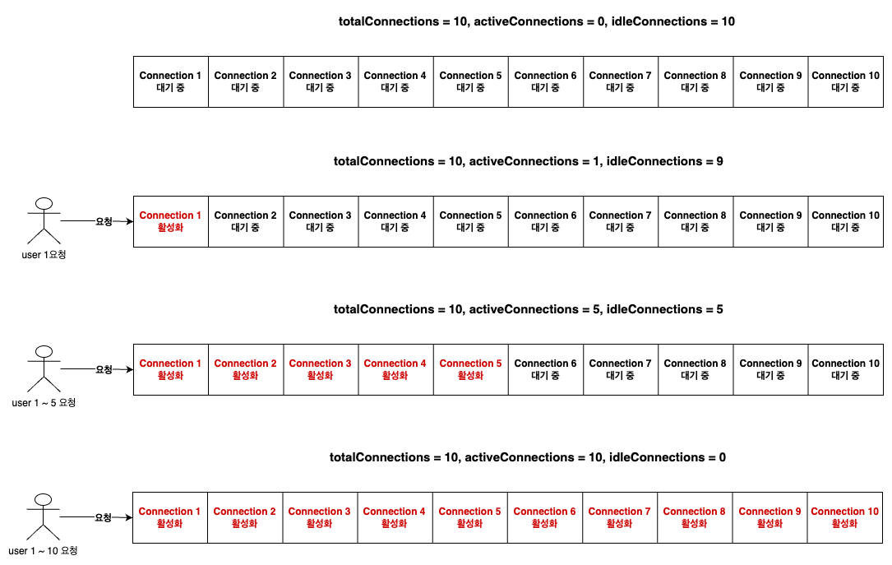
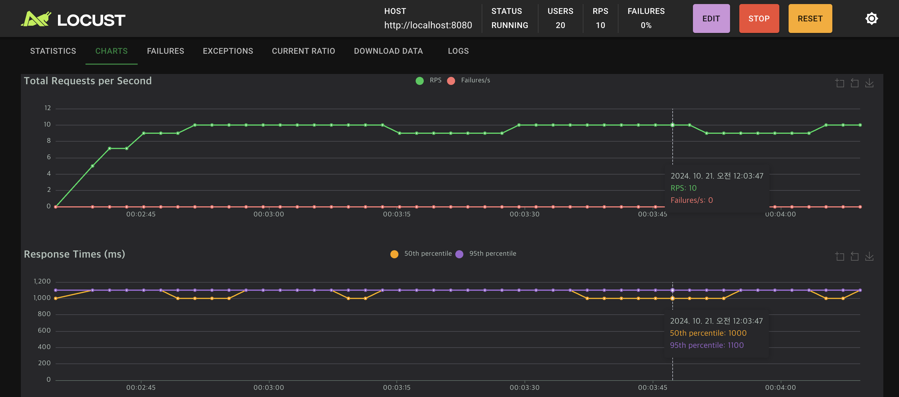
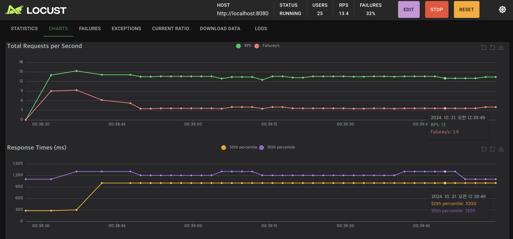

# MySQL Connection Pool

## Connection Pool이란?

애플리케이션에서 MySQL 데이터베이스와의 효율적인 연결을 위해 **커넥션 풀**을 사용합니다. 커넥션 풀은 미리 일정한 수의 데이터베이스 연결을 생성해 두고, 애플리케이션이 필요할 때마다 이 연결들을 재사용함으로써 성능을 향상시키는 기법입니다. 이 방식은 데이터베이스와의 연결을 매번 새로 생성하는 대신 이미 준비된 연결을 재사용하여 애플리케이션의 응답 시간을 줄이는 데 매우 유용합니다.

## Java JDBC와 HikariCP

Java 애플리케이션에서 가장 널리 사용되는 커넥션 풀 중 하나는 **HikariCP**입니다. HikariCP는 가볍고 빠른 커넥션 풀로, 대규모 트래픽이 발생하는 상황에서도 효율적인 연결 관리를 지원합니다. HikariCP는 **HikariPoolMXBean**과 **HikariConfigMXBean**이라는 JMX(Java Management Extensions)를 통해 커넥션 풀의 상태 및 설정을 관리할 수 있습니다.

### Spring Boot에서의 HikariCP 설정과 기본값

| 설정 항목                           | 설명                                                                               | 기본값                       |
|---------------------------------|----------------------------------------------------------------------------------|---------------------------|
| **maximum-pool-size**           | 커넥션 풀에서 유지할 수 있는 최대 커넥션 수입니다. 이 수치를 초과하는 요청은 대기 상태로 들어갑니다.                       | 10                        |
| **minimum-idle**                | 풀에서 유지할 유휴 커넥션의 최소 개수입니다. 유휴 커넥션이 이 수치 이하로 떨어지면 새로운 커넥션이 생성됩니다.                  | `maximum-pool-size` 값과 동일 |
| **connection-timeout**          | 커넥션을 가져오기 위해 스레드가 대기할 수 있는 최대 시간입니다. 이 시간이 초과되면 예외가 발생합니다.                       | 30,000ms (30초)            |
| **max-lifetime**                | 커넥션이 유지될 수 있는 최대 시간입니다. 이 시간이 지나면 커넥션은 폐기되고 새 커넥션으로 교체됩니다.                       | 1,800,000ms (30분)         |
| **idle-timeout**                | 유휴 상태의 커넥션이 풀에서 유지될 수 있는 최대 시간입니다. 이 시간이 지나면 유휴 커넥션이 풀에서 제거됩니다.                  | 600,000ms (10분)           |
| **leak-detection-threshold**    | 지정된 시간(밀리초) 동안 사용되지 않은 커넥션을 감지하는 데 사용됩니다. 이 시간이 지나면 커넥션 리크(leak)를 의심하고 경고를 남깁니다. | 0 (비활성화)                  |
| **pool-name**                   | 커넥션 풀의 이름을 지정합니다. 기본적으로 HikariCP는 자동으로 이름을 생성하지만, 필요에 따라 지정할 수 있습니다.             | 자동 생성된 이름                 |
| **auto-commit**                 | 새 커넥션이 자동 커밋 모드로 시작할지를 결정합니다. 각 쿼리 후 자동으로 커밋됩니다.                                 | `true`                    |
| **validation-timeout**          | 커넥션이 유효한지 검증할 때 사용할 최대 시간입니다. 이 시간이 초과되면 커넥션은 유효하지 않다고 판단하고 폐기됩니다.               | 5,000ms (5초)              |
| **read-only**                   | 커넥션이 읽기 전용 모드에서 작동할지를 결정합니다.                                                     | `false`                   |
| **isolate-internal-queries**    | 내부 쿼리(예: 커넥션 풀의 유지 관리 쿼리)가 애플리케이션의 쿼리와 격리되는지를 설정합니다.                             | `false`                   |
| **allow-pool-suspension**       | 커넥션 풀의 일시 정지 기능을 활성화합니다. 이 설정이 활성화되면 풀을 일시 정지하거나 다시 시작할 수 있습니다.                  | `false`                   |
| **initialization-fail-timeout** | 풀을 시작할 때 초기화에 실패하는 경우를 대비한 타임아웃 시간입니다. 이 시간이 지나면 예외가 발생합니다.                      | 1초 (1,000ms)              |

## 커넥션 풀 시나리오 설명



**상황**: `maximumPoolSize`가 10인 커넥션 풀을 가진 애플리케이션에서, 10명의 사용자가 각각 1초에 한 번씩 요청을 보낸다고 가정해보겠습니다. 각 요청은 약 1초가 소요됩니다. 아래 시나리오는 커넥션 풀의 상태를 각 단계별로 설명합니다.

### 커넥션 풀의 주요 필드 및 동작 시나리오 분석

* **maximumPoolSize**:
  - **설명**: 커넥션 풀에서 관리할 수 있는 최대 커넥션 수를 나타냅니다. 이 시나리오에서는 10개로 설정되어 있어, 동시에 최대 10개의 요청을 처리할 수 있습니다.
  - **이미지 설명**: 이미지에서 `totalConnections = 10`으로 설정되어 있으며, 이는 커넥션 풀에서 관리할 수 있는 총 커넥션이 10개임을 의미합니다.
* **activeConnections**:
  - **설명**: 현재 요청을 처리 중인 커넥션의 수입니다. 동시 요청이 10건 발생하면 `activeConnections`는 10이 됩니다. 더 이상 여유가 없는 상태에서 추가 요청이 들어오면 대기 상태가 됩니다.
  - **이미지 설명**: 첫 번째 그림에서 `activeConnections = 1`로, 한 개의 요청이 활성화된 상태입니다. 두 번째 그림에서는 `activeConnections = 5`로, 5명이 동시에 요청을 보내고 있습니다. 세 번째 그림에서는 `activeConnections = 10`으로, 모든 커넥션이 활성화되어 추가 요청을 처리할 수 없는 상태입니다.
* **idleConnections**:
  - **설명**: 유휴 상태로 대기 중인 커넥션의 수를 나타냅니다. 예를 들어, 첫 번째 요청이 처리될 때 `idleConnections`는 9개이며, 모든 커넥션이 활성화되면 `idleConnections`는 0이 됩니다.
  - **이미지 설명**: 첫 번째 그림에서 `idleConnections = 9`로, 9개의 커넥션이 대기 상태입니다. 두 번째 그림에서는 `idleConnections = 5`, 세 번째 그림에서는 `idleConnections = 0`으로, 모든 커넥션이 사용 중인 상태입니다.
* **totalConnections**:
  - **설명**: 커넥션 풀에서 관리하고 있는 총 커넥션 수로, `activeConnections`와 `idleConnections`의 합입니다. 이 값은 `maximumPoolSize` 내에서 유지되며, 동시 요청이 많을수록 `idleConnections`가 줄어듭니다.
  - **이미지 설명**: 세 개의 그림 모두 `totalConnections = 10`으로, 이는 커넥션 풀에서 관리하는 커넥션이 총 10개임을 나타냅니다.
* **threadsAwaitingConnection**:
  - **설명**: 커넥션이 모두 사용 중일 때 대기 중인 요청의 수를 나타냅니다. 예를 들어, 10명의 사용자가 모두 커넥션을 사용 중일 때 추가 요청이 발생하면, 그 요청은 대기 상태로 들어가 `threadsAwaitingConnection`이 증가합니다.
  - **이미지 설명**: 마지막 그림에서는 모든 커넥션이 사용 중이기 때문에, 추가 요청이 발생하면 대기 상태로 들어가게 됩니다.
* **connectionTimeout**:
  - **설명**: 대기 중인 요청이 커넥션을 얻기 위해 기다릴 수 있는 최대 시간을 나타냅니다. 예를 들어, `connectionTimeout`이 2초로 설정된 경우, 대기 중인 요청이 2초 내에 커넥션을 할당받지 못하면 요청은 실패하게 됩니다.
  - **이미지 설명**: 마지막 그림에서 모든 커넥션이 사용 중인 상태에서 추가 요청이 들어오면, `connectionTimeout` 내에 커넥션을 할당받지 못할 경우 해당 요청은 실패하게 됩니다.
* **validationTimeout**:
  - **설명**: 풀에서 커넥션을 빌려올 때 해당 커넥션이 유효한지 확인하는 시간입니다. 이 시간이 초과되면 해당 커넥션은 사용되지 않고 새로운 커넥션이 할당됩니다.
  - **이미지 설명**: 유휴 상태로 오래 있던 커넥션은 유효성 검사에서 실패할 수 있으며, 이 경우 새로운 커넥션이 할당됩니다. 이미지에서는 유휴 상태의 커넥션들이 대기 중인 상태를 보여줍니다.

## HikariCP 설정 및 상태 측정 샘플 코드

Spring Boot 애플리케이션에서 HikariCP를 사용하는 방법을 설명합니다. HikariCP는 Spring Boot에서 기본적으로 사용하는 커넥션 풀로, 설정을 통해 다양한 커넥션 관리 옵션을 제공합니다. 또한, HikariCP의 상태를 측정할 수 있는 방법을 추가하여 커넥션 풀의 효율적인 관리가 가능합니다.

### HikariCP Properties 설정

```yaml
spring:
    datasource:
        hikari:
            maximum-pool-size: 10           # 최대 커넥션 수
            minimum-idle: 10                # 최소 유휴 커넥션 수
            connection-timeout: 30000       # 커넥션을 가져올 때 대기할 최대 시간 (밀리초)
            max-lifetime: 1800000           # 커넥션이 유지될 최대 시간 (밀리초)
            idle-timeout: 600000            # 유휴 커넥션이 유지될 최대 시간 (밀리초)
            leak-detection-threshold: 2000  # 커넥션 리크를 감지할 기준 시간 (밀리초)
            pool-name: Sample-HikariPool    # 커넥션 풀 이름
            auto-commit: true               # 자동 커밋 여부
            validation-timeout: 5000        # 커넥션 유효성 검사를 위한 최대 시간 (밀리초)
            read-only: false                # 읽기 전용 모드 여부
            isolate-internal-queries: false # 내부 쿼리 격리 여부
            allow-pool-suspension: false    # 커넥션 풀 일시 정지 허용 여부
            initialization-fail-timeout: 1  # 초기화 실패 시 타임아웃 (밀리초)
```

### HikariCP 상태 측정 코드

```kotlin

@Service
class SampleService(
    private val dataSource: DataSource,
    private val memberRepository: MemberRepository
) {

    private val log = LoggerFactory.getLogger(javaClass)!!

    @Transactional
    fun getMember(): Member {
        val findById = memberRepository.findById(Random.nextInt(1, 101).toLong()).get()
        runBlocking { delay(1000) }
        val targetDataSource = dataSource.unwrap(HikariDataSource::class.java)
        val hikariDataSource = targetDataSource as HikariDataSource
        val hikariPoolMXBean = hikariDataSource.hikariPoolMXBean
        val hikariConfigMXBean = hikariDataSource.hikariConfigMXBean
        val log =
            """
            totalConnections : ${hikariPoolMXBean.totalConnections}
            activeConnections : ${hikariPoolMXBean.activeConnections}
            idleConnections : ${hikariPoolMXBean.idleConnections}
            threadsAwaitingConnection : ${hikariPoolMXBean.threadsAwaitingConnection}
            """.trimIndent()

        this.log.info(log)

        return findById
    }
}
```

이 코드에서는 먼저 `DataSource`를 `HikariDataSource`로 변환한 후, `HikariPoolMXBean`과 `HikariConfigMXBean`을 사용하여 커넥션 풀의 상태를 확인합니다. 이를 통해 총 커넥션 수, 활성 커넥션 수, 유휴 커넥션 수, 그리고 대기 중인 스레드 수와 같은 정보를 가져옵니다. 또한, `runBlocking { delay(1000) }`을 사용하여 1초간의 지연을 추가함으로써, 실제 요청이 처리되는 동안 커넥션 풀의 상태를 보다 명확하게 모니터링할 수 있습니다. 마지막으로, 이러한 커넥션 풀의 상태를 로그로 출력하여 애플리케이션의 성능을 모니터링하고, 필요한 경우 성능을 조정할 수 있는 정보를 제공합니다.


## Connection Pool 측정



애플리케이션에서 커넥션 풀을 사용할 때, 커넥션 풀의 상태를 지속적으로 모니터링하는 것은 매우 중요합니다. 아래와 같은 로그는 **10 TPS (초당 트랜잭션)**를 지속적으로 유지할 때 발생한 로그입니다. 이때 평균 응답 시간은 약 1,000ms로 나타나며, 이는 TPS 수준을 고려했을 때 시스템이 적정 수준에서 작동하고 있음을 보여줍니다.


- **로그 1**:
  - `totalConnections = 10`
  - `activeConnections = 7`
  - `idleConnections = 3`
  - `threadsAwaitingConnection = 0`

  이 상태는 **총 10개의 커넥션** 중 **7개가 활성화**되어 요청을 처리하고 있으며, **3개의 유휴 커넥션**이 대기 중인 상황입니다. 모든 요청이 원활하게 처리되고 있기 때문에, 대기 중인 스레드는 없습니다.

- **로그 2**:
  - `totalConnections = 10`
  - `activeConnections = 10`
  - `idleConnections = 0`
  - `threadsAwaitingConnection = 4`

  이 상태는 **모든 10개의 커넥션이 활성화**되어 요청을 처리 중이며, 더 이상 유휴 커넥션이 남아있지 않습니다. 이때 **4개의 추가 요청이 들어와 대기** 중입니다. `threadsAwaitingConnection` 값이 4로 증가한 이유는, 요청을 처리할 수 있는 유휴 커넥션이 없기 때문입니다.


### 커넥션 풀 동작 및 타임아웃 발생

커넥션 풀이 설정된 `maximumPoolSize`만큼 활성화된 경우, 그 이후에 들어오는 요청은 **대기 상태**에 들어가게 됩니다. 이때 **대기 시간이 길어질 수 있으며**, 이러한 대기 시간이 너무 길어지면 **타임아웃**이 발생할 수 있습니다. 타임아웃이 발생하는 주요 원인은 다음과 같습니다:

- **connection-timeout**: 커넥션을 얻기 위해 스레드가 대기할 수 있는 최대 시간을 의미합니다. 예를 들어, `connection-timeout`이 30초로 설정되어 있다면, 커넥션 풀이 사용 가능한 커넥션을 30초 동안 제공하지 못할 경우 타임아웃이 발생하게 됩니다. 이 설정은 대기 중인 요청이 얼마 동안 기다릴 수 있는지를 제한합니다.

커넥션 풀은 **한정된 자원**을 효율적으로 관리하여 시스템의 안정성을 유지하는 좋은 방법입니다. 그러나, 만약 요청량이 설정된 `maximumPoolSize`를 초과하게 되면 대기 상태가 발생할 수 있습니다. 이러한 상황을 방지하기 위해 적절한 **타임아웃** 값을 설정하고, 필요에 따라 풀 크기를 조정하는 것이 중요합니다.

---

### connection-timeout 설정과 TPS 증가로 인한 오류 발생

```yaml
spring:
  datasource:
    hikari:
      maximum-pool-size: 10         # 최대 커넥션 수
      minimum-idle: 10              # 최소 유휴 커넥션 수
      connection-timeout: 250       # 커넥션을 가져올 때 대기할 최대 시간 (밀리초)
```

위 설정에서 `connection-timeout`을 250ms로 지정한 경우, **TPS**가 10을 초과하게 되면 **threadsAwaitingConnection**에 대기하는 시간이 250ms를 넘을 수 있습니다. 이 상황이 발생하면, 커넥션 풀은 설정된 대기 시간보다 오래 걸리기 때문에 타임아웃 오류가 발생하게 됩니다.

#### 예시 시나리오



이미지에서와 같이, `RPS`(Request Per Second)가 10 이상일 때 커넥션 풀의 한계로 인해 대기 중인 요청이 발생하고, 그 대기 시간이 `250ms`를 초과하면 오류가 발생합니다. 이때 `Failures/s`가 증가하는 것을 확인할 수 있습니다. 이는 타임아웃 설정과 관련이 있으며, 커넥션 풀의 자원 한계와 처리량을 적절히 맞춰야 하는 이유를 보여줍니다.

**오류 메시지 예시**:

```
java.sql.SQLTransientConnectionException: Sample-HikariPool - Connection is not available, request timed out after 251ms.
	at com.zaxxer.hikari.pool.HikariPool.createTimeoutException(HikariPool.java:696) ~[HikariCP-4.0.3.jar:na]
	at com.zaxxer.hikari.pool.HikariPool.getConnection(HikariPool.java:197) 
```

이 오류는 대기 시간이 설정된 `connection-timeout`을 초과했음을 의미하며, 커넥션 풀이 추가 요청을 처리할 수 없다는 것을 나타냅니다.