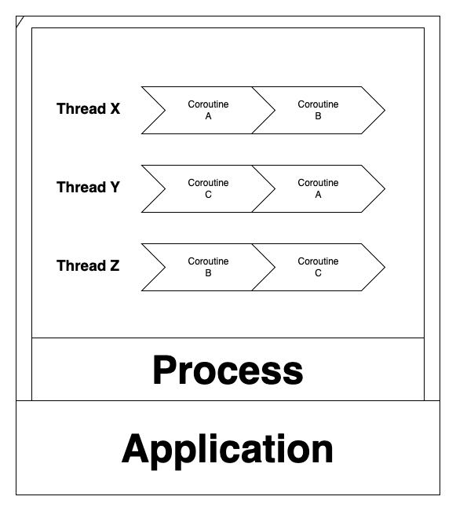
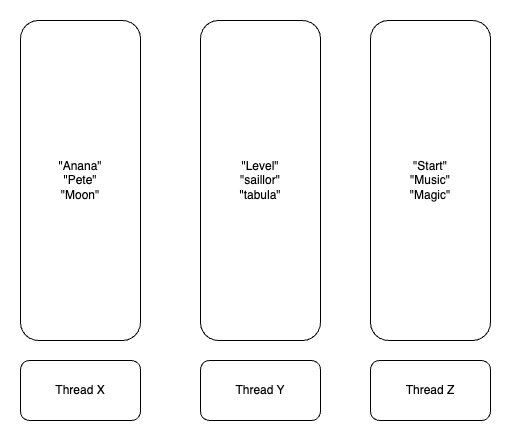

# 코틀린 동시성 프로그래밍

# 1장

## 프로세스

프로세스는 실행 중인 애플리케이션의 인스턴스다. 애플리케이션이 시작될 때마다 애플리케이션의 프로세스가 시작된다. 프로세스는 상태를 갖고 있다. 리소스를 여는 핸들, 프로세스 ID, 데이터, 네트워크 연결 등은 프로세스 상태의 일부이며 해당 프로세스 내부의 스레드가 액세스를 할 수 있다.

## 스레드

실행 스레드는 프로세스가 실행할 일연의 명령을 포함한다. 따라서 프로세스는 최소한 하나의 스레드를 포함하며 이 스레드는 애플리케이션의 진입점을 실행하기 위해 생성된다. 보통 진입점은 애플리케이션 main() 함수이며 메인 스레드라 하는데 프로스세의 라이프 사이클과 밀접하게 연관된다. 스레드가 끝나면 프로세스의 다른 스레드와 상관없이 프로세스가 종료된다.

```kotlin
fum main (args: Array<String>) {
    dowork()
}
```

기본적인 애플리케이션이 실행되면 main 함수의 명령 집합이 포함된 메인 스레드가 생성된다.dowork()은 메인 스레드에서 실행되므로 wowork()이 종료되면 애플리케이션의 실행이 종료된다.

각 스레드는 스레드가 ㅅ혹한 프로세스에 포함된 리소스를 액세스하고 수정할 수 있지만 스레드 로컬 스토리지라는 자체 저장소도 갖고 있다.

스레드 안에서 명령은 한 번에 하나씩 실행돼 스레드가 블록되면 블록이 끝날 때까지 같은 스레드에서 다른 명령을 실행할 수 없다. 그러나 많은 스레드가 같은 프로세스에서 생성될 수 있으며 서로 통신할 수 있다. 따라서 애플리케이션이 사용자 경험에 부정적인 영향을 미칠 수 있는 스레드는 블로킹하지 않아야 한다. 블록킹할 때는 블록킹 작업을 별도의 전용 스레드에 할당해야한다. GUI 애플리케이션은 애플리케이션의 응답성을 항상 유지하기 위해서 UI 스레드를 블록하지 않는다.

코틀린이 동시성을 구현한 방식을 보면 여러분이 직접 스레드를 시작하거나 중지할 필요가 없다는 것을 알게된다. 한두 줄의 코드로 코틀린이 특정 스레드나 스레드 풀을 생성해서 코루틴을 실행하도록 지시하기만 하면된다. 스레드와 관련된 나머지 처리는 프레임워크에 의해 수행된다.

## 코루틴

코틀린 문서에서는 코툴린을 경량 스레드라고 한다. 대부분 스레드와 마찬가지로 코루틴이 프로세스가 실행할 명령어 집합의 실행을 정의하기 때문이다. 또한 코루틴은 스레드와 비슷한 라이프 사이클을 갖고 있다.

코루틴은 스레드 안에서 실행된다. 스레드 하나에 많은 코루틴이 있을 수 있지만 주어진 시간에 하나의 스레드에서 하나의 명령만 실행될 수 있다. 즉 같은 스레드에 10개의 코루틴이 있다면 해당 시점에 하나의 코루틴만 실행된다.

스레드와 코루틴의 가장 큰 차이점은 코루틴이 빠르고 적은 비용으로 생성할 수 있다는 것이다. 추천 개의 코루틴도 쉽게 생성할 수 있ㅇ므ㅕ, 수천 개의 스레드를 생성하는 것보다 빠르고 자원도 훨씬 적게 사용한다.

```kotlin
suspend fun createCoroutines(amount: Int) {
    val jobs = ArrayList<Job>()
    for (i in 1..amount) {
        jobs += GlobalScope.launch {
            delay(1000)
        }
    }
    jobs.forEach { it.join() }
}

@Test
@DelicateCoroutinesApi
fun `코루틴 생성 테스트`() = runBlocking {
    println("${Thread.activeCount()} thread active at the start")

    val time = measureTimeMillis {
        createCoroutines(10_000)
    }

    println("${Thread.activeCount()} thread active at the end")
    println("Took $time ms")

}


```

amount에 지정된 수만큼 코루틴을 생성해 각 코루틴을 1초 간 지연시킨 이후 모든 코루틴이 종료될 때까지 기다렸다가 반환한다.

```
# amount = 1
4 thread active at the start
7 thread active at the end
Took 1016 ms

# amount = 10_000
4 thread active at the start
15 thread active at the end
Took 1072 ms

# amount = 100_000
4 thread active at the start
15 thread active at the end
Took 1291 ms

# amopunt = 1_000_000
4 thread active at the start
15 thread active at the end
Took 2842 ms
```

테스트 환경에서 amount를 10,000으로 실행할 때 약 1,072ms가 걸리는데 반해 100,000으로 실행하는데 1,291ms가 소요됐다. **코틀린의 고정된 크기의 스레드 풀을 사용하고 코루틴을 스레드들에 배포하기 때문에 실행 시간이 매우 적게 증가한다.** 따라서 수 천개의 코루틴을 추가하는 것은 거의 영향이 없다. 코루틴이 일시 중단되는 동안 실행 중인 스레드는 다른 코루틴을 실행하는 데 사용되며 코루틴은 시작 또는 재개될 준비 상태가 된다.

Thread 클래스의 activeCount() 메드를 활용하면 활성화된 스레드 수를 알 수 있다. 10,000개의 코루틴을 생성하기 위해서는 4개의 스레드만 생성하면 된다. 그러나 amount 값을 1로 하면 7개의 스레드만 필요하다.

**코루틴이 특성 스레드 안에서만 실행되더라도 스레드와 묶이지 않는다는 점을 이해햐아한다.** 코루틴의 일부를 특정 스레드에서 실행하고, 실행을 중지한 다음 나중에 다른 스레드에서 계속 실행하는 것이 가능하다. 코틀린이 실행 가능한 스레드로 코루틴을 이동시키기 때문이다. createCoroutines() amount를 3으로 하고, launch() 블록을 다음과 같이 변경해서 현재 실행 중인 스레드를 출력시키면 실제 내부에서 일어나는 일을 볼 수 있다.

```kotlin
val jobs = ArrayList<Job>()
for (i in 1..amount) {
    jobs += GlobalScope.launch {
        println("Started $i in ${Thread.currentThread().name}")
        delay(1_000)
        println("Finished $i in ${Thread.currentThread().name}")
    }
}
jobs.forEach { it.join() }

Started 3 in DefaultDispatcher - worker - 2 @coroutine #4
Started 1 in DefaultDispatcher - worker - 1 @coroutine #2
Started 2 in DefaultDispatcher - worker - 3 @coroutine #3
Finished 3 in DefaultDispatcher - worker - 1 @coroutine #4
Finished 2 in DefaultDispatcher - worker - 2 @coroutine #3
Finished 1 in DefaultDispatcher - worker - 3 @coroutine #2
```

스레드는 한 번에 하나의 코루틴만 실행할 수 있기 때문에 프레임워크가 필요에 따라 코루틴을 스레들 사이에 옮기는 역할을 한다. 코루틴은 개발자가 코루틴을 실행할 스레드를 지정하거나 코루틴을 해당 스레드로 제한할지 여부를 지정할 수 있을 만큼 충분히 유연하다.

## 내용 정리

스레드를 블록한다는 거은 그 스레드에ㅓ 코드의 실행을 중지한다는 의미인데, 사용자와 상호작용하는 스레드는 블록하지 않아야 하낟. 코루틴이 기본적으로 스레드 안에 존재하지만 스레에 얽ㅐㅣ지 않은 가벼운 스레드라는 것을 알게 됐다.



동시성은 애플리케이션이 동시에 한 개이상의 스레드에서 실행 될 때 발생한다. 공시성이 발생하려면 두 개 이상의 스레드가 생성돼 하며, 애플리케이션이 제대로 작동하려면 이런 스레드 간의 통신과 동기화가 필요하다.

## 동시성에 대해

```kotlin
fun getProfile(id: Int): Profile {
    val basicUSerInfo = getUserInfo(id)
    val contactInfo = getContactInfo(id)

    return createProfile(basicUSerInfo, contactInfo)
}
```

사용자 정보가 반환되기 전까지 연락처 정보를 요청하지 않는다. 이것이 순차 코드의 장점이다. 장확한 실행순서를 쉽게 알수 있어 예층하지 못하는 일이 벌어지지 않을 것이다. 그러나 순차 코드에는 두 가지 큰 문제점이 있다.

* 동시성 코드에 비해 성능이 저하될 수 있음
* 코드가 실행되는 하드웨어를 제대로 활용하지 못할 수 있음

basicUSerInfo, contactInfo이 서로 의존하지 않아 이들을 동시에 호출할 수 있다.

```kotlin
suspend fun getProfile(id: Int): Profile {
    val basicUSerInfo = asyncGetUserInfo(id)
    val contactInfo = asyncGetContactInfo(id)

    return createProfile(basicUSerInfo.await(), contactInfo.await())
}
```

suspend를 통해 일시 중단 함수로 정의 했고, asyncGetUserInfo(), asyncGetContactInfo()는 서로 다른 스레드에서 실행되도록 작성 했기 때문에 동시성이라고 한다.

await() 호출을 통해 asyncGetUserInfo(), asyncGetContactInfo()가 모두 완료될 때까지 getProfile()의 실행을 일시 중단하는 것이다. 둘 다 완료됐을 때만 createProfile()의 실행을 잃시 중단하는 것이다. 둘 다 완료됐을 때만 createProfile이 실행된다.

## 동시성은 병렬성이 아니다

흔히 동시성과 병렬성을 혼동하곤 한다. 어쨋든 두 개의 코드가 동시에 실행된다는 점에서 둘 다 상당히 비슷해 보이긴 하지만, 이 둘을 나눌 명확한 선을 규정할 것이다.

* 동시성은 두 개 이상의 알고리즘의 실행 시간이 겹칠 때 발생한다. 중첩이 발생하려면 두 개 이상의 슬행 스레드가 필요하다. 이런 스레드들이 단일 코어에서 실행되면 병렬이 아니라 동시에 실행되는데, 단일 코어가 서로 다른 스레드의 인스트럭션을 교차 배치해서, 스레드들의 실행을 효율적으로 겹쳐서 실행한다.
* 병렬은 두 개의 알고리즘이 정확히 같은 시점에 실행될 때 발생한다. 이것이 가능하려면 2개 이상의 코어와 2개 이상의 스레드가 있어야 각 코어가 동시에 스레들의 인스트럭션을 실행할 수 있다. **병렬은 동시성을 의미하지만 동시성은 병렬성이 없어도 발생할 수 있다는 점에서 유의하자.**

## CPU 바운드와 I/O 바운드

동시성과 병렬성이 CPU나 I/O 연산에 바인딩됐는지 여부에 따라 알고리즘의 성능에 어떻게 영햐응ㄹ 미칠 수 있는지를 알아본다.

### CPU 바운드

CPU만 완료하면 되는 작업을 중심으로 구현되는 알고리즘이 많다. 알고리즘의 성능은 실행 중인 CPU의 성능에 좌우되며 CPU만 업그레이드해도 성능이 향상된다.

### I/O 바운드

I/O 바운드는 입출력 장치에 의존하는 알고리즘이다. 실행 시간은 입출력 장치의 속도에 따라 달라지는데. 예컨데 문서를 읽어서 처리하는 알고리즘이면 알고리즘이 I/O 바운드다.

예를 들어 파일을 하드 드라이브에 저장하면 SSD에 저장하는 겻우보다 애플리케이션 성능이 더 나빠진다. 네트워킹이나 컴퓨터 주변기기로부터 입력을 받은 작업들도 I/O 작업이다. I/O 바운드 알고리즘은 I/O 작업을 기준으로 성능에 대한 병목 현상을 이르키는데, 최적화가 외부 시스템이나 장치에 의존한다는 것을 의미한다.

## CPU 바운드 알고리즘에서의 동시성과 병렬성

CPU 바운드 알고리즘의 경우 다중 코어에서 병렬성을 활요앟면 성능을 향상시킬 수 있지만 단일 코어에서 동시성을 구현하면 성능이 저하되기도 한다. 3개의 스레드로 단어를 분리하는 실행을 하면 다음과 같다



### 단일 코어에서 실행

단일 코어에서 실행된다면 하나의 코어가 3개의 스레드 사이에 교착 배치 되며 매번 일정량의 단어를 필터링하고 다음 스레드로 전환된다. 전환 프로세스를 컨텍스트 스위칭이라고 한다.

컨텍스트 스위칭은 현재 스레드의 사애틀ㄹ 저장한 후 다음 스레드의 사앹를 적재해야 하기 때문에 전체 프로세스에 오버헤드가 발생한다. 오버헤드로 인해 다중 스레드로 구현한 로직 앞에서 본 순차적으로 구현에 비해 단일 코어 머신에서는 더 오래 걸릴 가능성이 있다. 순차적으로 구현에서 단일 코어가 모든 작업을 수행하지만 컨텍스트 스위칭이 발생하지 않기 때문에이다.

### 병령 실행

병렬 실행의 경우 각 스레드가 하나의 전용 코어에서 실행된다고 가정하면 실행은 순차적 실행의 약 3분의 1이 될 것이다. 각 코어는 1,000개의 단어를 중단 없이 필터링해서 작업을 완료하면 데 필요한 총 시간을 줄일 것이다.

CPU 바운드 알고리즘을 위해서는 현재 사용중인 장치의 코어 수를 기준으로 적절한 스레드 수를 생성하도록 고려해야한다. 이렇게 하면 CPU 바운드 알고리즘을 실행하기 위해 생성된 스레드 풀인 코틀린의 CommonPool을 활용할 수 있다.

> CommonPool의 크기는 머신의 코어 수에서 1을 뺸 갑싱다. 4코어가 있는 머신의 CommonPool 크기는 3이다.

## I/O 바운드 알고리즘에서의 동시성 대 병렬성

지속적인 대기는 단일 코어 기기에서 대기하는 중에 다른 유용한 작업에 프로세스를 사용할 수 있도록 한다. 따라서 I/O 바운드 동시성 알고리즘은 병렬이거나 단일 코어에 상관없이 유사하게 수행될 것이다.

## 동시성이 어려운 이유

코틀린은 동시성 프로그래밍을 가능한 단순하면서도 여러 가지 사용 사례를 맞춰 조절할 수 있도록 충분히 유연하게 만들려고 노력했다.이런 사례를 이후에 살펴보고 지금은 동시성 코드를 프로그래밍할 때 제시되는 공통된 문제점을 찾아보자

### 레이스 컨디션

예를들어 데이터베이스에서 데이터를 가져오고 웹 서비스를 호출하는 기능을 동시에 수행하는 코드를 작성할 때 흔하게하는 실수는 데이터베이스가 더 빠를 것으로 가정하고 웹 서비스 작업이 끝나자 마자 데이터베이스 작업의 결과에 접근하려고 하는 것이다. 이때쯤이면 데이터베이스에서 나온 정보가 항상 준비된다고 생각한다. 레이스 컨디션은 동시성 일부가 제대로 작동하지 위해 일정한 순서로 완료돼야 할 때 발생한다. 이것은 동시성 코드를 구현하는 방법이 아니다.

```kotlin
@Test
fun `레디스 컨디션`() = runBlocking {
        asyncGetUserInfo(1)
        delay(1000)
        println("User ${user.id} is ${user.name}")
    }

@OptIn(DelicateCoroutinesApi::class)
fun asyncGetUserInfo(id: Int) = GlobalScope.async {
    user = UserInfo()
}
```

1초 지연한 후에 사용자 이름을 출력한다. 이코드는 1초를 지연하기 때문에 잘동작할 것이다. 지연을 없애거나 asyncGetUserInfo() 지연시간을 크게 하면 애플리케이션이 중단된다.

```kotlin
fun asyncGetUserInfo(id: Int) = GlobalScope.async {
    delay(11000)
    user = UserInfo()
}
```

```
lateinit kotlin.UninitializedPropertyAccessException: lateinit property user has not been initialized
at com.example.kotlincoroutine.Coroutines.getUser(Coroutines.kt:42)
```

실행하면 user에 정보를 출력하는 동안 초기화되지 않아서 종료된다. 레이스 컨디션을 해결하려면 접근하려고 하기 전에 정보를 얻을 때까지 명시적으로 기달려야만 한다.

### 원자성 위반

다일 스레드 애플리케이션에서는 모든 코드가 순차적으로 실행되기 때문에 모든 작업이 모두 원자일 것이다, 스레드가 하나만 실행되므로 간섭이 있을 수 없다.

원자성은 객체의 상태가 동시에 수정될 수 있을 때 필요하며 그 상태의 수정이 겹치지 않도록 보장 해야한다. 수정이 렵칠 수 있다는 것은 데이터 손실이 발생할 수 있다는 뜻인데, 가령 코루틴이 다른 코루틴이 수정하고 있는 데이터를 바꿀 수 있다.

```kotlin
@Test
fun `원자성 위반`() = runBlocking {
        val workerA = asyncIncrement(2_000)
        val workerB = asyncIncrement(100)

        workerA.await()
        workerB.await()
        println("counter [$counter]")

    }

@OptIn(DelicateCoroutinesApi::class)
fun asyncIncrement(by: Int) = GlobalScope.async {
    for (i in 0 until by)
        counter++
}
```

한 호출에서는 counter를 2,000 증가 시키는 반면 다른 호출에서는 100번 증가 시킬것이다. **문제는 asyncIncrement()의 두번 실행이 서로 간섭할 수 있으며, 설로 다른 코루틴 인스턴스가 값을 재정의할 수 있다는 것이다.** 여러번 실행하면 2,100 보다 낮은 값을 출력하는 경우가 발생한다.


counter++의 원장성이 부족해서 workerA와 workerB에서 각각 한번씩 값을 증가시켜야 하지만 한 번만 증가 시켰다.

코루틴에서 명령이 중첩되는 것은 counter++ 작업이 원자적이지 않기 때문이다. 실제로 이 작업은 counter의 현재 값을 읽은 당므 그 값을 1씩 증가시킨 후에 그 결과를 counter에 다시 저장하는 세가지 명령어로 나눌 수 있다. counter++에서 원자성이 없기 때문에 코루틴이 다른 코루틴이 하는 조작을 무시하고 값을 일고 수정할 수 있다.

### 교착 상태

동시성 코드가 올바르게 동기화되려면 다른 스레드에서 작업이 완료되는 동안 실행을 일시 중단하거나 차단할 필요가 있다. 이러한 상황의 복잡성 때문에, 즉 순환적 의존성으로 인해 전체 애플리케이션의 실행이 중단되는 상황이 드물지 않게 일어난다.

```kotlin
@OptIn(DelicateCoroutinesApi::class)
@Test
fun `교착 상태`() = runBlocking {
        GlobalScope.launch {
            delay(1_000)
            // wait for JobB to Fish
            jobB.join()
        }

        GlobalScope.launch {
            // wait for JobA to Fish
            jobA.join()
        }

        // wait for JobA to Fish
        jobA.join()
        println("Finished")
    }
```

jobA는 jobB가 실행을 완료하기를 기달리고 있는 반면 jobB는 jobA가 끝나기를 기다리고 있다. 서로가 서로를 기달리고 있기 때문에 누구도 끝나지 않는따 따라서 Finished 메시지가 출력되지 않는다.

실제 교착 상태를 발견하고 수정하기란 이보다 훨씬 어렵다. 일반적으로 복잡한 잠금 연관관계에 의해 발생하며 레이스 컨디션과 자주 발생한다.

### 라이브 락

라이브 락은 애플리케이션이 올바르게 실행을 계속할 수 없을 때 발생하는 교차 상태와 유사하다. 라이브 락이 진행될 때 애플리케이션의 상태는 지속적으로 변하지만 애플리케이션이 정상 실행으로 돌아오지 못하게 하는 방향으로 상태가 변한다는 점이 다르다.

두 사람이 좁은 복도에 마주보고 걸어오는 모습으로 라이브락을 설명한다. 두 사람은 각각 한쪽 방향으로 이동해서 서로를 피하려 한다. A가 왼쪽으로 이동할 때 B는 오른쪽으로 이동하지만 마주보고 있기 때문에 서로의 길을 막고 있다. 또 서로가 움직일 때마다 서로 한번 서로 길을 막게 된다. 이렇게 움직이며 서로의 길을 막게 된다. 둘은 교착상 태에서 벗어나는 방법을 알고 있다. **하지만 회복하려는 시점이 그들의 진행을 방해한다.**

교착 상태를 복구하도록 설계된 알고리즘에서 라이브 락이 발생하는 경우가 많다. 교착 상태에서 복구하려는 시도가 라이브 락을 만들어 낼 수도 있다.

## 코틀린에서의 동시성

### 넌 블로킹

스레드는 무겁고 생성하는 데 비용이 만힝 들며 제한된 수의 스레드만 생성할 수 있다. 스레드가 블록킹되면 어떻게 보면 자원이 낭비되는 셈이어서 코틀린은 중단 가능한 연산이라는 기능을 제공한다. 스레드의 실행을 블록킹하지 않으면서 실행을 잠시 중단하는 것이다. 예를 들어 스레드 Y에서 작업이 끝나기를 기다리려면 스레드 X를 블로킹하는 대신, 대기해야하는 코드를 일시 중단하고 그 동안 스레드 X를 다른 연산 작업에 사용하기도 한다.

코틀린은 채널, 액터, 상호 배제와 같은 훌룽한 기본형도 제공해 스레드를 블록하지 않고 동시성 코드를 효과적으로 통신하고 동기화하는 메커니즘을 제공한다.

### 명시적인 선언

연산이 동시에 실행돼야 하는 시점을 명시적으로 만드는 것이 중요하다. 일시 중단 가능 연산은 기본적으로 순차적으로 실행된다. 연산은 일시 중단될 때 스레드를 블록킹하지 않기 때문에 직접적인 단점은 아니다.

```kotlin
@Test
fun `명시적 선언`() = runBlocking {
        val time = measureTimeMillis {
            val name = getName()
            val lastName = getLastName()
            println("Hello $name $lastName")
        }
        println("Execution took $time ms")

    }

private suspend fun getName(): String {
    delay(1_000)
    return "Yun"
}

private suspend fun getLastName(): String {
    delay(1_000)
    return "Kim"
}
```

현재 스레드에서 일시 중단 가능한 연산 getName(), getLastName()을 순차적으로 실행한다.

```
Hello Yun Kim
Execution took 2023 ms
```

실행 스레드를 블록하지 않는 비 동시성 코드를 작성할 수 있어 편리하다. 그러나 getLastName, getName 간에 서로 의존성이 없기 때문에 getName을 실행할 때 대기해야할 필요가 없어 동시에 실행하는 것이 좋다.

```kotlin
@Test
fun `명시적 선언`() = runBlocking {
        val time = measureTimeMillis {
            val name = async { getName() }
            val lastName = async { getLastName() }
            println("Hello ${name.await()} ${lastName.await()}")
        }
        println("Execution took $time ms")
    }
```

```
Hello Yun Kim
Execution took 1026 ms
```

async {...}를 호출해 두 함수를 동시에 실행해야 하며 await()를 호출해 두 연산에 모두 결과가 나타날 때까지 일시 중단 요청한다. 1026 ms으로 동시에 실행된것을 확인할 수 있다.

### 가독성

코틀린의 동시성 코드는 순차적 코드만큼 읽기 쉽다. 자바를 비롯해 다른 언어에서는 동시성 코드를 일고 이해하고 디버깅하는 것이 어렵다는 문제점이 있다. 코틀린의 접근법은 관용구적인 동시성 코드를 허용한다.

```kotlin
suspend fun getProfile(id: Int) {
    val basicUserInfo = asyncGetUserInfo(id)
    val contactInfo = asyncGetContactInfo(id)

    createProfile(basicUserInfo.await(), contactInfo.wait())
}
```

suspend 메소드는 백그라운드 스레드에서 실행될 두 메소드를 호출하고 정보를 처리하기 전에 완료를 기달린다. 순차 코드 처렄 간단하고 읽고 디버깅하기 쉬운 코드가 됐다.

### 기본형 활용

코틀린은 동시성 코드를 쉽게 구현할 수 있도록 고급 함수와 기본형을 제공한다

* 스레드는 스레드 이름을 파라미터로하는 newSingleTreadContext()를 호출하면 생성된다. 일단 생성되면 필요한 칸큼 많은 코루틴을 수행하는 데 사용할 수 있다.
* 스레드 풀은 크기와 이름을 파라미터로 하는 newFixesdTreadPoolContext()를 호출하면 쉽게 생성할 수 있다.
* CommonPooldms CPU 바운드 작업에 최적인 스레드 풀이다. 최대 크기는 스스템 코어에서 1을 뺸 값이다.
* 코루틴을 다른 스레드로 이동시키는 역할은 런타임이 담당한다.
* 채널, 뮤텍스 및 스래드 한정과 같은 코루틴의 통신과 동기화를 위해 필요한 많은 기본형 기술이 제공된다.

### 유연성

코틀린은 간단하면서도 유연하게 동시성을 사용하게 해주는 기본형을 많이 제공한다.

* 채널: 코루틴 간 데이터를 안전하게 보내고 받는 데 사용할 수 있는 파이프다.
* 작업자 풀: 많은 스레드에서 연산 집합의 처리를 나눌 수 있는 코루틴의 풀이다.
* 액터: 채널과 코루틴을 사용하는 상태를 감싼 래퍼로 여러 스레드에서 상태를 안전하게 수정하는 메커니즘을 제공한다.
* 뮤텍스: 크리티컬 존 영역을 정의해 한 번에 하나의 스레드만 실행할 수 있도록 하는 동기화 메커니즘, 크리티컬 존에 액세스하려는 코루틴은 이전 코루틴이 크리티컬 존을 빠져나올 때까지 일시 정지된다.
* 스레드 한정: 코루틴의 실행을 제한해서 지정된 스레드에서만 실행하도록 하는 기능이다.
* 생성자: 필요에 따라 정보를 생성할 수 있고 새로운 정보가 필요하지 않을 때 일시 중단될 수 있는 데이터 소스다.

## 코틀린 동시성 관련 개념과 용어

### 일시 중단 연산

일시 중단 연산은 해당 스레드를 차단하지 않고 실행을 일시 중지할 수 있는 연산이다. 스레드를 차단하는 것은 좀불편하기 때문에 자체 실행을 일시 중단하면 일시 중단 연산을 통해 스레드를 다시 시작해야 할 때까지 스레드를 다른 연산에서 사용할 수 있다.

### 일시 중단 함수

일시 중단 함수는 함수 형식의 일시 중단 여산이다. 일시 중단 함수는 supend 제어자 때문에 쉽게 식별할 수있다.

```kotlin
suspend fun greetAfter(name: Stirng, delayMillis: Long) {
    delay(delayMillis)
    print("Hellom $name")
}
```

greetAfter()의 실행은 delay()가 호출될 때 일시 중단된다. delay()는 자체가 일시 중단 함수이며, 주어진 시간 동안 실행을 일시 중단한다. delay()가 완료되면 greetAfter()가 실행을 정상적으로 다시 시작한다. greetAfter()가 일시 중지된 동안 실행 스레드가 다른 연산을 수행하는 데 사용될 수 있다.

### 람다 일시 중단

일반적인 람다와 마찬가지로, 일시 중단 람다는 익명으로 로컬 함수다. 일시 중단 람다는 다른 잀히 중단 함수를 호출함으로써 자신의 실행을 중단할 수 있다는 점에서 보통의 람다와 차이가 있다.

### 코루틴 디스패처

코루틴은 시작하거나 재개할 스레드를 결정하기 위해 코루틴 디스패처가 사용된다. 모든 코루틴 디스패처는 CoroutineDispatcher 인터페이스를 구현해야 한다.

* DefulatDispatcher: 현재 CommonPool과 같다. 앞으로 바뀔 수 있다.
* CommonPool: 공유된 백그라운드 스레드 풀에서 코루틴을 실행하고 다시 시작한다. 기본 크기는 CPU 바운드 작업에서 사용하기에 적합하다. 하지만 현재 시점에서는 CommonPool이 기본 디스패처로 지원되지 않는다.
* Unconfined: 현재 스레드(코루틴이 호출된 스레드)에서 코루틴을 시작하지만 어떤 스레드에서 코루틴이 다시 재개될 수 있다. 디스패처에서는 스레드 정책을 사용하지 않는다.

디스패처와 함께 필요에 따라 Pool 또는 스레드를 정의하는 데 사용할 수 있는 몇가지 빌드거 있다.

* newSingleThreadContext(): 단일 스레드로 디스패처를 생성한다. 여기에서 실행되는 코루틴은 항상 같은  스레드에서 시작되고 재개된다.
* newFixedThreadPoolContext(): 지정된 크기의 스레드 풀이 있는 디스패처를 만든다. 런타임은 디스패처에서 실행된 코루틴을 시작하고 재개할 스레드를 결정한다.

### 코루틴 빌더

코루틴 빌더는 일시 중단 담다를 받아 그것을 실행시키는 코루틴을 생성하는 함수다. 코루틴은 다음과 같은 다양한 일반적인 시나리오에 맞게 활용할 수 있는 코두틴 빌더를 많이 제공한다.

* async(): 결과가 예상되는 코루틴을 시작한 데 사용한다. async()는 코루틴 내부에서 일어나는 모든 예외를 캡처해서 결과에 넣기 때문에 조심해서 사용해야 한다. 결과 또는 예외를 포함하는 Deferred<T>를 리턴한다.
* launch(): 결과를 반환하지 않는 코루틴을 시작한다. 자체 혹은 자식 코루틴의 실행을 취소하기 위해 사용할 수 있는 Job을 반환한다.
* runBlocking(): 블로킹 코드를 일시 중지 가능한 코드로 연결하기 위해 작성됐다. 보통 main() 메서드와 유닛 테스트에서 사용된다. runBlocking()은 코루틴의 실행이 끝날 때까지 현재 스레드를 차단한다.

# 2장

## 스레드 생성

코틀린은 스레드 생성 과정을 단순화해서 쉽고 간단하게 스레드를 생성할 수 있다.

### CoroutineDispatcher

코틀린에서는 스레드와 스레드 풀을 쉽게 만들 수 있지만 직접 엑세스하거나 제어하지 않는 점을 알아야 한다. CoroutineDispatcher는 기본적으로 가용성, 부하, 설정을 기반으로 스레드 간에 코루틴을 분산하는 오케스트레이터다.

여기에서는 스레드를 하나만 갖는 CoroutineDispatcher를 생성할것이며, 거기에 추가하는 모든 코루틴은 그 특정 스레드에서 실행된다. 그렇게 하려면 단 하나의 스레드만 갖는 CoroutineDispatcher를 확장한 TheadPoolDispacher를 생성한다.

```kotlin
@OptIn(DelicateCoroutinesApi::class)
@Test
fun name() {
    newSingleThreadContext(name = "serviceCall")
}
```

### 디스패처에 코루틴 붙이기

코루틴을 시작하는 두 가지 방법을 살펴 보자, 그 결과와 에러를 처리하려면 둘 사이의 차이를 알아야 한다.

#### async 코루틴 시작

결과 처리를 목적으로 코루틴을 시작했다면 async()를 사용해야 한다. async()는 Deferred<T>f를 반환하는데, 디퍼드 코루틴 프레임워크에서 제공하는 **취소 불가능한 넌블로킹 퓨처를 의미하한다 async()를 사용할 때 결과를 처리하는 것을 잊어서는 안되기 떄문에 주의하자.**

```kotlin
@OptIn(DelicateCoroutinesApi::class)
@Test
fun `async() 사용 방법`() = runBlocking {
    val task = GlobalScope.async {
        doSomething()
    }

    task.join()
    println("Completed")
}

private fun doSomething() { 
    throw UnsupportedOperationException("Can`t Do")
}
```

예외 코드를 통해 애플리케이션이 실해응ㄹ 멈추고 예외 스텍이 출력되며 또한 애플리케이션 종료코드는 0이 아닐것이라고 생각할 수 있다. 하지만 해당 코드는 `Completed`를 출력하며 정상적으로 종료된다.

async() 블록안에서 발생하는 예외는 그 결과에 첨부되는데, 그 결과를 확인해야 예외를 찾을 수 있다. 이를 위해서 isCancelled, getCancellationException() 메소드를 함꼐 사용해 안전하게 예외를 가져올 수 있다.

```kotlin
@OptIn(DelicateCoroutinesApi::class, InternalCoroutinesApi::class)
@Test
fun `async() 안전하게 예외 처리`() = runBlocking {
    val task = GlobalScope.async {
        doSomething()
    }

    task.join()
    if (task.isCancelled) {
        val exception = task.getCancellationException()
        println("Error with message: ${exception.cause}")
    } else {
        println("Success")
    }

    println("Completed")
}
```

출력 메시지는 다음과 같다.

```
Error with message: java.lang.UnsupportedOperationException: Can`t Do
Completed
```

예외를 전파하기 위해서는 디퍼드에서 await()을 호출할 수 있다.

```kotlin
@OptIn(DelicateCoroutinesApi::class)
@Test
fun `async() 사용 방법`() = runBlocking {
    val task = GlobalScope.async {
        doSomething()
    }

    task.await()
    println("Completed")
}
```

그러면 애플리케이션이 비정상적으로 중단된다.

```
java.lang.UnsupportedOperationException: Can`t Do
	at com.example.kotlincoroutine.Coroutines.doSomething(Coroutines.kt:173)
	at com.example.kotlincoroutine.Coroutines.access$doSomething(Coroutines.kt:15)
	at com.example.kotlincoroutine.Coroutines$async() 사용 방법$1$task$1.invokeSuspend(Coroutines.kt:145)
	(Coroutine boundary)
	at com.example.kotlincoroutine.Coroutines$async() 사용 방법$1.invokeSuspend(Coroutines.kt:149)
Caused by: java.lang.UnsupportedOperationException: Can`t Do
	at com.example.kotlincoroutine.Coroutines.doSomething(Coroutines.kt:173)
	at com.example.kotlincoroutine.Coroutines.access$doSomething(Coroutines.kt:15)
	at com.example.kotlincoroutine.Coroutines$async() 사용 방법$1$task$1.invokeSuspend(Coroutines.kt:145)
	at kotlin.coroutines.jvm.internal.BaseContinuationImpl.resumeWith(ContinuationImpl.kt:33)
	at kotlinx.coroutines.DispatchedTask.run(DispatchedTask.kt:106)
	at kotlinx.coroutines.scheduling.CoroutineScheduler.runSafely(CoroutineScheduler.kt:570)
	at kotlinx.coroutines.scheduling.CoroutineScheduler$Worker.executeTask(CoroutineScheduler.kt:750)
	at kotlinx.coroutines.scheduling.CoroutineScheduler$Worker.runWorker(CoroutineScheduler.kt:677)
	at kotlinx.coroutines.scheduling.CoroutineScheduler$Worker.run(CoroutineScheduler.kt:664)
```

**await()를 호출해서 중단되는데 이 경우가 예외를 감싸지 않고 전파하는, 감싸지 않은 디퍼드다.**

**join()으로 대기한 후 검증을 하고 어떤 오류를 처리하는 것과 await()를 직접호출하는 방식의 주요 차이점은 join()는 예외를 전파하지 않고 처리하는 반면, await()는 단지 호출하는 것만으로 예외가 전파된다는 점이다.**

**await()를 사용하는 예쩨에서는 실행 중 에러를 의미하는 코드를 1을 반환하는 반면, join()으로 대기하고 iscancelled, getCancellationException()를 사용해서 에러를 처리하는 경우 성공을 의미하는 0이 나온다.**

### launch 코루틴 시작

결과를 반환하지 않는 코루틴을 시작하려면 launch()를 사용 해야한다. lunach()를 연산이 실패한 경우에만 통보 받기를 원하는 경우 파이어 앤 포켓 시나리오를 위해 설계됐으며, 필요할 떄 취소할 수있는 함수도 함께 제공된다.

```kotlin
@Test
fun `launch`() = runBlocking {
    val task = GlobalScope.launch {
        doSomething()
    }
    task.join()
    println("Completed")
}
```

```
Exception in thread "DefaultDispatcher-worker-1 @coroutine#2" java.lang.UnsupportedOperationException: Can`t Do
	at com.example.kotlincoroutine.Coroutines.doSomething(Coroutines.kt:184)
	at com.example.kotlincoroutine.Coroutines.access$doSomething(Coroutines.kt:16)
	at com.example.kotlincoroutine.Coroutines$launch$1$task$1.invokeSuspend(Coroutines.kt:191)
	at kotlin.coroutines.jvm.internal.BaseContinuationImpl.resumeWith(ContinuationImpl.kt:33)
	at kotlinx.coroutines.DispatchedTask.run(DispatchedTask.kt:106)
	at kotlinx.coroutines.scheduling.CoroutineScheduler.runSafely(CoroutineScheduler.kt:570)
	at kotlinx.coroutines.scheduling.CoroutineScheduler$Worker.executeTask(CoroutineScheduler.kt:750)
	at kotlinx.coroutines.scheduling.CoroutineScheduler$Worker.runWorker(CoroutineScheduler.kt:677)
	at kotlinx.coroutines.scheduling.CoroutineScheduler$Worker.run(CoroutineScheduler.kt:664)
	Suppressed: kotlinx.coroutines.DiagnosticCoroutineContextException: [CoroutineId(2), "coroutine#2":StandaloneCoroutine{Cancelling}@b998694, Dispatchers.Default]
Completed
> Task :test
```
**예외가 스택에 출력되지만 실행이 중단되지 않고 애플리케이션은 종료되며 Completed 까지 출력되는 것을 확인할 수 있다.**

#### 코루틴을 시작할 때 특정 디스패처 사용하기

지금까지 async()와 launch()로 코루틴을 만드는 방법을 살펴보았다. 두 경우 모두 기본 디스패처를 사용하고 있었다. 다음 코드를 보자


```kotlin
@Test
fun `특정 디스패처 사용하기`() = runBlocking {
    val task = launch {
        printCurrentThread()
    }
    task.join()
}

fun printCurrentThread(){
    println("Running is thread [${Thread.currentThread().name}]") // 현재 스레드 출력
}
```

```
Running is thread [Test worker @coroutine#2]
```
코드를 실행하면 기본적으로 코루틴이 DefaultDispatcher에서 실행됨을 알 수 있는데, 글을 쓰는 시점에 CommonPool과 같은 디스패처지만 향후에는 바뀔 수 있다.

이전과 같은 방식으로, CoroutinDispatcher를 생성하기 위해 코드를 변경하고 그 다음 디스패처를 launch()로 전달하면 지정된 스데르에서 코루틴이 실행됨을 알 수 있다.

```kotlin

@Test
fun `특정 디스패처 사용하기2`() = runBlocking {
    val dispatcher = newSingleThreadContext("ServiceCall")
    val task = launch(dispatcher) {
        printCurrentThread()
    }
    task.join()
}
```

```
Running is thread [ServiceCall @coroutine#2]
```
스레드의 이름이 디스패처에 대한 설정한 이름으로 출력된다.

## 요약
* CoroutineDispatcher는 코루틴을 특정 스레드 또는 스레드 그룹에서 실행하도록 할 수 있다.
* 하나 이상의 코루틴을 launch, async로 스레드에서 실행 할 수 있다.
* launch는 파이어 앤 포갯와 같은 시나리오에서 사용돼야 하는데데, 코루틴이 무언가를 반환할 거을 예상하지 않는 경우를 말한다.
* 코루틴이 처리도리 결과를 생성할 때 async를 사용해야한다. **결과를 처리하지 않고 async를 사용하면 예외가 전파가 되지 않는다.**


