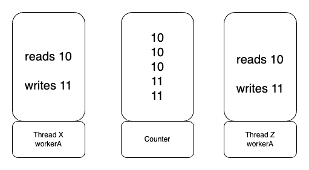

# 코틀린 동시성 프로그래밍

# 01 Hello, Concurrent World!

## 프로세스

프로세스는 실행 중인 애플리케이션의 인스턴스다. 애플리케이션이 시작될 때마다 애플리케이션의 프로세스가 시작된다. 프로세스는 상태를 갖고 있다. 리소스를 여는 핸들, 프로세스 ID, 데이터, 네트워크 연결 등은 프로세스 상태의 일부이며 해당 프로세스 내부의 스레드가 액세스를 할 수 있다.

## 스레드

실행 스레드는 프로세스가 실행할 일연의 명령을 포함한다. 따라서 프로세스는 최소한 하나의 스레드를 포함하며 이 스레드는 애플리케이션의 진입점을 실행하기 위해 생성된다. 보통 진입점은 애플리케이션 main() 함수이며 메인 스레드라 하는데 프로스세의 라이프 사이클과 밀접하게 연관된다. 스레드가 끝나면 프로세스의 다른 스레드와 상관없이 프로세스가 종료된다.

```kotlin
fum main (args: Array<String>) {
    dowork()
}
```

기본적인 애플리케이션이 실행되면 main 함수의 명령 집합이 포함된 메인 스레드가 생성된다.dowork()은 메인 스레드에서 실행되므로 wowork()이 종료되면 애플리케이션의 실행이 종료된다.

각 스레드는 스레드가 ㅅ혹한 프로세스에 포함된 리소스를 액세스하고 수정할 수 있지만 스레드 로컬 스토리지라는 자체 저장소도 갖고 있다.

스레드 안에서 명령은 한 번에 하나씩 실행돼 스레드가 블록되면 블록이 끝날 때까지 같은 스레드에서 다른 명령을 실행할 수 없다. 그러나 많은 스레드가 같은 프로세스에서 생성될 수 있으며 서로 통신할 수 있다. 따라서 애플리케이션이 사용자 경험에 부정적인 영향을 미칠 수 있는 스레드는 블로킹하지 않아야 한다. 블록킹할 때는 블록킹 작업을 별도의 전용 스레드에 할당해야한다. GUI 애플리케이션은 애플리케이션의 응답성을 항상 유지하기 위해서 UI 스레드를 블록하지 않는다.

코틀린이 동시성을 구현한 방식을 보면 여러분이 직접 스레드를 시작하거나 중지할 필요가 없다는 것을 알게된다. 한두 줄의 코드로 코틀린이 특정 스레드나 스레드 풀을 생성해서 코루틴을 실행하도록 지시하기만 하면된다. 스레드와 관련된 나머지 처리는 프레임워크에 의해 수행된다.

## 코루틴

코틀린 문서에서는 코툴린을 경량 스레드라고 한다. 대부분 스레드와 마찬가지로 코루틴이 프로세스가 실행할 명령어 집합의 실행을 정의하기 때문이다. 또한 코루틴은 스레드와 비슷한 라이프 사이클을 갖고 있다.

코루틴은 스레드 안에서 실행된다. 스레드 하나에 많은 코루틴이 있을 수 있지만 주어진 시간에 하나의 스레드에서 하나의 명령만 실행될 수 있다. 즉 같은 스레드에 10개의 코루틴이 있다면 해당 시점에 하나의 코루틴만 실행된다.

스레드와 코루틴의 가장 큰 차이점은 코루틴이 빠르고 적은 비용으로 생성할 수 있다는 것이다. 추천 개의 코루틴도 쉽게 생성할 수 있ㅇ므ㅕ, 수천 개의 스레드를 생성하는 것보다 빠르고 자원도 훨씬 적게 사용한다.

```kotlin
suspend fun createCoroutines(amount: Int) {
    val jobs = ArrayList<Job>()
    for (i in 1..amount) {
        jobs += GlobalScope.launch {
            delay(1000)
        }
    }
    jobs.forEach { it.join() }
}

@Test
@DelicateCoroutinesApi
fun `코루틴 생성 테스트`() = runBlocking {
    println("${Thread.activeCount()} thread active at the start")

    val time = measureTimeMillis {
        createCoroutines(10_000)
    }

    println("${Thread.activeCount()} thread active at the end")
    println("Took $time ms")

}


```

amount에 지정된 수만큼 코루틴을 생성해 각 코루틴을 1초 간 지연시킨 이후 모든 코루틴이 종료될 때까지 기다렸다가 반환한다.

```
# amount = 1
4 thread active at the start
7 thread active at the end
Took 1016 ms

# amount = 10_000
4 thread active at the start
15 thread active at the end
Took 1072 ms

# amount = 100_000
4 thread active at the start
15 thread active at the end
Took 1291 ms

# amopunt = 1_000_000
4 thread active at the start
15 thread active at the end
Took 2842 ms
```

테스트 환경에서 amount를 10,000으로 실행할 때 약 1,072ms가 걸리는데 반해 100,000으로 실행하는데 1,291ms가 소요됐다. **코틀린의 고정된 크기의 스레드 풀을 사용하고 코루틴을 스레드들에 배포하기 때문에 실행 시간이 매우 적게 증가한다.** 따라서 수 천개의 코루틴을 추가하는 것은 거의 영향이 없다. 코루틴이 일시 중단되는 동안 실행 중인 스레드는 다른 코루틴을 실행하는 데 사용되며 코루틴은 시작 또는 재개될 준비 상태가 된다.

Thread 클래스의 activeCount() 메드를 활용하면 활성화된 스레드 수를 알 수 있다. 10,000개의 코루틴을 생성하기 위해서는 4개의 스레드만 생성하면 된다. 그러나 amount 값을 1로 하면 7개의 스레드만 필요하다.

**코루틴이 특성 스레드 안에서만 실행되더라도 스레드와 묶이지 않는다는 점을 이해햐아한다.** 코루틴의 일부를 특정 스레드에서 실행하고, 실행을 중지한 다음 나중에 다른 스레드에서 계속 실행하는 것이 가능하다. 코틀린이 실행 가능한 스레드로 코루틴을 이동시키기 때문이다. createCoroutines() amount를 3으로 하고, launch() 블록을 다음과 같이 변경해서 현재 실행 중인 스레드를 출력시키면 실제 내부에서 일어나는 일을 볼 수 있다.

```kotlin
val jobs = ArrayList<Job>()
for (i in 1..amount) {
    jobs += GlobalScope.launch {
        println("Started $i in ${Thread.currentThread().name}")
        delay(1_000)
        println("Finished $i in ${Thread.currentThread().name}")
    }
}
jobs.forEach { it.join() }

Started 3 in DefaultDispatcher - worker - 2 @coroutine #4
Started 1 in DefaultDispatcher - worker - 1 @coroutine #2
Started 2 in DefaultDispatcher - worker - 3 @coroutine #3
Finished 3 in DefaultDispatcher - worker - 1 @coroutine #4
Finished 2 in DefaultDispatcher - worker - 2 @coroutine #3
Finished 1 in DefaultDispatcher - worker - 3 @coroutine #2
```

스레드는 한 번에 하나의 코루틴만 실행할 수 있기 때문에 프레임워크가 필요에 따라 코루틴을 스레들 사이에 옮기는 역할을 한다. 코루틴은 개발자가 코루틴을 실행할 스레드를 지정하거나 코루틴을 해당 스레드로 제한할지 여부를 지정할 수 있을 만큼 충분히 유연하다.

## 내용 정리

스레드를 블록한다는 거은 그 스레드에ㅓ 코드의 실행을 중지한다는 의미인데, 사용자와 상호작용하는 스레드는 블록하지 않아야 하낟. 코루틴이 기본적으로 스레드 안에 존재하지만 스레에 얽ㅐㅣ지 않은 가벼운 스레드라는 것을 알게 됐다.


동시성은 애플리케이션이 동시에 한 개이상의 스레드에서 실행 될 때 발생한다. 공시성이 발생하려면 두 개 이상의 스레드가 생성돼 하며, 애플리케이션이 제대로 작동하려면 이런 스레드 간의 통신과 동기화가 필요하다.

## 동시성에 대해

```kotlin
fun getProfile(id: Int): Profile {
    val basicUSerInfo = getUserInfo(id)
    val contactInfo = getContactInfo(id)

    return createProfile(basicUSerInfo, contactInfo)
}
```

사용자 정보가 반환되기 전까지 연락처 정보를 요청하지 않는다. 이것이 순차 코드의 장점이다. 장확한 실행순서를 쉽게 알수 있어 예층하지 못하는 일이 벌어지지 않을 것이다. 그러나 순차 코드에는 두 가지 큰 문제점이 있다.

* 동시성 코드에 비해 성능이 저하될 수 있음
* 코드가 실행되는 하드웨어를 제대로 활용하지 못할 수 있음

basicUSerInfo, contactInfo이 서로 의존하지 않아 이들을 동시에 호출할 수 있다.

```kotlin
suspend fun getProfile(id: Int): Profile {
    val basicUSerInfo = asyncGetUserInfo(id)
    val contactInfo = asyncGetContactInfo(id)

    return createProfile(basicUSerInfo.await(), contactInfo.await())
}
```

suspend를 통해 일시 중단 함수로 정의 했고, asyncGetUserInfo(), asyncGetContactInfo()는 서로 다른 스레드에서 실행되도록 작성 했기 때문에 동시성이라고 한다.

await() 호출을 통해 asyncGetUserInfo(), asyncGetContactInfo()가 모두 완료될 때까지 getProfile()의 실행을 일시 중단하는 것이다. 둘 다 완료됐을 때만 createProfile()의 실행을 잃시 중단하는 것이다. 둘 다 완료됐을 때만 createProfile이 실행된다.

## 동시성은 병렬성이 아니다

흔히 동시성과 병렬성을 혼동하곤 한다. 어쨋든 두 개의 코드가 동시에 실행된다는 점에서 둘 다 상당히 비슷해 보이긴 하지만, 이 둘을 나눌 명확한 선을 규정할 것이다.

* 동시성은 두 개 이상의 알고리즘의 실행 시간이 겹칠 때 발생한다. 중첩이 발생하려면 두 개 이상의 슬행 스레드가 필요하다. 이런 스레드들이 단일 코어에서 실행되면 병렬이 아니라 동시에 실행되는데, 단일 코어가 서로 다른 스레드의 인스트럭션을 교차 배치해서, 스레드들의 실행을 효율적으로 겹쳐서 실행한다.
* 병렬은 두 개의 알고리즘이 정확히 같은 시점에 실행될 때 발생한다. 이것이 가능하려면 2개 이상의 코어와 2개 이상의 스레드가 있어야 각 코어가 동시에 스레들의 인스트럭션을 실행할 수 있다. **병렬은 동시성을 의미하지만 동시성은 병렬성이 없어도 발생할 수 있다는 점에서 유의하자.**

## CPU 바운드와 I/O 바운드

동시성과 병렬성이 CPU나 I/O 연산에 바인딩됐는지 여부에 따라 알고리즘의 성능에 어떻게 영햐응ㄹ 미칠 수 있는지를 알아본다.

### CPU 바운드

CPU만 완료하면 되는 작업을 중심으로 구현되는 알고리즘이 많다. 알고리즘의 성능은 실행 중인 CPU의 성능에 좌우되며 CPU만 업그레이드해도 성능이 향상된다.

### I/O 바운드

I/O 바운드는 입출력 장치에 의존하는 알고리즘이다. 실행 시간은 입출력 장치의 속도에 따라 달라지는데. 예컨데 문서를 읽어서 처리하는 알고리즘이면 알고리즘이 I/O 바운드다.

예를 들어 파일을 하드 드라이브에 저장하면 SSD에 저장하는 겻우보다 애플리케이션 성능이 더 나빠진다. 네트워킹이나 컴퓨터 주변기기로부터 입력을 받은 작업들도 I/O 작업이다. I/O 바운드 알고리즘은 I/O 작업을 기준으로 성능에 대한 병목 현상을 이르키는데, 최적화가 외부 시스템이나 장치에 의존한다는 것을 의미한다.

## CPU 바운드 알고리즘에서의 동시성과 병렬성

CPU 바운드 알고리즘의 경우 다중 코어에서 병렬성을 활요앟면 성능을 향상시킬 수 있지만 단일 코어에서 동시성을 구현하면 성능이 저하되기도 한다. 3개의 스레드로 단어를 분리하는 실행을 하면 다음과 같다


### 단일 코어에서 실행

단일 코어에서 실행된다면 하나의 코어가 3개의 스레드 사이에 교착 배치 되며 매번 일정량의 단어를 필터링하고 다음 스레드로 전환된다. 전환 프로세스를 컨텍스트 스위칭이라고 한다.

컨텍스트 스위칭은 현재 스레드의 사애틀ㄹ 저장한 후 다음 스레드의 사앹를 적재해야 하기 때문에 전체 프로세스에 오버헤드가 발생한다. 오버헤드로 인해 다중 스레드로 구현한 로직 앞에서 본 순차적으로 구현에 비해 단일 코어 머신에서는 더 오래 걸릴 가능성이 있다. 순차적으로 구현에서 단일 코어가 모든 작업을 수행하지만 컨텍스트 스위칭이 발생하지 않기 때문에이다.

### 병령 실행

병렬 실행의 경우 각 스레드가 하나의 전용 코어에서 실행된다고 가정하면 실행은 순차적 실행의 약 3분의 1이 될 것이다. 각 코어는 1,000개의 단어를 중단 없이 필터링해서 작업을 완료하면 데 필요한 총 시간을 줄일 것이다.

CPU 바운드 알고리즘을 위해서는 현재 사용중인 장치의 코어 수를 기준으로 적절한 스레드 수를 생성하도록 고려해야한다. 이렇게 하면 CPU 바운드 알고리즘을 실행하기 위해 생성된 스레드 풀인 코틀린의 CommonPool을 활용할 수 있다.

> CommonPool의 크기는 머신의 코어 수에서 1을 뺸 갑싱다. 4코어가 있는 머신의 CommonPool 크기는 3이다.

## I/O 바운드 알고리즘에서의 동시성 대 병렬성

지속적인 대기는 단일 코어 기기에서 대기하는 중에 다른 유용한 작업에 프로세스를 사용할 수 있도록 한다. 따라서 I/O 바운드 동시성 알고리즘은 병렬이거나 단일 코어에 상관없이 유사하게 수행될 것이다.

## 동시성이 어려운 이유

코틀린은 동시성 프로그래밍을 가능한 단순하면서도 여러 가지 사용 사례를 맞춰 조절할 수 있도록 충분히 유연하게 만들려고 노력했다.이런 사례를 이후에 살펴보고 지금은 동시성 코드를 프로그래밍할 때 제시되는 공통된 문제점을 찾아보자

### 레이스 컨디션

예를들어 데이터베이스에서 데이터를 가져오고 웹 서비스를 호출하는 기능을 동시에 수행하는 코드를 작성할 때 흔하게하는 실수는 데이터베이스가 더 빠를 것으로 가정하고 웹 서비스 작업이 끝나자 마자 데이터베이스 작업의 결과에 접근하려고 하는 것이다. 이때쯤이면 데이터베이스에서 나온 정보가 항상 준비된다고 생각한다. 레이스 컨디션은 동시성 일부가 제대로 작동하지 위해 일정한 순서로 완료돼야 할 때 발생한다. 이것은 동시성 코드를 구현하는 방법이 아니다.

```kotlin
@Test
fun `레디스 컨디션`() = runBlocking {
        asyncGetUserInfo(1)
        delay(1000)
        println("User ${user.id} is ${user.name}")
    }

@OptIn(DelicateCoroutinesApi::class)
fun asyncGetUserInfo(id: Int) = GlobalScope.async {
    user = UserInfo()
}
```

1초 지연한 후에 사용자 이름을 출력한다. 이코드는 1초를 지연하기 때문에 잘동작할 것이다. 지연을 없애거나 asyncGetUserInfo() 지연시간을 크게 하면 애플리케이션이 중단된다.

```kotlin
fun asyncGetUserInfo(id: Int) = GlobalScope.async {
    delay(11000)
    user = UserInfo()
}
```

```
lateinit kotlin.UninitializedPropertyAccessException: lateinit property user has not been initialized
at com.example.kotlincoroutine.Coroutines.getUser(Coroutines.kt:42)
```

실행하면 user에 정보를 출력하는 동안 초기화되지 않아서 종료된다. 레이스 컨디션을 해결하려면 접근하려고 하기 전에 정보를 얻을 때까지 명시적으로 기달려야만 한다.

### 원자성 위반

다일 스레드 애플리케이션에서는 모든 코드가 순차적으로 실행되기 때문에 모든 작업이 모두 원자일 것이다, 스레드가 하나만 실행되므로 간섭이 있을 수 없다.

원자성은 객체의 상태가 동시에 수정될 수 있을 때 필요하며 그 상태의 수정이 겹치지 않도록 보장 해야한다. 수정이 렵칠 수 있다는 것은 데이터 손실이 발생할 수 있다는 뜻인데, 가령 코루틴이 다른 코루틴이 수정하고 있는 데이터를 바꿀 수 있다.

```kotlin
@Test
fun `원자성 위반`() = runBlocking {
        val workerA = asyncIncrement(2_000)
        val workerB = asyncIncrement(100)

        workerA.await()
        workerB.await()
        println("counter [$counter]")

    }

@OptIn(DelicateCoroutinesApi::class)
fun asyncIncrement(by: Int) = GlobalScope.async {
    for (i in 0 until by)
        counter++
}
```

한 호출에서는 counter를 2,000 증가 시키는 반면 다른 호출에서는 100번 증가 시킬것이다. **문제는 asyncIncrement()의 두번 실행이 서로 간섭할 수 있으며, 설로 다른 코루틴 인스턴스가 값을 재정의할 수 있다는 것이다.** 여러번 실행하면 2,100 보다 낮은 값을 출력하는 경우가 발생한다.



counter++의 원장성이 부족해서 workerA와 workerB에서 각각 한번씩 값을 증가시켜야 하지만 한 번만 증가 시켰다.

코루틴에서 명령이 중첩되는 것은 counter++ 작업이 원자적이지 않기 때문이다. 실제로 이 작업은 counter의 현재 값을 읽은 당므 그 값을 1씩 증가시킨 후에 그 결과를 counter에 다시 저장하는 세가지 명령어로 나눌 수 있다. counter++에서 원자성이 없기 때문에 코루틴이 다른 코루틴이 하는 조작을 무시하고 값을 일고 수정할 수 있다.

### 교착 상태

동시성 코드가 올바르게 동기화되려면 다른 스레드에서 작업이 완료되는 동안 실행을 일시 중단하거나 차단할 필요가 있다. 이러한 상황의 복잡성 때문에, 즉 순환적 의존성으로 인해 전체 애플리케이션의 실행이 중단되는 상황이 드물지 않게 일어난다.

```kotlin
@OptIn(DelicateCoroutinesApi::class)
@Test
fun `교착 상태`() = runBlocking {
        GlobalScope.launch {
            delay(1_000)
            // wait for JobB to Fish
            jobB.join()
        }

        GlobalScope.launch {
            // wait for JobA to Fish
            jobA.join()
        }

        // wait for JobA to Fish
        jobA.join()
        println("Finished")
    }
```

jobA는 jobB가 실행을 완료하기를 기달리고 있는 반면 jobB는 jobA가 끝나기를 기다리고 있다. 서로가 서로를 기달리고 있기 때문에 누구도 끝나지 않는따 따라서 Finished 메시지가 출력되지 않는다.

실제 교착 상태를 발견하고 수정하기란 이보다 훨씬 어렵다. 일반적으로 복잡한 잠금 연관관계에 의해 발생하며 레이스 컨디션과 자주 발생한다.

### 라이브 락

라이브 락은 애플리케이션이 올바르게 실행을 계속할 수 없을 때 발생하는 교차 상태와 유사하다. 라이브 락이 진행될 때 애플리케이션의 상태는 지속적으로 변하지만 애플리케이션이 정상 실행으로 돌아오지 못하게 하는 방향으로 상태가 변한다는 점이 다르다.

두 사람이 좁은 복도에 마주보고 걸어오는 모습으로 라이브락을 설명한다. 두 사람은 각각 한쪽 방향으로 이동해서 서로를 피하려 한다. A가 왼쪽으로 이동할 때 B는 오른쪽으로 이동하지만 마주보고 있기 때문에 서로의 길을 막고 있다. 또 서로가 움직일 때마다 서로 한번 서로 길을 막게 된다. 이렇게 움직이며 서로의 길을 막게 된다. 둘은 교착상 태에서 벗어나는 방법을 알고 있다. **하지만 회복하려는 시점이 그들의 진행을 방해한다.**

교착 상태를 복구하도록 설계된 알고리즘에서 라이브 락이 발생하는 경우가 많다. 교착 상태에서 복구하려는 시도가 라이브 락을 만들어 낼 수도 있다.

## 코틀린에서의 동시성

### 넌 블로킹

스레드는 무겁고 생성하는 데 비용이 만힝 들며 제한된 수의 스레드만 생성할 수 있다. 스레드가 블록킹되면 어떻게 보면 자원이 낭비되는 셈이어서 코틀린은 중단 가능한 연산이라는 기능을 제공한다. 스레드의 실행을 블록킹하지 않으면서 실행을 잠시 중단하는 것이다. 예를 들어 스레드 Y에서 작업이 끝나기를 기다리려면 스레드 X를 블로킹하는 대신, 대기해야하는 코드를 일시 중단하고 그 동안 스레드 X를 다른 연산 작업에 사용하기도 한다.

코틀린은 채널, 액터, 상호 배제와 같은 훌룽한 기본형도 제공해 스레드를 블록하지 않고 동시성 코드를 효과적으로 통신하고 동기화하는 메커니즘을 제공한다.

### 명시적인 선언

연산이 동시에 실행돼야 하는 시점을 명시적으로 만드는 것이 중요하다. 일시 중단 가능 연산은 기본적으로 순차적으로 실행된다. 연산은 일시 중단될 때 스레드를 블록킹하지 않기 때문에 직접적인 단점은 아니다.

```kotlin
@Test
fun `명시적 선언`() = runBlocking {
        val time = measureTimeMillis {
            val name = getName()
            val lastName = getLastName()
            println("Hello $name $lastName")
        }
        println("Execution took $time ms")

    }

private suspend fun getName(): String {
    delay(1_000)
    return "Yun"
}

private suspend fun getLastName(): String {
    delay(1_000)
    return "Kim"
}
```

현재 스레드에서 일시 중단 가능한 연산 getName(), getLastName()을 순차적으로 실행한다.

```
Hello Yun Kim
Execution took 2023 ms
```

실행 스레드를 블록하지 않는 비 동시성 코드를 작성할 수 있어 편리하다. 그러나 getLastName, getName 간에 서로 의존성이 없기 때문에 getName을 실행할 때 대기해야할 필요가 없어 동시에 실행하는 것이 좋다.

```kotlin
@Test
fun `명시적 선언`() = runBlocking {
        val time = measureTimeMillis {
            val name = async { getName() }
            val lastName = async { getLastName() }
            println("Hello ${name.await()} ${lastName.await()}")
        }
        println("Execution took $time ms")
    }
```

```
Hello Yun Kim
Execution took 1026 ms
```

async {...}를 호출해 두 함수를 동시에 실행해야 하며 await()를 호출해 두 연산에 모두 결과가 나타날 때까지 일시 중단 요청한다. 1026 ms으로 동시에 실행된것을 확인할 수 있다.

### 가독성

코틀린의 동시성 코드는 순차적 코드만큼 읽기 쉽다. 자바를 비롯해 다른 언어에서는 동시성 코드를 일고 이해하고 디버깅하는 것이 어렵다는 문제점이 있다. 코틀린의 접근법은 관용구적인 동시성 코드를 허용한다.

```kotlin
suspend fun getProfile(id: Int) {
    val basicUserInfo = asyncGetUserInfo(id)
    val contactInfo = asyncGetContactInfo(id)

    createProfile(basicUserInfo.await(), contactInfo.wait())
}
```

suspend 메소드는 백그라운드 스레드에서 실행될 두 메소드를 호출하고 정보를 처리하기 전에 완료를 기달린다. 순차 코드 처렄 간단하고 읽고 디버깅하기 쉬운 코드가 됐다.

### 기본형 활용

코틀린은 동시성 코드를 쉽게 구현할 수 있도록 고급 함수와 기본형을 제공한다

* 스레드는 스레드 이름을 파라미터로하는 newSingleTreadContext()를 호출하면 생성된다. 일단 생성되면 필요한 칸큼 많은 코루틴을 수행하는 데 사용할 수 있다.
* 스레드 풀은 크기와 이름을 파라미터로 하는 newFixesdTreadPoolContext()를 호출하면 쉽게 생성할 수 있다.
* CommonPooldms CPU 바운드 작업에 최적인 스레드 풀이다. 최대 크기는 스스템 코어에서 1을 뺸 값이다.
* 코루틴을 다른 스레드로 이동시키는 역할은 런타임이 담당한다.
* 채널, 뮤텍스 및 스래드 한정과 같은 코루틴의 통신과 동기화를 위해 필요한 많은 기본형 기술이 제공된다.

### 유연성

코틀린은 간단하면서도 유연하게 동시성을 사용하게 해주는 기본형을 많이 제공한다.

* 채널: 코루틴 간 데이터를 안전하게 보내고 받는 데 사용할 수 있는 파이프다.
* 작업자 풀: 많은 스레드에서 연산 집합의 처리를 나눌 수 있는 코루틴의 풀이다.
* 액터: 채널과 코루틴을 사용하는 상태를 감싼 래퍼로 여러 스레드에서 상태를 안전하게 수정하는 메커니즘을 제공한다.
* 뮤텍스: 크리티컬 존 영역을 정의해 한 번에 하나의 스레드만 실행할 수 있도록 하는 동기화 메커니즘, 크리티컬 존에 액세스하려는 코루틴은 이전 코루틴이 크리티컬 존을 빠져나올 때까지 일시 정지된다.
* 스레드 한정: 코루틴의 실행을 제한해서 지정된 스레드에서만 실행하도록 하는 기능이다.
* 생성자: 필요에 따라 정보를 생성할 수 있고 새로운 정보가 필요하지 않을 때 일시 중단될 수 있는 데이터 소스다.

## 코틀린 동시성 관련 개념과 용어

### 일시 중단 연산

일시 중단 연산은 해당 스레드를 차단하지 않고 실행을 일시 중지할 수 있는 연산이다. 스레드를 차단하는 것은 좀불편하기 때문에 자체 실행을 일시 중단하면 일시 중단 연산을 통해 스레드를 다시 시작해야 할 때까지 스레드를 다른 연산에서 사용할 수 있다.

### 일시 중단 함수

일시 중단 함수는 함수 형식의 일시 중단 여산이다. 일시 중단 함수는 supend 제어자 때문에 쉽게 식별할 수있다.

```kotlin
suspend fun greetAfter(name: Stirng, delayMillis: Long) {
    delay(delayMillis)
    print("Hellom $name")
}
```

greetAfter()의 실행은 delay()가 호출될 때 일시 중단된다. delay()는 자체가 일시 중단 함수이며, 주어진 시간 동안 실행을 일시 중단한다. delay()가 완료되면 greetAfter()가 실행을 정상적으로 다시 시작한다. greetAfter()가 일시 중지된 동안 실행 스레드가 다른 연산을 수행하는 데 사용될 수 있다.

### 람다 일시 중단

일반적인 람다와 마찬가지로, 일시 중단 람다는 익명으로 로컬 함수다. 일시 중단 람다는 다른 잀히 중단 함수를 호출함으로써 자신의 실행을 중단할 수 있다는 점에서 보통의 람다와 차이가 있다.

### 코루틴 디스패처

코루틴은 시작하거나 재개할 스레드를 결정하기 위해 코루틴 디스패처가 사용된다. 모든 코루틴 디스패처는 CoroutineDispatcher 인터페이스를 구현해야 한다.

* DefulatDispatcher: 현재 CommonPool과 같다. 앞으로 바뀔 수 있다.
* CommonPool: 공유된 백그라운드 스레드 풀에서 코루틴을 실행하고 다시 시작한다. 기본 크기는 CPU 바운드 작업에서 사용하기에 적합하다. 하지만 현재 시점에서는 CommonPool이 기본 디스패처로 지원되지 않는다.
* Unconfined: 현재 스레드(코루틴이 호출된 스레드)에서 코루틴을 시작하지만 어떤 스레드에서 코루틴이 다시 재개될 수 있다. 디스패처에서는 스레드 정책을 사용하지 않는다.

디스패처와 함께 필요에 따라 Pool 또는 스레드를 정의하는 데 사용할 수 있는 몇가지 빌드거 있다.

* newSingleThreadContext(): 단일 스레드로 디스패처를 생성한다. 여기에서 실행되는 코루틴은 항상 같은 스레드에서 시작되고 재개된다.
* newFixedThreadPoolContext(): 지정된 크기의 스레드 풀이 있는 디스패처를 만든다. 런타임은 디스패처에서 실행된 코루틴을 시작하고 재개할 스레드를 결정한다.

### 코루틴 빌더

코루틴 빌더는 일시 중단 담다를 받아 그것을 실행시키는 코루틴을 생성하는 함수다. 코루틴은 다음과 같은 다양한 일반적인 시나리오에 맞게 활용할 수 있는 코두틴 빌더를 많이 제공한다.

* async(): 결과가 예상되는 코루틴을 시작한 데 사용한다. async()는 코루틴 내부에서 일어나는 모든 예외를 캡처해서 결과에 넣기 때문에 조심해서 사용해야 한다. 결과 또는 예외를 포함하는 Deferred<T>를 리턴한다.
* launch(): 결과를 반환하지 않는 코루틴을 시작한다. 자체 혹은 자식 코루틴의 실행을 취소하기 위해 사용할 수 있는 Job을 반환한다.
* runBlocking(): 블로킹 코드를 일시 중지 가능한 코드로 연결하기 위해 작성됐다. 보통 main() 메서드와 유닛 테스트에서 사용된다. runBlocking()은 코루틴의 실행이 끝날 때까지 현재 스레드를 차단한다.

# 02 코루틴 인 액션

## 스레드 생성

코틀린은 스레드 생성 과정을 단순화해서 쉽고 간단하게 스레드를 생성할 수 있다.

### CoroutineDispatcher

코틀린에서는 스레드와 스레드 풀을 쉽게 만들 수 있지만 직접 엑세스하거나 제어하지 않는 점을 알아야 한다. CoroutineDispatcher는 기본적으로 가용성, 부하, 설정을 기반으로 스레드 간에 코루틴을 분산하는 오케스트레이터다.

여기에서는 스레드를 하나만 갖는 CoroutineDispatcher를 생성할것이며, 거기에 추가하는 모든 코루틴은 그 특정 스레드에서 실행된다. 그렇게 하려면 단 하나의 스레드만 갖는 CoroutineDispatcher를 확장한 TheadPoolDispacher를 생성한다.

```kotlin
@OptIn(DelicateCoroutinesApi::class)
@Test
fun name() {
    newSingleThreadContext(name = "serviceCall")
}
```

### 디스패처에 코루틴 붙이기

코루틴을 시작하는 두 가지 방법을 살펴 보자, 그 결과와 에러를 처리하려면 둘 사이의 차이를 알아야 한다.

#### async 코루틴 시작

결과 처리를 목적으로 코루틴을 시작했다면 async()를 사용해야 한다. async()는 Deferred<T>를 반환하는데, 디퍼드 코루틴 프레임워크에서 제공하는 **취소 불가능한 넌블로킹 퓨처를 의미하한다 async()를 사용할 때 결과를 처리하는 것을 잊어서는 안되기 때문에 주의하자.**

```kotlin
@OptIn(DelicateCoroutinesApi::class)
@Test
fun `async() 사용 방법`() = runBlocking {
        val task = GlobalScope.async {
            doSomething()
        }

        task.join()
        println("Completed")
    }

private fun doSomething() {
    throw UnsupportedOperationException("Can`t Do")
}
```

예외 코드를 통해 애플리케이션이 실해응ㄹ 멈추고 예외 스텍이 출력되며 또한 애플리케이션 종료코드는 0이 아닐것이라고 생각할 수 있다. 하지만 해당 코드는 `Completed`를 출력하며 정상적으로 종료된다.

async() 블록안에서 발생하는 예외는 그 결과에 첨부되는데, 그 결과를 확인해야 예외를 찾을 수 있다. 이를 위해서 isCancelled, getCancellationException() 메소드를 함께 사용해 안전하게 예외를 가져올 수 있다.

```kotlin
@OptIn(DelicateCoroutinesApi::class, InternalCoroutinesApi::class)
@Test
fun `async() 안전하게 예외 처리`() = runBlocking {
        val task = GlobalScope.async {
            doSomething()
        }

        task.join()
        if (task.isCancelled) {
            val exception = task.getCancellationException()
            println("Error with message: ${exception.cause}")
        } else {
            println("Success")
        }

        println("Completed")
    }
```

출력 메시지는 다음과 같다.

```
Error with message: java.lang.UnsupportedOperationException: Can`t Do
Completed
```

예외를 전파하기 위해서는 디퍼드에서 await()을 호출할 수 있다.

```kotlin
@OptIn(DelicateCoroutinesApi::class)
@Test
fun `async() 사용 방법`() = runBlocking {
        val task = GlobalScope.async {
            doSomething()
        }

        task.await()
        println("Completed")
    }
```

그러면 애플리케이션이 비정상적으로 중단된다.

```
java.lang.UnsupportedOperationException: Can`t Do
	at com.example.kotlincoroutine.Coroutines.doSomething(Coroutines.kt:173)
	at com.example.kotlincoroutine.Coroutines.access$doSomething(Coroutines.kt:15)
	at com.example.kotlincoroutine.Coroutines$async() 사용 방법$1$task$1.invokeSuspend(Coroutines.kt:145)
	(Coroutine boundary)
	at com.example.kotlincoroutine.Coroutines$async() 사용 방법$1.invokeSuspend(Coroutines.kt:149)
Caused by: java.lang.UnsupportedOperationException: Can`t Do
	at com.example.kotlincoroutine.Coroutines.doSomething(Coroutines.kt:173)
	at com.example.kotlincoroutine.Coroutines.access$doSomething(Coroutines.kt:15)
	at com.example.kotlincoroutine.Coroutines$async() 사용 방법$1$task$1.invokeSuspend(Coroutines.kt:145)
	at kotlin.coroutines.jvm.internal.BaseContinuationImpl.resumeWith(ContinuationImpl.kt:33)
	at kotlinx.coroutines.DispatchedTask.run(DispatchedTask.kt:106)
	at kotlinx.coroutines.scheduling.CoroutineScheduler.runSafely(CoroutineScheduler.kt:570)
	at kotlinx.coroutines.scheduling.CoroutineScheduler$Worker.executeTask(CoroutineScheduler.kt:750)
	at kotlinx.coroutines.scheduling.CoroutineScheduler$Worker.runWorker(CoroutineScheduler.kt:677)
	at kotlinx.coroutines.scheduling.CoroutineScheduler$Worker.run(CoroutineScheduler.kt:664)
```

**await()를 호출해서 중단되는데 이 경우가 예외를 감싸지 않고 전파하는, 감싸지 않은 디퍼드다.**

**join()으로 대기한 후 검증을 하고 어떤 오류를 처리하는 것과 await()를 직접호출하는 방식의 주요 차이점은 join()는 예외를 전파하지 않고 처리하는 반면, await()는 단지 호출하는 것만으로 예외가 전파된다는 점이다.**

**await()를 사용하는 예쩨에서는 실행 중 에러를 의미하는 코드를 1을 반환하는 반면, join()으로 대기하고 iscancelled, getCancellationException()를 사용해서 에러를 처리하는 경우 성공을 의미하는 0이 나온다.**

### launch 코루틴 시작

결과를 반환하지 않는 코루틴을 시작하려면 launch()를 사용 해야한다. lunach()를 연산이 실패한 경우에만 통보 받기를 원하는 경우 파이어 앤 포켓 시나리오를 위해 설계됐으며, 필요할 때 취소할 수있는 함수도 함께 제공된다.

```kotlin
@Test
fun `launch`() = runBlocking {
        val task = GlobalScope.launch {
            doSomething()
        }
        task.join()
        println("Completed")
    }
```

```
Exception in thread "DefaultDispatcher-worker-1 @coroutine#2" java.lang.UnsupportedOperationException: Can`t Do
	at com.example.kotlincoroutine.Coroutines.doSomething(Coroutines.kt:184)
	at com.example.kotlincoroutine.Coroutines.access$doSomething(Coroutines.kt:16)
	at com.example.kotlincoroutine.Coroutines$launch$1$task$1.invokeSuspend(Coroutines.kt:191)
	at kotlin.coroutines.jvm.internal.BaseContinuationImpl.resumeWith(ContinuationImpl.kt:33)
	at kotlinx.coroutines.DispatchedTask.run(DispatchedTask.kt:106)
	at kotlinx.coroutines.scheduling.CoroutineScheduler.runSafely(CoroutineScheduler.kt:570)
	at kotlinx.coroutines.scheduling.CoroutineScheduler$Worker.executeTask(CoroutineScheduler.kt:750)
	at kotlinx.coroutines.scheduling.CoroutineScheduler$Worker.runWorker(CoroutineScheduler.kt:677)
	at kotlinx.coroutines.scheduling.CoroutineScheduler$Worker.run(CoroutineScheduler.kt:664)
	Suppressed: kotlinx.coroutines.DiagnosticCoroutineContextException: [CoroutineId(2), "coroutine#2":StandaloneCoroutine{Cancelling}@b998694, Dispatchers.Default]
Completed
> Task :test
```

**예외가 스택에 출력되지만 실행이 중단되지 않고 애플리케이션은 종료되며 Completed 까지 출력되는 것을 확인할 수 있다.**

#### 코루틴을 시작할 때 특정 디스패처 사용하기

지금까지 async()와 launch()로 코루틴을 만드는 방법을 살펴보았다. 두 경우 모두 기본 디스패처를 사용하고 있었다. 다음 코드를 보자

```kotlin
@Test
fun `특정 디스패처 사용하기`() = runBlocking {
        val task = launch {
            printCurrentThread()
        }
        task.join()
    }

fun printCurrentThread() {
    println("Running is thread [${Thread.currentThread().name}]") // 현재 스레드 출력
}
```

```
Running is thread [Test worker @coroutine#2]
```

코드를 실행하면 기본적으로 코루틴이 DefaultDispatcher에서 실행됨을 알 수 있는데, 글을 쓰는 시점에 CommonPool과 같은 디스패처지만 향후에는 바뀔 수 있다.

이전과 같은 방식으로, CoroutinDispatcher를 생성하기 위해 코드를 변경하고 그 다음 디스패처를 launch()로 전달하면 지정된 스데르에서 코루틴이 실행됨을 알 수 있다.

```kotlin

@Test
fun `특정 디스패처 사용하기2`() = runBlocking {
    val dispatcher = newSingleThreadContext("ServiceCall")
    val task = launch(dispatcher) {
        printCurrentThread()
    }
    task.join()
}
```

```
Running is thread [ServiceCall @coroutine#2]
```

스레드의 이름이 디스패처에 대한 설정한 이름으로 출력된다.

## 요약

* CoroutineDispatcher는 코루틴을 특정 스레드 또는 스레드 그룹에서 실행하도록 할 수 있다.
* 하나 이상의 코루틴을 launch, async로 스레드에서 실행 할 수 있다.
* launch는 파이어 앤 포갯와 같은 시나리오에서 사용돼야 하는데데, 코루틴이 무언가를 반환할 거을 예상하지 않는 경우를 말한다.
* 코루틴이 처리도리 결과를 생성할 때 async를 사용해야한다. **결과를 처리하지 않고 async를 사용하면 예외가 전파가 되지 않는다.**

# 03 라이프 사이클과 에러 핸들링

3장에서는 두 가지 유형으 비동기 작업, Job, Deferred에 대해 자세히 살펴 본다. 두 유형의 유사점과 차이점은 무엇인지 그리고 이들의 라이프 사이클에 대해서도 자세히 알아볼 것이다. 3장에서 다루는 주제는 다음과 같다.

* 잡과 그 사용사례
* 잡과 디퍼드의 라이프 사이클
* 디퍼드 사용사례
* 집의 각 상태별 예상되는 상항
* 잡의 현재 상태를 산출하는 방법
* 예외 처리 방법

## 잡과 디퍼드

비동기 함수를 다음과 같이 두 그룹으로 나눠 볼 수 있다.

* 결과가 없는 비동기 함수: 일반적인 시나리오는 로그에 그록하고 분석 데이터를 전송하는 것과 같은 백그라운으 작업이 들 수 있다. 완료 여부를 머니터링할 수 있지만 결과를 갖지 않는다. 백그라운드 작업이 이런 유형에 속한다.
* 결과를 반환하는 비동기 함수: 예를 들어 비동기 함수가 웹 서버에서 정보를 가져올 때 거의 대부분 해당 함수를 사용해 정보를 반환하고자 할 것이다.

두 가지 중 어떤 경우인건 해당 작업에 접근하고 예외가 발생하면 그에 대응하거나, 해당 작업이 더 이상 필요하지 않을 때는 취소한다. 두 가지 유형을 어떻게 생성하고 상호 작용할 수 있는지 살펴보자.

### Job

잡은 파이어 앤 포겟 작업이다. 한 번 시작된 작업은 예외가 발생하지 않는 한 대기 하지 않는다. 다음과 같이 코루틴 빌더인 launch()를 사용해 잡을 생성하는 방법이 가장 일반적이다.

```kotlin
@Test
fun `Job 사용 방법`() = runBlocking {
        val job = GlobalScope.launch {
            // Do something..
        }
        // val job = Job() // 팩토리 함수로 사용 가능 
    }
```

#### 예외 처리

기본적으로 잡 내부에서 발생하는 예외는 잡을 생성한 곳까지 전파된다. 잡이 완료되기를 기달리지 않아도 발생한다.

````kotlin
@Test
fun `Job 예외 처리`() = runBlocking {
        val job = GlobalScope.launch {
            // Do something..
            TODO("Not Implemented!")
        }
        delay(500)
    }
````

이렇게 하면 현재 스레드의 포착되지 않은 예외 처리기에 예외가 전파된다. JVM 애플리케이션이라는 표준 오류 출력에 다음과 같이 예외가 출력됨을 의미한다.

```
Exception in thread "DefaultDispatcher-worker-1 @coroutine#2" kotlin.NotImplementedError: An operation is not implemented: Not Implemented!
	at com.example.kotlincoroutine.Coroutines$Job 예외 처리$1$job$1.invokeSuspend(Coroutines.kt:238)
	at kotlin.coroutines.jvm.internal.BaseContinuationImpl.resumeWith(ContinuationImpl.kt:33)
	at kotlinx.coroutines.DispatchedTask.run(DispatchedTask.kt:106)
	at kotlinx.coroutines.scheduling.CoroutineScheduler.runSafely(CoroutineScheduler.kt:570)
	at kotlinx.coroutines.scheduling.CoroutineScheduler$Worker.executeTask(CoroutineScheduler.kt:750)
	at kotlinx.coroutines.scheduling.CoroutineScheduler$Worker.runWorker(CoroutineScheduler.kt:677)
	at kotlinx.coroutines.scheduling.CoroutineScheduler$Worker.run(CoroutineScheduler.kt:664)
	Suppressed: kotlinx.coroutines.DiagnosticCoroutineContextException: [CoroutineId(2), "coroutine#2":StandaloneCoroutine{Cancelling}@1b679997, Dispatchers.Default]
```

예외가 발생 하더라도 표준예외를 출력할 뿐 애플리케이션의 코드 흐름을 그대로 진행된다.

#### 라이프 사이클


* New(생성): 존재하지만 아직 실행 되지 않은 잡
* Active(활성): 실행 중인 잡, 일시 중단된 잡도 활성으로 간주된다.
* Completed(완료 됨): 잡이 더 이상 실행되지 않는 경우
* Cancelling(최소 중): 실행 중인 잡에서 cancel()이 호출되면 취소가 완료될 때까지 시간ㅇ니 걸리기도 한다. 이것은 활성과 취소 사이의 중간 상태다.
* Cancelled(취소 됨): 취소로 인해 실행이 완료된 잡, 취소된 잡도 완료로 간주될 수 있다.

#### 생성

잡은 기본적으로 launch(), job()을 사용해서 생성될 때 자동으로 시작된다. 잡을 생성할 때 자동으로 시작되지 않게 하려면 CoroutineStart.LAZY를 사용 해야한다.

```kotlin
@Test
fun `생성 CoroutineStart LAZY`() = runBlocking {
        GlobalScope.launch(start = CoroutineStart.LAZY) {
            TODO("Not Implemented!")
        }
        delay(500)
    }
```

코드를 실행하면 요류가 출력되지 않는다. 작업이 생성됐지만 시작된 적이 없으므로 예외가 발생하지 않는다.

#### 활성

생성 상태에 있는 잡은 다양한 방법으로 시작할 수 있지만 일반적으로 start(), join()을 호출해서 실핼 하는데, 둘의 차이점은 전자의 경우 잡이 완료될 때까지 기다리지 않고 잡을 시작하는데 반면 후자는 잡이 완료될 때까지 실행을 실시 중단한다는 것이다. 다음 예쩨를 살펴보자.

```kotlin
@Test
fun `활성 CoroutineStart LAZY start`() = runBlocking {
        val job = GlobalScope.launch(start = CoroutineStart.LAZY) {
            delay(3000)
        }
        job.start()
    }
```

앞의 코드는 job.start()가 호출될 때 실행을 일시 중단하지 않으므로 애플리케이션이 job이 완료되는 것을 기달리지 않고 실행을 끝낸다.

join()을 사용하면 애플리케이션이 job을 완료할 때까지 대기한다.

```kotlin

@Test
fun `활성 CoroutineStart LAZY join`() = runBlocking {
    val job = GlobalScope.launch(start = CoroutineStart.LAZY) {
        delay(3000)
    }
    job.join()
}
```

**따라서 시작된 모든 잡을 활성 상태이며 실행이 완료되거나 취소가 요청될 때까지 활성 상태가 된다.**

#### 취소 중

취소 요청을 받은 활성 잡은 취소 중 이라고 하는 스테리징 상태로 들어갈 수 있다. 잡에 실행을 취소하도록 요청하려면 cancel() 함수를 호출해야 한다.

```kotlin
@Test
fun `cancel `() = runBlocking {
        val job = GlobalScope.launch(start = CoroutineStart.LAZY) {
            // Do some work here
            delay(5000)
        }
        delay(2000)
        job.cancel()
    }
```

잡 실행은 2초 후에 취소된다. cancel()에는 선택적 매개변수는 cause가 있다. 예외가 취소의 원인일 때는 원인을 같이 제공해 주면 나중에 찾아볼 수 있다.

#### 취소 됨

취소 또는 처리되지 않은 예외로 인해 실행이 종료된 잡은 취소됨 으로 간주된다. 잡이 취소되면 getCancellationException() 함수를 통해 취소에 대한 정보를 얻을 수 있다. 이 함수는 CancellationException을 반환하는데 취소 원인 등의 정보를 검색할 때 사용할 수 있다.

```kotlin
@OptIn(InternalCoroutinesApi::class)
@Test
fun `cancel getCancellationException`() = runBlocking {
        val job = GlobalScope.launch(start = CoroutineStart.LAZY) {
            // Do some work here
            delay(5000)
        }
        delay(2000)
        job.cancel(cause = CancellationException("Tried of waiting"))

        val cancellation = job.getCancellationException()
        println(cancellation)
    }
```

취소된 잡과 예외로 인해 실패한 잡을 구별하기 위해 다음과 같이 CoroutineException Handler를 설정해 취소 작업을 처리하는 것이 좋다.

```kotlin
@Test
fun `cancel CoroutineException Handler`() = runBlocking {
        val exceptionHandler = CoroutineExceptionHandler { _: CoroutineContext, throwable: Throwable ->
            println("Job cancelled due to ${throwable.message}")
        }
        GlobalScope.launch(exceptionHandler) {
            TODO("Not implemented yet!")
        }
        delay(2000)
    }
```

```
Job cancelled due to An operation is not implemented: Not implemented yet!
```

다음과 같이 invokeOnCompletion()을 사용할 수도 있다.

```kotlin
@Test
fun `cancel invokeOnCompletion`() = runBlocking {
        GlobalScope.launch {
            TODO("Not implemented yet!")
        }.invokeOnCompletion { cause ->
            cause?.let {
                println("Job canelled due to ${it.message}")
            }
        }
        delay(2000)
    }
```

#### 완료 됨

실행이 중지된 잡은 완료됨 으로 간주된다. 이는 실행이 정상적으로 종료됐거나 추ㅏㅣ소됐는지 또는 예외 때문에 종려됐는지 여부에 관계 없이 적용된다. 이러한 이유로 취소된 항목은 완료된 항목의 하위 항목으로 간주되기도 한다.

#### 잡의 현재 상태 확인

| 상태               | isActive | isCompleted | isCancelled |
|------------------|----------|-------------|-------------|
| 생성됨(Created)     | false    | false       | false       |
| 활성(Active)       | true     | false       | false       |
| 취소 중(Cancelling) | true     | false       | true        |
| 취소됨(Cancelled)   | false    | true        | true        |
| 완료됨(Completed)   | false    | true        | false       |

### Deferred

디퍼드는 결과를 갖는 비동기 작업을 수행하기 위해 잡을 확장한다. 다른 언어에서 퓨처 또는 프로미스 라고 하는 것의 코틀린 구현체가 디퍼드다. 기본적인 콘셉트는 연산이 객체를 반환할 것이며, 객체는 비동기 작업이 완료될 때 까지 비어 있다는 것이다. **디퍼드와 그 상태의 라이프 사이클은 잡과 비슷하다. 실제 차이점은 2장엣 ㅓ봤던 반환 유형과 앞으로 설명할 에러 핸들링이다.**

```kotlin
@Test
fun `Deferred handler`() = runBlocking {
        val headlinesTask = GlobalScope.async {
            getHeadLines()
        }
        headlinesTask.await()
    }

private fun getHeadLines() {
    // Do some work here
}
```

#### 예외 처리

**순수한 잡과 달리 디퍼드는 처리되지 않은 예외를 자동으로 전파하지 않는다. 디퍼드의 결과를 기대할 것으로 예상하기 때문에 이런 방식을 사용 했다. 실행이 성공했는지 확인 하는 것은 사용자의 몫이다.**

```kotlin
@Test
fun `Deferred 예외 처리`(): Unit = runBlocking {
        val deferred = GlobalScope.async {
            TODO("Not implemented yet!")
        }

        // Wait for it to fail
        delay(2000)
    }
```

앞의 예제는 지연된 실패를 갖지만 예외를 전파하지 않는다. 여기서 디퍼드의 실행을 모니터링하지 않은 시나리오를 재현할 수 있도록 delay()를 사용하고 있다. 디퍼드는 모니터링하도록 돼 있으므로, 이렇게 해서는 안된다. 예외를 쉽게 전파할 수 있는 방법을 알아본다.

```kotlin
@Test
fun `Deferred 예외 처리`(): Unit = runBlocking {
        val deferred = GlobalScope.async {
            TODO("Not implemented yet!")
        }

        // Wait for it to fail
        deferred.await()
    }
```

앞의 코드와 다르게 이 코드는 예외를 전파하고 애플리케이션을 중단 시킬 것이다.

```
An operation is not implemented: Not implemented yet!
kotlin.NotImplementedError: An operation is not implemented: Not implemented yet!
	at com.example.kotlincoroutine.Coroutines$Deferred 예외 처리$1$deferred$1.invokeSuspend(Coroutines.kt:345)
	at kotlin.coroutines.jvm.internal.BaseContinuationImpl.resumeWith(ContinuationImpl.kt:33)
	at kotlinx.coroutines.DispatchedTask.run(DispatchedTask.kt:106)
	at kotlinx.coroutines.scheduling.CoroutineScheduler.runSafely(CoroutineScheduler.kt:570)
	at kotlinx.coroutines.scheduling.CoroutineScheduler$Worker.executeTask(CoroutineScheduler.kt:750)
	at kotlinx.coroutines.scheduling.CoroutineScheduler$Worker.runWorker(CoroutineScheduler.kt:677)
	at kotlinx.coroutines.scheduling.CoroutineScheduler$Worker.run(CoroutineScheduler.kt:664)
```

디퍼드의 실행이 코드 흐름의 필수적인 부분임을 나타내는 것이기 때문에 await()을 호출하려는 이런 방식으로 설계됐다. 이런 방법을 사용하면 명령형 으로 보이는 비동기 코드를 보다 쉽게 작성할 수 있고 try-catch 블록을 이용해 예외를 처리할 수 있다.

```kotlin
@Test
fun `Deferred 예외 처리 try-catch`(): Unit = runBlocking {
        val deferred = GlobalScope.async {
            TODO("Not implemented yet!")
        }
        try {
            deferred.await()
        } catch (e: Throwable) {
            println(e.printStackTrace())
        }
    }
```

## 상태는 한 방향으로만 이동

일단 잡이 특정 상태에 도달하면 이전 상태로 되돌아가지 않는다.

```kotlin
@Test
fun `상태는 한 방향으로만 이동`() = runBlocking {
        val time = measureTimeMillis {
            val job = GlobalScope.launch {
                delay(2000)
            }
            job.join()

            // Restart the job
            job.start()
            job.join()
        }
        println("Took $time ms")
    }
```

코드는 2초 동안 실행을 일시 중단하고 잡을 만든다. 청므 호출한 job.join()을 호출해서 두 번째 실행이 끝날 때까지 대기한다. 전체 실행을 시간을 측정하고 time 변수에 저장한다. 코드의 실행 시간은 다음과 같다.

```
Took 2010 ms
```

총 실행에 약 1초가 걸렸으므로 잡이 한 번만 실행 됐음을 보여준다. 완료된 잡에서 start를 호출해서 다시 시작했다면 총 실행 시간은 4초가 걸릴 것이다.

잡은 완료됨 상태에 도달 했으므로 start()를 호출해도 아무런 변화가 없다.

## 최종 상태의 주의 사항

일부 잡의 상태는 최종 상태로 간주된다. 최종 상태는 잡을 옮길 수 없는 상태다. 잡이 이전 상태로 돌아가지 않을 것일하는 점을 ㅗㄱ려하면 해당상태는 취소완됨과 완료됨이다.

## 요약

* 잡은 아무것도 반환하지 않는 백그라운드 작업에 사용된다.
* 디퍼드는 백그라운드 작업이 수신하려는 것을 반활할 때 사용한다.
* 잡은 다양한 상태를 갖는다. 생성, 활성, 취소 중, 취소됨, 완료됨
* 잡의 현재 상태를 파악하기 위해 isActive, isCancelled, isCompleted 속성을 사용할 수 있다.
* 디퍼드는 잡을 확장해서 무언가를 반환할 가능성읖 높인다.
* 디퍼드가 가질 수 있는 상태의 잡은 상태와 같다
* 최종 상태는 잡이 이돌할수 없느 상태 중 하나다.
* 잡의 최종 상태는 취소됨 및 완료됨 이다.
* join()을 사용해 디퍼드가 대기가 된 경우, 예외가 전파되지 않도록 값을 읽기 전에 취소됐는지 확인ㄴ 해야한다.
* 항상 잡에 예외를 기록하거나 표시하자

# 04 일시 중단 함수와 코루틴 컨텍스트

4장에서 다루는 내용은 다음과 같다

* 일시 중단 함수의 개요
* 일시 중단 함수 사용하는 방법
* 일시 중단 함수 대신 비동기 함수를 사용하는 경우
* 코루틴 컨텍스트
* 디스패처, 예외 처리기, 취소 불가 같은 다양한 유형의 컨텍스트
* 코루틴 동작을 정의하기 위한 컨텍스트의 결합 및 분리

## 일시 중다 함수

Launch(), async(), runBlocking()과 같은 코루틴 빌더를 사용해서 일시 중단 알고리즘의 대부분을 작성했다. 코루틴 빌더를 호출할 때 전달하는 코드는 일시 중단 람다다. 이제 함수에서의 일시 중단 코드를 작성하는 방법을 자세히 살펴보자.

```kotlin
suspend fun greetDelayed(delayMillis: Long) {
    delay(delayMillis)
    println("Hello, World!")
}
```

일시 중단 함수를 만들려면 시그니처에 suspend 제어자만 추가하면 된다. 일시 중단 함수는 delay()와 같은 다른 일시 중단 함수를 직접 호출할 수 있다. 코드를 코루틴 빌더 안에 감쌀 필요가 없기 때문에 코드를 명확하고 가독성 있게 만들어준다.

이러한 장점에도 불구하고 코루틴 외부에서 이 함수를 호출하면 동작하지 않는다.

```kotlin
@Test
fun `suspend 외부`() {
    greetDelayed(1000)
}
```

일시 중단 연산은 다른 일시 중단 연산자에서만 호출될 수 있어서 이 코드는 컴파일되지 않는다.
비 일시 중단 코드에서 함수를 호출하려면 다음 예와 같이 코루틴 빌더로 감싸야한다.

```kotlin
@Test
fun `suspend 외부`() {
    runBlocking {
        greetDelayed(1000)
    }
}
```

이제 실행의 한 부분인 일시 중단 함수가 생겼으며 디스패처를 사용해 보다 편리하게 해당 시점에서 호출하 수 있다. 단일 스레드 컨텍스트를 사용해 호출할 수도 있다.

### 동작 중인 함수를 일시 중단

동시성 코드를 구현할 때 코루틴 빌더 대신 비동기 함수를 사용하는 쪽이 더 편리하다. 이제 일시 중단 함수를 추가해서 이 주제를 확장해 보자.

#### 비동기 함수로 레파지토리 작성

코루틴이 실행되는 동안 일시 중단을 위해서 join(), await()를 사용하는 코드가 필요하다는 단점이 생긴다. 기본 동작으로 일시 중지를 하 고싶으면 어떻게 해야할까? 비동기 함수를 사용해 레파지토리를 설계하고 구현 하는 방법을 살펴보자.

```kotlin
data class Profile(
    val id: Long,
    val name: String,
    val age: Int
)
```

프로파일을 검색하는 클라이언트 인터페이스는 다음과 같다.

```kotlin
interface ProfileServiceRepository {
    fun fetchByName(name: String): Profile
    fun fetchById(id: Long): Profile
}
```

비동기 함수를 갖도록 구현하고 싶은으므로 함수 이름을 비동기로 바꾸고 Profile의 Deferred를 반환하도록 변경한다.

```kotlin
interface ProfileServiceRepository {
    fun asyncFetchByName(name: String): Deferred<Profile>
    fun asyncFetchById(id: Long): Deferred<Profile>
}
```

구현 코드는 간단하다.

```kotlin
class ProfileServiceClient : ProfileServiceRepository {

    override fun asyncFetchByName(name: String) = GlobalScope.async {
        Profile(1, name, 28)
    }

    override fun asyncFetchById(id: Long) = GlobalScope.async {
        Profile(1, "name", 28)
    }
}
```

다른 일시 중단 연산에서 이 구현을 호출할 수 있다.

```kotlin
@Test
fun `구현 테스트 코드`() = runBlocking {
        val client = ProfileServiceClient()

        val profile = client.asyncFetchById(12).await()
        println(profile)
    }
```

구현에서 관찰할 수 있는 몇가지 사항이 있다.

* 함수 이름이 이해하기 편리하게 돼 있다. 필요할 때 클라이언트가 진행하는 것을 완료할 때까지 대기해야 한다는 것을 알 수 있도록, 함수가 비동기라는 점을 명시하는 것지 중요하다.
* 이러한 클라이언트의 성질로 인해, 호출자는 항상 요청이 완료될 때까지 일시 정지해야 하므로 보통 함수 호출 직후 await() 호출이 있게 된다.
* 구현은 Deferred와 엮이게 될 것이다. 물론 유형의 휴처로 ProfileServiceRepository 인터페이스를 깜끔하게 구현 하기 위한 방법은 없다. 코루틴이 아닌 동시성 기본형으로 구횬하면 자칫 지저분해질 수 있다.

#### 일시 중단 함수로 업그레이드

일시 중단 함수를 사용하기 위해 코드를 리팩토링 해보자. 비동기 함수로 구현하도록 강제하는 인터페이스 대신 일시 중단과 Profile을 반환하는 작업에만 신경 쓰면 된다는 것이다. 이렇게 되면 Deferred를 제거 할 수 있다.

```kotlin
interface ProfileServiceRepository {
    suspend fun fetchByName(name: String): Profile
    suspend fun fetchById(id: Long): Profile
}

class ProfileServiceClient : ProfileServiceRepository {
    override suspend fun fetchByName(name: String): Profile {
        return Profile(1, name, 28)
    }

    override suspend fun fetchById(id: Long): Profile {
        return Profile(1, "name", 28)
    }
}
```

```kotlin
@Test
fun `구현 테스트 코드`() = runBlocking {
        val client = ProfileServiceClient()

        val profile = client.fetchById(12)
        println(profile)
    }
```

이 방식은 비동기 구횬에 비해 몇 가지 분명한 이점이 있다.

* 유연함: 인터페이스의 상세 구현 내용은 노출되지 않기 때문에 퓨처를 지원하는 모든 라이브러리를 구현에서 사용할 수 있다. 현재 스레드를 차단하지 않고 예상된 Profile을 반환하는 구현이라면 어떤 퓨처 유형도 동작할 수 있다.
* 간단함: 순차적으로 수행하려면 작업에 비동기 함수를 사용하려면 항상 await()를 소출해야 하는 번거로움이 생기고, 명시적으로 async가 포함된 함수의 이름을 지정해야 한다. 일시 중단 함수를 사용하면 레파지토리를 사용할 때마다 이름을 변경 하지 않아도 되고 await()를 호출할 필요가 없어진다.
* 일반적으로 구현에 Job이 엮이는 것을 피하기 위해서는 일시 중단 함수를 사용하는 것이 좋다.
* 인터페이스를 정의할 때 항상 일시 중단 함수를 사용해야한다. 비동기 함수를 사용하면 Job을 반환하기 위한 구현을 해야 한다.
* 마찬가지로 추상 함수를 저의할 때는 항상 일시 중단 함수를 사용한다. 가시성이 높은 함수일수록 일시 중단 함수를 사용해야 한다. 비동기 함수는 private, internal 함수로 제한돼야 한다.

## 코루틴 컨텍스트

코루틴은 항상 컨텍스트 안에서 실행된다. 컨텍스트는 코루틴이 어떻게 실행되고 동작 해야 하는지를 정의할 수 있게 해주는 요소들의 그룹이다.

### 디스패처

디스패처는 코루틴이 실행될 스레드를 결정하는데, 여기서 시작될 곳과 중단후 재개될 것을 모두 포함한다.

#### CommonPool

CommonPool은 CPU 바욷드 작업을 위해서 프레임워크에 의해 자동으로 생성되는 스레드 풀이다. 스레드 풀의 최대 크기는 시스템 코어 수에서 1를 뺀 값이다. 현재는 기본 디스패처로 사용되지만 용도를 명시적으로 하고 싶다면, 다른 디스패처 처럼 사용할 수 있다.

#### 기본 디스패치

현재는 CommonPool과 같다. 기본 디스패처 사용을 위해서 디스패처 전달 없이 빌더를 사용할 수 있다. **최근 기본 디스패처는 `Dispatchers.Default`으로 변경됐다.**

#### Unconfined

첫 번째 중단 지점에 도달할 때까지 현재 스레드에 있는 코루틴은 실행 한다. 코루틴은 일시 중지된 후에, 일시 중단 연산에서 사용된 기존 스레드에서 다시 시작된다.

```kotlin
@Test
fun `Unconfined test`() = runBlocking {
        GlobalScope.launch(Dispatchers.Unconfined) {
            println("Starting in ${Thread.currentThread().name}")

            delay(500)
            println("Resuming in ${Thread.currentThread().name}")
        }.join()
    }
```

처음에는 테스트 에서 실행 중이었지만, 그 다음은 일시 중단 연산이 실행된 Default Executor 스레드로 이동 했다.

```
Starting in Test worker @coroutine#2
Resuming in kotlinx.coroutines.DefaultExecutor @coroutine#2
```

#### 단일 스레드 컨텍스트

항상 코루틴이 특정 스레드안에서 실행 된다는 것을 보장한다. 이 유형의 디스패처를 생성하려면 newSingleThreadContext를 사용해야 한다.

```kotlin
@Test
fun `newSingleThreadContext test `() = runBlocking {
        val dispatcher = newSingleThreadContext("myThread")
        GlobalScope.launch(dispatcher) {
            println("Starting in ${Thread.currentThread().name}")
            delay(500)
            println("Resuming in ${Thread.currentThread().name}")
        }.join()
    }
```

일시 중지 후에도 항상 같은 스레드에서 실행된다.

```
Starting in myThread @coroutine#2
Resuming in myThread @coroutine#2
```

#### 스레드 풀

스레드 풀을 갖고 있으면 해당 풀에서 가용한 스레드에서 코루틴을 시작하고 재개한다. 런타임이 가용한 스레드를 정하고 부하 분산ㅇ늘 위한 방법도 정하기 때문에, 따로 할 작업은 없다.

```kotlin
@Test
fun `newFixedThreadPoolContext test`() = runBlocking {
        val dispatcher = newFixedThreadPoolContext(4, "myPool")
        GlobalScope.launch(dispatcher) {
            println("Starting in ${Thread.currentThread().name}")
            delay(500)
            println("Resuming in ${Thread.currentThread().name}")
        }.join()
    }
```

newFixedThreadPoolContext()를 사용해 스레드 풀을 만들 수 있다. 대 부분 다음과 같이 출력된다.

```
Starting in myPool-1 @coroutine#2
Resuming in myPool-2 @coroutine#2
```

### 예외 처리

코루틴 컨텍스트의 또 다른 중요한 용도는 예측이 어려운 예외에 대한 동작을 정으하는 것이다. 이러한 유형의 컨텍스트는 다음과 같이 CoroutineExceptionHanlder를 구현해서 만들 수 있다.

```kotlin
@Test
fun `CoroutineExceptionHanlder test`() = runBlocking {
        val handler = CoroutineExceptionHandler { context, throwable ->
            println("Error capured is $context")
            println("Message: ${throwable.message}")
        }

        GlobalScope.launch(handler) {
            TODO()
        }

        // wait for error to happen
        delay(500)
    }
```

예측이 어려운 예외에 대한 정보를 출력하는 CoroutineExceptionHanlder를 생성한다. 그런 다음 예외를 던지고, 애플리케이션에 메세지를 출력하기 위해 잠시 대기 한다. 그러면 애플리케이션이 예외를 정상적으로 처리하게 된다.

```
Error capured is [com.example.kotlincoroutine.Coroutines$CoroutineExceptionHanlder test$1$invokeSuspend$$inlined$CoroutineExceptionHandler$1@784189ad, CoroutineId(2), "coroutine#2":StandaloneCoroutine{Cancelling}@550f440d, Dispatchers.Default]
Message: An operation is not implemented.
```

### None-Cancellable

코루틴의 실행이 취소되면 코루틴 내부에 CancellationException 유형의 예외가 발생하고 코루틴이 종료된다. 코루틴 내부에서 예외가 발생하기 때문에 try-finnally 블록을 사용해 리소스를 닫는 클리닝 작업을 수행하거나 로깅을 수행할 수 있다.

```kotlin
@Test
fun `non-cancellable`() = runBlocking {
        val duration = measureTimeMillis {
            val job = launch {
                try {
                    while (isActive) {
                        delay(500)
                        println("still running")
                    }
                } finally {
                    println("cancelled, will end now")
                }
            }
            delay(1200)
            job.cancelAndJoin()
        }
        println("Took $duration ms")
    }
```

코루틴이 취소될 때까지 0.5초마다 "still running"을 출력한다. 코루틴을 취소할 때는 finally 블록이 실행된다. 메인 스레드가 1.2s 동안 일시 중지된 다음 작업을 취소하고 애플리케이션 종료 전에 전체 실행 시간을 출력 한다.

```
still running
still running
cancelled, will end now
Took 1225 ms
```

예상 대로 1.2s 지연후 작업이 취소됐고, finnally 블록에서 메시지를 출력했다. 실제 코루틴이 종료되기 전에 5s 동안 멈추도록 finally 블록을 수정해보자.

```kotlin
@Test
fun `non-cancellable 2`() = runBlocking {
        val duration = measureTimeMillis {
            val job = launch {
                try {
                    while (isActive) {
                        delay(500)
                        println("still running")
                    }
                } finally {
                    println("cancelled, will delay finalization now")
                    delay(5000)
                    println("delay completed, bye bye")
                }
            }
            delay(1200)
            job.cancelAndJoin()
        }
        println("Took $duration ms")
    }
```

실행하면 다음과 같이 그런 식으로 동작하지 않는 것을 확인할 수 있다.

```
still running
still running
cancelled, will delay finalization now
Took 1225 ms
```

finally 블록에서 실제 지연은 일어나지 않았다. 코루틴은 일시 중단된 후 바로 종료됐다. **취소 중인 코루틴은 일시 중단될 수 없도록 설계 됐기 때문이다.** 코루틴이 취소되고는 동안 일시 중지가 필요한 경우 NonCanellable 컨텍스트를 사용 해야 한다.

```kotlin
@Test
fun `non-cancellable 3`() = runBlocking {
        val duration = measureTimeMillis {
            val job = launch {
                try {
                    while (isActive) {
                        delay(500)
                        println("still running")
                    }
                } finally {
                    withContext(NonCancellable) {
                        println("cancelled, will delay finalization now")
                        delay(5000)
                        println("delay completed, bye bye")
                    }
                }
            }
            delay(1200)
            job.cancelAndJoin()
        }
        println("Took $duration ms")
    }
```

코루틴의 취소 여부와 관계 없이 withContext()에 전달된 일시 중단 람다가 일시 중단될 수 있도록 보장한다.

```
still running
still running
cancelled, will delay finalization now
delay completed, bye bye
Took 6233 ms
```

## 컨텍스트에 대한 추가 정보

컨텍스트는 결합된 동작을 정의해 작동하기도 한다. 커넥스트가 어떻게 보다 창의적인 방법으로 사용될 수 있는지 알아보자

### 컨텍스트 결합

컨텍스트의 일부분이 될 수 있는 여러 종류들의 요서가 있다. 다양한 요구사항을 만족하는 컨텍스트를 생성하기 위해 이러한 요소들을 결합 시킬 수 있다.

#### 컨텍스트 조합

특정 스레드에서 실행하는 코루틴을 실행하고 동시에 해당 스레드를 위한 예외처리를 설정한다고 가정하자. 이를 위해 더하기 연산자를 사용해 둘을 결합 할 수 있다.

```kotlin
@Test
fun `컨텍스트 조합`() = runBlocking {
        val dispatcher = newSingleThreadContext("MyDispatcher")
        val handler = CoroutineExceptionHandler { _, throwalbe ->
            println("Error captured")
            println("Message ${throwalbe.message}")
        }

        GlobalScope.launch(dispatcher + handler) {
            println("Running in ${Thread.currentThread().name}")
            TODO("Not Implements")
        }
    }
```

이때 단일 스레드 디스패처와 예외를 처리를 결합하고 있으며, 코루틴은 그에 따라 동작하게 된다.

```
Running in MyDispatcher @coroutine#2
Error captured
Message: An operation is not implemented: Not Implements
```

물론 조합된 컨텍스트를 유ㅜ지할 변수를 반들면, 한 번 이상 더하기 연산자를 사용하지 않아도 된다.

#### 컨텍스트 분리

결합된 컨텍스트에서 컨텍스트 요소를 제거할 수도 있다. 이렇게 하려면 제거할 요소의 키에 대한 참조가 있어야 한다. 앞의 예제를 수정해서 결합된 컨텍스트를 분리해 보자.

```kotlin
@Test
@Test
fun `컨텍스트 분리`(): Unit = runBlocking {
        val dispatcher = newSingleThreadContext("MyDispatcher")
        val handler = CoroutineExceptionHandler { context, throwable ->
            println("Error captured")
            println("Message: ${throwable.message}")
        }

        // 두 컨텍스트를 결합
        val context = dispatcher + handler

        // 컨텍스트예서 하나의 요소 제거
        val tmpCtx = context.minusKey(dispatcher.key)

        GlobalScope.launch(tmpCtx) {
            println("Running in ${Thread.currentThread().name}")
            TODO("Not Implements")
        }.join()
    }
```

```
Running in DefaultDispatcher-worker-1 @coroutine#2
Error captured
Message: An operation is not implemented: Not Implements
```

스레드는 dispatcher의 스레드가 아닌 기본 디스패처에 해당한다.

### withContext를 사용하는 임시 컨텍스트 스위치

이미 일시 중단 함수 상태에 있을 때 withContext()를 사용해 코드 블록에 대한 컨텍스트를 변경할 수 있다. withContext()는 코드 블록을 실행을 위해 주어진 컨텍스트를 사용할 일시 중단 함수다. 다른 스레드에서 작업을 실행해야할 필요가 있다면 계속 진행하기 전에 해당 작업이 끝날 때까지 항상 기다리게 된다.

```kotlin
@Test
fun `withContext()를 사용하는 임시 컨텍스트 스위치`(): Unit = runBlocking {
        val dispatcher = newSingleThreadContext("MyThread")

        val name = GlobalScope.async(dispatcher) {
            // 중요한 작업 수행
            "Susan Calvin"
        }.await()

        println("User: $name")
    }
```

여기서는 컨텍스트 디스패처를 이용한 작업을 위해 async()를 사용하는데, async()는 Deferred<String>을 반환하기 때문에 name이 준비될 때까지 일시 중단할 수 있도록 바로 await()을 호출해야 한다.

withContext()를 사용할 수 있다. withContext() 함수는 Job이나 Deferred를 반환하지 않는다. 전달한 람다의 마지막 구분에 해당하는 값을 반환할 것이다.

```kotlin
@Test
fun `withContext()를 사용하는 임시 컨텍스트 스위치2`(): Unit = runBlocking {
        val dispatcher = newSingleThreadContext("MyThread")
        val name = withContext(dispatcher) {
            "Susan Calvin"
        }

        println("User: $name")
    }
```

이렇게 사면 코드는 순차적으로 동작한다. job(), await()을 호출할 필요 없이 이 이름을 가져올 때까지 일시 중단된다.

# 05 이터레이터, 시퀀스 그리고 프로듀서

5장에서는 코루틴의 동시성 기본형을 활용해 데이터 소스를 일시 중단 함수와 비동기 함수로 구현하는 다양한 방법을 설명한다. 5장에서 다루는 내용은 다음과 같다.

* 일시 중단 가능한 시퀀스
* 일시 중단 가능한 이터레이터
* 일시 중단 간으한 데이터 소스에서 데이터 산출
* 시퀀스와 이터레이터의 차이점
* 프로듀서를 사용한 비동기 데이터 검색
* 프로듀서의 실제 사례

## 일시 중단 간으한 시퀀스 및 이터레이터

지급까지는 하나 또는 그 이상의 연산이 실행되기를 기대하는 동안 일시 중단하는 함수를 알아보고 구현해왔다. 간단하게 표현하면 다음과 같다.


getProfile을 실행을 시작한 후 곧 바로 fetchProfile이 실행될 때까지 대기한다. fetchProfile이 응답 처리된 후 getProfile은 한 번 더 일시 중단되는데, calculcateAge이 호출되기 때문이다. calculateAge가 완료되면 getProfil의 실행이 완료될 때까지 계속 실행된다.

이 장에서는 실행 사이에 일시 중단이 일어나는 함수의 구현 같은, 고금은 다른 시나리오를 다뤄 본다. 다음 페이지가 필요할 때까지 일시 중단되는 저장소가 있을 수도 있다.


위 예제에서 next() 함수는 데이터 소스에서 첫 번째 요소를 생성하고 반환한 직후에 일시 중단된다. next()가 다시 호출될 때마다 값이 나올 때까지 실행이 재개되며, 이후에 한번 더 일시 중단된다. 먼저 일시 중단 가능한 시퀀스와 일시 중단 가능한 이터레이터를 살펴 본다. 둘 다 몇 가지 중요한 특성이 있다.

* 호출 사이에 일시 중단되지만, 실행 중에 이시 중단될 수 없다. 이로 인해 일시 중단 연산이 없어도 반복할 수 있다.
* 시퀀스와 이터레이터의 빌더는 CoroutineContext를 받지 않는다. 기본적으로 코드를 호출한 컨텍스트와 동일한 컨텍스트에서 코드가 실행됨을 의미한다.
* 정보 산출 후에만 일시 중지할 수 있다. 이를 위해 yield() 또는 yieldAll() 함수를 호출해야 한다.

## 값 산출

값을 산출하면 값이 다시 요청될 때까지 시퀀스 또는 이터레이터가 일시 중단된다. 이 코드는 세가지 요소를 포함 하는 이터레이터를 빌드한다. 요소가 처음 요청될 때 첫 번쨰 줄이 실행돼 산출되고 이후에 실행이 중단된다. 다음 요소가 요청되면 Second가 산출되고 다시 중단된다. 따라서 이터레이터가 포함하는 세 가지 요소를 얻으려면 next() 함수를 세 번 호출하면 된다.

```kotlin
@Test
fun `이터레이터`() {
    val iterator = iterator {
        yield("First")
        yield("Second")
        yield("Third")
    }

    println(iterator.next())
    println(iterator.next())
    println(iterator.next())
}
```

```
First
Second
Third
```

## 이터레이터

이터레이터는 요소들의 컬렉션을 순서대로 살펴보는 데 특히 유용하다. 코틀린 이터레이터의 특성은 다음과 같다.

* 인덱스로 요소를 검색할 수 없으므로 요소는 순서대로만 엑세스할 수 있다.
* 더 많은 요소가 있는지 여부를 나타내는 hasNext() 함수가 있다.
* 요소는 한 방향으로만 검색할 수 있다. 이전 요소를 검색할 방법은 없다.
* 재설정을 할 수 없으므로 한 번만 반복할 수 있다.

일시 중단 이터레이터를 작성하기 위해서 iterator()를 사용해 이터레이터 본문과 함께 람다를 전달한다. 이것은 달리 지정되지 않는 한 Iterator<T>를 리턴한다.

## 시퀀스

일시 중단 시퀀스는 일시 중단 이터레이터와는 상당히 다르므로 일시 중단 이퀀스의 몇가지 특성을 살펴보자

* 인덱스로 값을 가져올 수 있다.
* 상태가 지정 되지 않으며, 상호 작용한 후 자동으로 재설정된다.
* 한 번의 호출로 값 그룹을 가져올 수 있다.

```kotlin
@Test
fun `시퀀스`() {
    val sequence = sequence {
        yield(1)
        yield(1)
        yield(2)
        yield(3)
        yield(5)
        yield(8)
        yield(13)
        yield(21)
    }

    sequence.forEach { print("$it ") }
}
```

```
1 1 2 3 5 8 13 21 
```

## 프로듀서

앞어 설명한 것처럼 스퀀스와 이터레이터에 실행 중에 일시 중단할 수 없다는 제한이 있다. 이상적으로는 다른 작업이 끝나기를 기달리는 동안 일시 중단할 수 있어야 해서 이것은 대부분 큰 제약 사항이다. 한계를 극복하려면 프로듀서를 사용해야 한다. 프로듀서의 사상과 사용법은 일시 중단 시퀀스나 이터레이터와 비슷하지만 약간의 차이가 있다. 다름은 프로듀서에 대한 몇 가지 중요한 세부 사항들이다.

* 프로듀서는 값이 생성된 후 일시 중단되며, 새로운 값이 요청될 때 까지 재개된다. 이를 일시 중단 시퀀스 및 이터레이터와 유사하다.
* 프로듀서는 특정 CoroutineContext로 생성할 수 있다.
* 전달된느 일시 중단 람다의 본문은 언제든지 일시 중단될 수 있다.
* 어느 시점에서든 일시 중단할 수 있으므로 프로듀서의 값은 일시 중단 연산에서만 수신할 수 있다.
* 채널은 사용해 작동하므로 데이터를 스트림 처럼 생각할 수 있다. 요소를 수신하면 스트림에서 요소가 제거 된다.

### 프로듀서 만들기

프로듀서를 만들려면 코루틴 빌더 produce()를 호출해야 한다. ReceiveChannel<E>를 리턴한다. 프로듀서는 채널 위에 구축되므로 프로듀서의 요소를 산축하기 위해 send(E) 함수를 사용한다.

```kotlin
val producer = GlobalScope.produce {
    send(1)
}
```

launch(), async()와 같은 방식으로 CoroutineContext를 지정할 수 있다.

```kotlin
val context = newSingleThreadContext("myThread")
val producer = GlobalScope.produce(context) {
    send(1)
}
```

이터레이터 및 스퀀스와 마찬가지로 타입을 지정할 수 있으며 배출되는 요소가 이룰 준수하는 한 작동한다.

```kotlin
val context = newSingleThreadContext("myThread")
val producer: ReceiveChannel<Any> = GlobalScope.produce(context) {
    send(1)
    send("a")
}
```

### 프로듀서와 상호 작용

프로듀서와의 상호작용은 시퀀스와 이터레이터를 사용해 수행되는 방식을 혼합한 것이다. 6장에서는 채널에 대해 자세히 알아보고 지금은 가장 관련 있는 ReceiveChannel의 일부 기능에 대해서만 설명한다.

#### 프로듀서의 모든 요소 읽기

프로듀서의 모든 요소를 살펴 보기 위해 consumeEach() 함수를 사용할 수 있다.

```kotlin
val context = newSingleThreadContext("myThread")
val produce = GlobalScope.produce(context) {
    for (i in 0..9) {
        send(i)
    }
}

@Test
fun `프로듀서 모든 요소 읽기`() {
    runBlocking {
        produce.consumeEach {
            println(it)
        }
    }
}
```

프로듀서 최대 10개의 숫자를 생성한다. 이를 모두 가져오려면 간단히 프로듀서에서 consumerEach()를 호출하면 된다.

#### 단일 요소 받기

프로듀서로부터 단일 요소를 읽으려면 다음과 같이 receive() 함수를 사용할 수 있다.

```kotlin
val produce = GlobalScope.produce {
    send(5)
    send("a")
}

@Test
fun `단일 요소 받기`() {

    runBlocking {
        println(produce.receive())
        println(produce.receive())
    }
}
```

```
5
a
```

# 06 채널 -통신을 위한 통합 메모리 공유

동시성과 관련된 수 많은 오류는 서로 다른 스레드 간에 메모리를 공유할 때 발생한다. 예를 들면 다르 스레드에 의해 객체가 변경되는 경우에 무제가 생긴다. 이런 식의 메모리 공유는 방탄 동기화가 없으면 위험하여 공유 객체가 절대로 들어기지 않아야 하는 상태에 빠질 때가 생긴다.그리고 이러한 방탄 동기화를 작성하는 것은 보기 보다 매우 어렵다.

데드락, 레이스 컨디션, 원자성 위반은 공유 상태와 관련이 있다. 이들은 공유 상태가 유호하지 않기 때문에 발생하며, 상태가 일관성을 잃어버리는 원인이 되기도 한다.

이러한 문제를 극복하려는 차원에서 코틀린, Go, 다트와 같은 최신 프로그래밍 언어은 채널을 제공하고 있다. 채널은 스레드가 서로 상태를 공유하는 대신 메시지를 주고 받는 통신을 하도록 함으로써 동시성 코드를 작성 하는 데 도움을 주는 도구다.

## 채널의 이해

채널은 동시성 코드 간에 서로 안전한 통신을 할 수있도록 해주는 도구이다. 채널은 동시성 코드가 메시지를 보내는 통신할 수 있도록 해준다. 채널은 실행 중인 스레드에 상관 없이 서로 다른 코루틴 간에 메시지를 안전하게 보내고 받기 위한 파이프라인으로 생각할 수 있다.

채널이 어떻게 중요하고 현실적인 시나리오에서 사용될 수 있는지 몇 가지 예를 통해 살펴보자. 많은 코루틴의 공동 작업이 필요한 업무를 구현할 때 채널이 얼마나 유용한지를 이해하는데 도움이 될 것이다.

### 스프리밍 데이터 사례

특정 키워드에 대해 10개의 콘텐츠 인덱서를 조회한 뒤 검색 결과를 보여주는 비교적 간단한 프로그래밍을 작업을 하게 됐다. 첫 번째 접근 방식은 각 콘텐츠 인덱서를 위한 코루틴을 시작해서 Deferred<List<ResultDto>>를 반환하고, 모든 코루틴이 완료되면 결과를 병합해서 UI를 보내는 것이다.


예시에서 search()는 검색할 키워드를 제공하는 세 개의 코루틴으로 시작한다. 각 코루틴은 인덱서로 부터 결과를 가져온다. 세 개의 코루틴이 완료되면 search()가 결과를 컴파일하고 반환 한다.

각 인덱서가 응답을 반환하는 시간이 다르고 일부는 상당히 오래 걸릴 수 있다는 문제점이 있다. 그렇기 때뭉네 모른 코루틴이 완료 될 때가지 기다려야 하는데, 결과를 표시를 지연시켜서 사용자가 즉시 결과와 상호작용하는 것을 방해한다.

더 좋은 해곃책을 위해 몇 가지 변화가 필요 하다. 첫 번째는 search()에서 Channel<ResultDto>를 반환하는 것으로, 결과가 수신되는 즉시 UI로 보낼 수 있다. 가장 좋은 선택은 ReceiveChannel<ResultDto>를 사용하는 것이다. 둘째는 search()에서 결과가 도착하는 대로 각 코루틴으로 부터 끊김 없이 결과를 수신할 수 있도록 하는 바업ㅂ이다.

이를 위해 각 코뤁친은 응답을 가져오고 처리할 때 단일 채널을 통해서 결과를 전송한다. 한편 search()는 호출자가 편리하게 결과를 처리할 수 있도록 간단히 채널만 반환 한다.


이렇게 하면 호출자는 콘텐츠 인덱스로 부터 얻은 결과를 즉시 수신하게 되고 UI는 그 결과를 점차적으로 표시함으로써, 사용자에게 부드러우며서 빠른 경험을 할 수 있도록 해준다.

### 분산 작업의 사례

유즈넷 그룹의 콘텐츠를 색인화하는 애플리케이션을 만들어야 한다. 요즈넷 서버에 접속할 때 서버에 대한 동시 접속 수가 40개로 제핸되어 있다.

애플리케이션의 목적은 모든 커넥션을 사용해서 가능한 많은 아티클을 가져 오고 파싱한 후 카테고리를 분류해서서 처리된 정보를 데이터베이스에 저장하는 것이다. 접근 방법은 가능한 모든 커넥션 40개에 하나의 코루틴을 사용해 각 아티클을 가져와서 파싱하고, 콘텐츠를 분류한 다음 데이터베이스에 넣는 것이다. 각 코루틴은 하나를 끝내면 다음 아티클로 넘어갈 수 있다.


사용 가능한 커넥션을 최대로 사용 못하는 문제점이 있는데, 가능한 것보다 더 낮은 속도로 인덱싱을 하고 있다는 것을 의미한다. 아티클을 가져오는데 평균 30ms, 내용을 파싱 하는데 20ms, 카탈로그를 만드는데 30ms가 소요되며, 이를 테이터베이스에 저장하는데 20ms 걸린다고 가정하자.


아티클을 인덱스하는데 걸리느 시간의 30%만이 쓰이고 나머지, 70%는 처리하는데 사용 된다. 그럼에도 불구하고 인덱스 생성의 모든 단계를 수행하기 위해서 하나의 코루틴을 사용하기 때문에, 각각의 카이클랑 70ms 동안 커넥션을 사용 하지 않는다.

이보다 더 좋은 방법은 아티클을 가져오는 데만 사용되는 40개의 코루틴과 처리를 위한 또 다른 코루틴 그룹(예 80개)을 갖는 것이다. 두 그룹을 적절히 구성하면 이런 부하를 처리하기에 충분한 하드웨어가 있다는 가정 하에, 인덱스를 생성하는 전체 실행 시간 내내 커넥션 사용을 극대화할 수 있어 3배 이상 빠르게 콘텐츠를 인덱싱할 수 있다. 끊임없이 데이터를 가져오는 동시에 가능한 많이 처리하도록 하드웨어의 사용을 극대화 할 수 있다.

구현하려면 40개의 아티클 리트리버(가져오는 그룹) 그룹과 80개의 아티클 프로세서 그룹 사이에 채널만 추가하면 된다. 채널은 모든 리트리버가 가공되지 않은 원시 아티클을 가져와서 넣는 파이프라인을 작동하고, 프로세서는 가져온 아티클이 가용할 때 마다 처리하고 저장 하는 것이다.


**예제에서 가져오는 코루틴과 처리하는 코루틴 사이의 가교가 채널이다.** 데이터를 가져 오는 코루틴은 각 커넥션의 사용을 극대화 할 수 있도록 데이터를 가져와서 가공되지 않은 원시 응답 채널에 넣는 것에만 관려하는 반면, 처리 코루틴은 채널을 통해 데이터를 가져오는 대로 처리하게 된다.

채널의 작동 방식 때문에 코루틴이 채널로 부터 가져온 데이터를 처리하는 작업이 가능해지면서 부하 분산에 대해 걱정 할필요가 없어진 것이다.

변경하고 나서 90ms 마다 인덱스로 부터 약 3개의 아티클을 가져오게 돤다. 이는 3배 이상 빠른 것이다. 처리는 이렇게 빠르지 않을 수 있다, 데이터를 가져오는 즉시 다른 ㅋ루틴이 처리할 수 있도록 충분한 하드웨어 자원이 있는지 여부에 달려 있다.

## 채널 유형과 배압

Channel의 send()는 일시 중단 함수다. 그 이유는 실제 데이터를 수신하는 누군가 있을 때 전송하는 코드를 일시 중지할 수도 있기 때문이다. 흔히 배압이라고 하며 리시버가 실제로 처리할 수 있는 것보다 더 많은 요소들로 채널이 넘치지 않도록 도와준다.

배압을 구성하기 위해 채널에 대한 버퍼를 정의할 수 있다. 채널을 통해 데이터를 보내는 코루틴은 채널 안의 요소가 버퍼 크기에 도달하면 일시 중단된다. 채널에서 요소가 제거되는 즉시, 송신자는 다시 재개된다.

### 언버퍼드 채널

버퍼가 없는 채널은 언버퍼드 채널 이라고 한다.

#### RendezvousChannel

현재 언버퍼드 채널의 유일한 구현은 RendezvousChannel 뿐이다. 채널 구현은 버퍼가 전혀 없어서 그 채널에서 send()를 호출하면 리시버가 receive()를 호출할 때까지 일시 중단된다. 채널 유형은 몇 가지 방법으러 인스턴스화할 수 있다.

먼저 생성자를 호출해서 생성할 수 있다.

```kotlin
val channel = RendezvousChannel<Int>()
```

Channel() 함수를 사용할 수도 있다. Channel() 함수는 두 가지 구현을 갖고 있는데 하나는 버퍼 용량을 파라미터로 갖고, 다른 하나는 아무런 파라미터도 갖지 않는다. 파라미터가 없이 호출해서 RendezvousChannel을 얻을 수 있다.

```kotlin
val channel = Channel<Int>()
```

버퍼 용량을 0으로 전달했을 때도 같은 결과를 얻을 수 있다.

```kotlin
```kotlin
val channel = Channel<Int>(0)

``kotlin
@Test
fun `채널`(): Unit = runBlocking {
    val time = measureTimeMillis {
        val channel = Channel<Int>()

        GlobalScope.launch {
            repeat(10) {
                channel.send(it)
                println("Sent $it")
            }
        }

        channel.receive()
        channel.receive()
    }

    println("Took ${time}ms")
}
```

sender 코루틴은 채널을 통해 최대 10개의 숫자까지 보낼 수 있다. 그러나 실행이 끝나기 전에 채널로부터 수신하는 요소가 두 개 뿐이라서 두 요소만 전송된다. 결과는 다음과 같다

```
Sent 0
Sent 1
Took 7ms
```

### 버퍼드 채널

두 번째 유형의 채널은 버퍼를 가진 채널이다. 앞에 언근한 바와 같이, 이 유형의 채널은 채널 내 요소의 수가 버퍼의 크기와 같을 때마다 송신자의 실행을 중지한다. 버퍼 크기에 따라 몇 가지 종류의 버퍼드 채널이 있다.

#### LinkedListChannel

중단 없이 무한의 요소를 전송할 수 있는 채널을 원한다면 LinkedListChannel이 필요하다. 이 채널 유형은 어떤 송신자도 중단하지 않는다. 생성자를 사용해 Channel() 유형의 인스턴스를 얻을 수 있다.

```kotlin
val channel = LinkedListChannel<Int>()
```

Channel.UNLIMITED 파라미터와 함께 Channel() 함수를 사용할 수도 있다.

```kotlin
val channel = LinkedListChannel<Int>(Channel.UNLIMITED)
```

channel() 채널은 송신자를 절대로 일시 중단하지 않는다. 다음 예시 코드를 보자

```kotlin
@Test
fun `버퍼드 채널 LinkedListChannel`(): Unit = runBlocking {
    val time = measureTimeMillis {
        val channel = Channel<Int>(Channel.UNLIMITED)
        val sender = GlobalScope.launch {
            repeat(5) {
                println("Sending $it")
                channel.send(it)
            }
        }
        delay(500)
    }
    println("Took ${time}ms")
}
```

구현에서 채널이 9개 요소를 처리할 수 있는 리시버가 없더라도 sender가 5개의 요소를 보낼 수있다.

```
Sending 0
Sending 1
Sending 2
Sending 3
Sending 4
Took 513ms
```

### ArrayChannel

이 채널 유형은 버퍼 크기를 0부터 최대 int.MAX_VALUE -1 까지 가지며, 가지고 있는 요소의 양이 버퍼 크기에 이르면 송신자를 일시 중단한다. int.MAX_VALUE 보다 적은 값을 channel()에 전달하는 방식으로 생성할 수 있다.

```kotlin
val channel = Channel<Int>(50)
```

또한 생성자를 직접 호출해 생성할 수 있다.

```kotlin
val channel = ArrayChannel<Int>(50)
```

버퍼가 가득 차면 송신자를 일시 중지하고, 다음과 같이 하나 이상의 항목이 검색되면 다시 재개한다.

```kotlin
@Test
fun `버퍼드 채널 ArraytChannel`(): Unit = runBlocking {
    val time = measureTimeMillis {
        val channel = Channel<Int>(4)
        val sender = GlobalScope.launch {
            repeat(10) {
                channel.send(it)
                println("Sent $it")
            }
        }

        delay(500)
        println("Taking two")
        channel.receive()
        channel.receive()
        delay(500)
    }

    println("Took ${time}ms")
}
```

sender는 최대 10개 요소를 내보낼 수 있지만 채널 용량이 4이기 때문에 다 섯 번재 요소를 보내기 전에 중단된다. 두 개의 요소가 수신되면 sender는 버퍼가 다시 찰때까지 재개한다.

#### ConflatedChannel

ConflatedChannel은 내보낸 요소가 유실돼도 괜찮다는 생각이 깔려 있다. 이 유형의 채널에는 하나의 요소의 버퍼만 갖고 있고, 새로운 요소가 보내질 때마다 이전 요소는 우실된다. 또한ㄴ 송신자가 절대로 일시 중지되지 않는 다는 것을 의미한다.

생성자를 호춣해 인스턴스르 생성할 수 있다.

```kotlin
val channel = ConflatedChannel<Int>()
```

Channel.CONFLATED 파라미터로 Channel() 함수를 호출함으로써 인스턴스를 생성할 수 있다.

```kotlin
val channel = ConflatedChannel<Int>(Channel.CONFLATED)
```

채널은 송신자를 절대 일시 중지 하지 않는다. 대신에 가져오지 않는 요소를 덮어 쓴다.

```kotlin
@Test
fun `버퍼드 채널 ConflatedChannel`(): Unit = runBlocking {
    val time = measureTimeMillis {
        val channel = Channel<Int>(Channel.CONFLATED)
        val sender = GlobalScope.launch {
            repeat(10) {
                channel.send(it)
                println("Sent $it")
            }
        }

        delay(500)
        val element = channel.receive()
        println("Received $element")
    }
    println("Took ${time}ms")
}
```


구현은 채널을 통해 전송된 마지막 값을 포함하는 요소를 갖는다. 숫자가 4가 된다.

```
Sent 0
Sent 1
Sent 2
Sent 3
Sent 4
Received 4
Took 512ms
```

## 채널과 상호작용

Channel<T>의 동작은 SendChannel<T>와 ReceiveChannel<T>의 두 개의 인터페이스로 이뤄져 있다. 각 인터페이스에 정의된 함수와 채널과 상호작용하기 위한 방법에 대해서 살표 본다.

### SendChannel

채널을 통해 요소를 보내기 위한 몇 개의 함수와 무언가를 보낼 수 있는지 검증하기 위해서 다른 함수를 정의한다.


#### 보내기 전 검증

채널을 통해 요소를 보내기 전에 수행할 수 있는 몇가지 검증 방법이 있다. 가장 일반적인 방법은 전송을 위한 채널이 닫히지 않았는지를 확인 하는 것이다. 이를 위해서 isClosedForSend를 사용할 수 있다.

```kotlin
val channel = Channel<Int>()
channel.isclosedForSend() // false
channel.close()
channel.isclosedForSend() // true
```

채널 용량이 부족한지도 체크할 수 있다. 채널이 가득 차면 다음 send를 호출 한 다음에 채널이 일시 중단되므로, 현재 코루틴을 일시 중단하고 싶지 않을 때 유용 하다.

```kotlin
val channel = Channel<Int>()
channel.isFull // false
channel.send(1)
channel.isFull // true
```

#### 요소 전송

채널을 통해 요소를 전송하려면 앞에서 본 바와 같이 send() 함수를 사용 해야 한다. 함수는 버퍼드 채널에서 버퍼가 가득 차면 송신자를 일시 중단하며, RendezvousChannel 이면 receive()가 호출될 때까지 일시 중단하는 일시 중단 함수다.

```kotlin
val channel = Channel<Int>(1)
channel.send(1)
```

채널이 닫히면 send() 함수는 ClosedChannelException을 던진다.

```kotlin
val channel = Channel<Int>(1)
channel.close()
channel.send(1)
```

#### 요소 제공

특정 상황에서 채널을 통해 요소를 보낼 수 있는 비 일시 중단 함수가 있다. offer() 함수는 대기열에 추가할 요소를 가지며, 채널의 상태에 따라 Boolean을 반환하거나 예외를 던진다.

#### 채널이 닫힌 상태

channel.isClosedForSend가 true경우, offer()는 다음과 같이 ClosedSendChannelException 유형의 예외를 던진다.

```kotlin
val channel = Channel<Int>(1)
channel.close()
channel.offer(1)
```

#### 채널이 가득 찬 상태

isFull이 true이면 offer()는 간단히 false를 반환한다.

```kotlin
val channel = Channel<Int>(1)
channel.send(1)
channel.offer(2) // false 
```

#### 채널이 열리고 가득 차지 않은 상태

채널이 열려 있고 가득 차 있지 않은 때는 offer()는 요소를 대기열에 추가한다. 일시 중단 연산에서 발생하지 않은 채널에 요소를 추가하는 유일한 방법이다. 


```kotlin
val channel = Channel<Int>(1)
channel.offer(2) // true 
channel.receive() // 2 
```

#### ReceiveChannel

##### 읽기 전 유효성 검사

예외를 피하거나 일반적인 코드 흐름을 개선 하기 위해, ReceiveChannel에서 정보를 읽기 전 몇가지를 확인할 사항이 있다.

##### isClosedForReceive

첫 번째는, 다음과 같이 수신에 대해 닫힌 채널인지 여부를 나타내는 isClosedForReceive 속성을 확인 해야한다.  

```kotlin
val channel = Channel<Int>()
channel.isClosedForReceive() // false 
channel.close()
channel.isClosedForReceive() // true
```

닫힌 채널에서 receive가 호출되면, ClosedReceiveChannelException이 발생한다.

```kotlin
val channel = Channel<Int>()
channel.close()
channel.receive()
```


##### isEmpty

두 번째 유효성 확인은 수신할 것이 있는지 여불르 확힌하는 일이다. isEmpty 속성을 사용해서 수행할 수 있다.

```kotlin
val channel = Channel<Int>()
channel.isEmpty() // true
channel.send(10)
channel.isEmpty() // false
```

# 07 스레드 한정, 액터 그리고 뮤텍스

코틀린은 동시성 코드를 안전하게 작성하는 데 사용할 수 있는 많은 도구를 제공한다. 6장에서는 협업 동시성의 관점에서 채널에 대해 설명했는데, 7장에서는 스레드 간에 상 태를 공유하고 회피하는 데 사용할 수 있는 다양한 도구들에 대해 깊이 살펴볼 것이다. 원자성 위반에 대한 설명에서 부터 이를 회픠하는 방법까지 이야기 하낟.

원자성 위반의 관점에서 많은 주레를 다룰 텐데 여기서 거론되는 주제들은 다른 시나리오에서도 적용할 수 있다는 점을 이해할 필요가 있다. 가령 이 장에서 다루는 방법들을 사용해 레이스 컨디션을 방지할 수도 있다. 

7장에서 다루는 내용은 다음고 ㅏ같다

* 원자성 위반에 대한 요약
* 스레드 한정
* 안전한 동시성을 위해 스레드 한정을 사용하는 시기와 방법
* 액터
* 액터의 작동 방식과 사용시기
* 상호 배제
* 상호 배제를 사용하는 바업
* 휘발성 변수
* 휘발성 변수를 사용하는 경우
* 원자적 변수

## 원자성 위반

원자성 위반이라는 동시성 오류 유형이 있다. 이 유형의 오류는 정확한 동기화 없이 객체의 상태를 동시에 수정할 때 발생한다. 1장에서 봤던 예는 매우 간단했다. 사로 다른 스레드에 있는 여러 코루틴이 객체의 상태를 수정했기 때문에 일부 수정 사항이 유실 됐다.

원자성 위반은 코틀린에서도 발생할 수 있지만 오류를 피할 수 있도록 디자인하는 데 도움이 되는 기본형을 제공한다.

원자성이 무엇을 의미하고 원자성 위반이 어떻게 발생하는지 제대로 이해한다면 코드를 어떻게 작성해야 원자적으로 실핻될 수 있는지 알 수 있을 것이다.

### 원자성의 의미

소프트웨어 실행 관점에서, 연산이 단일하고 분할할 수 없을 때 이 연산을 원자적이라고 한다. 공유 상태에 관해 언급할 때 흔히 많은 스레드에서 하나의 변수를 읽거나 쓰는 것에 대해 이야기 한다.

변수의 사앹를 수정하느 것은 일반적으로 변수 값을 읽고 수정하고 업데이트된 값을 저장하는 것처럼 여러 단계로 구성돼 있다. 보통 이렇게 원자적이지 않아서 문제가 발생한다.

동시성 애플리케이션을 실행하게 되면 공유 상태를 수정하는 코드 블록이 다른 스레드의 변경 시도와 겹치면서 이런 문제가 발생하낟. 예컨데 한 스레드가 현재 값을 바꾸는 중에 아직 쓰지 않은 상태에서 다른 스레드가 현재 값을 읽을 수 있다. 이런 상황은 하나 또는 그 이상의 공유 상태에 대한 변경사항이 엎어 씌워져 유실될 수 있음을 의미한다.

```kotlin
private var counter = 0

fun increment() {
    counter ++
}
```

순차적으로 실해앟면, counter 값에 대해 걱정할 필요가 없다. counter의 값은 항상 increment()가 호출된 횟수와 일치한다.

그러나 여기에 동시성을 추가하면 내부의 많은 것들이 바뀐다. 


```kotlin
private var counter = 0

    fun asyncIncrement() = async(CommonPool[1]) {
        for ( i in 0 until by) {
            counter ++
        }
    }
```

CommonPool을 CoroutineContext로 사용해 요청한 횟수만큼 counter를 늘리고 있다. 하나 이상의 프로세스 유닛이 있는 디바이스에서 실행한다고 가정하고 다음과 같이 메인 함수에서 호출 할 수 있다.

```kotlin
fun main(args: Arrat<String>) = runBlocking {
    val workerA = asyncIncrement(2_000)
    val workerB = asyncIncrement(100)
    
    workerA.awiat()
    workerB.awiat()
    
    print("Counter [$couinter]")
}
```

실행 후 counter의 값이 가끔 2,100 보다 낮은 것을 확인할 수 있다.

```
counter [2004]
```

counter++를 수행하는 코드가 원자적이지 않아서 발생한다. 이 한줄의 코드는 읽기, 수정 및 쓰기의 세가지 작업으로 나눌 수 있으며, 스레드가 작동하는 방식 때문에 한 스레드의 쓰기 변경사항이 다른 스레드에서 값을 읽거나 수정할 때 보이지 않을 수 있다. 여러 스레드가 잠재적으로 counter를 같이 증가시킬 수 있다.

이것이 실제러 의미하는 바는 asyncIncrement 내부의 여러 for 루프 중 여러 사이클이 counter값을 오직 한 번만 바꿨다는 것이다. 

두 개의 스레드가 같은 값을 익지만 읽기와 쓰기가 중복돼 증가분 중 하나는 유실된다.

코드 블록을 원자적으로 만들려면 블록 안에서 발생하는 어떤 메모리 액세스도 동시에 실행되지 않도록 해야 한다. 여러가지 방법으로 수행할 수 이씅며 가장 좋은 방법은 상황의 특성에 따라 다르다.


## 스레드 한정

### 스레드 한정의 개요

### 코루틴을 단일 스레드로 한정

## 액터

### 액터의 역할

### 액터 생성

### 액터를 사용한 기능 확장

### 액터 상호 작요에 대한 추가 정보

#### 버퍼드 액터

#### CoroutineContext를 갖는 액터

## 상호 배제

### 상호 배제의 이해

### 상홍 배제와 상호 작용

## 휘발성 변수

### 스래드 캐시

### @Volatile

### @Volatile이 스레드 안전 카툰터 문제를 해결하지 못하는 이유

### @Volatile을 사용하는 경우

## 원자적 데이터 구조


