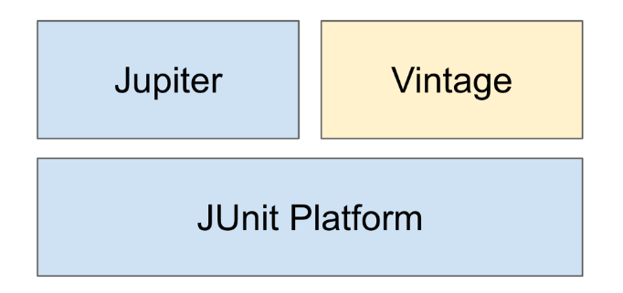

# Junit5
> [더 자바, 애플리케이션을 테스트하는 다양한 방법](https://www.inflearn.com/course/the-java-application-test/)을 보고 학습한 내용을 정리한 것입니다.

## Junit 소개


* Platform:  테스트를 실행해주는 런처 제공. TestEngine API 제공.
* Jupiter: TestEngine API 구현체로 JUnit 5를 제공.
* Vintage: JUnit 4와 3을 지원하는 TestEngine 구현체.

```kotlin
import org.junit.jupiter.api.Test

internal class SampleTest {

    @Test
    internal fun `sample test`() {
        println("hello world")
    }
}
```

* Main 메서드가 없어도 Jupiter 엔진으로 테스트 구동이 가능합니다.

## Junit5 시작하기

* Junit5 부터는 public method가 없어도 동작이 가능하다.

### 기본 어노테이션

기본 애노테이션
* @Test
* @BeforeAll / @AfterAll :  테스트 실행전 딱 한 번 실행, 반드시 static으로 만들어야한다
* @BeforeEach / @AfterEach : 모든 테스트시에 각각 실행, static일 필요는 없다,
* @Disabled : 특정 테스트를 ignore 하는 방법

```kotlin
internal class SampleTest {

    companion object {
        @BeforeAll
        @JvmStatic
        internal fun BeforeAll() {
            println("BeforeAll : 테스트 실행되기 전 한번 실행됨")
        }

        @AfterAll
        @JvmStatic
        internal fun AfterAll() {
            println("AfterAll : 테스트 실행된 후 한 번 실행됨")
        }

    }

    @BeforeEach
    internal fun BeforeEach() {
        println("BeforeEach : 모든 테스트 마다 실행되기 전에실행됨")
    }

    @AfterEach
    internal fun AfterEach() {
        println("AfterEach : 모든 테스트 마다 실행된후 전에실행됨")
    }
}
```
```
BeforeAll : 테스트 실행되기 전 한번 실행됨

BeforeEach : 모든 테스트 마다 실행되기 전에실행됨

AfterEach : 모든 테스트 마다 실행된후 전에실행됨

AfterAll : 테스트 실행된 후 한 번 실행됨
```

## 테스트 이름 표시하기
* @DisplayNameGeneration
  * Method와 Class 레퍼런스를 사용해서 테스트 이름을 표기하는 방법 설정.
  * 기본 구현체로 ReplaceUnderscores 제공

* @DisplayName
  * 어떤 테스트인지 테스트 이름을 보다 쉽게 표현할 수 있는 방법을 제공하는 애노테이션.
  * @DisplayNameGeneration 보다 우선 순위가 높다.


```kotlin
@Test
@DisplayName("display name 기반으로 테스코드가 동작한다")
internal fun `test code`() {
    then(1).isEqualTo(1)

}
```

## 조건에 따라 테스트 실행하기
* @Enabled___ 와 @Disabled___
  * OnOS
  * OnJre
  * IfSystemProperty
  * IfEnvironmentVariable
  * If


```kotlin
internal class SampleTest {

    @Test
    @EnabledOnOs(OS.MAC, OS.WINDOWS)
    internal fun `EnabledOnOs`() {
        println("운영체제에 따라서 실행...")
    }
    
    @Test
    @EnabledOnJre(JRE.JAVA_10, JRE.JAVA_11)
    internal fun `EnabledOnJre`() {
        println("JRE 버전에 따라서 실행...")
    }

    @Test
    @EnabledIfEnvironmentVariable(named = "local", matches = "local")
    internal fun EnabledOnIf() {
        println("Env 에따라서 실행...")
    }
}
```

## 태깅과 필터링
테스트 그룹을 만들고 원하는 테스트 그룹만 테스트를 실행할 수 있는 기능.

* @Tag
  * 테스트 메소드에 태그를 추가할 수 있다.
  * 하나의 테스트 메소드에 여러 태그를 사용할 수 있다.
## Tag

```kotlin
internal class SampleTest {

@Test
    @Tag("slow")
    internal fun `tag slow`() {
        println("slow fast")
    }

    @Test
    @Tag("fast")
    internal fun `tag fast`() {
        println("tag fast")
    }
}
```

## 테스트 반복하기

```kotlin
@RepeatedTest(value = 10, name = "{displayName}")
internal fun `10번 반복 테스트`(repetitionInfo: RepetitionInfo) {
}
```

```kotlin

@ParameterizedTest(name = "{index} {displayName} value={0}")
@DisplayName("parameter test")
@ValueSource(ints = [10, 20, 30])
internal fun `parameter test`(value : Int) {
    println(value)
}
```

## 테스트 인스턴스

* **JUnit은 테스트 메소드 마다 테스트 인스턴스를 새로 만든다.**
  * 이것이 기본 전략.
  * 테스트 메소드를 독립적으로 실행하여 예상치 못한 부작용을 방지하기 위함이다.
  * 이 전략을 JUnit 5에서 변경할 수 있다.


```kotlin
internal class SampleTest {
    var value = 0

    @Test
    @DisplayName("display name 기반으로 테스코드가 동작한다")
    internal fun `test code`() {
        then(1).isEqualTo(1)
        value++
        println("value: $value")
        println("this address : $this")
    }

    @Test
    internal fun `test code 2`() {
        then(1).isEqualTo(1)
        value++
        println("value: $value")
        println("this address : $this")
    }
}
```

```
value: 1
this address : com.example.kotlinjunit5.SampleTest@52e677af

value: 1
this address : com.example.kotlinjunit5.SampleTest@5c1a8622

value: 1
this address : com.example.kotlinjunit5.SampleTest@3e3047e6

value: 1
this address : com.example.kotlinjunit5.SampleTest@37e547da
```

```
@TestInstance(TestInstance.Lifecycle.PER_CLASS)
internal class SampleTest {

    var value = 0

    @Test
    @DisplayName("display name 기반으로 테스코드가 동작한다")
    internal fun `test code`() {
        then(1).isEqualTo(1)
        value++
        println("value: $value")
        println("this address : $this")
    }

    @Test
    internal fun `test code 2`() {
        then(1).isEqualTo(1)
        value++
        println("value: $value")
        println("this address : $this")
    }

}
```

```
value: 1
this address : com.example.kotlinjunit5.SampleTest@341b80b2

value: 2
this address : com.example.kotlinjunit5.SampleTest@341b80b2

value: 3
this address : com.example.kotlinjunit5.SampleTest@341b80b2

value: 4
this address : com.example.kotlinjunit5.SampleTest@341b80b2
```

* @TestInstance(Lifecycle.PER_CLASS)
  * **value가 증가하고, this address 주소가 동일한것을 확인 할 수 있다. 즉 테스트 인스턴스가 동일 하다는 것이다.**
  * **테스트 클래스당 인스턴스를 하나만 만들어 사용한다.**
  * **경우에 따라, 테스트 간에 공유하는 모든 상태를 @BeforeEach 또는 @AfterEach에서 초기화 할 필요가 있다.**
  * @BeforeAll과 @AfterAll을 인스턴스 메소드 또는 인터페이스에 정의한 default 메소드로 정의할 수도 있다.
  
## 테스트 순서
**실행할 테스트 메소드 특정한 순서에 의해 실행되지만 어떻게 그 순서를 정하는지는 의도적으로 분명히 하지 않는다.** (테스트 인스턴스를 테스트 마다 새로 만드는 것과 같은 이유)

경우에 따라, 특정 순서대로 테스트를 실행하고 싶을 때도 있다. 그 경우에는 테스트 메소드를 원하는 순서에 따라 실행하도록 @TestInstance(Lifecycle.PER_CLASS)와 함께 @TestMethodOrder를 사용할 수 있다.
* MethodOrderer 구현체를 설정한다.
* 기본 구현체
  * Alphanumeric
  * OrderAnnoation
  * Random


## junit-platform.properties
JUnit 설정 파일로, 클래스패스 루트 (src/test/resources/)에 넣어두면 적용된다.

* 테스트 인스턴스 라이프사이클 설정
  * junit.jupiter.testinstance.lifecycle.default = per_class
* 확장팩 자동 감지 기능
  * junit.jupiter.extensions.autodetection.enabled = true
* @Disabled 무시하고 실행하기
  * junit.jupiter.conditions.deactivate = org.junit.*DisabledCondition
* 테스트 이름 표기 전략 설정
  * junit.jupiter.displayname.generator.default = \
    org.junit.jupiter.api.DisplayNameGenerator$ReplaceUnderscores


 