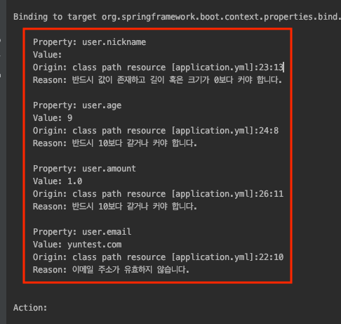
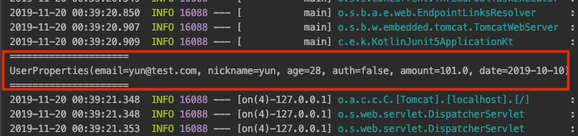

# Immutable Properties
Spring Boot 2.2 버전에서부터는 Immutable으로 Properties 설정을 할 수 있습니다. 커스텀 하게 설정한 값들은 Properties 객체로 관리하는 것이 좋습니다. 해당 내용은 [Properties 설정값 가져오기](https://github.com/cheese10yun/spring-jpa-best-practices/blob/master/doc/step-10.md)를 참조하시면 됩니다. 기존 Properties의 단점은 Mutable이라는 점입니다. 아래 예제 코드에서 설명드리겠습니다.

## 기존 Mutable Properties 방법

```java
@Configuration
@ConfigurationProperties(prefix = "user")
@Validated
public class SampleProperties {
    @Email
    private String email;
    @NotEmpty
    private String nickname;
    private int age;
    private boolean auth;
    private double amount;

    // getter, setter
}
```

**기존 방식은 위처럼 setter 기반으로 바인딩 되기 때문에 해당 Properteis 설정은 언제든지 변경될 가능성이 있습니다.** 이런 단점을 스프링 부트 2.2에서는 생성자 바인딩을 지원해서 해결했습니다.

## Immutable Properteis 방법
해당 예제는 Kotlin `data class` 기준으로 작성했습니다.

```kotlin
@ConstructorBinding
@ConfigurationProperties(prefix = "user")
@Validated
data class UserProperties(
        @field:Email
        val email: String,

        @field:NotEmpty
        val nickname: String,

        @field:Min(10)
        val age: Int,

        @field:NotNull
        val auth: Boolean,

        @field:Min(10)
        val amount: Double,

        @DateTimeFormat(pattern = "yyyy-MM-dd")
        @field:NotNull
        val date: LocalDate
)
```
사용법은 간단합니다. `@ConstructorBinding`을 추가하고 `data class`으로 넘겨받을 값을 생성자로 지정합니다. 위처럼 작성하면 객체는 Immutable 상태가 됩니다. **스프링 부트 2.2.1 버전부터는 `@ConfigurationProperties` scanning 방식이 disabled 되면서 `@EnableConfigurationProperties`을 따로 지정해야 합니다. 자세한 내용은 [여기](https://github.com/spring-projects/spring-boot/issues/18674)를 참고하세요.**

```kotlin
@SpringBootApplication
@EnableConfigurationProperties(UserProperties::class)
class KotlinJunit5Application

fun main(args: Array<String>) {
    runApplication<KotlinJunit5Application>(*args)
}
```
2.2.1 버전 부터는 `@EnableConfigurationProperties`으로 클래스를 지정해야합니다. `@Validated` 어노테이션으로 properteis에 대한 검증도 가능합니다.

```yml
user:
  email: "yuntest.com"
  nickname: ""
  age: 9
  auth: true
  amount: 1
  date: "2019-10-10" 
```

위 처럼 유효하지 않은 값들에 대해서 아래 화면처럼 검증할 수 있습니다.



스프링 부트가 구동될 때 해당 값에 대한 유효성 검사를 어노테이션 기반으로 쉽게 검증할 수 있습니다. **해당 값이 유효하지 않은 경우 스프링이 구동되지 않기 때문에 장점이 있습니다.**


```yml
user:
  email: "yun@test.com"
  nickname: "yun"
  age: 28
  auth: false
  amount: 101
  date: "2019-10-10"
```
위 `yml` 처럼 유효한 값을 입력하면 정상적으로 동작하는 것을 확인할 수 있습니다.

```kotlin
@Component
class AppRunner(private val userProperties: UserProperties) :ApplicationRunner{
    override fun run(args: ApplicationArguments?) {
        println("=====================")
        println(userProperties.toString())
        println("=====================")
    }
}
```

값들이 유요한 경우 객체에 바인딩 되는 것을 학인할 수 있습니다.