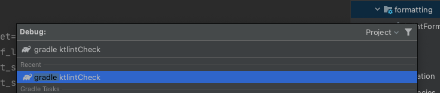
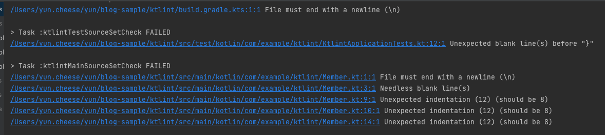
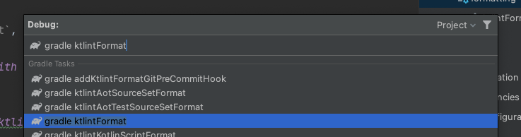

# Ktlint 컨벤션
[ktlint](https://ktlint.github.io/)는 Kotlin의 공식 가이드 기반으로 코드 스타일을 검사해 주는 도구입니다. gradle plugin을 통해서 보다 쉽게 설정할 수 있는데 해당 부분에 대해서 포스팅하겠습니다.

## ktlint-gradle
[jlleitschuh-ktlint-gradle](https://github.com/JLLeitschuh/ktlint-gradle) 그레이들 플러그인 중에서 가장 많이 사용하는 `jlleitschuh-ktlint-gradle`으로 설정을 진행하겠습니다.


```kotlin
plugins {
    id("org.jlleitschuh.gradle.ktlint") version "10.0.0"
    id("org.jlleitschuh.gradle.ktlint-idea") version "10.0.0"
}
```

## .editorconfig 설정

`.editorconfig` 파일을 기반으로 스타일 검사를 진행합니다. 자세한 내용은 [EditorConfig](https://editorconfig.org/)에 설명되어 있습니다. `.editorconfig` 파일이 없는 경우 기본룰 Ktlint 버전에 따라서 [Standard rules](https://github.com/pinterest/ktlint#standard-rules)를 기본적으로 따르지만 버전이 변경이 되면 Standard rules로 변경이 될 수 있기 때문에 root 디렉터리에 `.editorconfig`파일을 설정하는 것을 권장합니다.

```
root = true

[*]
charset=utf-8
end_of_line=lf
indent_style=space
indent_size=4
insert_final_newline=true
disabled_rules=no-wildcard-imports,import-ordering,comment-spacing

[*.{kt,kts}]
insert_final_newline=false
```
`*.kt`, `*.kts` 확장자 경우에만 `insert_final_newline=false` 옵션을 주었습니다.

## With IntelliJ


### ktlintCheck  
```
$ ./gradlew ktlintCheck  
```
위 명령어를 통해서 스타일 검사를 진행할 수 있습니다.



IntelliJ를 이용하면 편리하게 Gradle 자동완성을 통해서 실행할 수 있습니다.



실행 결과를 보면 해당 규칙에 어긋난 코드 스타일에 대해서 명확하게 알려주고 있습니다.

### ktlintFormat



`ktlintFormat`는 스타일에 맞지 않은 코드 전체를 스타일에 맞게 변경해 줍니다. 개인적으로는 모든 commit을 완료하고 마지막에 `ktlintFormat`를 통해서 diff를 반드시 확인하는 방식으로 사용하는 것을 권장합니다. 단순 스타일 변경이라고는 하지만 혹시 모르는 부분이 있을 수 있으며 자동으로 변경되는 부분은 꼭 눈으로 확인하는 게 더 좋다고 생각합니다.
