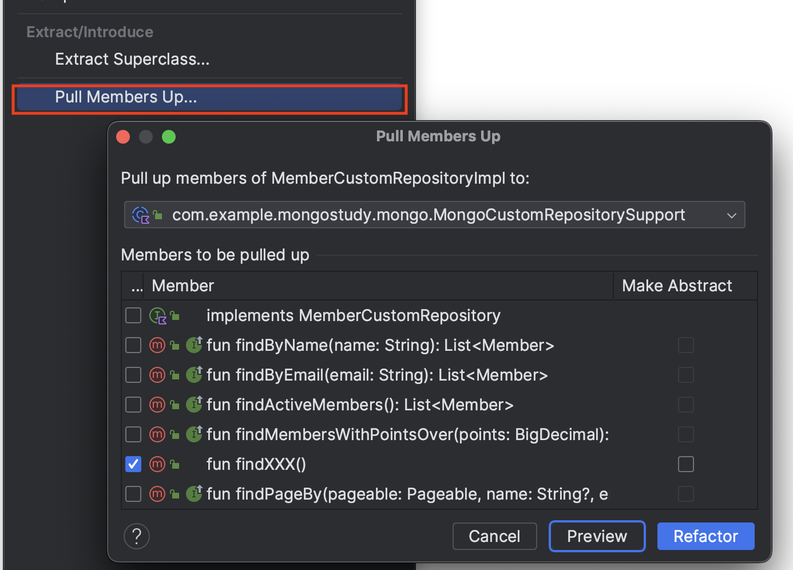

# Spring Data MongoDB Custom Repository

Spring Data JPA에서 흔히 사용하는 Repository 확장 패턴을 Spring Data MongoDB에도 적용할 수 있습니다. 이 패턴은 'CustomRepository'와 'CustomRepositoryImpl'의 조합으로 구성되며, [Spring-JPA Best Practices step-15](https://cheese10yun.github.io/spring-jpa-best-15/)에서 이전에 포스팅한적 있습니다. 이 방법을 사용하면 복잡한 조회 작업을 'CustomRepositoryImpl'에서 처리할 수 있게 됩니다. 이 구조를 사용하면, 사용자는 Repository 인터페이스만을 이용하여 데이터를 조회할 수 있게 되어 코드의 간결성과 유지보수성이 향상됩니다. 예를 들어, CustomRepositoryImpl에서 복잡한 쿼리 로직을 구현하면, 상위 레벨에서는 이러한 구현 디테일을 신경 쓰지 않고 데이터 접근 로직을 단순화할 수 있습니다. Spring Data MongoDB에서 동일하게 적용하는 방법을 살펴보겠습니다.

## Custom Repository

### Custom Repository 구성

```kotlin
@Document(collection = "members")
class Member(
    @Field(name = "name")
    val name: String,

    @Field(name = "email")
    val email: String
) : Auditable()

interface MemberRepository : MongoRepository<Member, ObjectId>, MemberCustomRepository, QuerydslPredicateExecutor<Member>

interface MemberCustomRepository

class MemberCustomRepositoryImpl(private val mongoTemplate: MongoTemplate) : MemberCustomRepository
```

코드의 각 부분은 MongoDB를 사용하는 스프링 애플리케이션에서 도메인 객체를 정의하고, 저장소를 구성하는 데 필요한 요소들을 포함하고 있습니다. 아래는 코드 구조를 기반으로 한 정리입니다:

1. **`Member` 클래스** - MongoDB의 'members' 컬렉션에 매핑되는 도메인 객체입니다. 'name'과 'email' 필드를 가지고 있으며, 각 필드는 MongoDB의 문서 필드에 맞추어 `@Field` 애노테이션을 사용하여 지정되어 있습니다. 또한, `Auditable`을 상속받아 생성 및 수정 시간에 대한 감사(audit) 정보를 자동으로 관리할 수 있습니다.

2. **`MemberRepository` 인터페이스** - MongoDB의 기본 CRUD 작업을 위한 `MongoRepository`와 사용자 정의 쿼리를 위한 `MemberCustomRepository`, Querydsl 지원을 위한 `QuerydslPredicateExecutor`를 확장하는 저장소 인터페이스입니다. 이로 인해 `Member` 객체에 대한 표준 데이터 접근 패턴과 함께 복잡한 쿼리 기능을 제공합니다.

3. **`MemberCustomRepository` 인터페이스** - 사용자 정의 쿼리를 위한 인터페이스로, 실제 사용자 정의 로직을 위한 메소드의 시그니처를 포함할 수 있습니다.

4. **`MemberCustomRepositoryImpl` 클래스** - `MemberCustomRepository`의 구현체로, 실제 사용자 정의 쿼리 로직을 실행하는 메소드를 포함합니다. `MongoTemplate`을 주입받아 MongoDB의 복잡한 작업을 처리하는 데 사용됩니다.

이 구성을 통해, 애플리케이션은 MongoDB에 대한 데이터 액세스를 추상화하고 효율적으로 관리할 수 있으며, 사용자 정의 저장소를 통해 비즈니스 로직에 맞는 복잡한 데이터 접근 패턴을 구현할 수 있어 애플리케이션의 유연성을 증가시키고 코드의 관리를 간소화합니다.

### MemberCustomRepositoryImpl 구현

```kotlin
interface MemberCustomRepository {
    fun findByName(name: String): List<Member>
    fun findByEmail(email: String): List<Member>
}

class MemberCustomRepositoryImpl(private val mongoTemplate: MongoTemplate) : MemberCustomRepository {
    override fun findByName(name: String): List<Member> {
        val query = Query(Criteria.where("name").`is`(name))
        return mongoTemplate.find(query, Member::class.java)
    }

    override fun findByEmail(email: String): List<Member> {
        val query = Query(Criteria.where("email").`is`(email))
        return mongoTemplate.find(query, Member::class.java)
    }
}
```

`MemberCustomRepositoryImpl` 클래스에서는 `MemberCustomRepository` 인터페이스에 선언된 메소드의 구체적인 구현이 이루어집니다. 처음에는 `override` 키워드 없이 구현을 시작할 수 있습니다. 구현을 완료한 후, IntelliJ의 `Refactoring` 메뉴에서 `Pull Members Up...` 옵션을 선택함으로써 해당 메소드를 상위 인터페이스로 이동시킬 수 있습니다.



인터페이스의 메서드 시그니처를 처음부터 명확히 정의하지 않고, 구현 클래스에서 메서드의 세부 구현을 확정한 후에 이를 상위 인터페이스로 옮기는 방식을 개인적으로 선호합니다.

## CustomRepositoryImpl를 서포트하는 MongoCustomRepositorySupport

### MongoCustomRepositorySupport 구현체

[Querydsl Repository Support 활용](https://cheese10yun.github.io/querydsl-support/) 포스팅에서는 `QuerydslRepositorySupport`를 사용해 `CustomRepositoryImpl`의 반복적이고 복잡한 쿼리 로직을 단순화한 방법을 소개했습니다. 이와 유사하게, `MongoCustomRepositorySupport`를 생성하여 `CustomRepositoryImpl`에 공통 메서드를 중앙화시키면, 코드 중복을 줄이고 재사용성을 높일 수 있습니다. 이러한 방식은 Mongo DB 환경에서도 Querydsl의 장점을 활용하게 해주며, 코드 관리 및 유지보수의 효율성을 향상시킵니다. 대표적으로 페이징 처리 관련된 기능들을 통합해서 제공해줄 수 있습니다.

```kotlin
abstract class MongoCustomRepositorySupport<T>(
    protected val documentClass: Class<T>,
    protected val mongoTemplate: MongoTemplate
) {
    private val logger by logger()

    protected fun logQuery(
        query: Query,
        name: String? = null,
    ) {
        if (logger.isDebugEnabled) {
            logger.debug("Executing MongoDB $name Query: $query")
        }
    }

    protected fun <S : T> applyPagination(
        pageable: Pageable,
        contentQuery: (Query) -> List<S>,
        countQuery: (Query) -> Long
    ) = runBlocking {
        val content = async { contentQuery(Query().with(pageable)) }
        val totalCount = async { countQuery(Query()) }
        PageImpl(content.await(), pageable, totalCount.await())
    }

    protected fun <S : T> applySlicePagination(
        pageable: Pageable,
        contentQuery: (Query) -> List<S>
    ): Slice<S> {
        val content = contentQuery(Query().with(pageable))
        val hasNext = content.size >= pageable.pageSize
        return SliceImpl(content, pageable, hasNext)
    }
}
```


JPA 페이징 성능을 향상시키는 방법으로, 내용을 담은 콘텐츠 쿼리와 개수를 세는 카운트 쿼리를 분리하여 구현하는 것이 유익하다는 내용을 [JPA 페이징 Performance 향상 방법](https://cheese10yun.github.io/page-performance/)에서 다루었습니다. 이 두 쿼리는 상호 의존적이지 않아 병렬 처리를 함으로써 성능을 높일 수 있습니다. 또한, 슬라이스 쿼리의 경우, '다음 페이지가 있는지'를 확인하는 `hasNext` 메서드를 포함한 공통된 로직을 사용함으로써 코드 중복을 방지하고 재사용성을 극대화합니다. `MongoCustomRepositorySupport` 클래스는 이러한 공통 기능을 제공하여 효율적인 데이터 조회와 페이지 처리를 가능하게 합니다."

### MongoCustomRepositorySupport

```kotlin
interface MemberCustomRepository {
    ...
    fun findPageBy(
        pageable: Pageable,
        name: String?,
        email: String?
    ): Page<Member>
}

class MemberCustomRepositoryImpl(mongoTemplate: MongoTemplate) : MemberCustomRepository, MongoCustomRepositorySupport<Member>(
    Member::class.java,
    mongoTemplate
) {
    ...

    override fun findPageBy(
        pageable: Pageable,
        name: String?,
        email: String?
    ): Page<Member> {

        val queryBuilder: (Query) -> Query = { query ->
            val criteria = Criteria().apply {
                name?.let { and("name").regex(".*$it.*", "i") }
                email?.let { and("email").regex(".*$it.*", "i") }
            }
            query.addCriteria(criteria)
        }

        return applyPagination(
            pageable = pageable,
            contentQuery = { query ->
                mongoTemplate.find(queryBuilder(query), documentClass)
            },
            countQuery = { query ->
                mongoTemplate.count(queryBuilder(query), documentClass)
            }
        )
    }

}
```

`MemberCustomRepositoryImpl` 클래스는 `MongoCustomRepositorySupport` 추상 클래스를 상속받아, MongoDB와의 데이터 교환을 더 효율적으로 관리하는 특수한 저장소 구현을 제공합니다. `MongoCustomRepositorySupport`는 몽고디비의 `mongoTemplate`와 작업할 클래스 타입을 받아 초기화합니다. 이는 사용자 정의 저장소 구현에 필수적인 기반 구조를 제공하여 보일러플레이트 코드를 줄이고 코드의 재사용성을 향상시킵니다.