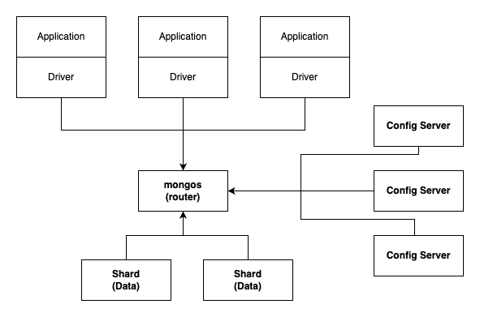
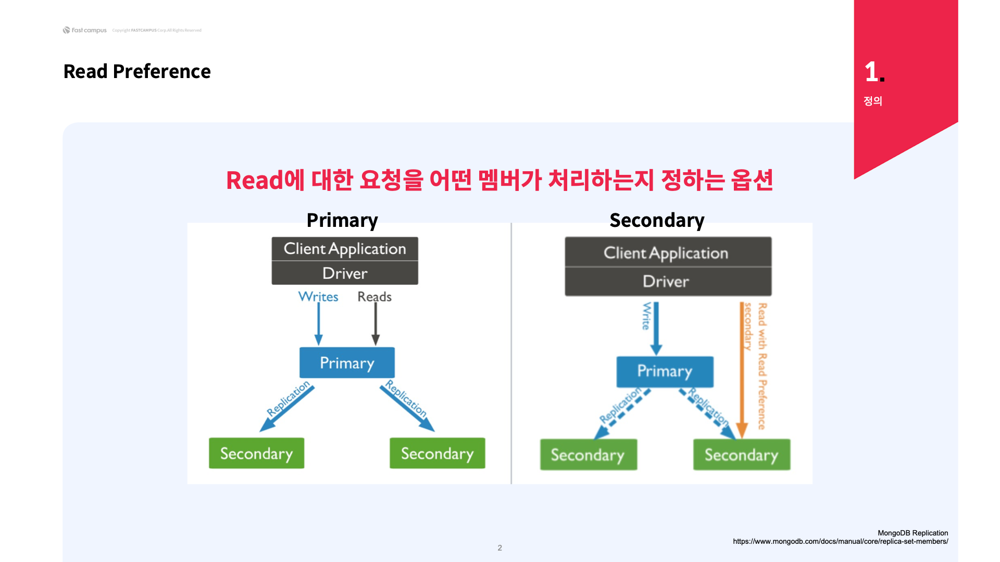
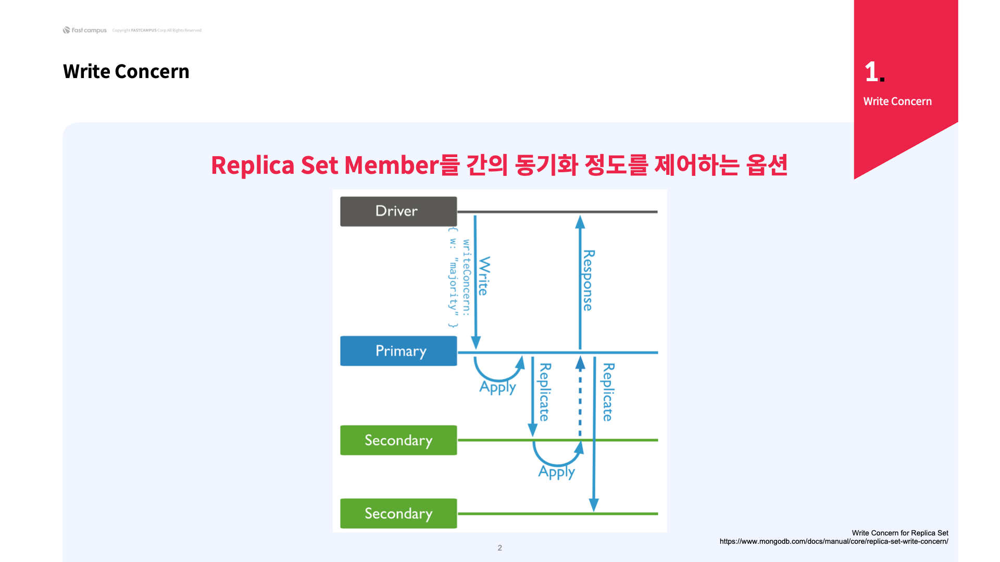
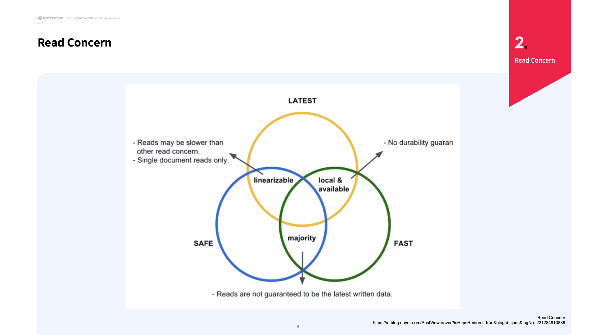
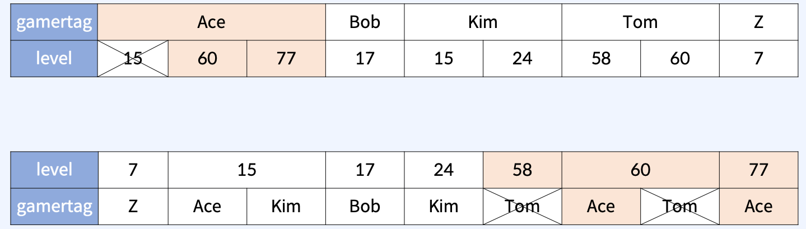
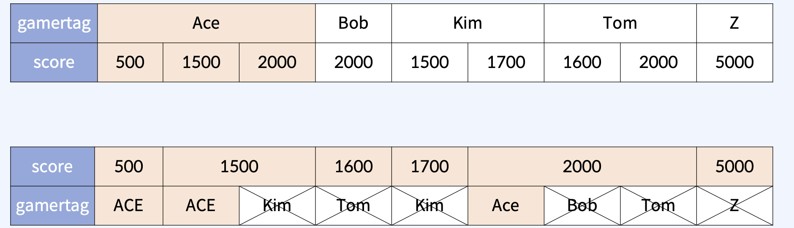
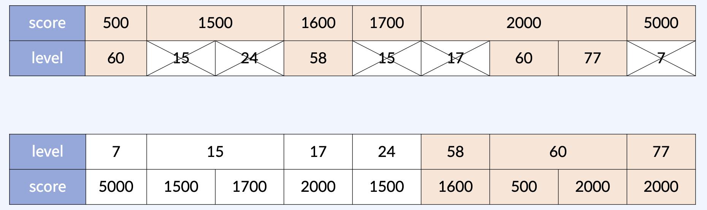
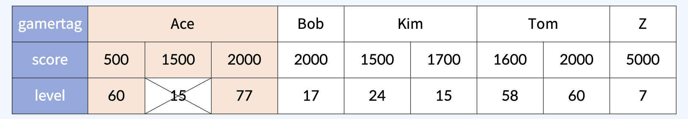
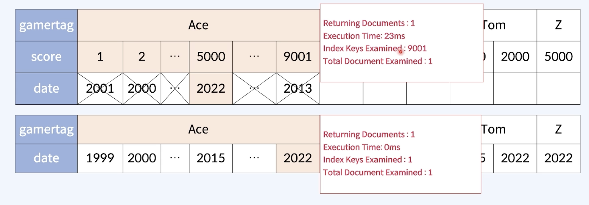
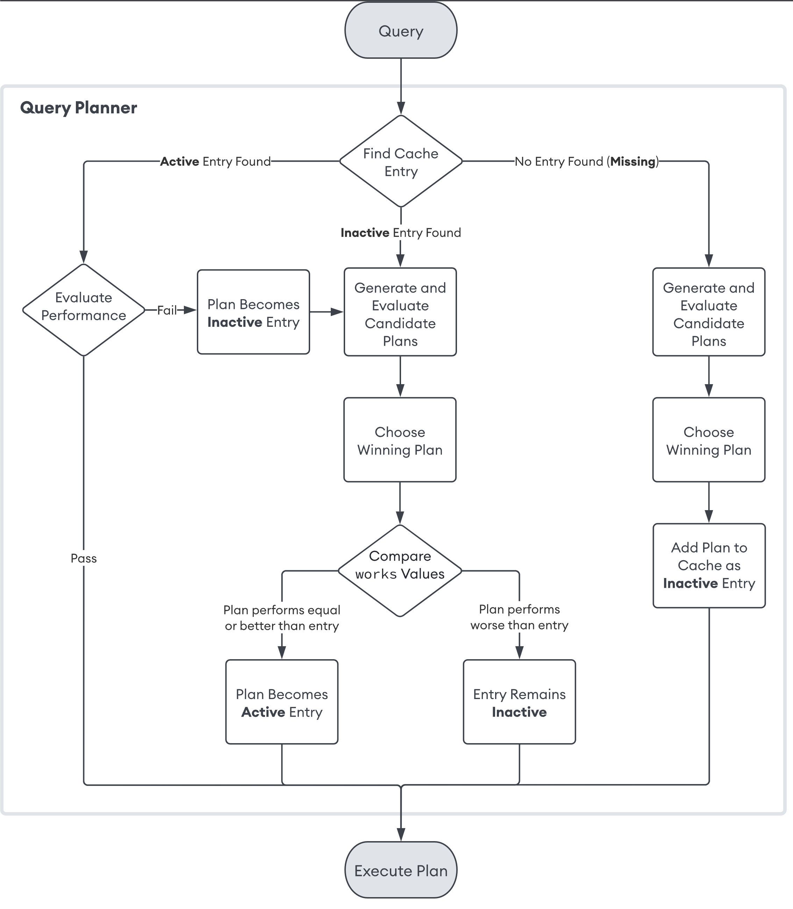

# MongoDB 개요

## SQL vs NoSQL

### RDBMS 장단점

* 장점
  * 데이터 중복을 방지할 수 있다.
  * join 성능이 좋다
  * 복잡하고 다양한 쿼리가 가능하다
  * 잘못 입력을 방지할 수있다.
* 단점
  * 하나의 레코드를 확인하기 위해 여러 테이블을 join 하여 가시성이 떨어진다.
  * 스키마가 엄격하여 변경에대한 공수가 크다.
  * Scale-Out이 가능하지만, 설정이 어려워 전통적으로 Sale-Up 위주로 확장 했다.
  * 확장할 때마다 App단의 수정이 필요하다

### NoSQL 장단점

* 장점
  * 데이터 접근성과 가시성이 좋다.
  * Join없이 조회가 가능해서 응답 속도가 일반적으로 빠르다.
  * 스키마 변경에 공수가 적다
  * 스키마가 유연해서 데이터 모델을 App 요구사항에 맞게 데이터를 수용할 수 있다.
  * HA와 Sharding에 대한 솔루션을 자체적으로 지원하고 있어 Scale-Out이 간편하다.
  * 확장시 App의 변셩사항이 없다.
* 단점
  * 데이터중복이 발생한다.
  * 스키마가 자유롭지만, 스키마 설계를 잘해야 성능 저하를 피할 수 있다.

### Summary

* MongoDB는 Document 지향 Database이다.
* 데이터 중복이 발생할 수 있지만, 접근성과 가시성이 좋다.
* 스키마 설계가 어렵지만, 스키마가 유연해서 App의 요구사항에 맞게 데이터를 수용할 수 있다.
* 분산에 대한 솔루션을 자체적으로 지원해서 Scale-Out이 쉽다.
* 확장 시, App를 변경하지 않아도 된다.

## MongoDB 구조

### RDBMS vs MongoDB

| RDBMS    | MongoDB    |
|----------|------------|
| Cluster  | Cluster    |
| Database | Database   |
| Table    | Collection |
| Row      | Document   |
| Column   | Field      |

### 기본 Database

| Database | Description                                                                                                                                                                     |
|----------|---------------------------------------------------------------------------------------------------------------------------------------------------------------------------------|
| admin    | * 인증과 권한 부여 역할이다.<br/> * 일부 관리 작업을 하려면 admin database 접근이 필요하다.                                                                                                                 |
| local    | * 모든 mongodb instance는 local database를 소유한다.<br/> * oplog와 같은 replication 절차에 필요한 정보를 저장한다. <br/> * startup_log와 같은 instance 진단 정보를 저장한다. <br/> * local database는 자체는 복제되지 않는다. |
| config   | * shareded cluster에 각 shard 정보를 저장한다.                                                                                                                                           |

### Collection 특징

* 동적 스키마를 갖고 있어 스키마를 수정하려면 필드 값을 추가/수정/삭제 하면 된다.
* Collection 단위로 Index를 생성할 수 있다.
* Collection 단위로 Shard를 나눌 수 있다.

### Document 특징

* JSON 형태로 표한하고 BSON(Binary JSON) 형태로 저장한다.
* 모든 Document는 "_id" 필드가 있고, 없이 생성하면 ObjectId 타입의 고유한 값을 저장한다.
* 생성시, 상위 구조인 Database나 Collection이 없다면 먼저 생성하고 Document를 생성한다.
* Document의 최대 크기는 **16MB** 이다.

## MongoDB 배포 형태 소개

## Replica Set

## Sharded Cluster

* 장점
  * 용량의 한계를 극복 가능
  * 데이터 규모와 부하가 크더라도 처리량이 좋다.
  * 고가용성을 보장한다.
  * 하드웨어에 대한 제약을 해결할 수 있다.
* 단점
  * 관리가 비교적 복잡하다.
  * Replica Set과 비교해서 쿼리가 느리다.

### Architecture



## Replica Set vs Sharded Cluster 어떻게 배포할것인가?

## MogoDB Storage Engines

| 항목               | MMAPv1                                | WiredTiger        |
|------------------|---------------------------------------|-------------------|
| Data Compression | 지원하지 않는다.                             | 지원한다.             |
| Locl             | 버전에 따라 Database 혹인 Collection 레벨 Lock | Document 레벨의 Locl |

# Document Query 실습

## CRUD

<details>
<summary>접기/펼치기</summary>
<div markdown="1">

```js
show
dbs

use
test

db.employees.insertOne({
    name: "lake",
    age: 21,
    dept: "Database",
    joinDate: new ISODate('2022-10-01'),
    salary: 400000,
    bonus: null
})

db.employees.find()


db.employees.insertMany([
    {
        name: "ocean",
        age: 45,
        dept: "Network",
        joinDate: new ISODate('1999-11-15'),
        resignationDate: new ISODate('2002-12-23'),
        salary: 100000,
        bonus: null
    },
    {
        name: "river",
        age: 34,
        dept: "Devops",
        isNegotiating: true
    }
])

db.employees.updateOne(
    {"name": "river"},
    {
        $set: {
            salary: 35000,
            dept: "Database",
            joinDate: new ISODate("2022-12-31")
        },
        $unset: {
            isNegotiating: ""
        }
    }
)

db.employees.find()

db.employees.updateMany(
    {
        resignationDate: {$exists: false},
        joinDate: {$exists: true}
    },
    {
        $mul: {salary: Decimal128("1.1")}
    }
)

db.employees.updateMany(
    {
        resignationDate: {$exists: false},
        bonus: {$exists: true}
    },
    {
        $set: {bonus: 200000}
    }
)

db.employees.find()

db.employees.deleteOne(
    {
        name: "river"
    }
)

db.employees.find()

db.employees.deleteMany({})

show
collections

db.employees.drop()


db.planets.findOne(
    {
        name: "Mars"
    }
)


db.planets.find(
    {
        hasRings: true,
        orderFromSun: {$lte: 6}
    }
)


db.planets.find(
    {
        $and: [
            {
                hasRings: true,
            },
            {
                orderFromSun: {$lte: 6}
            }
        ]
    }
)

db.planets.find(
    {
        $or: [
            {
                hasRings: {$ne: false},
            },
            {
                orderFromSun: {$gt: 6}
            }
        ]
    }
)

db.planets.find(
    {
        mainAtmosphere: {$in: ['O2']}
    }
)


```

</div>
</details>

### 유용한 Query 함수들

#### Bulk Writer

<details>
<summary>접기/펼치기</summary>
<div markdown="1">

```js
db.bulk.bulkWrite(
    [
        {insertOne: {document: {doc: 1, order: 1}}},
        {insertOne: {document: {doc: 2, order: 2}}},
        {insertOne: {document: {doc: 3, order: 3}}},
        {insertOne: {document: {doc: 4, order: 4}}},
        {insertOne: {document: {doc: 4, order: 5}}},
        {insertOne: {document: {doc: 5, order: 6}}},
        {
            deleteOne: {
                filter: {doc: 3}
            }
        },
        {
            updateOne: {
                filter: {doc: 2},
                update: {
                    $set: {doc: 12}
                }
            }
        }
    ],
    {ordered: false}
)
```

* ordered 순서 여부

```js
db.bulk.countDocuments()
db.bulk.estimatedDocumentCount()

db.bulk.distinct("doc")

db.bulk.find()

db.bulk.findAndModify(
    {
        query: {doc: 5},
        sort: {order: -1},
        update: {$inc: {doc: 1}}
    }
)

db.sequence.insertOne({seq: 0})

db.sequence.find()

db.sequence.findAndModify({
    query: {},
    sort: {seq: -1},
    update: {$inc: {seq: 1}}
})

db.bulk.getIndexes()

db.bulk.createIndex({doc: 1})

db.bulk.updateOne(
    {doc: 1},
    {$set: {_id: 1}}
)


db.bulk.replaceOne(
    {doc: 1},
    {doc: 13},
)

db.bulk.find()
```

</div>
</details>

### 배열과 내장 Document를 다루는 방법 1 Read

### 배열과 내장 Document를 다루는 방법 2 Update

### Query 예제

<details>
<summary>접기/펼치기</summary>
<div markdown="1">

#### sample_mflix database의 mpvies collection 전체를 조회한다.

```
db.movies.find()
```

#### mpvies collection의 Document 수를 구한다.

```
db.movies.countDocuments()
```

#### mpvies collection의 전체를 조회하는데, title, year, genres, runtime, rated를 보여주고 _id는 보여주지 않는다.

```
db.movies.find(
    {},
    {
        title:1,
        year:1,
        genres: 1,
        runtime: 1,
        rated: 1,
        _id:0
    }
    )
```

#### movies 100분 이하

```
db.movies.find(
    { runtime: {$lte: 100}}
)
```

#### movies 100 분이하, 장르 드라마

```
db.movies.find(
    {
        runtime: {$lte: 100},
        genres: 'Drama'
    }
)
```

#### movies 100 분이하, 장르 드라마, size 1개

```
db.movies.find(
    {
        $and: [
            {runtime: {$lte: 100}},
            {genres: 'Drama'},
            {genres: {$size: 1}}
        ]
    },
    {genres: 1}
)
```

</div>
</details>

## 집계 프레임워크 Aggregation

* Collection의 데이터를 변환하거나 분석하기 위해 집계 프레임워크
* Aggregation find 함수로 처리할 수 없는, SQL의 Group By와 Join 구문 같은 복잡한 데이터 분석 기능을 제공한다.
* Aggregation 프레임워크는 Pipelin 형태를 갖춘다.
* MongoDB 2.2 부터 제공되었고 이전에는 Map Reduce를 사용 했다.

### 자주 사용되는 Aggregation Stage

### Aggregation 예제

### 배포의 형태에 따른 CRUD 특징

# MongoDB의 일관성 제어 소개

Single Document -> Transaction -> Replica Set Member -> Sharded Cluster Shard

## Read Preference



| Read Preference 종류 | 설명                                  |
|--------------------|-------------------------------------|
| primary            | 무조건 primary로 읽기 요청                  |
| primaryPreferred   | 가능하면 primary에서 읽고 없으면 Secondary로 요청 |
| secondary          | 무조건 secondary로 읽기 요청                |
| secondaryPreferred | 가능하면 Secondary에서 읽고 없으면 primary로 요청 |
| nearest            | 평균 Ping 시간을 기반으로 지연율이 가장 낮은 멤버로 요청  |

## Read/Write Concern

### Write Concern



* w: majority 과반수의 secondary에서 apply를 한 경우 동기화 완료처리, 위 상황에서는 primary 1개 secondary가 2개이기 때문에 1개만 apply 완료되면 replica set에 적용이 완료됐다고 판단

### Read Concern Level

| Read Concern 종류 | 설명                                     |
|-----------------|----------------------------------------|
| local           | 복제를 확인하지 않고 요청한 Member의 현재 데이터를 반환     |
| available       | local과 동일하지만, 고아 Document를 반환할 수 있다.   |
| majority        | Member 과반수가 들고 있는 동일한 데이터를 반환          |
| lineeaizable    | 쿼리 수행 전에 모든 Majority Write가 반영된 결과를 반환 |
| snapshot        | 특정 시점에 대한 결과를 반환(Point-In-Time Query)  |



* Read Concern Level 성능 및 안전성

### Causal Consistency

## Transaction

# MongoDB Index 기본 구조와 효율적인 탐색

## Compound index & ESR Rule

```
db.products.creaateIndex( {"item": 1, "stock": 1, "price": 1} )
```

```
db.products.find({item: "Banana"})
db.products.find({item: "Banana", stock: {$gt: 5})
db.products.find({item: "Banana", stock: {$gt: 5}, price: { $gt:10000 })
```

item 으로 조회하는 경우 복합 인덱스 보다 item만을 인덱스로 생성하는게 좋다. 불필요한 인덱스를 생성하면 인덱스 때문에 용량이 증가되고 insert 성능도 크게 떨어지기 때문이다.

### ESR Rule

* E = Equal
* S = Sort
* R = Range

| 명칭          | 설명                    | Query                                                    |
|-------------|-----------------------|:---------------------------------------------------------|
| E           | Equality First        |                                                          |
| E -> R      | Equality Before Range | find({gamertag: "Ace", level: {$gt:50})                  |
| E -> S      | Equality Before Sort  | find({gamertag: "Ace"}).sort({score:1})                  |
| S -> R      | Sort Before Range     | find({level: {$gt: 50}).sort({score:1})                  |
| E -> S -> R | Equality Sort Range   | find({gamertag: "Ace", level: {$gt: 50}).sort({score:1}) |

E -> S -> R 순으로 인덱스를 태우는게 대체로 빠르다

#### E -> R Equality Before Range

```
find({gamertag: "Ace", level: {$gt:50})
```



gamertag 인덱스키로 Ace를 먼저 찾고 level을 범위로 필터링하는게 훨씬 더 효율적이다.

#### E -> S Equality Before Sort

```
find({gamertag: "Ace"}).sort({score:1})
```



gamertag 인덱스키로 Ace를 먼저 찾고 score으로 정렬하는 것이 훨씬 더 효율적이다.

#### S -> R Sort Before Range

```
find({level: {$gt: 50}).sort({score:1})
```



대부분의 경우 Sort 비용이 Range의 비용 보다 저렴하다. 위 이미지에서는 정렬 필드인 score를 먼저 보게 되는 경우 더 많은 인덱스를 읽게 되어 level를 먼저 보는 것보다 더 비효율적으로 보인다. 하지만 인덱스 키를 읽는 것은 생각보다 더 저렴한 비용이 발생하고 정렬을 하는 것은 생각보다 더 큰 비용이 발생한다. 그러기 떄문에 score를 먼저 봐서 인덱스키를 더 많이 보는건 맞지만 그 비용이 저렴하고 추후 에 있을 정렬 비용까지 생각하면 score 부터 읽고 level을 정렬하는것이 더 효율적이다. 물론 이것은 모든 경우에 해당하는 것은 아니며 인덱스, 컬렉션 데이터양에 따라서 다르다.

#### E -> S -> R Equality Sort Range

```
find({gamertag: "Ace", level: {$gt: 50}).sort({score:1})
```



대부분의 경우 E -> S -> R 성립한다. 하지만 모든 케이스에 대해서 성립하는 것은 아니다.

```
find({gamertag: "Ace", date: {$gt: 2022}).sort({score:1})
```



2022년도 데이터가 1개뿐이라면 E -> S -> R 으로 조회하면 불필요한 데이터를 더 많이 읽게된다. 하지만 정렬 필드를 제외하고 E -> R으로만 검색하면 1개의 인덱스 키만 탐색하게 된다.

실행 계획을 보면 정렬이 포함된 쿼리의 경우 9001개의 인덱스 키를 찾아서 최종적으로 1개의 도큐먼트를 반환하지만 정렬이 없는 경우는 1개의 인덱스 키를 찾아 1개의 도큐먼트를 응답한다. 물론 인덱덱스 키에 대한 조회는 비용이 저렴하기 떄문에 9001개를 찾는 응답은 23ms 으로 빠르게 응답했다. 그래도 정렬이 없는 쿼리는 0ms으로 더 훨씬더 빠르다. 한 번의 조회는 큰 차이는 없을 수 있지만 여러번의 조회를 지속적으로하면 23ms도 유의미한 차이를 발생 시킨다.

### 실습

<details>
<summary>접기/펼치기</summary>
<div markdown="1">

```
db.zips.getIndexes()
``` 

```json
[
  {
    "key": {
      "_id": 1
    },
    "name": "_id_",
    "v": 2
  }
]
```

* 기본적으로 _id 필드는 인덱스 필드로 설정된다.

```
db.zips.find(
    {
        state: "LA",
        pop: {
            $gt: 40000
        }
    }
).sort({city: 1}).explain('executionStats')
```

* 실행 계획을 확인 가능

```json
{
  "executionStats": {
    "executionSuccess": true,
    "nReturned": 13,
    "executionTimeMillis": 22,
    "totalKeysExamined": 0,
    "totalDocsExamined": 29470,
    ...
  }
}
```

* nReturned: 반환된 도큐먼트
* executionTimeMillis: 실행 시간
* totalKeysExamined: 인덱스 키를 몇개나 탐색했는지
* totalDocsExamined: 키를 통해서 몇개의 도큐먼트를 조회 했는지

13개를 도큐먼트를 반환하는데 29470개의 도큐먼트를 조회했다고 분석이 가능하다.

```
# 인덱스 생성
db.zips.createIndex({state: 1})

# 인덱스 확인
db.zips.getIndexes()
```

```
[
  {
    "key": {
      "_id": 1
    },
    "name": "_id_",
    "v": 2
  },
  {
    "key": {
      "state": 1
    },
    "name": "state_1",
    "v": 2
  }
]
```

* state 인덱스 키 추가된 것을 확인

```json
{
  "executionStats": {
    "executionSuccess": true,
    "nReturned": 13,
    "executionTimeMillis": 2,
    "totalKeysExamined": 469,
    "totalDocsExamined": 469
  },
  ...
  "inputStage": {
    "stage": "IXSCAN",
    "nReturned": 469,
    ...
    "keyPattern": {
      "state": 1
    }
  },
  ..
}
```

* executionTimeMillis 수행된 시간이 줌
* totalKeysExamined: 인덱스 키 탐색 확
* totalDocsExamined: 인덱스 키를 통해서 조회한 결과 확인
* stage: IXSCAN = 인덱스 스켄 진행
* keyPattern: 사용한 인덱스 키

```
# E -> S -> R 룰 적용
db.zips.createIndex({state: 1, city: 1, pop: 1})
```

* equal = state
* sort = city
* range = pop 적용

```json
{
  "executionStats": {
    "executionSuccess": true,
    "nReturned": 13,
    "executionTimeMillis": 3,
    "totalKeysExamined": 419,
    "totalDocsExamined": 13,
    ...
    "keyPattern": {
      "state": 1,
      "city": 1,
      "pop": 1
    }
  }
}
```

* totalKeysExamined 인덱스 키를 탐색한 것은 419
* totalDocsExamined 도큐먼트를 탐색한 것은 13, nReturned 반환된 13개와 동일 즉 인덱스를 통해 정확하게 가져옴
* keyPattern: 인덱스 순서대로 적용 확인
* sort하는 부분이 없음, 인덱스를 통해서 city가 정렬되어 있기 때문에 인덱스 정렬을 그대로 사용

```
db.zips.find(
    {
        state: "LA",
        pop: {
            $gt: 40000
        }
    },
    {
        _id: 0,
        state: 1,
        pop: 1,
        city: 1
    }
)
    .sort({city: 1})
    .explain('executionStats')
```

* 인덱스 키만 프로젝션

```json
{
  "executionStats": {
    "executionSuccess": true,
    "nReturned": 13,
    "executionTimeMillis": 2,
    "totalKeysExamined": 419,
    "totalDocsExamined": 0,
    "executionStages": {
      "stage": "PROJECTION_COVERED",
      ...
    }
  }
```

* totalDocsExamined = 0, 인덱스 키만 프로젝션 조회하는 경우 도큐먼트를 다시 읽으로 가지 않아도 됨, 즉 인덱스 키 필드만 프로젝을 진행하면 인덱스 키에서 찾은 값을 그대로 사용

</div>
</details>

## Multikey index

### Multikey index 개념


배열로 2개의 도큐먼트로 표현하고, 하나는 오브젝트로 4개의 도큐먼트를 표현한 경우더라도 인덱스 키의 카운트는 동일하다. **Multikey index는 배열의 모든 요소 하나 하나가 인덱스 키가 된다.** Multikey index는 도큐먼트 하나가 바라보는 키가 여러개가 존재하기 떄문에 Multikey index 라고 한다.

### Multikey index 비용

```
# Document 1
{_id: 1, item: "ABC", ratings: [2, 5, 7]}

# Document 2
{_id: 1, item: "ABC", ratings: [2]}

db.collection.createIndex({ratings:1})

# 발생 비용 단순계산
# _id: 1 ---> 1 + 1.5 * 3 = 5.5
# _id: 2 ---> 1 + 1.5 * 2 = 2.5
```

실제 Collection에 Document를 지정하는 비율을 1이라고 가정하면 **index key entry를 추가하고 삭제하는 작업은 1.5정도 비용이 필요하다고 한다.**

Multikey index는 배열의 크기가 작은 경우 사용하는 경우 좋다. Document의 전체 크기도 중요하겠지만 배열 필드에 천개 요소가 넘어가는 경우 성능적인 부분을 고려해봐야함.

### Multikey index 실습

<details>
<summary>접기/펼치기</summary>
<div markdown="1">

```json
// 멀티키 인덱스키 생성
db.data.createIndex({
  sections: -1
})

// 실행 계획 조회
db.data.find(
{
  sections: 'AG1'
}
).explain('executionStats')
```

```json
{
  "inputStage": {
    "stage": "IXSCAN",
    "keyPattern": {
      "sections": -1
    },
    "indexName": "sections_-1",
    "isMultiKey": true
  }
```

* isMultiKey: 멀티키 인덱스 사용

```
# 오브젝트 안의 배열에 인덱스 생성
db.grades.createIndex({"scores.type": 1})

# 인덱스 확인
db.grades.getIndexes()

# 실행 계획 확인
db.grades.find(
    {
        "scores.type": "exam"
    }
).explain("executionStats") 
```

```json
{
  ...
  "indexName": "scores.type_1",
  "isMultiKey": true
}
```

* indexName: 인덱스 정상 사용 확인
* isMultiKey: 멀티키 인덱스 사용 여부 확인

```
# 기존 인덱스 제거
db.grades.dropIndex({"scores.type": 1})

# compound index 생성
db.grades.createIndex(
    {class_id: 1, "scores.type": 1}
)

# 실행계획 조회
db.grades.find(
    {
        "scores.type": "exam",
        class_id: {
            $gte: 350
        }
    }
    ).explain("executionStats")
```

```json
{
  ...
  "keyPattern": {
    "class_id": 1,
    "scores.type": 1
  },
  "indexName": "class_id_1_scores.type_1",
  "isMultiKey": true,
  "multiKeyPaths": {
    "class_id": [],
    "scores.type": [
      "scores"
    ]
  }
}
```

* keyPattern: Compound Index 사용 확인
* isMultiKey: Compound Index를 사용 하고 Multikey index도 사용하는 것을 확인

</div>
</details>

## Index의 다양한 속성

### TTL Index 실습

<details>
<summary>접기/펼치기</summary>
<div markdown="1">

```
// sample data insert
db.ttl.insertMany(
    [
        {msg: "Hello!", time: new ISODate},
        {msg: "HelloWorld!", time: new ISODate}
    ]
)

// TTL Index 추가
db.ttl.createIndex(
    {time: 1},
    {expireAfterSeconds: 60},
)

// TTL 시간 이후 데이터 제거됨
db.ttl.find()
```

### Unique Index 실습

<details>
<summary>접기/펼치기</summary>
<div markdown="1">

```
// 유니크 인덱스 생성
db.unique.createIndex(
    {name: 1},
    {unique: true}
)

// sample data insert
db.unique.insertMany([
    {"name": "tom"},
    {"name": "john"},
])

// 중복 data insert 오류
db.unique.insertOne({"name": "tom"},)

Write operation error on server ac-rq5pfw3-shard-00-01.qhhygdz.mongodb.net:27017. Write error: WriteError{code=11000, message='E11000 duplicate key error collection: test.unique index: name_1 dup key: { name: "tom" }', details={}}.

// 기존 인덱스 삭제
db.unique.dropIndexes({name: 1})

// Compound 인덱스 생성
db.unique.createIndex(
    {name: 1, age: 1},
    {unique: true}
)

// sample data insert
db.unique.insertOne(
    {"name": "james", age:24}
)

// 중복 data insert 오류
db.unique.insertOne(
    {"name": "james", age:24}
)

// age 25, 다른 값 입력 가능
db.unique.insertOne(
    {name: "james", age: 25}
)
```

</div>
</details>

### Sparse index

필드가 존재하는 경우에만 인덱스에 포함 시키는 속성

<details>
<summary>접기/펼치기</summary>
<div markdown="1">

```
// sample data index
db.sparse.insertOne({x:1})
db.sparse.insertOne({x:2})
db.sparse.insertOne({y:2})

// sparse index 생성
db.sparse.createIndex(
    { x: 1 },
    { sparse: true }
)

// 전체 조회시 x:1, x:2, y:2 조회 
db.sparse.find()

// 전체 조회 + hint 으로 인덱스 조회시 x:1, x:2 조회, 인덱스 걸린 데이터만 조회 
db.sparse.find().hint({x:1})
```

</div>
</details>

### Hidden index

Hidden index는 실행 계획에서 숨겨서 해당 인덱스를 사용하지 못하게 하는 기능, 운영중인 서비스에서 특정 인덱스를 드롭하고 싶은 경우 드롭시 부정적인 영향이 있는 경우 Hidden index으로 처리

## Index 생성 주의사항

### Background Option

```
db.collection.createIndex({a: 1}, {background: true})
```

4.2 버전 이전까지 background 옵션을 설정하지 않으면 index를 빠르게 생성할 수 있지만, Database 단위의 Lock을 걸어서 index 생성이 완료될 때 까지 Read/Write가 막힌다. 4.2 이상 버전 부터는 background가 기본 true 으로 변경됨

### 구분 검사  취약

```
// 구분 검사가 취약하기 때문에 실제로 백그라운드에서 동작하지 않는다.
db.collection.createIndex(
  { "deleteData": 1 }, 
  { expireAfterSeconds: 60 } ,
  { background: true }
)

// 2번째 인자로 background 넘겨 정상동작한다.
db.collection.createIndex(
  { "deleteData": 1 }, 
  { expireAfterSeconds: 60, background: true }
)
```

### Rolling Index Builds

4.4 이전 까지는 index는 내부적으로 Primary에서 생성 완료하고 Secondary에 복제한다. index 생성으로 인해서 발생하는 성능저하를 줄이기 위해 멤버 하나씩 접속해서 Rolling 형태로 index를 생성 했다.

* 하지만 너무 번거롭다.
* Unique Index는 Collection에 대해서 Write가 없다는 것을 확인하고 생성해야 한다.
* Index 생성 시간이 Oplog Window Hour보다 작아야 한다.


4.4 이후 부터는 Primary, Secondary를 내부적으로 동시에 인덱스를 생성하여 Rolling 방식은 더이상 사용하지 않는다.


### Drop Index

4.4 이전 까지는 Index는 내부적으로 Primary에서 생성을 완료하고 Secondary에서 복제한다. Primary에서 생성을 완료하고 Secondary로 복제되는 도중에 Index를 Drop하면, Secondary에서 복제를 멈추는 문제가 있다. 즉 Index가 큰 경우, 복제 지연이 발생할 수 있다.

4.4 이후 부터는 Primary, Secondary를 내부적으로 동시에 인덱스를 생성하여 해당 문제가 없다. 


### Resumable Index Build

버전 5.0 부터 index를 생성 중에 정상적으로, process가 shutdown되면 다시 기동 되었을 때 기존의 progress에서 index가 생성된다. **비정상적으로 shutdown된 경우는 처음부터 index를 다시 생성한다.**


### 내장된 Document Index 생성

필터링에서 Document의 모든 필드의 순서도 같을 때만 Index를 사용하기 때문에 내장 Document 필드 자체에 Index를 만드는 것을 피한다.


# Advanced Querying

## lockup 이론 

> Accessed Together Stays Together (접근하는 정보는 같이 저장되고 있다.)
> Please Embed your Document`s Avoid Join`s (조인 사용하지 말고 Embemed를 사용해라.)

MongoDb는 Left outer Join 형태로만 Join을 지원하고 Lockup 이라고 한다. 

## lockup 실습

<details>
<summary>접기/펼치기</summary>
<div markdown="1">

```
# sample data insert
db.restaurants.insertMany( [
    {
        _id: 1,
        name: "American Steak House",
        food: [ "filet", "sirloin" ],
        beverages: [ "beer", "wine" ]
    },
    {
        _id: 2,
        name: "Honest John Pizza",
        food: [ "cheese pizza", "pepperoni pizza" ],
        beverages: [ "soda" ]
    }
] )

# sample data insert
db.orders.insertMany( [
    {
        _id: 1,
        item: "filet",
        restaurant_name: "American Steak House"
    },
    {
        _id: 2,
        item: "cheese pizza",
        restaurant_name: "Honest John Pizza",
        drink: "lemonade"
    },
    {
        _id: 3,
        item: "cheese pizza",
        restaurant_name: "Honest John Pizza",
        drink: "soda"
    }
] )

# look up
db.restaurants.aggregate([
    {
        $lookup: {
            from: "orders",
            localField: "name",
            foreignField: "restaurant_name",
            as: "orders"
        }
    }
])


# look up & unwind
db.restaurants.aggregate([
    {
        $lookup: {
            from: "orders",
            localField: "name",
            foreignField: "restaurant_name",
            as: "orders"
        }
    },
    {
        $unwind: "$orders"
    },
    {
        $match: {
            $expr: {
                $and: [
                    {$in: ["$orders.item", "$food"]},
                    {$in: ["$orders.drink", "$beverages"]},
                ]
            }
        }
    },
    {
        $group: {
            _id: "$_id",
            name: {$first: "$name"},
            food: {$first: "$food"},
            beverages: {$first: "$beverages"},
            orders: {
                $push: "$orders"
            }
        }
    }
])

db.restaurants.aggregate([
    {
        $lookup: {
            from: "orders",
            let: {
                name_var: "$name",
                beverages_list: "$beverages",
                food_list: "$food",
            },
            pipeline: [
                {
                    $match: {
                        $expr: {
                            $and: [
                                {
                                    $eq: [
                                        "$$name_var",
                                        "$restaurant_name",
                                    ]
                                },
                                {
                                    $in: [
                                        "$drink",
                                        "$$beverages_list"
                                    ]
                                },
                                {
                                    $in: [
                                        "$item",
                                        "$$food_list"
                                    ]
                                }
                            ]
                        }
                    }
                }
            ],
            as: "orders"
        }
    }
])

```

</div>
</details>

# Query 성능 분석

## Query Planner Logic

```
// 응답이 느림
1 -> db.test.find({a:1})
query -> disk -> cache -> return 

// 응답이 빠름, 동일한 쿼리 캐시 사용
2 -> db.test.find({a:1})
query  -> cache -> return
```

```
Speed -> Disk < Cache
Storage -> Disk > Cache

100 GB Working Set > 80 GB Cache
20GB Cache Eviction

Server Spec -> 비용이 발생되는 해결 방법

져렴한 해결 방버
* 모델링
* 쿼리 튜닝
* 비즈니스 요구사항 자체를 변경

몽고 디비 해결 방법
실행 계획 -> Query Plan
```

* Cache: 
* Query plan: 

### Query Panner



## Query Plan 읽는 방법


```
db.restaurants.find(
    {
        borough: "Brooklyn"
    }
).explain("executionStats")
```

```json
{
  "executionStats": {
    "executionSuccess": true,
    "nReturned": 6086,
    "executionTimeMillis": 31,
    "totalKeysExamined": 0,
    "totalDocsExamined": 25359,
    "executionStages": {
      
    }
  }
}
```

* nReturned: 반환된 Document의 Count
* executionTimeMillis: 쿼리 수행 시간
* totalKeysExamined: 인덱스 스캔 하여 읽은 수 (0 이라면 인덱스 스캔을 하지 않음)
* totalDocsExamined: 결과 반환까지 읽은 총 Document Count

totalKeysExamined가 0으로 인덱스 스캔을 하지 않고 totalDocsExamined의 25359 만큼 도큐먼트를 읽어서 최종적으로 nReturned인 6086의 도큐먼트를 응답했으며 수행 시간은 executionTimeMillis인 31ms 만큼 소요됐다 라고 해석 할 수 있다.


```
db.restaurants.find(
    {borough: "Brooklyn"},
    {name:1, borough:1}
).explain("executionStats")
```

```json
{
  "executionStages": {
    "stage": "PROJECTION_SIMPLE",
    "nReturned": 6086,
    "executionTimeMillisEstimate": 6,
    "works": 25360,
    "advanced": 6086,
    "needTime": 19273,
    "needYield": 0,
    "saveState": 25,
    "restoreState": 25,
    "isEOF": 1,
    "transformBy": {
      "name": 1,
      "borough": 1
    },
    "inputStage": {
      "stage": "COLLSCAN",
      "filter": {
        "borough": {
          "$eq": "Brooklyn"
        }
      },
      "nReturned": 6086,
      "executionTimeMillisEstimate": 5,
      "works": 25360,
      "advanced": 6086,
      "needTime": 19273,
      "needYield": 0,
      "saveState": 25,
      "restoreState": 25,
      "isEOF": 1,
      "direction": "forward",
      "docsExamined": 25359
    }
  }
},
}
```
* executionStages 안에 inputStage들이 nested가 여러개 있을 수 있음
* inputStage.stage: COLLSCAN 컬렉션 스캔을 진행
* inputStage.filter: 필터링 정보
* inputStage.nReturned: 쿼리 조건에 매칭되는 Document
* inputStage.advanced: 부모 스테이지로 넘기는 Document Count
* inputStage.works: 인덱스키 하나를 읽거나, 정렬 작업을 하거나, 쿼리 실행에 발생하는 작업 단위를 쪼개서 얼마나 많은 작업들을 하는지 알려주는 수치

```
# compound index 추가
db.restaurants.createIndex(
    {name: 1, borough: -1}
)

# allPlansExecution 실행 게획
db.restaurants.find(
    {borough: "Brooklyn"},
    {name: 1, borough: 1}
    )
    .sort({name: 1})
    .explain("allPlansExecution")
```


## Query 성능 최적화 1: Aggregation