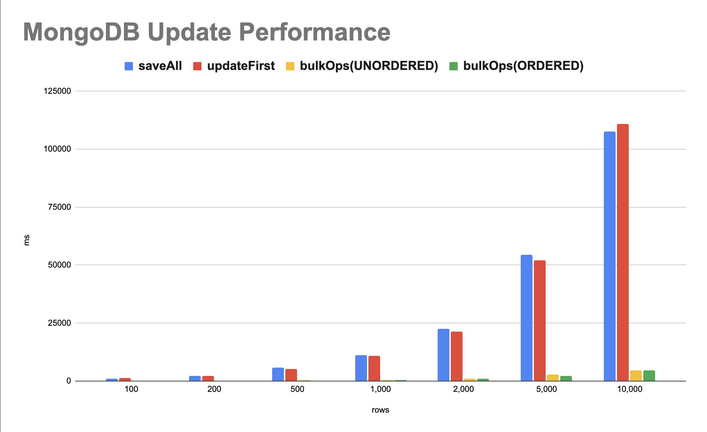

## Performance

## Update Performance

### 성능 측정



| rows   | saveAll    | updateFirst | bulkOps(UNORDERED) | bulkOps(ORDERED) |
|--------|------------|-------------|--------------------|------------------|
| 100    | 1,052 ms   | 1,176 ms    | 46 ms              | 79 ms            |
| 200    | 2,304 ms   | 2,196 ms    | 103 ms             | 124 ms           |
| 500    | 5,658 ms   | 5,250 ms    | 309 ms             | 257 ms           |
| 1,000  | 11,106 ms  | 10,846 ms   | 418 ms             | 412 ms           |
| 2,000  | 22,592 ms  | 21,427 ms   | 1,060 ms           | 1,004 ms         |
| 5,000  | 54,407 ms  | 52,075 ms   | 2,663 ms           | 2,292 ms         |
| 10,000 | 107,651 ms | 110,884 ms  | 4,514 ms           | 4,496 ms         |

### Update Code

#### saveAll

```kotlin
fun updateSaveAll(members: List<Member>) {
    memberRepository.saveAll(members)
}
```

#### updateFirst

```kotlin
fun updateFirst(id: ObjectId): UpdateResult {
    return mongoTemplate.updateFirst(
        Query(Criteria.where("_id").`is`(id)),
        Update().set("name", UUID.randomUUID().toString()),
        Member::class.java
    )
}
```

#### bulkOps 방식

```kotlin
fun updateBulk(
    ids: List<ObjectId>,
    bulkMode: BulkOperations.BulkMode = BulkOperations.BulkMode.UNORDERED
): BulkWriteResult {
    val bulkOps = mongoTemplate.bulkOps(bulkMode, Member::class.java)
    for (id in ids) {
        bulkOps.updateOne(
            Query(Criteria.where("_id").`is`(id)),
            Update().set("name", UUID.randomUUID().toString())
        )
    }
    return bulkOps.execute()
}
```

### BulkMode 차이점

### 분석

## Insert Performance

### 성능 측정

### 분석