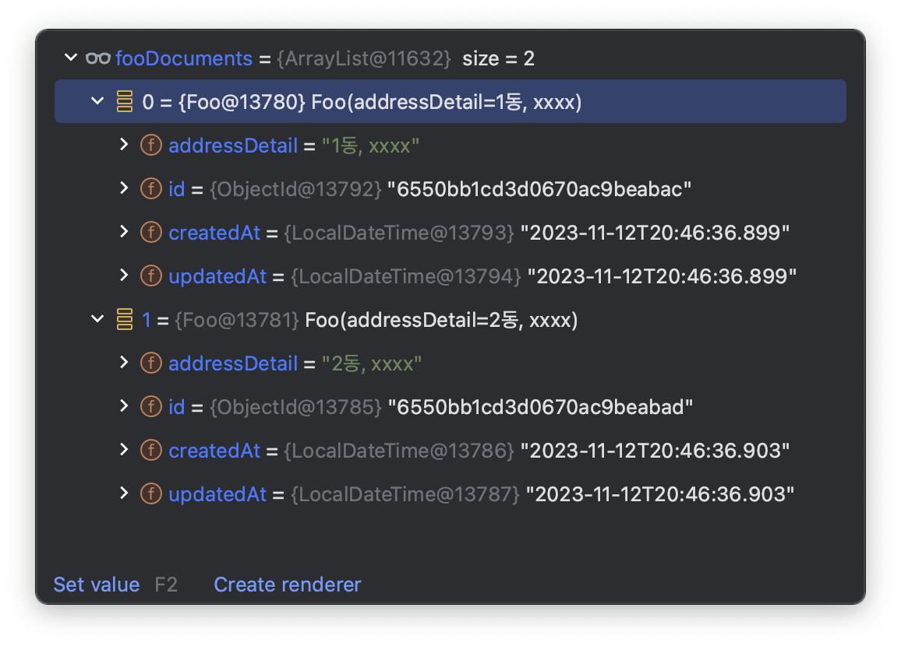

# MongoDB 다양한 테스트 케이스를 커버할 수 있는 테스트 데이터 셋업 방법

테스트 코드의 가치가 널리 인정받으며, 이제 그 필요성을 언급하는 것은 의미가 없어졌습니다. 테스트 코드의 가장 큰 매력은 바로 구현 코드에 대한 실시간 피드백을 제공하고, 이를 바탕으로 구현 코드를 지속적으로 개선해 나갈 수 있다는 점입니다. 이 개념은 "[실무에서 적용하는 테스트 코드 작성 방법과 노하우 Part 2: 테스트 코드로부터 피드백 받기](https://tech.kakaopay.com/post/mock-test-code-part-2/)"사내 기술 블로그에 이미 다룬 바 있습니다. 폭넓은 테스트를 작성하고 실행하기 위해서는 테스트 코드의 간편한 작성이 필수적입니다. 본 포스팅에서는 Spring Data MongoDB를 사용하여 Given 절의 데이터 셋업을 쉽게 하는 방법을 소개할 것입니다.

## 데이터 셋업의 어려움과 중요성


위 이미지처럼 주문 테스트 코드에 대한 다양한 테스트 케이스를 작성하기 위해서는 다양한 데이터를 셋업 하는 것은 필수적입니다. 다양한 테스트 케이스를 작성하지 못하면 테스트 범위가 좁아지며, 이로 인해 테스트 코드로부터 양질의 피드백을 받을 수 없게 됩니다. 따라서, 테스트 코드를 쉽게 작성하고 다양한 시나리오를 손쉽게 검증할 수 있는 환경을 만드는 것이 중요합니다.

스프링에서는 @Sql 어노테이션을 이용해 테스트 데이터를 간단히 셋업 할 수 있으며, 이를 통해 테스트 케이스를 원활하게 확장할 수 있습니다. 이에 관한 자세한 방법은 [Sql을 통해서 테스트 코드를 쉽게 작성하자" 포스팅에서 설명하고 있습니다](https://cheese10yun.github.io/sql-test/). 이 자료는 Sql을 활용하여 다양한 테스트 데이터를 쉽게 구성하는 방법을 제공합니다.

## SQL 파일을 이용한 데이터 셋업 방식

```kotlin
@SqlGroup(
    Sql(
        value = ["/schema.sql", "/order-setup.sql", "/coupon.sql", "product.sql"],
        config = SqlConfig(
            dataSource = "dataSource",
            transactionManager = "transactionManager"
        ),
        executionPhase = Sql.ExecutionPhase.BEFORE_TEST_METHOD
    ),
    Sql(
        value = ["/delete.sql"],
        config = SqlConfig(
            dataSource = "dataSource",
            transactionManager = "transactionManager"
        ),
        executionPhase = Sql.ExecutionPhase.AFTER_TEST_METHOD
    )
)
@Test
fun `sql test code`() {
    // test code
}
```

`@SqlGroup` 어노테이션을 사용하면 `*.sql` 파일을 통해 테스트 데이터를 쉽게 준비할 수 있습니다. 이렇게 데이터를 만들면 setter를 막아 데이터 변경 단위를 논리적으로 제공하는 경우라면 큰 장점이 있습니다.


1. Order라는 엔티티 객체를 테스트 코드를 작성하려면 특정 Snapshot 상태로 만들어야 한다.
2. 테스트 코드를 작성하는 구간은 상품 준비 -> 배송시작 임으로 해당 객체를 상품 준비 상태로 만들어야 한다.
3. 하지만 단순 setter가 없기 때문에 상품 준비 중 객체로 직접 만드는 것이 어려운 부분이 있다.

**이런 경우 `*.sql` 파일을 이용하면 setter가 없어도 테스트 데이터를 비즈니스 제약 없이 쉽게 준비할 수 있습니다.**

## JSON 파일을 이용한 데이터 셋업 방식

`@Sql`와 같은 어노테이 어노테이션을 제공해주지 않기 때문에 직접 만들어야 합니다. 우선 적용된 코드부터 살펴보도록하겠습니다.

### Document

```kotlin
@Document(collection = "foo")
data class Foo(
    @Field("address_detail")
    var addressDetail: String
) : Auditable()

@Document(collection = "bar")
data class Bar(
    @Field("email")
    var email: String
) : Auditable()

abstract class Auditable {
    @Id
    var id: ObjectId? = null
        internal set

    @Field(name = "created_at")
    @CreatedDate
    open lateinit var createdAt: LocalDateTime
        internal set

    @Field(name = "updated_at")
    @LastModifiedDate
    open lateinit var updatedAt: LocalDateTime
        internal set
}
```

테스트를 위해 Foo, Bar Document를 간단한 필드들로 구성하며, `Auditable`을 상속하여 공통된 필드를 갖도록 합니다.

### MongoDataSetup 활용

```kotlin
@MongoTestSupport //(1)
@SpringBootTest
@ActiveProfiles("test")
@TestConstructor(autowireMode = TestConstructor.AutowireMode.ALL)
class MongoDataSetupExecutionListenerBeforeTest(
    private val mongoTemplate: MongoTemplate
) {
    // (2)
    @MongoDataSetup(
        // [{"address_detail": "1동, xxxx"}, {"address_detail": "2동, xxxx"}]
        jsonPath = "/mongo-document-foo.json", // (3)
        clazz = Foo::class, // (4)
    )
    @Test
    @DisplayName("MongoDataSetup 단일 테스트")
    fun mongoDataSetup() {
        // when
        val fooDocuments = mongoTemplate.findAll<Foo>()

        // then
        then(fooDocuments).hasSize(2)
        then(fooDocuments).allSatisfy(
            Consumer {
                then(it.id).isNotNull()
                then(it.addressDetail).isIn(
                    "1동, xxxx",
                    "2동, xxxx"
                )
                then(it.createdAt).isNotNull()
                then(it.updatedAt).isNotNull()
            }
        )
    }
}
```

적용된 코드부터 살펴보고 이후 구현 코드를 살펴보도록하겠습니다.

* (1): `@MongoTestSupport` 설정을 통해서 테스트 실행 리스너로 추가하여 데이터 설정을 자동화합니다.
* (2): `@MongoDataSetup`은 해당 JSON 파일일을 읽어 MongoDB에 삽입합니다.
* (3): `jsonPath`은 `test/resources/` 디렉토리에 위치한 JSON 파일의 경로를 지정합니다. 마지막으로,
* (4): MongoDB에 삽입할 문서의 클래스를 명시합니다.



`@MongoDataSetup` 어노테이션을 사용하면, JSON 파일을 통해 MongoDB 테스트 데이터를 간편하게 설정할 수 있으며, 테스트 실행 시 Foo Document 객체가 성공적으로 저장되고 조회되는 것을 확인할 수 있습니다.

## 코드

### MongoDataSetup

```kotlin
/**
 * @param jsonPath json file의 경로를 작성한다.
 * @param clazz MongoDB에 저장할 Document 객체
 * @param collectionName [clazz]와 Document collection 이름이 다른 경우 명시, 명시하지 않는 경우 [clazz]의 Document의 collection 으로 저장
 *
 * @see com.example.mongostudy.MongoDataSetupExecutionListenerTest.mongoDataSetup
 * @see com.example.mongostudy.MongoDataSetupExecutionListenerTest.mongoDataSetupCollectionName
 */
@Target(AnnotationTarget.FUNCTION)
@Retention(AnnotationRetention.RUNTIME)
annotation class MongoDataSetup(
    val jsonPath: String,
    val clazz: KClass<*>,
    val collectionName: String = ""
)
```

단일 문서 데이터 셋업에 사용됩니다.

```kotlin
/**
 * 여러 데이터를 셋업이 필요한 경우
 * @param mongoDataSetup
 *
 * @see com.example.mongostudy.MongoDataSetupExecutionListenerTest.mongoDataSetups
 */
@Target(AnnotationTarget.FUNCTION, AnnotationTarget.ANNOTATION_CLASS)
@Retention(AnnotationRetention.RUNTIME)
annotation class MongoDataSetups(vararg val mongoDataSetup: MongoDataSetup)
```

여러 문서의 데이터 셋업 시 사용합니다.

### MongoDataSetupExecutionListener

```kotlin
class MongoDataSetupExecutionListener : TestExecutionListener {

    /**
     * 테스트 이전에 [MongoDataSetup]기반으로 Document를 생성한다.
     */
    override fun beforeTestMethod(testContext: TestContext) {
        val currentTestMethod = testContext.testMethod
        val mongoDataSetup = currentTestMethod.getAnnotation(MongoDataSetup::class.java)
        val mongoDataSetups = currentTestMethod.getAnnotation(MongoDataSetups::class.java)
        when {
            mongoDataSetup != null -> insertDocuments(mongoDataSetup, testContext)
            mongoDataSetups != null -> mongoDataSetups.mongoDataSetup.forEach { document ->
                insertDocuments(document, testContext)
            }
        }
    }

    /**
     * 테스트가 끝난 이후 모든 모든 데이터를 삭제한다.
     */
    override fun afterTestMethod(testContext: TestContext) {
        val mongoTemplate = mongoTemplate(testContext)
        val currentTestMethod = testContext.testMethod
        val mongoDataSetup = currentTestMethod.getAnnotation(MongoDataSetup::class.java)
        val mongoDataSetups = currentTestMethod.getAnnotation(MongoDataSetups::class.java)

        when {
            mongoDataSetup != null -> {
                when {
                    mongoDataSetup.collectionName.isEmpty() -> mongoTemplate.dropCollection(mongoDataSetup.clazz.java)
                    else -> mongoTemplate.dropCollection(mongoDataSetup.collectionName)
                }
            }
            mongoDataSetups != null -> {
                mongoDataSetups.mongoDataSetup.forEach {
                    when {
                        it.collectionName.isEmpty() -> mongoTemplate.dropCollection(it.clazz.java)
                        else -> mongoTemplate.dropCollection(it.collectionName)
                    }
                }
            }
        }
    }

    private fun insertDocuments(mongoDataSetup: MongoDataSetup, testContext: TestContext) {
        val mongoTemplate = mongoTemplate(testContext)
        val documents = objectMapper.readValue<List<Any>>(
            readFile(mongoDataSetup.jsonPath),
            objectMapper.typeFactory.constructCollectionType(List::class.java, mongoDataSetup.clazz.java)
        )
        if (documents.isNotEmpty()) {
            when {
                mongoDataSetup.collectionName.isEmpty() -> mongoTemplate.insertAll(documents)
                else -> {
                    // 객체와, collectionName 일치하지 않는 경우는 collectionName을 지정하여 저장한다.
                    for (document in documents) {
                        mongoTemplate.insert(document, mongoDataSetup.collectionName)
                    }
                }
            }
        }
    }


    private fun mongoTemplate(testContext: TestContext): MongoTemplate {
        return testContext.applicationContext.getBean(MongoTemplate::class.java)
    }

    private fun readFile(path: String): String {
        return String(ClassPathResource(path).inputStream.readBytes())
    }

    private val objectMapper: ObjectMapper = ObjectMapper()
        .registerKotlinModule()
        .registerModules(JavaTimeModule(), Jdk8Module())
        .configure(DeserializationFeature.FAIL_ON_UNKNOWN_PROPERTIES, false)
        .apply { this.propertyNamingStrategy = PropertyNamingStrategies.SNAKE_CASE }
}
```

`MongoDataSetupExecutionListener`는 `TestExecutionListener`를 상속받아 구현되며, 스프링의 테스트 컨텍스트 프레임워크를 사용합니다. 이 리스너는 `beforeTestMethod`와 `afterTestMethod` 이벤트를 활용해 테스트 메소드 실행 전에 데이터를 준비하고, 실행 후에 데이터를 정리하는 기능을 수행합니다. 이 리스너는 `TestContext`에 의존하여 테스트 애플리케이션 컨텍스트에서 Bean을 쉽게 가져올 수 있으며, 예시에서는 `MongoTemplate`를 추출하는 데 사용되며 테스트 환경을 설정하거나, 테스트 데이터를 초기화하거나, 테스트 결과를 정리하는 등의 작업을 자동화하는 데 유용합니다. `TestExecutionListener` 인터페이스를 구현하고, 스프링의 테스트에 `@TestExecutionListeners` 어노테이션을 사용하여 리스너를 등록함으로써 활용할 수 있습니다.

### TestExecutionListeners 리스너 등록 방법

```kotlin
@TestExecutionListeners(
    listeners = [
        MongoDataSetupExecutionListener::class,
        DependencyInjectionTestExecutionListener::class
    ]
)
@Retention(AnnotationRetention.RUNTIME)
@Target(AnnotationTarget.CLASS)
annotation class MongoTestSupport
```

`MongoDataSetupExecutionListener`는 테스트에 필요한 리스너로, `TestExecutionListeners` 어노테이션을 통해 등록합니다. 이 과정을 단순화하기 위해 `MongoTestSupport` 어노테이션을 생성하여, `TestExecutionListeners` 설정을 손쉽게 적용할 수 있도록 합니다.

```kotlin
@MongoTestSupport
class MongoDataSetupExecutionListenerBeforeTest {
    ...
}
```

클래스 상단에 `@MongoTestSupport` 어노테이션을 추가함으로써, `MongoDataSetupExecutionListener`가 포함된 `TestExecutionListeners`를 쉽게 사용할 수 있습니다.

### MongoDataSetups 여러 문서의 데이터 셋업

```kotlin
@MongoDataSetups(
    MongoDataSetup(
        jsonPath = "/mongo-document-bar.json",
        clazz = Bar::class,
    ),
    MongoDataSetup(
        jsonPath = "/mongo-document-foo.json",
        clazz = Foo::class,
    ),
)
@Test
@DisplayName("MongoDataSetups 여러개 테스트")
fun mongoDataSetups() {
    // when
    val fooDocuments = mongoTemplate.findAll<Foo>()
    val barDocuments = mongoTemplate.findAll<Bar>()

    // then
    then(fooDocuments).hasSize(2)
    then(fooDocuments).allSatisfy(
        Consumer {
            then(it.id).isNotNull()
            then(it.addressDetail).isIn(
                "1동, xxxx",
                "2동, xxxx"
            )
            then(it.createdAt).isNotNull()
            then(it.updatedAt).isNotNull()
        }
    )

    then(barDocuments).hasSize(2)
    then(barDocuments).allSatisfy(
        Consumer {
            then(it.id).isNotNull()
            then(it.email).isIn(
                "aaa@asd.com",
                "bbb@asd.com"
            )
            then(it.createdAt).isNotNull()
            then(it.updatedAt).isNotNull()
        }
    )
}
```

`MongoDataSetups`를 사용하면 다수의 `MongoDataSetup` 인스턴스를 결합하여 여러 문서를 쉽게 설정할 수 있습니다.

### MongoDataSetup Projection 사용

```kotlin
data class FooProjection(
    @Field("address_detail")
    var addressDetail: String,
    @Field("created_at")
    val createdAt: LocalDateTime,
    @Field("updated_at")
    val updatedAt: LocalDateTime
)

@MongoDataSetup(
    jsonPath = "/mongo-document-foo-projection.json",
    clazz = FooProjection::class,
    collectionName = "foo"
)
@Test
@DisplayName("collectionName 기반으로 테스트")
fun mongoDataSetupCollectionName() {
    // when
    val fooDocuments = mongoTemplate.findAll<Foo>()

    // then
    then(fooDocuments).hasSize(2)
    then(fooDocuments).allSatisfy(
        Consumer {
            then(it.id).isNotNull()
            then(it.addressDetail).isIn(
                "1동, xxxx",
                "2동, xxxx"
            )
            then(it.createdAt).isNotNull()
            then(it.updatedAt).isNotNull()
        }
    )
}
```

Document 클래스가 아닌 Projection 객체를 이용해 데이터를 설정하려면, collectionName을 사용하여 명시적으로 컬렉션 이름을 지정함으로써 데이터를 원하는 컬렉션에 설정할 수 있습니다.

## 편리성 제공

```kotlin
@SpringBootTest
@ActiveProfiles("test")
@TestInstance(TestInstance.Lifecycle.PER_CLASS)
@TestConstructor(autowireMode = TestConstructor.AutowireMode.ALL)
@MongoTestSupport
abstract class MongoApplicationTests
```

`@SpringBootTest` 어노테이션을 사용하는 테스트 클래스에 `@MongoTestSupport`를 추가함으로써, 개별 테스트 클래스에서 어노테이션을 중복하여 작성할 필요 없이 모든 테스트에 적용될 수 있으며, 이를 통해 Application Context를 효율적으로 재사용할 수 있습니다. 이러한 방식은 공통적인 설정을 일관되게 관리하는 데에도 도움이 됩니다.

## @MongoDataSetup 적절한 사용

`@Sql` 방식과 마찬가지로, JSON 파일 기반의 데이터 셋업에는 단점이 있습니다. 코드 내에서 객체를 생성하면 변수명과 주석을 통해 명확한 컨텍스트를 제공할 수 있는 반면, JSON 방식은 이러한 세부 사항을 전달하기 어렵습니다. 또한, `Document` 클래스의 코드 변경 시 관련 JSON 파일을 수동으로 업데이트해야 하는 번거로움이 있습니다.

`@MongoDataSetup`을 사용한 데이터 셋업은 주로 대량의 데이터나 복잡한 데이터 조합이 필요한 로직을 테스트할 때 추천됩니다. 이런 케이스에서는 코드로 직접 작성할 경우 유지보수 비용이 증가하고, 변수명과 주석을 통한 컨텍스트 전달에 한계가 있기 때문에, 이러한 상황에서 `@MongoDataSetup`의 사용이 효과적입니다.

## 마무리

이 포스팅에서는 MongoDB 데이터를 쉽게 설정하는 방법을 소개했지만, 강조하고 싶은 주요 메시지는 테스트 코드의 중요성과 함께 테스트 환경 구성의 중요성입니다. **다양한 테스트 케이스를 작성할 수 있는 환경이 준비되어야만, 테스트 코드를 통해 유의미한 피드백을 얻고, 이를 통해 로직을 검증하고 코드 품질을 향상시킬 수 있습니다.**

