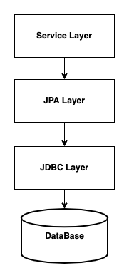
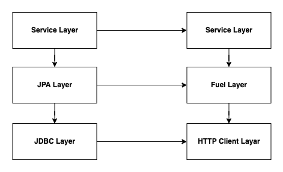

# HTTP Client 책임 분리하기

일반적으로 특정 요구사항을 만족하기 위해서는 다른 서비스들과의 통신을 통하여 진행합니다. 가장 대표적인 통신은 HTTP으로 쉽고 간결하게 연결이 가능하여 많이 사용합니다.

HTTP Client를 개발할 때 적절한 책임과 역할을 부여하는 방법에 대해서 이번 포스팅에서 다루려고 합니다. 보편적으로 이렇게 책임과 역할을 나누는 것이 좋다는 것이지 모든 프로젝트에 알맞은 패턴이라고 주장하는 것은 아닙니다.


## HTTP Client Code

HTTP Client 라이브러리는 [Fuel](https://github.com/kittinunf/fuel)를 사용했습니다. 특정 라이브러리에 대한 부분이 핵심이 아니기 때문에 다른 클라이언트를 사용하는 경우에도 무방합니다. 개인적으로 사용법이 직관적이고 코틀린 베이스이기 때문에 코틀린으로 프로젝트를 진행 중이다면 [Fuel](https://github.com/kittinunf/fuel)을 추천드립니다.


## 코드 흐름

책 예약 서비스인 Book Reservation Service로 책에 대한 예약만을 진행하고 책에 대한 정보는 Book Service에서 HTTP 통신을 통해 진행한다고 가정하겠습니다.

```kotlin
@Service
class BookReservationService() {
    private val BOOK_SERVICE_HOST: String = "http://book-service.copm"

    fun doReservation(bookId: Long, userId: Long) {
        val book = "$BOOK_SERVICE_HOST/api/v1/books/$bookId"
            .httpGet()
            .responseObject<Book>()
            .third
            .onError {
                if (it.response.isSuccessful.not()) {
                    throw IllegalArgumentException("bookId: $bookId not found")
                }
            }
            .get()

        val bookReservation = BookReservation(
            bookId = book.id,
            bookStatus = book.status,
            userId = userId
        )
        // bookReservationRepository.save(bookReservation) JPA를 사용한다고 가정하고 책 예약 반영


        // Book Service API에 책 상태 업데이트
        "$BOOK_SERVICE_HOST/api/v1/books"
            .httpPost()
            .header(Headers.CONTENT_TYPE, "application/json")
            .jsonBody(
                """
                    {
                      "status": "RESERVATION"
                    }
                """.trimIndent()
            )
            .response()
            .third
            .onError {
                if (it.response.isSuccessful.not()) {
                    throw IllegalArgumentException("Book Status Failed")
                }
            }
            .get()

    }
}
```

책 예약을 하기 위해 책에 대한 정보 조회, 책에 대한 상태 업데이트를 Book Service를 통해 HTTP 통신을 진행한다는 코드입니다. 해당 코드는 무엇이 문제일까요? `doReservation` 메서드가 너무 많은 일을 하고 책임 또한 많이 가져간다고 생각합니다. 책 조회, 책 상태 업데이트에 대한 실패, 성공 등등 모든 책임이 부여되어 있고, 해당 케이스에 대한 구현이 `doReservation` 메서드 외에는 테스트할 수 없는 블랙박스가 되어 버린다고 생각합니다.

이런 식의 고도한 책임 부여 현상은 테스트 코드를 작성 시 자연스럽게 알게 되어 리팩토링 하게 되는 부분이 있습니다. 해당 포스팅에 중요 논점은 아니지만 테스트 코드에 아주 큰 장점으로 코드에 대한 피드백을 가장 빠르게 개발자에게 제공한다고 생각합니다.

다시 본론으로 들어가서 가장 쉬운 해결책은 BookClient 코드를 분리하는 것입니다.


```kotlin
@Service
class BookReservationService2() {
    //    private val BOOK_SERVICE_HOST: String = "http://book-service.copm"
    val bookClient = BookClient()

    fun doReservation(bookId: Long, userId: Long) {

        val boo = bookClient.getBook(bookId)

        val bookReservation = BookReservation(
            bookId = boo.id,
            bookStatus = boo.status,
            userId = userId
        )
        // bookReservationRepository.save(bookReservation) JPA를 사용한다고 가정하고 책 예약 반영
        
        // Book Service API에 책 상태 업데이트
        bookClient.updateBookStatus(status = "RESERVATION")
    }
}

class BookClient(
    private val host: String = "http://book-service.copm"
) {

    fun getBook(bookId: Long) =
        "$host/api/v1/books/$bookId"
            .httpGet()
            .responseObject<Book>()
            .third
            .onError {
                if (it.response.isSuccessful.not()) {
                    throw IllegalArgumentException("bookId: $bookId not found")
                }
            }
            .get()

    fun updateBookStatus(
        status: String
    ) =
        "$host/api/v1/books"
            .httpPost()
            .header(Headers.CONTENT_TYPE, "application/json")
            .jsonBody(
                """
                    {
                      "status": "$status"
                    }
                """.trimIndent()
            )
            .response()
            .third
            .onError {
                if (it.response.isSuccessful.not()) {
                    throw IllegalArgumentException("Book Status Failed")
                }
            }
            .get()
}
```

가장 일반적인 패턴으로 Book HTTP 통신을 위한 HTTP Client를 객체로 분리 하게 됩니다. 그 결과 Book HTTP 통신에 대한 책임을 `doReservation` 메서드로 부터 분리하게 됩니다. 하지만 위 코드도 책임이 적절하게 부여했다고 생각하지는 않습니다.

## JPA Repositroy 패턴
우리가 자주 사용하는 JPA Repositroy에 대한 설명 드리겠습니다.

```kotlin
@Service
class BookReservationFindService(
    private val bookReservationRepository: BookReservationRepository
) {
    fun findById(id: Long): BookReservation {
        return bookReservationRepository.findById(id).orElseThrow { throw IllegalArgumentException("id: $id Not found") }
    }
}
```

JPA Repositroy에서 `findById` 메서드에서 특별히 예외를 발생 시키지는 않습니다. 조회가 끝난 이후에 예외 발생 여부는 서비스 레이어로 넘어가게 됩니다. 없는 경우 어떤 예외를 발생할지는 서비스 레이어에서 결정하며, 그 결정은 비지니스 로직에 의해 결정하게 됩니다.



우리는 각 계층 별로 책임과 역활을 나누고 본인의 계층에서는 본인의 책임과 역할을 진행하고 상대적으로 Low 레이어에서는 비지니스에 대한 로직이 없고, High 레이어에서는 비지니스에 대한 로직이 들어가게 됩니다.


## JPA Repositroy == HTTP Client




저는 JPA Repositroy와 HTTP Client에 대한 레이어가 동일 하다고 생각합니다. 위에서 언급 했듯이 
상대적으로 Low 레이어에서는 본인이 담당하는 Low 레벨에 대한 책임만을 수행하며, 비지니스에 대한 책임은 서비스 레이어에서 진행 하는 것이 바람직합니다. 


```kotlin

@Service
class BookReservationService3(
    private val objectMapper: ObjectMapper
) {
    //    private val BOOK_SERVICE_HOST: String = "http://book-service.copm"
    val bookClient = BookClient(objectMapper = objectMapper)

    fun doReservation(bookId: Long, userId: Long) {
        val responseBook = bookClient.getBook(bookId)
        if (responseBook.first.not()) {
            throw IllegalArgumentException("bookId: $bookId not found")
        }
        val book = responseBook.second!!

        val bookReservation = BookReservation(
            bookId = book.id,
            bookStatus = book.status,
            userId = userId
        )
        // bookReservationRepository.save(bookReservation) JPA를 사용한다고 가정하고 책 예약 반영

        // Book Service API에 책 상태 업데이트
        val bookStatusUpdateResponse = bookClient.updateBookStatus(status = "RESERVATION")

        if (bookStatusUpdateResponse.first.not()) {
            throw IllegalArgumentException("book status update failed")
        }
    }
}


class BookClient(
    private val host: String = "http://book-service.copm",
    private val objectMapper: ObjectMapper
) {

    fun getBook(bookId: Long) =
        "$host/api/v1/books/$bookId"
            .httpGet()
            .responseObject<Book>()
// 비지니스 예외는 서비스 레이어에서 책임 진다.
//            .third
//            .onError {
//                if (it.response.isSuccessful.not()) {
//                    throw IllegalArgumentException("bookId: $bookId not found")
//                }
//            }
//            .get()
//            .second
            .run {
                Pair(
                    this.second.isSuccessful,
                    when {
                        this.second.isSuccessful -> this.third.get()
                        else -> null
                    }
                )
            }

    fun updateBookStatus(
        status: String
    ) =
        "$host/api/v1/books"
            .httpPost()
            .header(Headers.CONTENT_TYPE, "application/json")
            .jsonBody(
                """
                    {
                      "status": "$status"
                    }
                """.trimIndent()
            )
// 비지니스 예외는 서비스 레이어에서 책임 진다.
//            .response()
//            .third
//            .onError {
//                if (it.response.isSuccessful.not()) {
//                    throw IllegalArgumentException("Book Status Failed")
//                }
//            }
            .response()
            .run {
                Pair(
                    second.isSuccessful,
                    when {
                        second.isSuccessful -> null
                        else -> {
                            objectMapper.readValue(
                                String(second.body().toByteArray()),
                                ErrorResponse::class.java
                            )
                        }
                    }
                )
            }
}

}
```

HTTP Client에서는 본인 레이어에 해당 하는 역할인 HTTP 통신에 대한 요청/응답에 대한 책임과 역할을 갖게 하며 HTTP 응답/요청에 대한 비지니스 판단은 서비스 레이어에서 진행 합니다. 또한 JPA Repositroy에서는 본인의 책임 영역인 SQL Exception(Low 레벨) 발생 시키듯이, HTTP Client도 HTTP 통신에 대한 Low 레벨에 해당하는 예외를 발생 시켜 본인 계층의 책임을 다하게 합니다. 


## HTTP Client에서 예외를 발생시키면

```kotlin
class Book {

    fun updateStatus(bookId: Long, status: String){
        "$BOOK_SERVICE_HOST/api/v1/books/$bookId"
            .httpPost()
            .header(Headers.CONTENT_TYPE, "application/json")
            .jsonBody(
                """
                    {
                      "status": "$status"
                    }
                """.trimIndent()
            )
            .response()
            .third
            .onError {
                if (it.response.isSuccessful.not()) {
                    throw IllegalArgumentException("Book Status Failed")
                }
            }
            .get()
    }

        fun getBook(bookId: Long) =
        "$host/api/v1/books/$bookId"
            .httpGet()
            .responseObject<Book>()

            .third
            .onError {
                if (it.response.isSuccessful.not()) {
                    throw IllegalArgumentException("bookId: $bookId not found")
                }
            }
            .get()
            .second
}

class BookBulkStatusUpdate() {

    fun update(bookId: Long, bookStatus: String) {
        BookClient()
            .updateBookStatus(bookId, bookStatus)
        
        // 벌크 업데이트 진행 여부를 데이터베이스에 기록하는 로직...
    }
}
```
위와 같이 예외를 발생 시키고 해당 업데이트에 대한 기록을 저장하는 로직이 있다고 가정하면 저 코드는 200응답을 받지 못하면 예외가 발생하여 로직이 종료됩니다. 물론 try catch를 통해서 예외를 잡고 로직을 이어가면 가능은 하지만, 이런 식의 구조는 좋은 코드의 흐름 이라고는 생각하지 않습니다. 그러기 때문에 HTTP Client에 대한 책임은 요청/응답에 대한 책임만 부여하여, 요청/응답이 변경되지 않는 이상 HTTP Client의 코드에 변경이 없도록 하는 것이 바람직합니다.


조회 또한 마찬가지 입니다. 조회 해서 없는 경우 새로 Book를 생성할 수 있고, 아니면 기본 Book을 응답할 수 있습니다. 이 영역은 비지니스 영역이기 때문에 HTTP Client에서는 해당 부분을 관여하지 않는 것이 바람직 합니다.


## 비지니스 코드가 있는 경우 HTTP Client를 한 번더 감싸야 하는가?

HTTP Client에서는 응답/요청에 대한 책임과 역할만을 부여 한다면, 비지니스 로직이 필요한 경우에는 반드시 서비스로 감싸야 하는가라는 의문이 생깁니다.

```kotlin
class BookClient {
    fun registerBook(
        bookName: String,
        bookCode: String,
        publisher: String
    ){
        // bookCode가 publisher에 맞게 적절하게 생생했는지 비지니스 유효성 검증이 필요...
        "$host/api/v1/books"
            .httpPost()
            .header(Headers.CONTENT_TYPE, "application/json")
            .jsonBody("...")
    }
}
```
위 코드 처럼 책을 등록하는 경우 bookCode가 출판사에 맞게 생성된 코드인지 검증이 필요한 경우 등등 요청을 보내야 하는 경우 특정 값에 대해서 유효성 검증, 해당 값을 조합 하여 새로운 값을 생성 등등 다양한 것들이 경우가 있을 수 있습니다.

```kotlin
class BookClientRegistrationService() {
    private val bookClient = BookClient()

    fun register(
        bookName: String,
        bookCode: String,
        publisher: String
    ) {
        // 필요한 비지니스 로직 진행 ...
        // 로직 진행 이후 HTTP Client 호출
        bookClient.registerBook(
            bookName = bookName,
            bookCode = bookCode,
            publisher = publisher,
        )
    }
}
```
그런 경우에는 이렇게 HTTP Client를 한 번더 감싸 BookClientRegistrationService라는 서비스 영역에서 비지니스 요구사항에 맞는 책임을 부여하는 것이 적절해 보입니다. 하지만 단순하게 null, empty 검증 정도로 단순한 검증이라면 서비스 영역을 별도로 만들지는 않을거 같습니다.

## 결론


