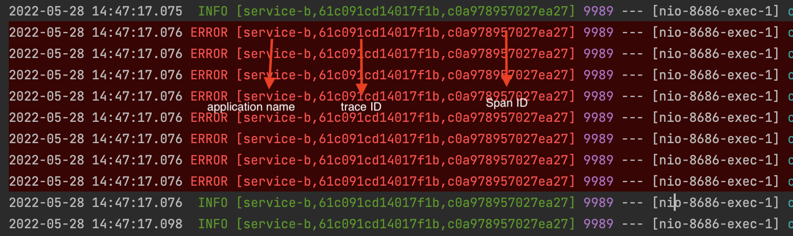
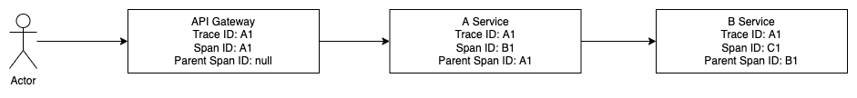
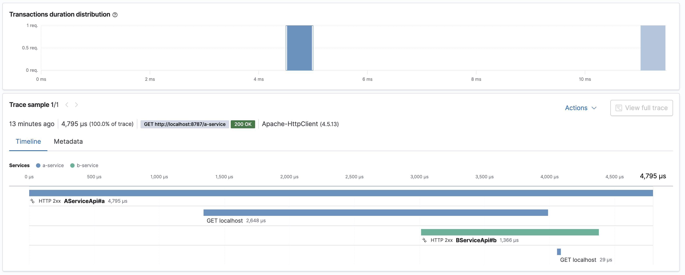

# Sleuth 분산 환경 트래킹

[Spring Cloud Sleuth](https://github.com/spring-cloud/spring-cloud-sleuth)는 분산 환경에서 일련의 Request에 대한 상관관계를 표시하여 서비스 간 호출에 대한 추적을 지원해 주는 모듈입니다. Sleuth는 RestTemplate, Feign, WebClient와 같은 스프링 진형의 HTTP Client 모듈을 사용하는 경우 Sleuth 의존성을 추가하는 것으로도 설정이 자동적으로 동작하게 됩니다. 하지만 다른 HTTP Client 모듈을 사용한다면 해당 설정을 수동으로 진행 햐아 하는데요. 이번 포스팅에서는 코틀린 기반의 [Fuel](https://github.com/kittinunf/fuel) HTTP Client 모듈에 Sleuth를 연동하는 방법을 다루어보겠습니다.


## Sleuth 적용 방법
```
dependencyManagement {
    imports {
        mavenBom("org.springframework.cloud:spring-cloud-dependencies:2021.0.2")
    }
}

dependencies {
    implementation("org.springframework.cloud:spring-cloud-starter-sleuth")
}
```

Sleuth 의존성을 추가하는 것만으로도 logback 설정과 연계되어 애플리케이션 로그에 바로 적용이 됩니다.



기본 설정은 [application name, Trance ID, Span ID] 형식으로 적용됩니다. Application name은 `spring.application.name: xxx` 설정값을 기준으로 지정됩니다. 로그 형식을 바꾸고 싶은 경우에는 loback 설정을 직접 하여 변경이 가능합니다.

## Trance ID & Span ID

이름 | 설명
---|---
Trace ID | 전체 Request의 고유한 값
Span ID | 전체 Request중 일부의 일부의 고유한 값
Parent Span ID | 이전 Request의 Span ID로 요청의 흐름을 파악을 위한 값




1. API Gateway에서 Request를 받아 Trace ID, Span ID를 동일한 값으로 생성하며 Parent Span ID는 null으로 지정
2. A Service에서는 Trace ID는 동일하게 설정, Span ID는 Request의 중 일부로 고유한 값을 설정, Parent Span ID는 이전 Request의 Span ID로 지정
3. B Service에서는 Trace ID는 동일하게 설정, Span ID도 동일하게 유일한 값, Parent Span ID도 동일하게 이전 Request의 Span ID로 설정

Request의 전체 흐름을 Trace ID를 기준으로 트래킹 하며 Span ID로는 해당 Request의 속했던 서비스의 유니크하게 식별이 가능합니다. 또 Parent Span ID를 통해서 호출 간의 상관관계를 파악할 수 있게 됩니다.

## Sleuth + Fuel

RestTemplate, Feign, WebClient처럼 스프링 진형의 HTTP Client를 사용하면 Sleuth 의존성을 추가하면 자동으로 Sleuth가 동작하게 되며 HTTP Header 정보에 Trace ID, Span ID, Parent Span ID를 자동으로 추가됩니다. 하지만 그 외에 HTTP Client 라이브러리를 사용한다면 해당 설정을 진행해야 합니다. 본 예제는 Kotlin 기반의 HTTP Client 라이브러리 [Fuel](https://github.com/kittinunf/fuel)를 기준으로 설명드리겠습니다.

```kotlin
@Configuration
class FuelConfiguration {
    @Bean
    fun fuelManager(tracer: Tracer) =
        FuelManager.instance.apply {
            this.timeoutReadInMillisecond = 120_000 // 2분 // 1
            this.timeoutReadInMillisecond = 120_000 // 2분 // 2
            this.addRequestInterceptor(tracingRequestInterceptor(tracer = tracer)) // 3
            this.addRequestInterceptor(LogRequestInterceptor) // 4
            this.addResponseInterceptor(LogResponseInterceptor) // 5

        }

    // 6
    private fun tracingRequestInterceptor(tracer: Tracer) = { next: (Request) -> Request ->
        { request: Request ->
            val span = tracer.currentSpan() ?: tracer.nextSpan()
            request.header(
                "x-b3-traceid" to span.context().traceId(),
                "x-b3-spanid" to tracer.nextSpan().context().spanId(),
                "x-b3-parentspanid" to tracer.nextSpan().context().parentId().toString()
            )
            next(request)
        }
    }
}
```

* FuelManager을 통해서 설정을 진행합니다.
* (1),(2): Timeout 설정을 진행합니다. 기본 설정이 15s이기 때문에 조정이 필요하면 서비스에 맞데 설정을 진행합니다.
* (3): Header 객체에 `x-b3-traceid`, `x-b3-spanid`, `x-b3-parentspanid`의 값을 Tracer 객체 기반으로 설정합니다.
* (4)(5): Request, Response를 Logging 진행합니다.

```kotlin
@RestController
@RequestMapping("/a-service")
class AServiceApi(
    private val tracer: Tracer
) {

    @GetMapping
    fun a() {
        "http://localhost:8686/b-service"
            .httpGet()
            .header(CONTENT_TYPE to "application/json")
            .response()
    }
}
```

Fuel을 기반으로 B Service를 호출합니다. Fuel은 매우 직관적으로 HTTP 통신을 진행할 수 있습니다. API Gateway -> A Service -> B Service를 호출하는 구조에서 A Service의 로그 정보는 아래와 같습니다.


```
# API Gateway
2022-05-28 18:09:04.159  INFO [gateway-server,757d0493f099b94b,757d0493f099b94b] 11352 --- [ctor-http-nio-4] com.server.gateway.GlobalFilter          : =======API Gateway\======
...

# A service Log
2022-05-28 18:09:04.163  INFO [service-a,757d0493f099b94b,7fba8ecffbdbabcd] 9927 --- [nio-8787-exec-5] c.example.msaerrorresponse.AServiceApi   : =======a-service======
--> GET http://localhost:8686/b-service
Body : (empty)
Headers : (4)
Content-Type : application/json
x-b3-spanid : 4e8d66a6aa1c1ed6
x-b3-parentspanid : 7fba8ecffbdbabcd
x-b3-traceid : 757d0493f099b94b

<-- 200 http://localhost:8686/b-service
Response : 
Length : 0
Body : (empty)
Headers : (4)
Connection : keep-alive
Date : Sat, 28 May 2022 09:09:04 GMT
Content-Length : 0
Keep-Alive : timeout=60

# B service Log
2022-05-28 18:09:04.165  INFO [service-b,757d0493f099b94b,4e8d66a6aa1c1ed6] 9989 --- [nio-8686-exec-3] c.example.msaerrorresponse.BServiceApi   : =======b-service======
```

모든 Request는 Trace ID: 757d0493f099b94b으로 그룹화가 가능하며 각 서비스마다 Span ID마다 고유한 값으로 트래킹이 가능합니다. 또 Parent Span ID를 통해서 Request의 상관관계를 파악할 수 있습니다.



이렇게 Slueth를 통해서 Request의 상관관계를 로깅을하면 해당 정보를 활용하여 시각화가 가능합니다. 해당 이미지는 Elastic Search APM를 사용했습니다.

