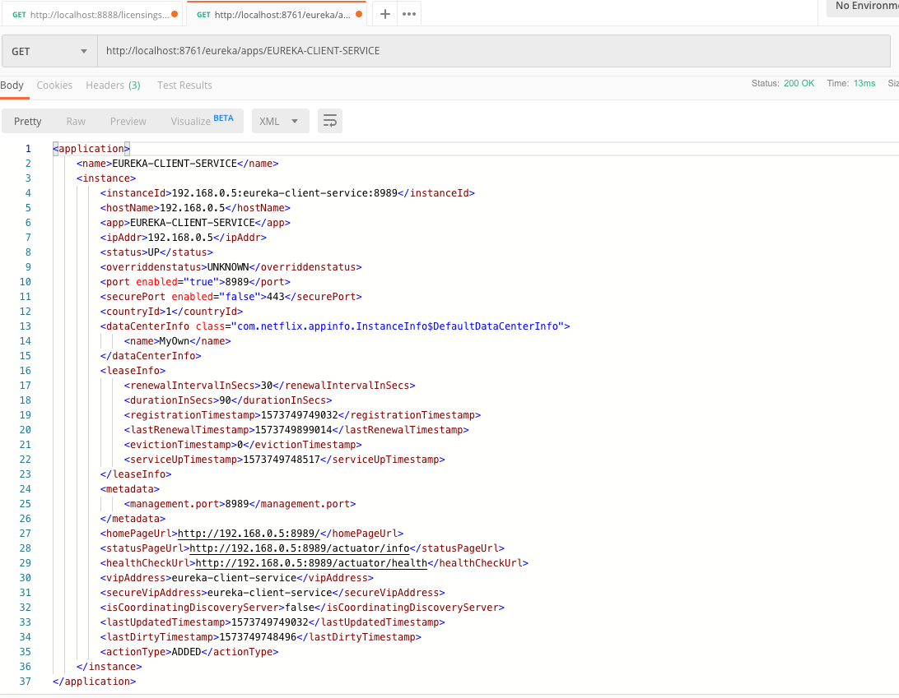

# 스프링 유레카 서비스 등록
```yml
spring:
  application:
    name: eureka-client-service
  profiles:
    active: default

eureka:
  instance:
    preferIpAddress: true
  client:
    registerWithEureka: true
    fetchRegistry: true
    serviceUrl:
      defaultZone: http://localhost:8761/eureka/
```
* `name: eureka-client-service` 유레카에 등록할 서비스의 논리 이름
* `preferIpAddress: true` 유래카에 서비스 등록 (프로퍼티는 서비스의 호스트 이름이 아닌 IP 주소를 유레카에 등록하도록 지정한다.)
* `fetchRegistry: true` 유레카 서비스 위치
* `defaultZone: http://localhost:8761/eureka/` 레지스트리 사본을로컬로 가져오기
* 스프링 부트 기반의 마이크로 서비스에서 애플리케이션  ID는 항상 `spring.application.name` 프로퍼티 값으로 설정된다.


> **IP 주소를 선호하는 이유**
> 기본적으로 유레카 호스트 이름으로 접속하는 서비스를 등록한다. 이것이 DNS가 지원된 호스트 이름을 할당하는 서버 기반 환경에서 잘 동작하기 때문이다. 그러나 컨테이너 기반의 배포(도커)에서 컨테이너는 DNS 엔트리가 없는 임의로 생성된 호스트 이름을 부뎌 받기 시작한다.
>
> `eureka.instance.preferIpAddress`를 true로 설정하지 않는다면 해당 컨테이너에 대한 DNS 엔트리가 없으므로 클라이언트 애플리케이션 호스트 이름을 위치를 정상적으로 얻지 못한다. `preferIpAddress` 프로퍼티를 설정하면 클라이언트 IP 주소로 전달받길 선호한다고 유레카 서비스에 알려준다
>
> 개인적으로 이 속성을 항상 true로 설정한다. 클라우드 기반 마이크로서비스는 일시적이며 무상태 잉야 하므로 자유롭게 시작하고 종료될 수 있다. IP주소는 이런 서비스 유형에 더 적절하다.

`eureka.client.registerWithEureka` 프로퍼티는 조직 서비스 자신을 유레카 서비스에 등록하도록 지정한다. `eureka.client.registerWithEureka` 프로퍼티는 스프링 유레카 클라이언트가 레지스트리의 로컬 복사본을 가져오도록 지정하는데 사용한다. 이 프로퍼티를 true 설정하면 검색할때 마다 유레카 서비스를 호출하는 대신 레지스트리가 로컬로 캐시된다. 30초 마다 클라이언트 소프트웨어는 유레카 서비스에 레지스트리를 변경 사항 여부를 재확인한다.


레지스트리에 있는 조직 조회하려면 `http://localhost:8761/eureka/apps/{APP-ID}`를 호출하면 된다.



# 서비스 디스커버리를 사용해 서비스 검색
유레카에 등록한 서비스의 위치를 직접 알지 못해도 호출할 수 있다. 서비스의 물리적 위치를 검색할 수 있기 때문이다. 서비스가 리본과 상호 작용할 수있는 스프링/넷플릭스의 클라이언트 라이버르리들이 있다.

* 스프링 디스커버리 클라이언트
* RestTemplate이 활성화된 스프링 디스커버리 클라이언트
* 넷플릭스 Feign 클라이언트

## 넷플릭스 Feign 클라이언트로 서비스 호출

```kotlin
@SpringBootApplication
@EnableDiscoveryClient
@EnableFeignClients

class EurekaClientApplication

fun main(args: Array<String>) {
    runApplication<EurekaClientApplication>(*args)
}
```
* `@EnableDiscoveryClient` 여기서 FeignClient만 사용하므로 `@EnableDiscoveryClient`를 제거할 수 있다.
* `@EnableFeignClients` FeignClient를 사용하기 위해 에너테이션 사용

```kotlin
@FeignClient("sampleService")
interface SampleFeignClient {

    @GetMapping("/sample/{id}")
    fun sample(@PathVariable("id") id: String)

}
```
* 간단하게 인터페이스 기반으로 사용할 수 있다.