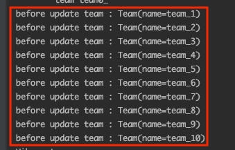
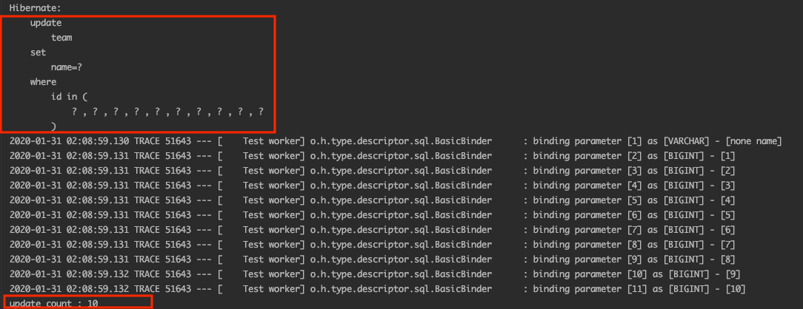
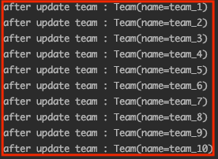
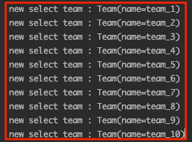
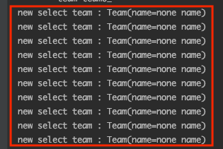

# JPA Bulk 작업시 주의점

JPA Bulk 작업을 진행할 때 영속성 컨텍스트의 매커니즘을 이애하지 못한 상태라면 예상하지 못한 문제를 만날 수도 있게됩니다. 어떤 문제가 있고 이 문제가 왜 발생하는지 정리해 보았습니다.

## 코드
```kotlin
internal class BulkTest(
        private val em: EntityManager
) : SpringBootTestSupport() {

    val query = JPAQueryFactory(em)

    @BeforeEach
    internal fun setUp() {
        val teams = listOf(
                Team("team_1"),
                Team("team_2"),
                Team("team_3"),
                Team("team_4"),
                Team("team_5"),
                Team("team_6"),
                Team("team_7"),
                Team("team_8"),
                Team("team_9"),
                Team("team_10")
        )

        for (team in teams) {
            em.persist(team)
        }

    }

    @Test
    internal fun `bulk test`() {
        // team 전체를 조회한다. team name은 team_x 이다.
        val teams = query.selectFrom(qTeam).fetch()

        for (team in teams) {
            println("before update team : $team")
        }

        val ids = teams.map { it.id!! }

        // team  name 전체를 none name으로 변경한다. 
        val updateCount = query.update(qTeam)
                .set(qTeam.name, "none name")
                .where(qTeam.id.`in`(ids))
                .execute()

        println("update count : $updateCount")

        for (team in teams) {
            println("after update team : $team")
        }

        for (team in newSelectTeams) {
            println("new select team : $team")
        }
    }
}
```

코드는 간단합니다. `team_1`, `team_2`...`team_10`을 저장하고 query dsl update를 이용해서 `team name`을 `none name`으로 변경하는 것입니다. 그리고 변경 제대로 변경이 되었는지 확인하는 확인하는 반복문이 있습니다.




로그를 보면 `team name` 1 ~ 10까지 제대로 출력되는 것을 확인할 수 있습니다.



update query, update count가 정상적으로 출력됩니다. 이제 업데이트된 `team`을 확인하는 아래 코드의 로그를 확인해보겠습니다.

```kotlin
for (team in teams) {
    println("after update team : $team")
}
```

예상했던 `none name`이 아닌 이전 데이터가 출력 되는 것을 획인 할 수 있습니다. 그렇다면 새로 query dsl으로 조회 쿼리를 해보겠습니다.

```kotlin
for (team in newSelectTeams) {
    println("new select team : $team")
}
```


신규로 조회한 데이터에서도 `team name`이 변경되지 않은 것을 확인할 수 있습니다. 왜 변경되지 않은 것일 까요?

## Team 엔티티가 변경되지 않은 이유

### JPA 벌크성 작업은 영속성 컨텍스트와 무관
업데이트 이후 아래 코드가 `team name` 변경 전 데이터인 이유를 설명드리겠습니다.

```kotlin
for (team in teams) {
    println("after update team : $team")
}
```

#### 엔티티 수정 메커니즘


**엔티티의 변경사항을 을 데이터베이스에 반영하는 것을 변경 감지(dirty checking)이라고 합니다.** JPA는 엔티티를 영속성 컨텍스트에 보관할 때, 최초 상태를 복사해서 저장해두고. 플러시 시점에서 스냅샷과 엔티티를 비교해서 변경된 엔티티를 데이터베이스에 반영하게 됩니다. 즉 아래와 같은 절차를 진행하게 됩니다.

1. **트랜잭션을 커밋 하면 엔티티 매니저 내부에서 먼저 플러시가 호출된다.**
2. **엔티티와 스냅샷을 비교해서 변경된 엔티티를 찾는다.**
3. 변경된 엔티티가 있으면 수정 쿼리를 생성해서 쓰기 지연 SQL 저장소에 보낸다.
4. 쓰기 지연 저장소의 SQL을 데이터베이스에 보낸다.
5. **데이터베이스 트랜잭션을 커밋 한다.**

#### 벌크 수정 메커니즘
**하지만 벌크성 작업은 영속성 컨텍스트와 무관합니다.** 벌크 연산은 영속성 컨텍스트를 통하지 않고 아래 그림처럼 **데이터베이스에 직접 쿼리를 진행합니다.**


**즉 영속성 컨텍스트와 무관하니 기존 영속성 컨텍스트에 존재하는 Team의 name들은 변경이 없는 것입니다.**

### 영속성 컨텍스트는 1차 캐시된 것이 우선이다.
`after update team`를 조회했을 때는 영속성 컨텍스트와 무관했기 때문에 기존 데이터가 나왔지만 **신규 조회를 한 아래 코드 왜 변경 전 name이 출력 되었을까요? 그 이유는 영속성 컨텍스트 저장 메커니즘에 있습니다.**

```kotlin
for (team in newSelectTeams) {
    println("new select team : $team")
}
```

#### 영속성 컨텍스트 저장 메커니즘

[영속성 컨텍스트 1차 캐시 저장 메커니즘](https://cheese10yun.github.io/jpa-persistent-context/) 관련 포스팅에서 이미 포스팅한 적이 있습니다. 해당 글을 


findById() 같은 경우는 영속성 컨텍스트를 먼저 찾고 영속성 컨텍스트에 해당 엔티티가 있으면 그 값을 바로 리턴합니다. 이를 1차 캐시라고 말합니다. **반면 JPQL은 영속성성 컨텍스트를 먼저 조회하지 않고 데이터베이스에 query 하여 결과를 가져옵니다. 그리고 아래와 같은 흐름으로 영속성 컨텍스트를 저장을 시도합니다.**

1. JPQL을 호출하면 데이터베이스에 우선적으로 조회한다.
2. 조회한 값을 영속성 컨텍스트에 저장을 시도한다.
3. 저장을 시도할 때 해당 데이터가 이미 영속성 컨텍스트에 존재하는 경우(영속성 컨텍스트에서는 식별자 값으로 식별) 데이터베이스에서 조회한 신규 데이터를 버린다.


**즉 이미 영속성컨텍스트에 team들이 존재하기 때문에 신규 조회한 영속성 컨텍스트를 버리게 되는 것입니다.** 영속성 컨텍스트에서는 ID를 기반으로 식별작을 합니다.

## 해결 방법
해결 방법은 간단합니다. **영속성 컨텍스트를 초기화(clear)을 하면 됩니다.** 영속성 컨텍스트가 초기화됐기 때문에 신규 조회한 `team` 객체들이 모두 영속성 컨텍스트에 그대로 반영되게 됩니다. 


```kotlin
    ...
    em.clear() // 영속성 컨텍스트를 초기화 한다.

    val newSelectTeams = query.selectFrom(qTeam).fetch()

    for (team in newSelectTeams) {
        println("new select team : $team")
    }
```


신규 조회한 `team name` 제대로 변경된 것을 확인할 수 있습니다. 