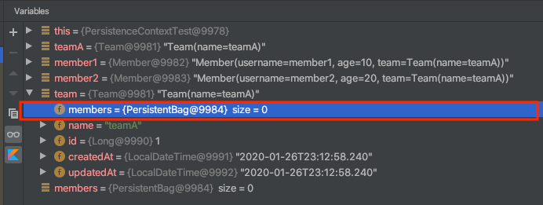
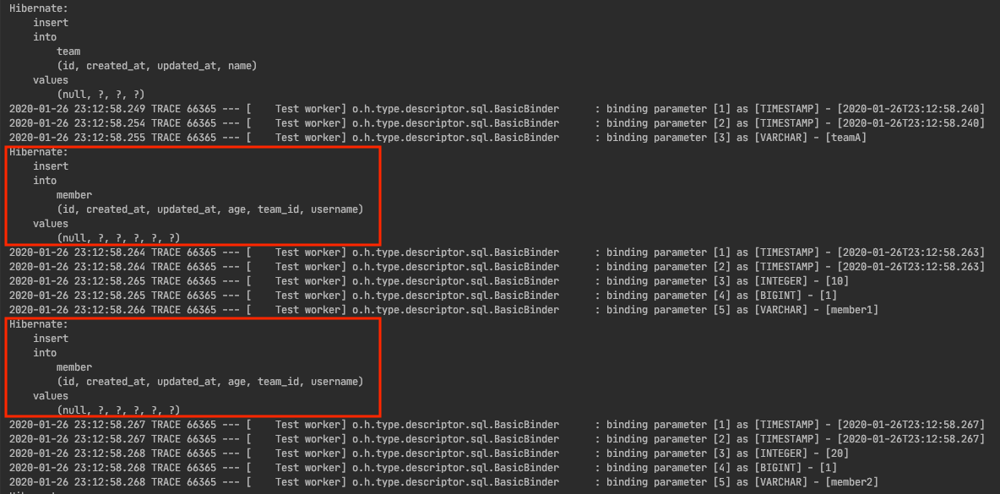
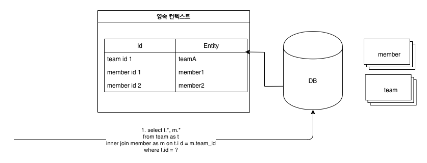

# JPA 영속성 컨텍스트 주의 점

## 엔티티 객체

```kotlin
@Entity
@Table(name = "member")
data class Member(
        @Column(name = "username", nullable = false)
        var username: String,

        @Column(name = "age", nullable = false)
        var age: Int = 0,

        @ManyToOne(fetch = FetchType.LAZY, optional = false)
        @JoinColumn(name = "team_id", nullable = false)
        var team: Team
) : EntityAuditing()

@Entity
@Table(name = "team")
data class Team(
        @Column(name = "name", nullable = false)
        var name: String
) : EntityAuditing() {

    @OneToMany(mappedBy = "team")
    var members: MutableList<Member> = mutableListOf()  
}
```
엔티티 관계는 위와 같습니다.

## 테스트 코드
```kotlin
import com.example.querydsl.domain.QMember.member as qMember
import com.example.querydsl.domain.QTeam.team as qTeam

@SpringBootTest
@TestConstructor(autowireMode = TestConstructor.AutowireMode.ALL)
@Transactional
class PersistenceContextTest(
        private val em: EntityManager
) {

    val query = JPAQueryFactory(em)

    @Test
    internal fun `persistence context test`() {
        //given
        val teamA = Team("teamA")
        em.persist(teamA)

        val member1 = Member(username = "member1", age = 10, team = teamA)
        val member2 = Member(username = "member2", age = 20, team = teamA)
        em.persist(member1)
        em.persist(member2)

        //when
        val team = query
                .selectFrom(qTeam)
                .join(qTeam.members, qMember).fetchJoin()
                .where(qTeam.name.eq("teamA"))
                .fetchOne()!!

        //then
        val members = team.members
        then(members).anySatisfy {
            then(it.username).isIn("member1", "member2")
        }
    }
}
```
`teamA`를 영속화 이후, `member1`, `member2`를 영속화를 진행합니다. `member1`, `member2`는 `teamA` 소속이 됩니다.

그리고 `fetch join`통해서 `teamA`와 `teamA`에 속한 `member`를 조회하고 있습니다. 그리고 `then`절에서 `member1`, `member2`가 `teamA`에 있는지 검증을 진행합니다.

**이 테스트 코드는 실패합니다.**



디버깅 모드로 보면 `memebers` szie가 0인 것을 확인할 수 있습니다. 그렇다면 실제 데이터베이에 `member1`, `member2`가 영속화가 안 된 것일 까요?



`teamA` insert, `member1`, `memeber2` insert 쿼리를 확인할 수 있습니다. 물론 insert query log를 출력했더라도 실제 데이터베이스에 insert 됐다고는 볼 수 없습니다. **정확하게 테스트하기 위해서는 실제 데이터베이스에 저장됐는지 확인하는 것이 바람직합니다.** 해당 경우는 실제 데이터베이스에 commit까지 되는 경우입니다.

그렇다면 왜 해당 테스트 코드가 실패할까요? 그 이유를 알기 위해서는 영속성 컨텍스트의 1차 케시의 저장 메커니즘을 이해해야 합니다.


## 영속성 컨텍스트 1차 캐시 저장 메커니즘



JPQL의 특징이 있습니다. `findById()` 같은 경우는 영속성 컨텍스트를 먼저 찾고 영속성 컨텍스트에 해당 엔티티가 있으면 그 값을 바로 리턴합니다. 이를 1차 캐시라고 말합니다. **하지만 반면 JPQL은 항상 데이터베이스 query를 하여 결과를 가져옵니다.** 그리고 아래와 같은 흐름으로 영속성 컨텍스트에 저장합니다.

1. **JPQL을 호출하면 데이터베이스에 우선적으로 조회한다.**
2. 조회한 값을 영속성 컨텍스트에 저장을 시도한다.
3. **저장을 시도할 때 영속성 컨텍스트에 조회할 때 이미 존재하는 데이터가 있다면(영속성 컨텍스트에서는 식별자 값으로 식별) 데이터를 버린다. 즉 이미 존재하는 영속성 컨텍스트의 데이터를 보존한다.**

## 테스트가 실패하는 이유


```kotlin
    ...

    @Test
    internal fun `persistence context test`() {
    //given
    val teamA = Team("teamA")
    em.persist(teamA)

    val member1 = Member(username = "member1", age = 10, team = teamA)
    val member2 = Member(username = "member2", age = 20, team = teamA)
    em.persist(member1)
    em.persist(member2)

    ... 
}
```
`teamA`, `member1`, `member2` 영속화를 진행합니다. 이때 위 그림처럼 영속성 컨텍스트에 저장됩니다. 

그리고 아래 코드의 `when` 절을 보겠습니다.

```kotlin
    //when
    val team = query
            .selectFrom(qTeam)
            .join(qTeam.members, qMember).fetchJoin()
            .where(qTeam.name.eq("teamA"))
            .fetchOne()!!
```
위에서 언급했던 것처럼 JPQL은 영속성 컨텍스트의 데이터를 조회하지 않고 **데이터베이스에 아래의 query를 진행합니다.**

```sql
    select
        team0_.id as id1_2_0_,
        members1_.id as id1_1_1_,
        team0_.created_at as created_2_2_0_,
        team0_.updated_at as updated_3_2_0_,
        team0_.name as name4_2_0_,
        members1_.created_at as created_2_1_1_,
        members1_.updated_at as updated_3_1_1_,
        members1_.age as age4_1_1_,
        members1_.team_id as team_id6_1_1_,
        members1_.username as username5_1_1_,
        members1_.team_id as team_id6_1_0__,
        members1_.id as id1_1_0__ 
    from
        team team0_ 
    inner join
        member members1_ 
            on team0_.id=members1_.team_id 
    where
        team0_.name=?
```
`fetch join`를 사용했기 때문에 `team`, `member` 객체를 한번에 가져오게 됩니다. **하지만 `teamA`가 이미 존재 하므로 해당 쿼리를 통해서 가져온 데이터를 버리게 됩니다.**

## 해결 하는 방법

### Team 객체에 Member 추가하기
```kotlin
@Test
internal fun `persistence context test`() {
    //given
    val teamA = Team("teamA")
    em.persist(teamA)

    val member1 = Member(username = "member1", age = 10, team = teamA)
    val member2 = Member(username = "member2", age = 20, team = teamA)
    em.persist(member1)
    em.persist(member2)

    teamA.members.add(member1) // teamA에 member1 추가
    teamA.members.add(member2) // teamA에 member2 추가

    ...
}
```
`member1`, `member2`영속화 이후 `teamA` 객체에 영속화된 member 객체를 추가하는 코드를 작성하면 됩니다.

그렇게 되면 `fetch join`을 통해서 데이터베이스에 query를 진행하고 해당 데이터가 영속성 컨텍스트에 이미 있으므로 **데이터를 버리게 되더라도 이미 `member1`, `memeber2`가 존재하는 상태이기 때문에 문제가 되지 않습니다.**

양방향 연관 관계의 경우 편의 메서드를 작성해서 이런 문제를 미연에 방지하는 것이 좋습니다. 물론 필요에 따라서 양방향 양방향 연관 관계를 작성하는 것은 상관없지만 **가능하면 단방향 연관 관계를 유지하는 것이 좋다고 생각합니다.**

양방향 관계가 되면 생각보다 신경 쓸 것이 많아지게 되어 복잡도가 증가하게 됩니다. 또 `OneToMany`, `ManyToOne` 같은 양방향 연관 관계의 경우 N+1 문제도 신경 쓸 것들이 많아지게 됩니다.

### 영속성 컨텍스트 초기화

```kotlin
@Test
internal fun `persistence context test`() {
    //given
    val teamA = Team("teamA")
    em.persist(teamA)

    val member1 = Member(username = "member1", age = 10, team = teamA)
    val member2 = Member(username = "member2", age = 20, team = teamA)
    em.persist(member1)
    em.persist(member2)

//        teamA.members.add(member1)
//        teamA.members.add(member2)
    
    em.flush()
    em.clear()

    ...
}
```
`em.flush()`을 통해서 영속성 컨텍스트의 내용을 데이터베이스에 반영하고 **`em.clear()`을 통해서 영속성 컨텍스트를 모두 초기화 합니다.(영속성 컨텍스트의 데이터를 모두 제거)** 영속성 컨텍스츠가 초기화 되었기 때문에 `fetch join`의 결과가 모두 영속성 컨텍스트의 반영됩니다.

## 결론
테스트 코드를 작성할 때 이런 점을 조심하자는 것이 중점은 아닙니다. 중점으로 다루고 싶었던 내용은 JPQL은 영속성 컨텍스트를 먼저 들리지 않고 데이터베이스에 query를 진행하고, 이후 영속성 컨텍스트에 그 데이터를 이미 존재하는 데이터인 경우 버리고, 없는 경우는 영속성 컨텍스트에 추가하는 메커니즘을 설명하고자 했습니다. 

이 부분은 명확하게 알고 있더라도 영속성 컨텍스트는 실제 보이는 영역이 아니기 때문에 실수하기 좋고  이런 실수를 하더라도 이것을 바로 캐치하기가 어렵습니다. 그래서 정리차 포스팅을 진행하게 되었습니다.

## 참고
* [자바 ORM 표준 JPA 프로그래밍](http://acornpub.co.kr/book/jpa-programmig)