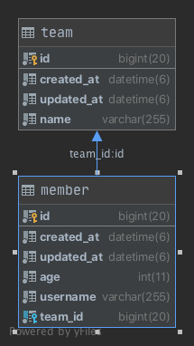
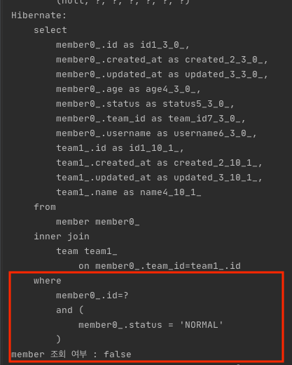
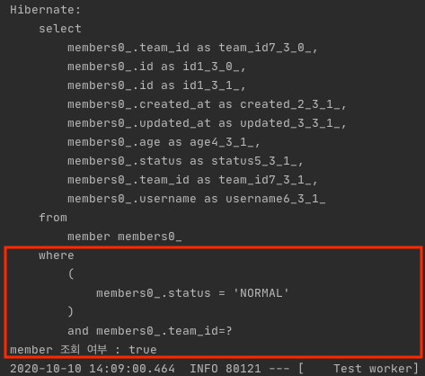
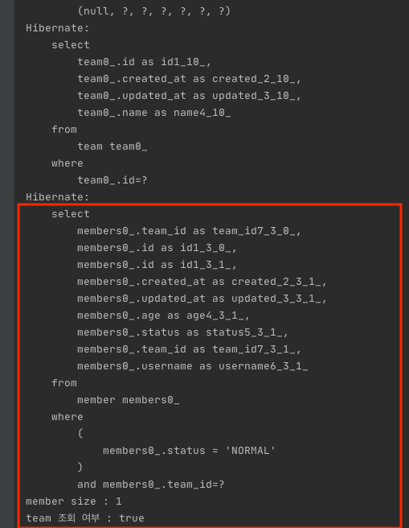

# JPA @Where 사용법

JPA에서 `@Where`를 사용하면 엔티티를 조회하는 경우 일괄적인 Where 조건을 추가할 수 있습니다. 코드를 살펴보겠습니다.

## Entity


```kotlin
@Entity
@Table(name = "member")
@Where(clause = "status = 'NORMAL'")
data class Member(
    @Column(name = "username", nullable = false)
    var username: String,

    @Column(name = "age", nullable = false)
    var age: Int = 0,

    @Enumerated(EnumType.STRING)
    @Column(name = "status", nullable = false)
    var status: MemberStatus = MemberStatus.NORMAL,

    @ManyToOne(fetch = FetchType.EAGER)
    @JoinColumn(name = "team_id", nullable = false)
    var team: Team
) : EntityAuditing() {
}

enum class MemberStatus {
    NORMAL,
    BAN
}

@Entity
@Table(name = "team")
data class Team(
    @Column(name = "name", nullable = false)
    var name: String
) : EntityAuditing() {

    @OneToMany(fetch = FetchType.LAZY, mappedBy = "team")
    var members: MutableList<Member> = mutableListOf()
}
```

엔티티는 위 코드처럼 ManyToOne <-> OneToMany 관계를 가지며 Member 엔티티의 상태를 표현하는 `MemberStatus` enum 클래스로 `NORMAL`, `BAN` status를 갖습니다. 일반적인 Member의 조회는 `NORMAL`인 status를 기준으로 한다고 가정했을 경우 엔티티 조회에서 `where status = 'NOMAL'`의 조건이 추가되어야 합니다. 이런 경우 `@Where`을 사용하면 유용합니다. 테스트 코드를 통해서 살펴보겠습니다.

## Test Code

### Member

```kotlin
@Test
internal fun `where sql MemberStatus BAN test`() {
    //given
    val teamA = save(Team("teamA"))
    val memberId = save(Member("name", 10, MemberStatus.BAN, teamA)).id!!

    //when
    val member = memberRepository.findById(memberId)

    //then
    then(member.isPresent).isFalse()
    println("member 조회 여부 : ${member.isPresent}")
}
```



member의 조회는 `findById` 즉 PK로 찾는 코드지만 `@Where(clause = "status = 'NORMAL'")`으로 인해서 SQL 로그를 보면 where 조건에 `member0_.status = 'NORMAL '`가 추가된 것을 확인할 수 있습니다. `MemberStatus.BAN`상태로 Member를 저장했기 때문에 조회 여부는 `false`인 것을 확인할 수 있습니다.

```kotlin
@Test
internal fun `where sql MemberStatus NORMAL test`() {
    //given
    val teamA = save(Team("teamA"))
    val memberId = save(Member("name", 10, MemberStatus.NORMAL, teamA)).id!!

    //when
    val member = memberRepository.findById(memberId)

    //then
    then(member.isPresent).isTrue()
    println("member 조회 여부 : ${member.isPresent}")
}
```
이번에는 `MemberStatus.NORMAL`으로 저장하고 조회 해보겠습니다.



member 조회 여부가 `true`인것을 확인할 수 있습니다.

### Team

그렇다면 Team 엔티티를 통해서 Lazy Loading 하는 경우에도 Member 엔티티의 `@Where(clause = "status = 'NORMAL'")`가 동작하는지를 QueryDSL 기반으로 진행해보겠습니다.

```kotlin
@Test
internal fun `where sql test`() {
    //given
    val qTeam = QTeam.team
    val teamA = save(Team("teamA"))
    save(Member("name", 10, MemberStatus.NORMAL, teamA))

    //when
    val findTeam = Optional.of(query.selectFrom(qTeam).where(qTeam.id.eq(teamA.id)).fetchOne()!!)
    //then

    val memberSize = findTeam.get().members.size
    println("member size : $memberSize")
    println("team 조회 여부 : ${findTeam.isPresent}")
}
```
 

Team 엔티티를 통해서 Member 엔티티를 Lazy Loading 하더라도 `@Where(clause = "status = 'NORMAL'")`가 정상적으로 동작하는것을 확인 할 수 있습니다.