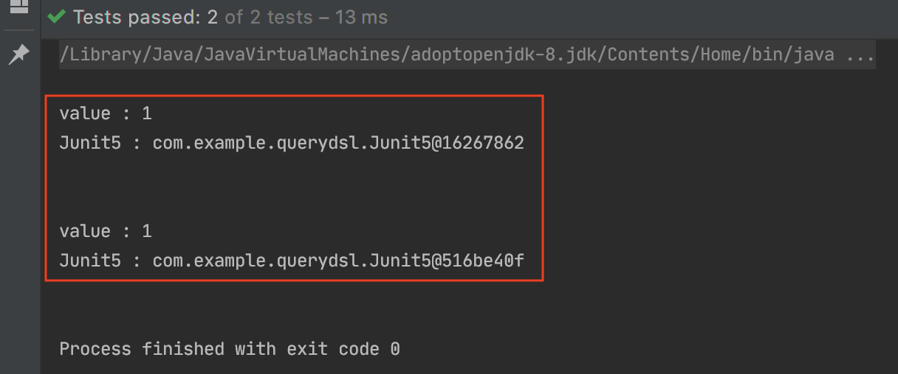
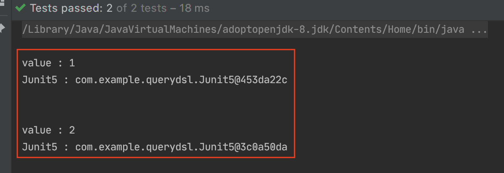
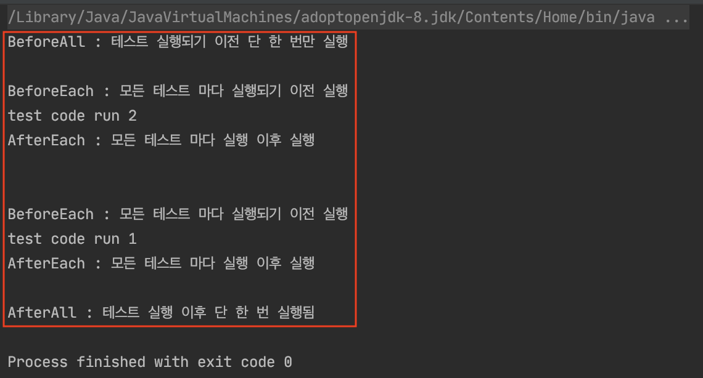
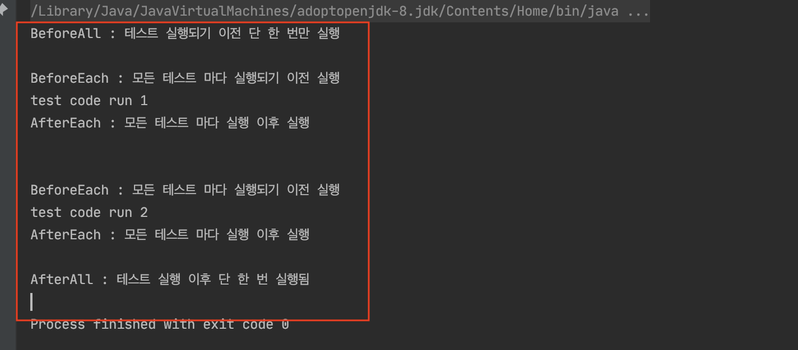

# Junit5

## Instance 특징

Junit5는 **테스트 메서드마다 인스턴스를 새로 생성**하는 것이 기본 전략입니다. 이는 테스트 코드(메서드) 간의 디펜던시 줄이기 위해서입니다. 아래 코드를 통해서 살펴보겠습니다.

```kotlin
internal class Junit5 {

    private var value = 0
    
    @Test
    internal fun `value add 1`() {
        value++

        println("value : $value")
        println("Junit5 : $this")
    }

    @Test
    internal fun `value add 2`() {
        value++

        println("value : $value")
        println("Junit5 : $this")
    }
}
```
각가의 테스트 코드마다 `value`을 증가시키고 있습니다. `value add 1`, `value add 2` 두 메서드 중 한 메서드에서는 `value : 2`가 출력되어야 합니다. 하지만 출력 결과를 확인해 보면 모두 `value : 1`의 값이 출력되는 것을 확인할 수 있습니다.



그 이유는 위에서 언급했듯이 Junit5는 테스트 메서드마다 인스턴스를 새로 생성하는 것이 기본 전략이기 때문에 `value` 값이 초기화되는 것입니다. `Junit5 : $this` 출력을 확인해보면 인스턴스 주솟값이 다른 것을 확인할 수 있습니다. 이렇게 되면 `value add 1`, `value add 2` 테스트 메서드 간에 디펜더시가 줄어들게 됩니다.

만약 테스트 메서드마다 해당 값을 공유해서 사용하고 싶으면 `companion object (static)`으로 변수를 지정하는 것입니다. 아레 코드처럼 변경하고 테스트 코드를 실행해보면 다음과 같은 결과를 확인할 수 있습니다.

```kotlin
internal class Junit5 {

    // private var value = 0

        companion object {
            private var value = 0
    }
    ...
}
```



`value : $value`의 출력을 확인해보면 해당 값이 증가된 것을 확인할 수 있습니다. 또 Junit5 인스턴스가 계속 생성되는 것을 방지하고 싶은 경우에는 `@TestInstance(TestInstance.Lifecycle.PER_CLASS)` 에노테이션을 사용하면 됩니다.

```kotlin
@TestInstance(TestInstance.Lifecycle.PER_CLASS)
internal class Junit5 {

    private var value = 0

    @Test
    internal fun `value add 1`() {
        value++

        println("value : $value")
        println("Junit5 : $this")
    }

    @Test
    internal fun `value add 2`() {
        value++

        println("value : $value")
        println("Junit5 : $this")
    }
}
```


`Junit5` 주솟값을 보면 동일한 주솟값을 출력하는 것을 확인할 수 있습니다. 그 결과 `private var value` 변숫값이 테스트 메서드에서 공유되는 것을 확인할 수 있습니다. 물론 테스트 코드 간의 디펜더시를 줄이는 것이 올바른 테스트 방식이라고 생각합니다. **하지만 테스트 메서드마다 인스턴스를 계속 생성하는 것이 효율적이지 않다고 생각합니다.** 테스트 코드는 디펜던시 없이 작성하고, `@TestInstance(TestInstance.Lifecycle.PER_CLASS)`을 통해서 인스턴스를 계속 생성을 막는 것도 좋은 방법이라고 생각합니다.


### 전처리 후처리

| Annotation  | Description                          |
| ----------- | ------------------------------------ |
| @BeforeAll  | 테스트 실행되기 전 한번 실행됨       |
| @BeforeEach | 모든 테스트 마다 실행되기 전에실행됨 |
| @AfterEach  | 모든 테스트 마다 실행된후 전에실행됨 |
| @AfterAll   | 테스트 실행된 후 한 번 실행됨        |

Junit5에서는 테스트 메서드 실행 시 전처리, 후처리를 위해서 위와 같은 어노테이션을 지원합니다.


```kotlin
internal class SampleTest {

    companion object {
        @BeforeAll
        @JvmStatic
        internal fun beforeAll() {
            println("BeforeAll : 테스트 실행되기 이전 단 한 번만 실행")
        }

        @AfterAll
        @JvmStatic
        internal fun afterAll() {
            println("AfterAll : 테스트 실행 이후 단 한 번 실행됨")
        }

    }

    @BeforeEach
    internal fun beforeEach() {
        println("BeforeEach : 모든 테스트 마다 실행되기 이전 실행")
    }

    @AfterEach
    internal fun afterEach() {
        println("AfterEach : 모든 테스트 마다 실행 이후 실행")
    }

    @Test
    internal fun `test code1`() {
        println("test code run 1")
    }

    @Test
    internal fun `test code2`() {
        println("test code run 2")
    }
}
```



테스트 결과를 보면 `@BeforeXXX`는 테스트 실행 이전 이후 1번 실행되고, `@BeforeXXX`는 테스트 메서드 실행 이전 이후 실행되는 것을 확인할 수 있습니다.

위에서 설명했듯이 테스트 메서드마다 인스턴스를 새로 생성하기 때문에 `@BeforeXXX`는 `companion object(static)`으로 처리하고 있습니다.

```kotlin
internal class SampleTest {

    @BeforeAll
    internal fun beforeAll() {
        println("BeforeAll : 테스트 실행되기 이전 단 한 번만 실행")
    }

    @AfterAll
    internal fun afterAll() {
        println("AfterAll : 테스트 실행 이후 단 한 번 실행됨")
    }
}
```

만약 위처럼 설정하면 위와 같은 에러 메시지를 확인할 수 있습니다.

```
org.junit.platform.commons.JUnitException: @BeforeAll method 'public final void com.example.querydsl.SampleTest.beforeAll$query_dsl()' must be static unless the test class is annotated with @TestInstance(Lifecycle.PER_CLASS).
```

아래 코드처럼 `TestInstance.Lifecycle.PER_CLASS`을 추가하면 테스트 코드가 잘 실행되는 것을 확인할 수 있습니다.

```kotlin
@TestInstance(TestInstance.Lifecycle.PER_CLASS)
internal class SampleTest {

    @BeforeAll
    internal fun beforeAll() {
        println("BeforeAll : 테스트 실행되기 이전 단 한 번만 실행")
    }

    @AfterAll
    internal fun afterAll() {
        println("AfterAll : 테스트 실행 이후 단 한 번 실행됨")
    }
    ...
}
```
예제가 길었지만 전하고 싶은 것은 **테스트 메서드마다 인스턴스를 새로 생성하는 것입니다.**

## 테스트 순서


Junit5에는 테스트 코드 실행 순서는 명확하게 정해져있지 않습니다.(정확히는 순서가 있지만 그것이 명시적으로 정해져있지는 않은 거 같습니다.) 물론 테스트 간의 디펜더시를 줄이기 위해서는 테스트 간의 순서가 없는 것이 더 바람직합니다.

하지만 특정 테스트에서는 순서를 명시해야 할 필요성도 있습니다. `@TestMethodOrder(MethodOrderer.OrderAnnotation::class)`을 사용하면 테스트 순서를 명시적으로 지정할 수 있습니다.

```kotlin
@TestInstance(TestInstance.Lifecycle.PER_CLASS)
@TestMethodOrder(MethodOrderer.OrderAnnotation::class)
internal class SampleTest {

    @BeforeAll
    internal fun beforeAll() {
        println("BeforeAll : 테스트 실행되기 이전 단 한 번만 실행")
    }

    @AfterAll
    internal fun afterAll() {
        println("AfterAll : 테스트 실행 이후 단 한 번 실행됨")
    }

    @BeforeEach
    internal fun beforeEach() {
        println("BeforeEach : 모든 테스트 마다 실행되기 이전 실행")
    }

    @AfterEach
    internal fun afterEach() {
        println("AfterEach : 모든 테스트 마다 실행 이후 실행")
    }

    @Test
    @Order(1)
    internal fun `test code1`() {
        println("test code run 1")
    }

    @Test
    @Order(2)
    internal fun `test code2`() {
        println("test code run 2")
    }
}
```



`@Order()`을 사용하면 위와 같이 테스트 순서를 보장 받을 수 있습니다. **`value` 값이 낮을수록 테스트 코드 우선순위가 높습니다.**

## 정리
`Junit5`에서는 테스트마다 새로운 인스턴스 생성, 테스트 간의 순서를 보장하지 않습니다. 그러한 이유는 이런 방식으로 테스트 코드를 작성하는 것이 더 좋은 방법이라 생각하여 가이드를 하는 거 같습니다. 이러한 부분을 명확하게 이해하고 위와 같은 방법을 사용하는 것이 좋을 거 같습니다.