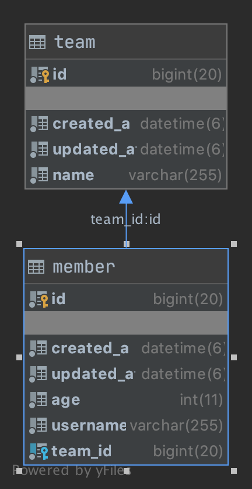
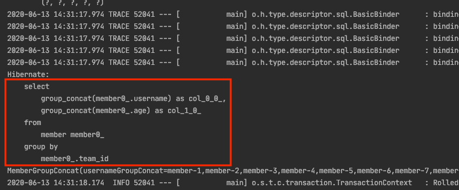
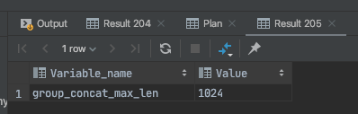

# JPA + Querydsl group_concat 사용법

Querydsl 기반으로 작업하다 보면 sql 함수가 필요한 경우가 있습니다. 대표적으로 sum(), max() 등이 있고 해당 함수는 Querydsl 자체에서 지원해 주고 있습니다. 하지만 `group_concat`과 같은 함수를 사용하기 위해서는 별도의 설정이 필요합니다. 본 포스팅의 내용은 Mysql 환경에서 JPA + Querydsl 조합에서 `group_concat`을 사용하는 방법을 정리한 것입니다.

Mysql 환경에서 `group_concat`을 사용하기 위해서 별다른 설정 없이 `Expressions.stringTemplate()` 함수를 이용해서 `group_concat`사용하는 경우 아래와 같은 에러가 발생합니다.

```
java.lang.IllegalArgumentException: No pattern found for GROUP_CONCAT
```

`SQLExpressions.groupConcat`을 사용해서 `group_concat`을 사용하는 방법도 있지만 해당 설정은 의존성과, 설정이 조금 복잡하기 때문에 `Expressions.stringTemplate` 기반으로 `group_concat`을 사용하겠습니다.

## 설정 방법

```kotlin
package com.example.querydsl.config
...

class MysqlCustomDialect : MySQL57Dialect() {
    init {
        registerFunction(
            "GROUP_CONCAT",
            StandardSQLFunction("group_concat", StandardBasicTypes.STRING)
        )
    }
}
```
`MySQL57Dialect`을 상속받는 커스텀한 `Dialect`클래스를 작성하고 `registerFunction()`메서드를 통해서 `group_concat` SQL Function을 등록합니다.


```yml
spring:
  jpa:
    ...
    show-sql: true
    database-platform: com.example.querydsl.config.MysqlCustomDialect
    ...
```
`application.myl` or `application.properties` 설정에서 위에서 작성한 `MysqlCustomDialect` 패키지 경로를 입력합니다.

## 테스트

* 위와 같은 관계에서 테스트를 진행하겠습니다.

```kotlin
data class MemberGroupConcat @QueryProjection constructor(
    val usernameGroupConcat: String,
    val ageGroupConcat: String
)

@ActiveProfiles("mysql")
@Transactional
internal class GroupConcatTest(
    private val em: EntityManager
) : SpringBootTestSupport() {

    @Test
    internal fun `group concat test`() {
        //given
        val teamA = Team("teamA")
        em.persist(teamA)

        (1..20).map {
            em.persist(Member(username = "member-$it", age = it, team = teamA))
        }

        //when
        val members =
            query
                .select(QMemberGroupConcat(
                    Expressions.stringTemplate("group_concat({0})", qMember.username),
                    Expressions.stringTemplate("group_concat({0})", qMember.age)
                ))
                .from(qMember)
                .groupBy(qMember.team)
                .fetch()

        for (member in members) {
            println(member) // MemberGroupConcat(usernameGroupConcat=member-1,member-2,member-3,member-4,member-5,member-6,member-7,member-8,member-9,member-10,member-11,member-12,member-13,member-14,member-15,member-16,member-17,member-18,member-19,member-20, ageGroupConcat=1,2,3,4,5,6,7,8,9,10,11,12,13,14,15,16,17,18,19,20)
        }
    }
}
```
`teamA`를 하나 생성하고 `member-1` ~ `member-20`까지 `member`를 생성하고 `teamA`에 연결합니다. 리턴 받는 객체는 `MemberGroupConcat`으로 받게 설정합니다. `Projection`을 하는 여러 가지 방법이 있지만 `@QueryProjection`을 이용한 방법을 선호합니다. 해당 포스팅은 [Querydsl Projection 방법 소개 및 선호하는 패턴 정리](https://cheese10yun.github.io/querydsl-projections/)에서 정리한 적 있습니다.



의도한 것처럼 `group_concat`이 잘 동작하는 것을 확인할 수 있습니다.

## 주의점
`group_concat`사용할 때 max length를 주의해서 사용해야 합니다. `group_concat` max length size가 있고 그것을 넘어가면 문자열을 더 가져오지 않습니다.

```kotlin
@Test
internal fun `group concat max length size`() {
    //given
    val teamA = Team("teamA")
    em.persist(teamA)

    (1..1000).map {
        em.persist(Member(username = "member-$it", age = it, team = teamA))
    }

    //when
    val members =
        query
            .select(QMemberGroupConcat(
                Expressions.stringTemplate("group_concat({0})", qMember.username),
                Expressions.stringTemplate("group_concat({0})", qMember.age)
            ))
            .from(qMember)
            .groupBy(qMember.team)
            .fetch()

    for (member in members) {
        println(member) // MemberGroupConcat(usernameGroupConcat=member-1,member-2,member-3,...member-101,member-102,member-103, ageGroupConcat=1,2,3,,281,282,283,)

    }
}
```
member를 1000개 저장하고 `group_concat`을 사용해서 `print()`을 하면 전체 결과가 나오지 않고 일정 length에서 잘리는 것을 알 수 있습니다.

```sql
show variables like 'group_concat_max_len';
```



위 명령어로 `group_concat` max length를 확인할 수 있습니다. 물론 해당 max length를 늘려서 사용할 수 있습니다.

## 정리
`group_concat`을 사용하는 방법을 정리하긴 했지만 가능하면 사용하는 것을 권장하지 않습니다. JPA 연관관계를 통해서 가져오는 것이 더 선호하며 `group_concat` 정도는 괜찮지만 SQL에 함수에 너무 의존적인 코드를 작성하는 것은 지양하는 것이 좋다고 생각합니다.
