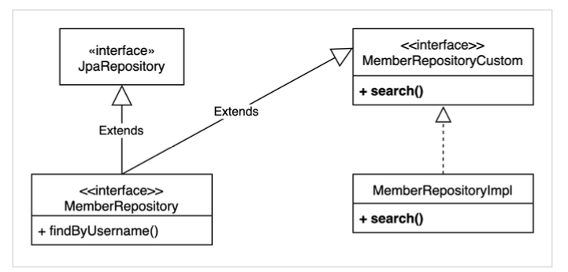

# Query DSl 실전! 강의 학습 정리
> [실전! Querydsl](https://www.inflearn.com/course/Querydsl-%EC%8B%A4%EC%A0%84#)을 학습 내용 정리입니다.

# Query DSL With Kotlin Setting

## build.gradle.kts

```groovy
plugins {
    kotlin("kapt") version "1.3.61" // query dsl plugin 푸가
}

dependencies {
    implementation("org.springframework.boot:spring-boot-starter-data-jpa")
    implementation("com.fasterxml.jackson.module:jackson-module-kotlin")
    implementation("org.jetbrains.kotlin:kotlin-reflect")
    implementation("org.jetbrains.kotlin:kotlin-stdlib-jdk8")
    implementation("com.querydsl:querydsl-jpa") // query dsl 의존성 추가
    runtimeOnly("com.h2database:h2")
    annotationProcessor(group = "com.querydsl", name = "querydsl-apt", classifier = "jpa") // query dsl 의존성 추가
    annotationProcessor("org.springframework.boot:spring-boot-configuration-processor")
    testImplementation("org.springframework.boot:spring-boot-starter-test") {
        exclude(group = "org.junit.vintage", module = "junit-vintage-engine")
    }
    kapt("com.querydsl:querydsl-apt:4.2.1:jpa") // query dsl 의존성 추가
}

```
## Setting Test

```kotlin
@Entity
@Table(name = "heelo")
data class Hello(
        @Column(name = "name", nullable = false)
        val name: String

) : EntityAuditing()
```
Entity 정의

```kotlin
@SpringBootTest
@TestConstructor(autowireMode = TestConstructor.AutowireMode.ALL)
@Transactional
class QueryDslApplicationTests(
        private val em: EntityManager
) {

    @Test
    internal fun `querydsl setting test`() {
        val hello = Hello("yun")
        em.persist(hello)

        val query = JPAQueryFactory(em)

        val qHello = QHello.hello

        val findHello = query
                .selectFrom(qHello)
                .where(qHello.name.eq("yun"))
                .fetchOne()!!

        then(findHello.id).isNotNull()
        then(findHello.name).isEqualTo("yun")
    }
}
```
query dsl 기반으로 select test

```
2020-01-26 01:42:11.185  INFO 53210 --- [    Test worker] o.s.t.c.transaction.TransactionContext   : Began transaction (1) for test context [DefaultTestContext@262bae0d testClass = QueryDslApplicationTests, testInstance = com.example.querydsl.QueryDslApplicationTests@3845bcdd, testMethod = querydsl setting test$query_dsl@QueryDslApplicationTests, testException = [null], mergedContextConfiguration = [WebMergedContextConfiguration@23acc0c7 testClass = QueryDslApplicationTests, locations = '{}', classes = '{class com.example.querydsl.QueryDslApplication}', contextInitializerClasses = '[]', activeProfiles = '{}', propertySourceLocations = '{}', propertySourceProperties = '{org.springframework.boot.test.context.SpringBootTestContextBootstrapper=true}', contextCustomizers = set[org.springframework.boot.test.autoconfigure.properties.PropertyMappingContextCustomizer@0, org.springframework.boot.test.autoconfigure.web.servlet.WebDriverContextCustomizerFactory$Customizer@42eee529, org.springframework.boot.test.context.filter.ExcludeFilterContextCustomizer@230b83e5, org.springframework.boot.test.json.DuplicateJsonObjectContextCustomizerFactory$DuplicateJsonObjectContextCustomizer@1ada8a06, org.springframework.boot.test.mock.mockito.MockitoContextCustomizer@0, org.springframework.boot.test.web.client.TestRestTemplateContextCustomizer@6f3e4b24], resourceBasePath = 'src/main/webapp', contextLoader = 'org.springframework.boot.test.context.SpringBootContextLoader', parent = [null]], attributes = map['org.springframework.test.context.web.ServletTestExecutionListener.activateListener' -> true, 'org.springframework.test.context.web.ServletTestExecutionListener.populatedRequestContextHolder' -> true, 'org.springframework.test.context.web.ServletTestExecutionListener.resetRequestContextHolder' -> true]]; transaction manager [org.springframework.orm.jpa.JpaTransactionManager@38217803]; rollback [true]
2020-01-26 01:42:11.283  INFO 53210 --- [    Test worker] p6spy                                    : #1579970531283 | took 1ms | statement | connection 5| url jdbc:h2:mem:testdb
insert into heelo (id, created_at, updated_at, name) values (null, ?, ?, ?)
insert into heelo (id, created_at, updated_at, name) values (null, '2020-01-26T01:42:11.269+0900', '2020-01-26T01:42:11.269+0900', 'yun');
2020-01-26 01:42:11.565  INFO 53210 --- [    Test worker] p6spy                                    : #1579970531565 | took 3ms | statement | connection 5| url jdbc:h2:mem:testdb
select hello0_.id as id1_0_, hello0_.created_at as created_2_0_, hello0_.updated_at as updated_3_0_, hello0_.name as name4_0_ from heelo hello0_ where hello0_.name=?
select hello0_.id as id1_0_, hello0_.created_at as created_2_0_, hello0_.updated_at as updated_3_0_, hello0_.name as name4_0_ from heelo hello0_ where hello0_.name='yun';
2020-01-26 01:42:11.641  INFO 53210 --- [    Test worker] p6spy                                    : #1579970531641 | took 0ms | rollback | connection 5| url jdbc:h2:mem:testdb
```
query 정상동작 확인

# 기본 문법
## 검색 조건 쿼리

```kotlin

@Test
internal fun `query dsl search`() {
    //@formatter:off
    val member = query
            .selectFrom(qMember)
            .where(
                    qMember.username.eq("member1")
                    .and(qMember.age.eq(10))
            )
            .fetchOne()!!
    //@formatter:on

    then(member.username).isEqualTo("member1")
    then(member.age).isEqualTo(10)
}

@Test
internal fun `query dsl and 생략 가능`() {
    val member = query
            .selectFrom(qMember)
            .where(
                    qMember.username.eq("member1"),
                    qMember.age.eq(10)
            )
            .fetchOne()!!

    then(member.username).isEqualTo("member1")
    then(member.age).isEqualTo(10)
}
```
`and` 조건인 경우 생략이 가능하며 `,`으로 간략하게 가능하다.


 ## 결과 조회
 ```kotlin
@Test
internal fun `query dsl fetch type`() {

// 단건 조회
val member = query
        .selectFrom(qMember)
        .where(qMember.username.eq("member1"))
        .fetchOne()

// list 조회
val members = query
        .selectFrom(qMember)
        .fetch()

// 처음 한건 조회
val firstMember = query
        .selectFrom(qMember)
        .fetchFirst()

// 페이징 사용
val pagingMembers = query
        .selectFrom(qMember)
        .fetchResults()

// count 쿼리
val count = query
        .selectFrom(qMember)
        .fetchCount()

}
 ```
* fetch() : 리스트 조회, 데이터 없으면 빈 리스트 반환
* fetchOne() : 단 건 조회, 결과가 없으면 : null 결과가 둘 이상이면 : com.querydsl.core.NonUniqueResultException
* fetchFirst() : limit(1).fetchOne()
* fetchResults() : 페이징 정보 포함, total count 쿼리 추가 실행
* fetchCount() : count 쿼리로 변경해서 count 수 조회

## 정렬
```kotlin
@Test
internal fun `query dsl sort`() {
    val members = query
            .selectFrom(qMember)
            .orderBy(qMember.age.desc(), qMember.username.asc().nullsLast())
            .fetch()
}
```
* desc() , asc() : 일반 정렬
* nullsLast() , nullsFirst() : null 데이터 순서 부여

## 페이징
```kotlin
@Test
internal fun `query dsl paging fetch 조회 건수 제한`() {
    val members = query
            .selectFrom(qMember)
            .orderBy(qMember.username.desc())
            .offset(1)
            .limit(2)
            .fetch()
}

@Test
internal fun `query dsl paging fetch results 전체 조회 수가 필요`() {
    val paging = query
            .selectFrom(qMember)
            .orderBy(qMember.username.desc())
            .offset(1)
            .limit(2)
            .fetchResults()


    then(paging.total).isEqualTo(4)
    then(paging.limit).isEqualTo(2)
    then(paging.offset).isEqualTo(1)
    then(paging.results.size).isEqualTo(2)
}
```

주의: count 쿼리가 실행되니 성능상 주의!
> 참고: 실무에서 페이징 쿼리를 작성할 때, 데이터를 조회하는 쿼리는 여러 테이블을 조인해야 하지만, count 쿼리는 조인이 필요 없는 경우도 있다. 그런데 이렇게 자동화된 count 쿼리는 원본 쿼리와 같이 모두 조인을 해버리기 때문에 성능이 안나올 수 있다. count 쿼리에 조인이 필요없는 성능 최적화가 필요하다면, count 전용 쿼리를 별도로 작성해야 한다.

## 집합
```kotlin
@Test
internal fun `query dsl aggregation set`() {

    val result = query
            .select(
                    qMember.count(),
                    qMember.age.sum(),
                    qMember.age.avg(),
                    qMember.age.max(),
                    qMember.age.min()
            )
            .from(qMember)
            .fetch()


    val tuple = result[0]

    then(tuple.get(qMember.count())).isEqualTo(4)
    then(tuple.get(qMember.age.sum())).isEqualTo(100)
    then(tuple.get(qMember.age.avg())).isEqualByComparingTo(25.0)
    then(tuple.get(qMember.age.max())).isEqualTo(40)
    then(tuple.get(qMember.age.min())).isEqualTo(10)
}

@Test
internal fun `query dsl group by`() {

    val result = query
            .select(qTeam.name, qMember.age.avg())
            .from(qMember)
            .join(qMember.team, qTeam)
            .groupBy(qTeam.name)
            .fetch()

    val teamA = result[0]
    val teamB = result[1]

    then(teamA.get(qTeam.name)).isEqualTo("teamA")
    then(teamA.get(qMember.age.avg())).isEqualTo(15.0)

    then(teamB.get(qTeam.name)).isEqualTo("teamB")
    then(teamB.get(qMember.age.avg())).isEqualTo(35.0)
}
```
* JPQL이 제공하는 모든 집합 함수를 제공한다.
* tuple은 프로젝션과 결과반환에서 설명한다.


## 조인

### 일반 조인
```kotlin
@Test
internal fun `query dsl join`() {

    val members = query
            .selectFrom(qMember)
            .join(qMember.team, qTeam)
            .where(qTeam.name.eq("teamA"))
            .fetch()

    then(members).anySatisfy {
        then(it.username).isIn("member1", "member2")
        then(it.team!!.name).isEqualTo("teamA")
    }

}
```

```sql
select
    member0_.id as id1_1_,
    member0_.created_at as created_2_1_,
    member0_.updated_at as updated_3_1_,
    member0_.age as age4_1_,
    member0_.team_id as team_id6_1_,
    member0_.username as username5_1_
from
    member member0_
inner join
    team team1_
        on member0_.team_id=team1_.id
where
    team1_.name=?
```

* join() , innerJoin() : 내부 조인(inner join)
* leftJoin() : left 외부 조인(left outer join)
* rightJoin() : rigth 외부 조인(rigth outer join)
* JPQL의 on과 성능 최적화를 위한 fetch 조인 제공 -> 다음 on 절에서 설명

### 세타 조인
**연관관계가 없는 필드로 조인**
```kotlin
@Test
internal fun `query dsl seta join`() {
    val members = query
            .select(qMember)
            .from(qMember, qTeam)
            .where(qMember.username.eq(qTeam.name))
            .fetch()
}
```

```sql
select
    member0_.id as id1_1_,
    member0_.created_at as created_2_1_,
    member0_.updated_at as updated_3_1_,
    member0_.age as age4_1_,
    member0_.team_id as team_id6_1_,
    member0_.username as username5_1_
from
    member member0_ cross
join
    team team1_
where
    member0_.username=team1_.name
```
* from 절에 여러 엔티티를 선택해서 세타 조인
* 외부조인불가능 다음에설명할조인on을 사용하면외부조인가능
* SQL cross join이 진행된것을 확인

### 조인 on : 조인 대상 필터링
* 조인대상필터링
* 연관관계없는엔티티외부조인

```kotlin
@Test
internal fun `query dsl join on`() {
    val members = query
            .select(qMember)
            .from(qMember)
            .leftJoin(qMember.team, qTeam).on(qTeam.name.eq("teamA"))
            .fetch()

    then(members).anySatisfy {
        then(it.team!!.name).isEqualTo("teamA")
    }
}
```

```sql
select
    member0_.id as id1_1_,
    member0_.created_at as created_2_1_,
    member0_.updated_at as updated_3_1_,
    member0_.age as age4_1_,
    member0_.team_id as team_id6_1_,
    member0_.username as username5_1_
from
    member member0_
left outer join
    team team1_
        on member0_.team_id=team1_.id and (team1_.name=?)
```
참고: on 절을 활용해 조인 대상을 필터링 할 때, 외부조인이 아니라 내부조인(inner join)을 사용하면, where 절에서 필터링 하는 것과 기능이 동일하다. 따라서 on 절을 활용한 조인 대상 필터링을 사용할 때, 내부조인 이면 익숙한 where 절로 해결하고, 정말 외부조인이 필요한 경우에만 이 기능을 사용하자.

## 조인 on : 연관관계 없는 엔티티 외부 조인

```kotlin
@Test
internal fun `query dsl ro relation`() {
    val result = query
            .select(qMember, qTeam)
            .from(qMember)
            .leftJoin(qTeam).on(qMember.username.eq(qTeam.name))
            .fetch()


    for (tuple in result) {
        println("tuple : ${tuple}")
    }
}
```

```sql
select
    member0_.id as id1_1_0_,
    team1_.id as id1_2_1_,
    member0_.created_at as created_2_1_0_,
    member0_.updated_at as updated_3_1_0_,
    member0_.age as age4_1_0_,
    member0_.team_id as team_id6_1_0_,
    member0_.username as username5_1_0_,
    team1_.created_at as created_2_2_1_,
    team1_.updated_at as updated_3_2_1_,
    team1_.name as name4_2_1_
from
    member member0_
left outer join
    team team1_
        on (
            member0_.username=team1_.name
        )
// tuple : [Member(username=member1, age=10, team=Team(name=teamA)), null]
// tuple : [Member(username=member2, age=20, team=Team(name=teamA)), null]
// tuple : [Member(username=member3, age=30, team=Team(name=teamB)), null]
// tuple : [Member(username=member4, age=40, team=Team(name=teamB)), null]
```

* 하이버네이트 5.1부터 on 을 사용해서 서로 관계가 없는 필드로 외부 조인하는 기능이 추가되었다. 물론 내 부 조인도 가능하다.
* 주의! 문법을 잘 봐야 한다. leftJoin() 부분에 일반 조인과 다르게 엔티티 하나만 들어간다.
  * 일반조인: leftJoin(member.team, team)
  * on조인: from(member).leftJoin(team).on(xxx)

### 조인 - fetch join
* 페치 조인은 SQL에서 제공하는 기능은 아니다. SQL조인을 활용해서 연관된 엔티티를 SQL 한번에 조회하 는 기능이다. 주로 성능 최적화에 사용하는 방법이다.
```kotlin
@Test
internal fun `query dsl fetch join`() {
    val member = query
            .selectFrom(qMember)
            .join(qMember.team, qTeam).fetchJoin()
            .where(qMember.username.eq("member1"))
            .fetchOne()!!

}
```

```sql
select
    member0_.id as id1_1_0_,
    team1_.id as id1_2_1_,
    member0_.created_at as created_2_1_0_,
    member0_.updated_at as updated_3_1_0_,
    member0_.age as age4_1_0_,
    member0_.team_id as team_id6_1_0_,
    member0_.username as username5_1_0_,
    team1_.created_at as created_2_2_1_,
    team1_.updated_at as updated_3_2_1_,
    team1_.name as name4_2_1_
from
    member member0_
inner join
    team team1_
        on member0_.team_id=team1_.id
where
    member0_.username=?
```

```kotlin
@ManyToOne(fetch = FetchType.LAZY)
@JoinColumn(name = "team_id")
var team: Team? = null
```
실제 페치 전략이 Lazy이더라도, 즉시 로딩으로 한 번에 조회 할 수 있다.

## 서브 쿼리

```kotlin
@Test
internal fun `query dsl sub query 나이가 가장 큰 값`() {
    val qMemberSub = QMember("memberSub")
    val member = query
            .selectFrom(qMember)
            .where(qMember.age.eq(
                    JPAExpressions
                            .select(qMemberSub.age.max())
                            .from(qMemberSub)
            ))
            .fetchOne()!!

    then(member.age).isEqualTo(40)
}
```

```sql
select
    member0_.id as id1_1_,
    member0_.created_at as created_2_1_,
    member0_.updated_at as updated_3_1_,
    member0_.age as age4_1_,
    member0_.team_id as team_id6_1_,
    member0_.username as username5_1_
from
    member member0_
where
    member0_.age=(
        select
            max(member1_.age)
        from
            member member1_
    )
```

```kotlin
@Test
internal fun `query dsl sub query 평균 보다 큰 나이`() {
    val qMemberSub = QMember("memberSub")
    val members = query
            .selectFrom(qMember)
            .where(qMember.age.goe(
                    JPAExpressions
                            .select(qMemberSub.age.avg())
                            .from(qMemberSub)
            ))
            .fetch()!!

    then(members).anySatisfy {
        then(it.age).isIn(30, 40)
    }
}
```
```kotlin
@Test
internal fun `query dsl sub query 평균 보다 큰 나이`() {
    val qMemberSub = QMember("memberSub")
    val members = query
            .selectFrom(qMember)
            .where(qMember.age.goe(
                    JPAExpressions
                            .select(qMemberSub.age.avg())
                            .from(qMemberSub)
            ))
            .fetch()!!

    then(members).anySatisfy {
        then(it.age).isIn(30, 40)
    }
}
```

```sql
select
    member0_.id as id1_1_,
    member0_.created_at as created_2_1_,
    member0_.updated_at as updated_3_1_,
    member0_.age as age4_1_,
    member0_.team_id as team_id6_1_,
    member0_.username as username5_1_
from
    member member0_
where
    member0_.age>=(
        select
            avg(cast(member1_.age as double))
        from
            member member1_
    )
```

### from 절의 서브쿼리 한계
**JPA JPQL 서브쿼리의 한계점으로 from 절의 서브쿼리(인라인 뷰)는 지원하지 않는다. 당연히 Querydsl 도 지원하지 않는다. 하이버네이트 구현체를 사용하면 select 절의 서브쿼리는 지원한다. Querydsl도 하 이버네이트 구현체를 사용하면 select 절의 서브쿼리를 지원한다.**

### from 절의 서브쿼리 해결방안
1. 서브쿼리를 join으로 변경한다. (가능한 상황도 있고, 불가능한 상황도 있다.)
2. 애플리케이션에서 쿼리를 2번 분리해서 실행한다.
3. nativeSQL을 사용한다.

## Case 문
```kotlin
@Test
internal fun `query dsl basic case`() {
    val results = query
            .select(qMember.age
                    .`when`(10).then("열살")
                    .`when`(20).then("스무살")
                    .otherwise("이타"))
            .from(qMember)
            .fetch()

    for (str in results){
        println(str)
    }
}
```
```sql
select
    case
        when member0_.age=? then ?
        when member0_.age=? then ?
        else '이타'
    end as col_0_0_
from
    member member0_
```

# 중급 문법

## 프로젝션과 결과 반환 - 기본
```kotlin
@Test
internal fun `query dsl projection simple`() {
    val results = query
            .select(qMember.username)
            .from(qMember)
            .fetch()

    for (result in results) {
        println(result)
    }
}
```
```sql
select
    member0_.username as col_0_0_
from
    member member0_
```
* 프로젝션 대상이 하나면 타입을 명확하게 지정할 수 있음
* 프로젝션 대상이 둘 이상이면 튜플이나 DTO로 조회

## 튜플 조회
```kotlin
@Test
internal fun `query dsl tuple projection`() {

    val results = query
            .select(qMember.username, qMember.age)
            .from(qMember)
            .fetch()

    for (tuple in results) {

        val username = tuple.get(qMember.username)
        val age = tuple.get(qMember.age)

        println("""
            username : $username
            age : $age
        """.trimIndent())

    }
}
```

```sql
select
    member0_.username as col_0_0_,
    member0_.age as col_1_0_
from
    member member0_
```
## 프로젝션과 결과 반환 - DTO 조회
결과를 DTO 반환할 때 사용 다음 3가지 방법 지원

* 프로퍼티 접근
* 필드 직접 접근
* **생성자 사용**

생성가 기반의 프로젝션 처리가 좋은 코드라고 생각, setter 방식은 setter 코드 때문에 객체가 mutable 상태로 변경되게 되며, 필드 방식은 필드명이 정확하게 일치해야 하는 문제가 있다. 생성자 방식이 가장 POJO 스럽게 코드를 작성할 수 있음

### 생성자 사용
```kotlin
data class MemberDto(
        val username: String,
        val age: Int
)

@Test
internal fun `query dsl projection dto`() {
    val members = query
            .select(Projections.constructor(
                    MemberDto::class.java,
                    qMember.username,
                    qMember.age
            ))
            .from(qMember)
            .fetch()

    for (member in members) {
        println(member)
    }
}
```
```sql
select
    member0_.username as col_0_0_,
    member0_.age as col_1_0_
from
    member member0_
```
### 별칭이 다를 때
```kotlin
@Test
internal fun `query dsl projection dto 2`() {
    val members = query
            .select(Projections.constructor(
                    MemberDto::class.java,
                    qMember.username,
                    qMember.age.max().`as`("age")
            ))
            .from(qMember)
            .groupBy(qMember.age)
            .fetch()

    for (member in members) {
        println(member)
    }
}
```

```sql
select
    member0_.username as col_0_0_,
    max(member0_.age) as col_1_0_
from
    member member0_
group by
    member0_.age
```
* 프로퍼티나, 필드 접근 생성 방식에서 이름이 다를 때 해결 방안
* ExpressionUtils.as(source,alias) : 필드나, 서브 쿼리에 별칭 적용
* username.as("memberName") : 필드에 별칭 적용


## 프로젝션과 결과 반환 - @QueryProjection
```kotlin
data class MemberDto @QueryProjection constructor(
        val username: String,
        val age: Int) {
}

@Test
internal fun `query dsl dto projection QueryProjection`() {
    val members = query
            .select(QMemberDto(qMember.username, qMember.age))
            .from(qMember)
            .fetch()

    for (member in members) {
        println(member)
    }
}
```
**이 방법은 컴파일러로 타입을 체크할 수 있으므로 가장 안전한 방법이다.** 다만 DTO에 QueryDSL 어노테 이션을 유지해야 하는 점과 DTO까지 Q 파일을 생성해야 하는 단점이 있다.

또 다른 하나의 단점은 DTO의 의존관계의 문제이다. DTO는 모든 레이어에서 공통적으로 사용하는 코드로 어떠한 의존관계를 갖지 않는 것이 바람직하다. 그런데 `@QueryProjection` 어노테이션은 Query DSL의 의존성이 필요하다. 그래서 해당 DTO의 의존성이 추가 되는게 문제이긴 하다. 그래도 어노테이션정도 추가이기 때문에 그렇게 안티패턴이라고 생각하지 않는다.

## 동적 쿼리 : BooleanBuilder 사용

```kotlin
@Test
internal fun `query dsl dynamic query boolean builder`() {

    val username = "member1"
    val age = 10

    val members = searchMember(username, age)

    for (member in members) {
        println(member)
    }
}

private fun searchMember(username: String?, age: Int?): List<Member> {
    val booleanBuilder = BooleanBuilder()

    username.let {
        booleanBuilder.and(qMember.username.eq(username))
    }

    age.let {
        booleanBuilder.and(qMember.age.eq(age))
    }

    return query
            .selectFrom(qMember)
            .where(
                    booleanBuilder
            )
            .fetch()
}
```
## 동적 쿼리 - Where 다중 파라미터 사용
```kotlin
@Test
internal fun `query dsl dynamic query`() {
    val username = "member1"
    val age = 10

    val members = query
            .selectFrom(qMember)
            .where(usernameEq(username), ageEq(age))
            .fetch()

    for (member in members) {
        println(member)
    }

}

private fun usernameEq(username: String?): BooleanExpression? {
    return when (username) {
        null -> null
        else -> qMember.username.eq(username)
    }
}

private fun ageEq(age: Int?): BooleanExpression? {
    return when (age) {
        null -> null
        else -> qMember.age.eq(age)
    }
}
```
* where 조건에 null 값은 무시된다.
* 메서드를 다른 쿼리에서도 재활용 할 수 있다.
* 쿼리 자체의 가독성이 높아진다.
* 작성한 메서드의 조합으로 재사용성이 높아진다.

## 수정, 삭제 벌크 연산
```kotlin
@Test
internal fun `query  dsl bulk update`() {
    val count = query
            .update(qMember)
            .set(qMember.username, "set username")
            .where(qMember.age.lt(20))
            .execute()

    then(count).isEqualTo(1)
}

@Test
internal fun `query  dsl bulk delete`() {
    val count = query
            .delete(qMember)
            .where(qMember.age.gt(10))
            .execute()

    then(count).isEqualTo(3)
}
```

```sql
update
    member
set
    username=?
where
    age<?

delete
from
    member
where
    age>?
```
**주의: JPQL 배치와 마찬가지로, 영속성 컨텍스트에 있는 엔티티를 무시하고 실행되기 때문에 배치 쿼리를 실행하고 나면 영속성 컨텍스트를 초기화 하는 것이 안전하다.**

## 사용자 정의 리포지토리
)
1. 사용자 정의 인터페이스 작성
2. 사용자 정의 인터페이스 구현
3. 스프링 데이터 리포지토리에 사용자 정의 인터페이스 상속

### 사용 방법

```kotlin
interface MemberRepository : JpaRepository<Member, Long>, MemberRepositoryCustom

interface MemberRepositoryCustom {

    fun search(username: String?, age: Int?): Member

}

class MemberRepositoryImpl(
        private val query : JPAQueryFactory
) :  MemberRepositoryCustom {

    override fun search(username: String?, age: Int?): Member {
        return query
                .selectFrom(qMember)
                .where(qMember.username.eq("member1"))
                .fetchOne()!!

    }
}

@Configuration
class Configuration {

    @Bean
    fun query(entityManager: EntityManager): JPAQueryFactory {
        return JPAQueryFactory(entityManager)
    }
}
```

`XXXImpl`의 이름이 패턴이 동일 해야함

### Count Query 최적화

```kotlin
override fun search(username: String?, age: Int?, page: Pageable): Page<MemberDto> {
    val content = query
            .select(QMemberDto(
                    qMember.username,
                    qMember.age))
            .from(qMember)
            .where(searchCondition(username, age))
            .offset(page.offset)
            .limit(page.pageSize.toLong())
            .orderBy()
            .fetch()

    val countQuery = query
            .select(QMemberDto(
                    qMember.username,
                    qMember.age))
            .from(qMember)
            .where(searchCondition(username, age))

    return PageableExecutionUtils.getPage(content, page) { countQuery.fetchCount() }
}
```
* content, totalCount를 별도로 쿼리한다. count 쿼리는 여러거지 이유로 content의 쿼리와 동일하지 않을 수 있음, 불필요한 조인이 있는 경우 등등
* 람다식으로 `{ countQuery.fetchCount() }` 카운트 쿼리를 넘겨줌

```kotlin
public static <T> Page<T> getPage(List<T> content, Pageable pageable, LongSupplier totalSupplier) {

    Assert.notNull(content, "Content must not be null!");
    Assert.notNull(pageable, "Pageable must not be null!");
    Assert.notNull(totalSupplier, "TotalSupplier must not be null!");

    if (pageable.isUnpaged() || pageable.getOffset() == 0) {

        if (pageable.isUnpaged() || pageable.getPageSize() > content.size()) {
            return new PageImpl<>(content, pageable, content.size());
        }

        return new PageImpl<>(content, pageable, totalSupplier.getAsLong());
    }

    if (content.size() != 0 && pageable.getPageSize() > content.size()) {
        return new PageImpl<>(content, pageable, pageable.getOffset() + content.size());
    }

    return new PageImpl<>(content, pageable, totalSupplier.getAsLong());
}
```
다양한 이유로 count queqry를 최적화함, total count가 size를 넘지 않은 경우는 count query를 동작시킬 필요 없음 등등 유틸 클래스에서 최적화 시켜줌

* count 쿼리가 생략 가능한 경우 생략해서 처리
  * 페이지 시작이면서 컨텐츠 사이즈가 페이지 사이즈보다 작을 때
  * 마지막 페이지 일 때 (offset + 컨텐츠 사이즈를 더해서 전체 사이즈 구함)

## 인터페이스 지원 - QuerydslPredicateExecutor

```java
public interface QuerydslPredicateExecutor<T> {
    Optional<T> findById(Predicate predicate);
    Iterable<T> findAll(Predicate predicate);
    long count(Predicate predicate);
    boolean exists(Predicate predicate);
// ... more functionality omitted.
}
```

### 한계점
* 조인X (묵시적 조인은 가능하지만 left join이 불가능하다.)
* 클라이언트가 Querydsl에 의존해야 한다. 서비스 클래스가 Querydsl이라는 구현 기술에 의존해야 한다.
* 복잡한 실무환경에서 사용하기에는 한계가 명확하다.

# 스프링 데이터 JPA가 제공하는 Query 기능

## 리포지토리 지원 - QuerydslRepositorySupport

### 장점
* getQuerydsl().applyPagination() 스프링 데이터가 제공하는 페이징을 Querydsl로 편리하게 변환 가능(단! Sort는 오류발생)
* from() 으로 시작 가능(최근에는 QueryFactory를 사용해서 select() 로 시작하는 것이 더 명시적)
* EntityManager 제공

### 한계
* Querydsl 3.x 버전을 대상으로 만듬
* Querydsl 4.x에 나온 JPAQueryFactory로 시작할 수 없음
  * select로 시작할 수 없음 (from으로 시작해야함) QueryFactory 를 제공하지 않음
* 스프링 데이터 Sort 기능이 정상 동작하지 않음

## Query Dsl 지원 클래스 직접 만들기
스프링 데이터가 제공하는 QuerydslRepositorySupport 가 지닌 한계를 극복하기 위해 직접 Querydsl
지원 클래스를 만들어보자.

### 장점
* 스프링 데이터가 제공하는 페이징을 편리하게 변환 페이징과 카운트 쿼리 분리 가능
* 스프링 데이터 Sort 지원
* select() , selectFrom() 으로 시작 가능 EntityManager , QueryFactory 제공