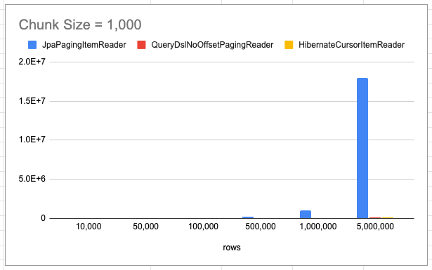
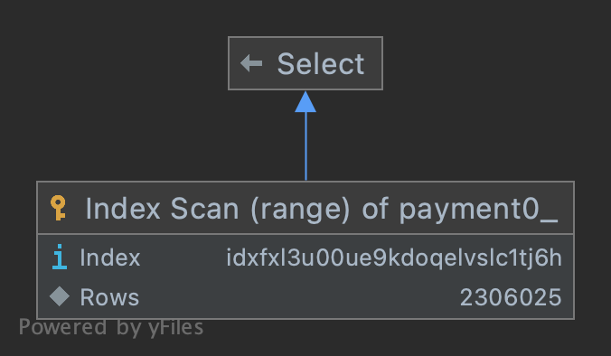
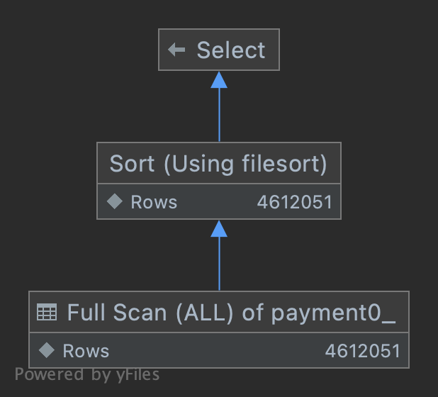
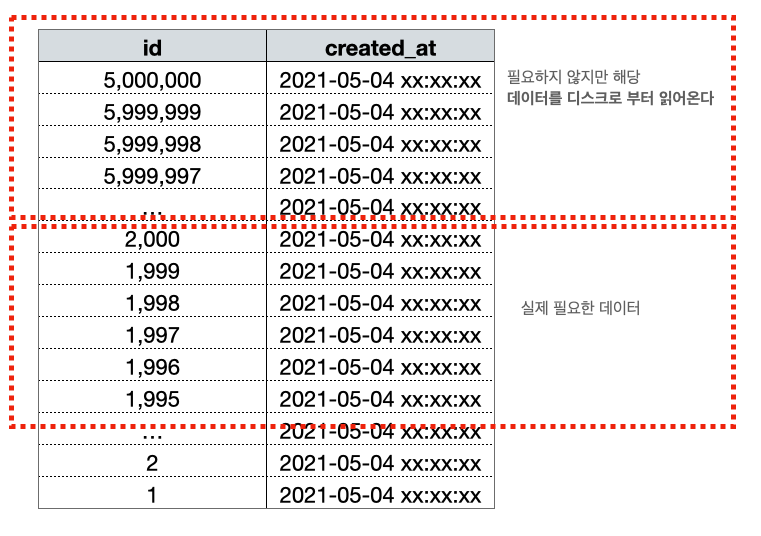
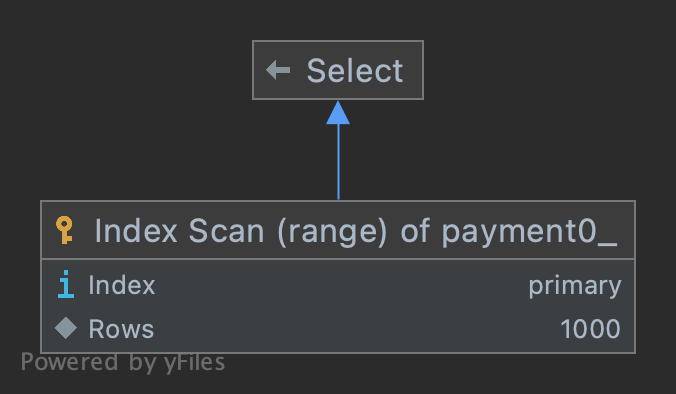

# Querydsl Repository Support - 커서 기반 페이지네이션

## 관련 포스팅

- [Querydsl Repository Support 활용](https://cheese10yun.github.io/querydsl-support/)
- [JPA 페이징 Performance](https://cheese10yun.github.io/page-performance/)
- [Spring Batch QueryDsl Batch Insert](https://cheese10yun.github.io/querydsl-batch-insert/)

---

이전 포스팅에서 `Querydsl4RepositorySupport`를 이용한 두 가지 페이지네이션 방법을 소개했습니다. 이번 포스팅에서는 해당 방법들의 한계를 짚어보고, 이를 해결하는 커서 기반 페이지네이션(`applyCursorPagination`)을 소개합니다.

## 기존 페이지네이션 방식 복습

전통적인 페이지네이션은 `limit`, `offset`으로 부분 데이터를 가져오고, 하단의 네비게이션을 구성하기 위해 전체 카운트 쿼리를 별도로 실행하는 방식입니다.

```sql
-- 데이터 조회
SELECT *
FROM payment
ORDER BY id DESC
LIMIT 10 OFFSET 100;

-- 전체 카운트
SELECT COUNT(*)
FROM payment;
```

이 방식의 카운트 쿼리는 테이블 전체를 스캔하기 때문에 데이터가 많아질수록 부담이 커집니다.

### applySlicePagination - 카운트 쿼리 없는 Slice

그렇다면 카운트 쿼리가 반드시 필요한가? 라는 질문을 해볼 수 있습니다. 실제로 페이지 네비게이션이 있는 화면이라도, 사용자가 26페이지에 원하는 데이터가 있을 것이라고 예상하고 바로 넘어가는 경우는 거의 없습니다. 대부분 다음 페이지로 넘어가는 방식으로 탐색합니다. 이런 경우에는 굳이 무거운 카운트 쿼리 없이, 다음 데이터가 있는지 여부만 내려주는 Slice 방식이 더 효율적입니다.

```kotlin
protected fun <T> applySlicePagination(
    pageable: Pageable,
    query: Function<JPAQueryFactory, JPAQuery<T>>
): Slice<T> {
    val jpaContentQuery = query.apply(queryFactory)
    val content = querydsl!!.applyPagination(pageable, jpaContentQuery).fetch()
    val hasNext = content.size >= pageable.pageSize
    return SliceImpl(content, pageable, hasNext)
}
```

`pageSize + 1`개를 조회해서 다음 데이터 존재 여부(`hasNext`)만 판별하고, 카운트 쿼리는 실행하지 않습니다.

### applyPagination - 코루틴 병렬 조회

하단 전체 페이지 네비게이션이 반드시 필요한 경우라면 데이터 조회 쿼리와 카운트 쿼리를 코루틴으로 동시에 실행해서 성능을 개선할 수 있습니다.

```kotlin
protected fun <T> applyPagination(
    pageable: Pageable,
    contentQuery: Function<JPAQueryFactory, JPAQuery<T>>,
    countQuery: Function<JPAQueryFactory, JPAQuery<Long>>
): Page<T> = runBlocking {
    val jpaContentQuery = contentQuery.apply(queryFactory)
    val content = async(Dispatchers.IO) { querydsl!!.applyPagination(pageable, jpaContentQuery).fetch() as List<T> }
    val count = async(Dispatchers.IO) { countQuery.apply(queryFactory).fetchFirst() }

    PageImpl(content.await(), pageable, count.await())
}
```

데이터 조회에 500ms, 카운트 조회에 500ms가 걸린다면, 동기식으로는 1,000ms가 소요됩니다. 코루틴으로 병렬 실행하면 이론적으로 500ms로 단축됩니다.

```kotlin
fun findBy(amount: BigDecimal, pageable: Pageable): Page<Payment> {
    return applyPagination(
        pageable = pageable,
        contentQuery = { selectFrom(qPayment).where(qPayment.amount.gt(amount)) },
        countQuery = { select(qPayment.count()).from(qPayment).where(qPayment.amount.gt(amount)) }
    )
}
```

## limit, offset의 근본적인 한계

두 방식 모두 `limit`, `offset` 기반이라는 점에서 공통적인 한계가 있습니다. **offset이 커질수록 조회 성능이 선형적으로 저하됩니다.**

### 왜 offset이 느려지는가?

> 보다 자세한 내용은 [Spring Batch Reader 성능 분석](https://cheese10yun.github.io/spring-batch-reader-performance/)을 참고해 주세요.

`JpaPagingItemReader`(offset 방식)와 `QueryDslNoOffsetPagingReader`(No Offset 방식)의 실측 성능을 비교하면 offset의 한계가 명확하게 드러납니다.

| Reader                       | rows      | 소요 시간        |
|------------------------------|-----------|--------------|
| JpaPagingItemReader          | 10,000    | 778 ms       |
| JpaPagingItemReader          | 100,000   | 8,912 ms     |
| JpaPagingItemReader          | 500,000   | 205,469 ms   |
| JpaPagingItemReader          | 1,000,000 | 1,048,979 ms |
| QueryDslNoOffsetPagingReader | 10,000    | 658 ms       |
| QueryDslNoOffsetPagingReader | 100,000   | 3,523 ms     |
| QueryDslNoOffsetPagingReader | 500,000   | 15,501 ms    |
| QueryDslNoOffsetPagingReader | 1,000,000 | 28,732 ms    |

`JpaPagingItemReader` 기준으로 10만 건과 50만 건의 차이가 단순히 5배가 아니라 23배 이상 차이가 납니다. 반면 `QueryDslNoOffsetPagingReader`는 rows가 늘어나도 선형에 가까운 증가를 보입니다.



그래프를 보면 `JpaPagingItemReader`(파란색)의 수치가 너무 커서 `QueryDslNoOffsetPagingReader`(빨간색)의 선이 거의 보이지 않을 정도입니다. 두 리더의 성능 차이가 그만큼 크다는 것을 의미합니다. `JpaPagingItemReader`를 제외하고 두 리더만 비교한 그래프에서 `QueryDslNoOffsetPagingReader`가 얼마나 안정적인지 확인할 수 있습니다.

원인을 실행 계획으로 확인해 보겠습니다.

#### JpaPagingItemReader - 첫 번째 청크 (offset 0)

```sql
SELECT *
FROM payment
WHERE created_at >= ?
ORDER BY created_at DESC
LIMIT 1000;
```

| type  | key            | Extra                 |
|-------|----------------|-----------------------|
| range | IDX_created_at | Using index condition |



`type: range`로 인덱스가 정상적으로 동작합니다.

#### JpaPagingItemReader - 마지막 청크 (offset 4,999,000)

```sql
SELECT *
FROM payment
WHERE created_at >= ?
ORDER BY created_at DESC
LIMIT 4999000, 1000;
```

| type | key  | Extra                       |
|------|------|-----------------------------|
| ALL  | NULL | Using where; Using filesort |



`type: ALL`, 즉 **풀 테이블 스캔**이 발생합니다. 인덱스도 사용하지 않습니다.

#### 왜 풀 스캔이 발생하는가?

`offset`의 본질적인 문제를 이해하려면 DB가 offset을 처리하는 방식을 알아야 합니다. `LIMIT 4999000, 1000`은 "4,999,000번째 행부터 1,000건을 가져와라"라는 의미인데, 데이터베이스는 4,999,000번째 행이 어디 있는지 바로 알 수 없습니다. **버스에서 10번째 줄에 누가 앉아 있는지 확인하려면 앞에서부터 9줄을 직접 세어가며 확인해야 하는 것처럼, offset도 그 위치까지 도달하기 위해 앞의 데이터를 모두 읽고 버려야 합니다.**

즉, `LIMIT 4999000, 1000` 쿼리는 결국 4,999,000건을 읽고 전부 버린 뒤, 그 다음 1,000건만 돌려주는 동작을 합니다. 실제로 반환되는 데이터는 1,000건이지만 내부적으로는 500만 건 가까운 데이터를 스캔하는 셈입니다.

여기서 옵티마이저의 비용 판단이 개입합니다. **인덱스를 통해 레코드 1건을 읽는 것은 테이블에서 직접 1건을 읽는 것보다 4~5배 비용이 발생합니다.** 데이터 모수가 적을 때는 인덱스를 타는 것이 훨씬 효율적이지만, 읽어야 할 범위가 테이블 전체의 20~25%를 넘어서면 옵티마이저는 인덱스를 통해 한 건씩 찾아가는 것보다 테이블을 통째로 풀 스캔하는 것이 더 낫다고 판단합니다. 결과적으로 후반 청크에서는 인덱스가 사라지고 풀 스캔이 선택됩니다.



#### QueryDslNoOffsetPagingReader - 첫 번째 / 마지막 청크 비교

No Offset 방식은 `WHERE id < 마지막 조회 ID` 조건으로 offset 없이 다음 데이터를 찾습니다.

```sql
-- 첫 번째 청크
SELECT *
FROM payment
WHERE created_at >= ?
  AND id >= 1
  AND id <= 1000
ORDER BY id ASC
LIMIT 1000;

-- 마지막 청크
SELECT *
FROM payment
WHERE created_at >= ?
  AND id >= 4999001
  AND id <= 5000000
ORDER BY id ASC
LIMIT 1000;
```

| type  | key     | Extra       |
|-------|---------|-------------|
| range | PRIMARY | Using where |




**첫 번째 청크와 마지막 청크의 실행 계획이 동일합니다.** PK 인덱스(`PRIMARY`)를 기준으로 범위 조회하기 때문에 offset이 누적되어도 스캔 비용이 일정하게 유지됩니다.

정리하면, **offset/limit 방식은 offset이 커질수록 그 위치까지 도달하기 위한 스캔 비용이 누적되어 결국 풀 스캔으로 전환되는 구조적 한계를 가집니다.** No Offset 방식은 이 문제를 커서 조건으로 원천 차단합니다.

## applyCursorPagination - No Offset 커서 기반 조회

이 문제를 해결하는 핵심 아이디어는 `offset`을 없애는 것입니다. `offset` 대신 **마지막으로 조회한 데이터의 ID를 커서(cursor)로 삼아 `WHERE id < :cursor` 조건으로 다음 데이터를 가져오는 방식**입니다.

```sql
-- offset 방식 (뒤로 갈수록 느려짐)
SELECT *
FROM payment
ORDER BY id DESC
LIMIT 10 OFFSET 4990;

-- cursor 방식 (항상 동일한 실행 계획)
SELECT *
FROM payment
WHERE id < :lastId
ORDER BY id DESC
LIMIT 10;
```

`WHERE id < :lastId`는 PK 인덱스를 그대로 활용하기 때문에, 조회 위치가 어디든 실행 계획이 동일하게 유지됩니다.

### 동작 원리

데이터가 8건(id: 1~8)이고 pageSize=2인 경우를 예로 들겠습니다.

```
전체 데이터: [8, 7, 6, 5, 4, 3, 2, 1]  (DESC 기준)
```

**FIRST** - 첫 페이지 (커서 없음):

```sql
SELECT *
FROM payment
ORDER BY id DESC
LIMIT 3;
-- pageSize + 1
-- 결과: [8, 7, 6]
```

- `actualContent`: [8, 7] (pageSize만큼 자름)
- `hasNext`: true (3건 > pageSize 2)
- `nextCursor`: "7" (마지막 항목 ID)
- `hasPrev`: false, 
- `prevCursor`: null

**NEXT** (cursor=7):

```sql
SELECT *
FROM payment
WHERE id < 7
ORDER BY id DESC
LIMIT 3;
-- 결과: [6, 5, 4]
```

- `actualContent`: [6, 5]
- `hasNext`: true
- `nextCursor`: "5", 
- `prevCursor`: "6"
- `hasPrev`: true

**NEXT** (cursor=3) - 마지막 페이지:

```sql
SELECT *
FROM payment
WHERE id < 3
ORDER BY id DESC
LIMIT 3;
-- 결과: [2, 1]
```

- `actualContent`: [2, 1]
- `hasNext`: false (2건 ≤ pageSize 2)
- `nextCursor`: null
- `hasPrev`: true, 
- `prevCursor`: "2"

### 구현

```kotlin
fun <T> applyCursorPagination(
    cursorRequest: CursorRequest,
    cursorPath: NumberPath<Long>,
    cursorSelector: (T) -> String,
    contentQuery: Function<JPAQueryFactory, JPAQuery<T>>,
): CursorPageResponse<T> {
    val direction = cursorRequest.direction
    val pageSize = cursorRequest.pageSize
    val cursorValue = cursorRequest.cursorKey?.toLong()

    val query = contentQuery.apply(queryFactory)

    when (direction) {
        CursorDirection.FIRST, CursorDirection.LAST -> Unit
        CursorDirection.NEXT -> {
            requireNotNull(cursorValue) { "Cursor key must be provided for NEXT direction" }
            query.where(cursorPath.lt(cursorValue))
        }
        CursorDirection.PREV -> {
            requireNotNull(cursorValue) { "Cursor key must be provided for PREV direction" }
            query.where(cursorPath.gt(cursorValue))
        }
    }

    query.orderBy(
        when {
            direction.isForward -> cursorPath.desc()
            else -> cursorPath.asc()
        }
    )
    query.limit((pageSize + 1).toLong())
    val content = query.fetch()
    return CursorPageResponse(
        content = content,
        direction = direction,
        pageSize = pageSize,
        encodeCursor = cursorSelector,
    )
}
```

`contentQuery`에는 기본 조회 쿼리만 전달하면 됩니다. `WHERE` 커서 조건, `ORDER BY`, `LIMIT` 처리는 `applyCursorPagination`이 담당합니다.

실제 Repository에서는 다음과 같이 사용합니다.

```kotlin
fun findByCursor(cursorRequest: CursorRequest): CursorPageResponse<Payment> {
    return applyCursorPagination(
        cursorRequest = cursorRequest,
        cursorPath = qPayment.id,
        cursorSelector = { it.id.toString() },
        contentQuery = { selectFrom(qPayment) }
    )
}
```

### CursorPageResponse

응답 객체는 팩토리 함수(`invoke`)를 통해 방향별 커서와 플래그를 자동으로 계산합니다.

```kotlin
data class CursorPageResponse<T> private constructor(
    val content: List<T>,
    val hasNext: Boolean,
    val hasPrev: Boolean,
    val nextCursor: String?,
    val prevCursor: String?,
    ...
)
```

| direction | content                   | hasNext | hasPrev | nextCursor     | prevCursor      |
|-----------|---------------------------|---------|---------|----------------|-----------------|
| FIRST     | take(pageSize)            | 초과 여부   | false   | 마지막 항목 or null | null            |
| NEXT      | take(pageSize)            | 초과 여부   | true    | 마지막 항목 or null | 첫 번째 항목         |
| PREV      | take(pageSize).reversed() | true    | 초과 여부   | 마지막 항목         | 첫 번째 항목 or null |
| LAST      | take(pageSize).reversed() | false   | 초과 여부   | null           | 첫 번째 항목 or null |

backward(PREV/LAST) 방향은 DB에서 ASC로 조회한 결과를 `reversed()`로 뒤집어 표시 순서를 맞춥니다.

## 주의 사항

### contentQuery에 정렬 조건을 넣지 마세요

`applyCursorPagination`은 내부에서 `cursorPath`를 기준으로 `ORDER BY`를 자동으로 추가합니다. `contentQuery`에 별도의 정렬 조건을 넣으면 충돌이 발생할 수 있습니다.

```kotlin
// Bad - contentQuery에 orderBy 추가
contentQuery = { selectFrom(qPayment).orderBy(qPayment.createdAt.desc()) }

// Good - 기본 조회 쿼리만
contentQuery = { selectFrom(qPayment) }
```

### 커서 기반 조회가 적합하지 않은 경우

커서 기반 조회는 ID처럼 **순차적이고 유니크한 값을 기준**으로 동작합니다. 다음 경우에는 적합하지 않을 수 있습니다.

**1. GROUP BY가 포함된 쿼리**

GROUP BY 결과에서 ID 기준으로 커서를 잡기 애매합니다. 예를 들어 카테고리별 합계를 조회하는 경우, 집계 결과의 행에는 단일 ID가 존재하지 않아 커서의 연속성이 깨집니다.

```sql
-- ID 커서를 적용하기 어려운 쿼리
SELECT category, SUM(amount)
FROM payment
GROUP BY category;
```

**2. ID와 다른 기준으로 정렬하는 경우**

커서 기반 조회는 ID의 대소 비교로 페이지를 나눕니다. 정렬 기준이 ID와 다른 경우(예: `amount DESC`) 커서가 정렬 순서와 일치하지 않아 데이터 누락이나 중복이 발생할 수 있습니다.

**3. 임의 페이지 이동이 필요한 경우**

"26페이지로 바로 이동" 같은 임의 페이지 이동은 커서 기반으로는 지원하기 어렵습니다. 커서는 이전 페이지의 결과에서 연속적으로 이어지는 구조이기 때문입니다.

정리하면, 커서 기반 조회는 **시계열 데이터를 ID 기준으로 순차 탐색**하는 패턴에 가장 잘 맞습니다. 피드, 알림 목록, 거래 내역처럼 최신순으로 스크롤하는 화면이 대표적인 적합 사례입니다.

## 성능 비교

> 아래 성능 측정 결과는 추후 업데이트 예정입니다.

| 방식                    | rows | 소요 시간 |
|-----------------------|------|-------|
| applyPagination       |      |       |
| applySlicePagination  |      |       |
| applyCursorPagination |      |       |

## 마무리

| 방식                    | 카운트 쿼리 | 성능 저하          | 임의 페이지 이동 | 적합한 화면        |
|-----------------------|--------|----------------|-----------|---------------|
| applyPagination       | O (병렬) | offset 증가 시 저하 | O         | 전체 페이지 네비게이션  |
| applySlicePagination  | X      | offset 증가 시 저하 | X         | 무한 스크롤, 더보기   |
| applyCursorPagination | X      | 없음             | X         | 피드, 알림, 거래 내역 |

세 가지 방식 모두 `Querydsl4RepositorySupport`를 통해 공통 함수로 제공됩니다. 화면 요구사항과 데이터 규모에 따라 적절한 방식을 선택하면 됩니다.
