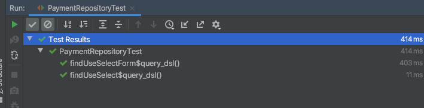

# Querydsl Repository Support 활용

개발을 진행할 하다 보면 다양한 조회 쿼리를 만들게 됩니다. JPA를 이용한다면 Querydsl Support를 사용하면 세부 구현체를 숨기고 Repository를 통해서 조회 쿼리를 제공해 줄 수 있어 장점이 있습니다.

관련 [step-15: Querydsl를 이용해서 Repository 확장하기 (1)](https://github.com/cheese10yun/spring-jpa-best-practices/blob/master/doc/step-15.md), [JPA 선호하는 패턴](https://cheese10yun.github.io/jpa-preference/)을 참고해 주세요


## QuerydslRepositorySupport 사용시 문제점

QuerydslRepositorySupport은 `JPQLQuery`를 이용해서 JPQL 작업을 진행합니다. 그래서 약간 단점이 있습니다.

```kotlin
import com.example.querydsl.domain.QPayment.payment as qPayment

class PaymentCustomRepositoryImpl : QuerydslCustomRepositorySupport(Payment::class.java), PaymentCustomRepository {

    override fun findUseForm(targetAmount: BigDecimal): List<Payment>? {
        return from(qPayment)
            .where(qPayment.amount.gt(targetAmount))
            .fetch()
    }
}
```
해당 코드를 보면 `form`으로 시작해야 합니다. `QuerydslRepositorySupport` 구현체의 form 메서드는 아래와 같습니다.

```kotlin
protected <T> JPQLQuery<T> from(EntityPath<T> path) {
    return getRequiredQuerydsl().createQuery(path).select(path);
}
```
즉 `JPQLQuery`을 사용해서 쿼리 작업을 진행해야 되기 때문에 `form`으로 시작할 수밖에 없습니다.

사실 별거 아닌 거 같지만 우리는 일반적으로 query를 시작할 때는 `select`으로 시작합니다. `queryFactory`을 이용하면 select, selectFrom으로 쿼리를 시작할 수 있습니다.

```kotlin
override fun findUseSelectForm(targetAmount: BigDecimal): List<Payment> {
    return selectFrom(qPayment)
        .where(qPayment.amount.gt(targetAmount))
        .fetch()
}

override fun findUseSelect(targetAmount: BigDecimal): List<Long> {
    return select(qPayment.id)
        .from(qPayment)
        .where(qPayment.amount.gt(targetAmount))
        .fetch()
}
```

`selectFrom`은 조회하는 타입이 일치하는 경우 사용할 수 있고, `select`는 리턴 받을 타입을 지정할 수 있습니다. 우리가 일반적으로 사용하는 SQL 문과 아주 유사한 구조입니다.

## QuerydslCustomRepositorySupport 작성하기

```kotlin
abstract class QuerydslCustomRepositorySupport(domainClass: Class<*>) : QuerydslRepositorySupport(domainClass) {

    private var queryFactory: JPAQueryFactory by Delegates.notNull()

    @PersistenceContext
    override fun setEntityManager(entityManager: EntityManager) {
        super.setEntityManager(entityManager)
        this.queryFactory = JPAQueryFactory(entityManager)
    }

    protected fun <T> select(expr: Expression<T>): JPAQuery<T> {
        return queryFactory.select(expr)
    }

    protected fun <T> selectFrom(from: EntityPath<T>): JPAQuery<T> {
        return queryFactory.selectFrom(from)
    }
}
```
사용법은 간단합니다. `QuerydslRepositorySupport`을 상속하는 클래스를 **직접 정의해서 제공하는 것입니다.**

코드는 간단합니다. `EntityManager`을 상위 클래스에서 전달해 주며 `JPAQuery`에서 제공해 주는 `select`, `selectFrom`을 구현(JPAQuery의 메서드를 복붙)하면 됩니다. `select`, `selectFrom` 외에도 다양한 기능들을 제공해 줄 수 있습니다.


```kotlin
internal class PaymentRepositoryTest(
    private val paymentRepository: PaymentRepository
) : SpringBootTestSupport() {

    @Test
    internal fun `findUseSelectForm`() {
        //given
        val targetAmount = 200.toBigDecimal()

        //when
        val payments = paymentRepository.findUseSelectForm(targetAmount)

        //then
        then(payments).anySatisfy {
            then(it.amount).isGreaterThan(targetAmount)
        }
    }

    @Test
    internal fun `findUseSelect`() {
        //given
        val targetAmount = 200.toBigDecimal()

        //when
        val ids = paymentRepository.findUseSelect(targetAmount)

        //then
        then(ids).hasSizeGreaterThan(1)
    }
}
```



테스트 코드를 통과로 정상 동작하는 것을 확인할 수 있습니다.
`select`, `selectFrom` 시작해서 큰 이득을 얻을 수 없지만 최대한 SQL스럽게 코드를 작성할 수 있어서 개인적으로 선호하는 방식입니다.