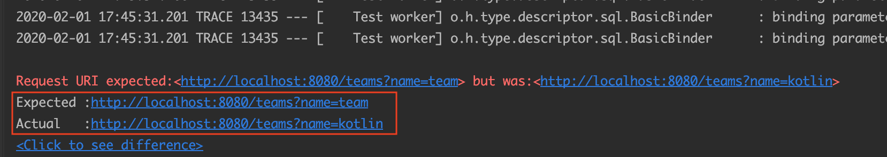
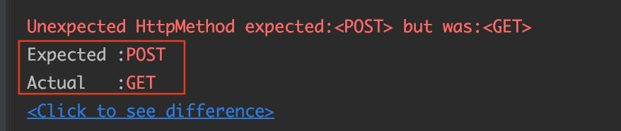
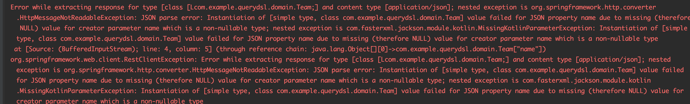

# RestTemplate Mock 기반 테스트 하기
스프링 프로젝트에서는 외부 API 모듈을 RestTemplate를 이용해서 호출하는 경우가 많습니다, 이런 경우 RestTemplate을 기반으로 Mock 테스트를 보다 쉽게 진행할 수 있습니다.


## 왜 Mock 기반 테스트를 진행 해야하나 ?
외부 인프라스트럭처를 테스트 코드를 작성할 때는 mock 기반으로 테스트를 진행해야 합니다. 외부 인프라스트럭처에는 대표적으로 외부 API가 있습니다.

그런데 왜 Mock 기반으로 테스트해야 할까요? 외부 환경이기 때문에 제어권이 우리 밖에 있습니다. 그래서 우리 코드의 테스트를 위해서 Request, Response가 우리가 주어진 값인 경우 정상 동작하는지 테스트하기 위함입니다. **Mockito 기반으로 데이터베이스의 의존성을 Mock으로 처리하고 실제 비즈니스 코드를 검증하는 거와 같은 결이라고 생각하면 됩니다.**

물론 전체 플로우를 테스트하기 위해서는 통합 테스트를 진행할 수도 있겠지만 이번 포스팅에서는 Mock 기반 단위 테스트하는 방법을 다루겠습니다.

## 코드

```kotlin
@Configuration
class Configuration {

    @Bean
    fun restTemplate(objectMapper: ObjectMapper): RestTemplate {
        return RestTemplateBuilder()
            .rootUri("http://localhost:8080")
            .setConnectTimeout(Duration.ofSeconds(10))
            .additionalMessageConverters()
            .build()
    }
}
@RestController
@RequestMapping("/teams")
class TeamApi(
    private val query: JPAQueryFactory
) {

    @GetMapping
    fun get(@RequestParam(required = false) name: String?): List<Team> {
        return query.selectFrom(qTeam)
            .from(qTeam)
            .fetch()
    }
}

@Service
class ApiService(
    private val restTemplate: RestTemplate
) {

    fun getTeam(name: String): List<Team> {
        return restTemplate.getForObject("/teams?name=$name", Array<Team>::class.java)!!.toList()
    }
}
```

코드는 간단합니다. RestTemplate 기반으로 local 서버를 호출하는 코드입니다. 테스트를 위해 Team 정보를 10개를 set up 했습니다. 

## 테스트 코드
```kotlin
@SpringBootTest
@TestConstructor(autowireMode = TestConstructor.AutowireMode.ALL)
internal class ApiServiceTest(
    private val restTemplate: RestTemplate, // (1)
    private val apiService: ApiService // (2)

) {
    private var server: MockRestServiceServer by notNull()

    @BeforeEach
    internal fun setUp() {
        server = MockRestServiceServer.createServer(restTemplate) // (3)
    }


    @Test
    internal fun `api test`() {
        //given
        val path = "/team-api-response.json"
        val name = "team"
        server
            .expect(
                requestTo("http://localhost:8080/teams?name=$name")
            )// (4)
            .andExpect(method(HttpMethod.GET)) // (5)
            .andRespond(
                withStatus(HttpStatus.OK)
                    .contentType(MediaType.APPLICATION_JSON)
                    .body(ClassPathResource(path, javaClass))
            )// (6)

        //when
        // (7)
        val teams = apiService.getTeam("team")

        //then
        // (8)
        for (team in teams) {
            println(team)
        }

        // (9)
        then(teams).hasSize(10)
        then(teams).anySatisfy {
            then(it.name).startsWith("team")
        }
    }
}
```
* (1) : 해당 서비스에서 사용하는 RestTemplate를 주입받습니다. 실제 실무에서는 RestTemplate를 vendor마다 등록하기 때문에 테스트하고자 하는 RestTeamplte를 주입받습니다.
* (2) : 해당 API 통신하는 서비스를 주입받습니다.
* (3) : 주입받은 RestTemplate 기반으로 MockRestServiceServer 생성합니다. MockRestServiceServer는 클라이언트와 서버 사이의 REST 테스트를 위한 객체입니다. 내부에서 RestTemplate를 바인딩 하여 실제로 통신이 이루어지게끔 구성할 수도 있습니다. 이 코드에서는 목 객체와 같이 실제로 통신이 이루어지지는 않지만 지정한 결로에 예상되는 반환값을 명시합니다.
* (4) : 검증을 시도합니다. 실제 restTeamplte의 Request가 저 URL으로 해당하는지 검증합니다.
* (5) : 실제 Request의 HTTP Method가 GET을 이용하는지 검증합니다.
* (6) : Response에 대한 검증을 시작합니다. HTTP Status Code, Body, MediaType 등을 검증합니다. path 변수에는 해당 API의 예상되는 json 값을 작성해 놓습니다. Givne 절이라고 생각하면 됩니다.
* (7) : 실제 서비스 코드에서 호출하는 코드를 호출합니다.
* (8) : 테스트 동작 여부를 확인하기 위해서 print 하는 코드입니다.
* (9) : 실제 when 절의 코드가 예상하는 것처럼 동작했는지 검증합니다.

given 절에 있는 `/team-api-response.json`는 `/src/test/resources/` 디렉터리에 기본 path로 바라보며 해당 경로에 있는 파일을 찾게 됩니다. JSON 파일은 아래와 같습니다.

```json
[
  {
    "name": "team 1",
    "id": 1,
    "createdAt": "2020-02-01T16:58:34.377",
    "updatedAt": "2020-02-01T16:58:34.377",
    "members": []
  },
  ...
  {
    "name": "team 10",
    "id": 10,
    "createdAt": "2020-02-01T16:58:34.402",
    "updatedAt": "2020-02-01T16:58:34.402",
    "members": []
  }
]
```

물론 객체 기반으로 만들고 그것을 시리얼 라이즈 해서 json으로 만들어도 되지만 [테스트 코드 작성에 대한 나름의 고찰](https://cheese10yun.github.io/spring-about-test/#json)에서 한 번 다뤘지만 해당 테스트에서 Team 객체가 Response body가 객체가 시리얼 라이즈 되는지까지 책임이 부여되기 때문에 json 파일로 response body를 관리하는 것이 더 효율적이라고 생각합니다.


## 무엇을 테스트할 것인가?
일단 Mock 기반 테스트는 단위 테스트 성격이 높습니다. 그렇다면 무엇을 테스트할 것인지 명확하게 테스트해야 합니다. **해당 테스트에서는 원하는 곳으로 Request가 가는지, 우리가 원하는 Reponse가 예상되었을 경우 우리 로직이 제대로 동작하는지 테스트를 진행하겠습니다.**

### Request 테스트
```kotlin
...

val name = "team"
    server
        .expect(
            requestTo("http://localhost:8080/teams?name=$name")
        )// (4)

val teams = apiService.getTeam("kotlin") // team -> kotlin 으로 이름 변경
```
MockRestServiceServer에서는 요청을 `teams?=name=team`으로 했고 실제 apiService에서는 `kotlin` 을 넘겼기 때문에 두 요청은 일치하지 않습니다. 이 상태에서 테스트 코드를 실행하면 아래와 같은 오류를 발견합니다.



즉 실제 apiService 룰 통한 실제 요청과 mock 기반 요청이 일치하는지 확인을 검증하는 것입니다. 파라미터가 name 하나여서 간단하지 조회용 condition이 상당히 복잡합니다. 이런 것들을 케이스 별로 테스트하는 것이 바람직합니다.

```kotlin
server
        .expect(
            requestTo("http://localhost:8080/teams?name=$name")
        )// (4)
        .andExpect(method(HttpMethod.POST)) // (5) GET -> POST 변경 
```


이 테스트도 마찬가지로 mock server의 HTTP Method 다르기 때문에 실패하게 됩니다.


### Response 테스트
```kotlin
server
        ...    
        .andRespond(
            withStatus(HttpStatus.OK)
                .contentType(MediaType.APPLICATION_JSON)
                .body(ClassPathResource(path, javaClass))
        )// (6)

val teams = apiService.getTeam("team")
```
Response를 테스트 진행합니다. Response 테스트에서는 RestTemplate에서 전달받은 Response Body가 객체로 변환되는지 테스트합니다.

위에서 언급했듯이 `.body(ClassPathResource(path, javaClass))`는 `/src/test/resources/` path에 있는 해당 json 파일 기반으로 body를 mock 해서 돌려줍니다.


역 직렬화를 못하게 name을 null으로 변경해보겠습니다. (team name 객체는 notnull입니다.)
```json
[
  {
    "name": null,
    "id": 1,
    "createdAt": "2020-02-01T16:58:34.377",
    "updatedAt": "2020-02-01T16:58:34.377",
    "members": []
  }
  ...
]
```


역 직렬화를 못하기 때문에 테스트가 실패하는 것을 확인할 수 있습니다.

## 결론
RestTemplate 기반으로 테스트하는 방법을 포스팅하긴 했지만 더 **강조하고 싶은 부분은 외부 디펜던시 어떻게 끊고 어떤 부분을 어떤 관점에서 테스트할지 고민해보고 테스트를 작성하는 것이 좋다는 것입니다.**

